# This notebook contains the code to reproduce the main figures of the manuscript titled "_Blood RNA Signatures Predict Recent Tuberculosis Exposure in Mice, Macaques and Humans_"

Only Ingenuity Pathway Analysis for Figure 5E is excluded (commercial software)

It is recommended that jupyter extensions are used to allow easy display and review of the code:
    - https://github.com/ipython-contrib/jupyter_contrib_nbextensions
    
All code was run with access to a 128 GB RAM machine with 48 CPU cores. This amount of memory and CPU-cores is not necessary for all calculations, but may be necessary to some of the calls to the caret package (machine learning hyperparameter searches).
    
All code written during the development of this project is in "Time Since Infection RNA_Paper_Analysis.ipynb" and may be reviewed. However, it is not structured for easy, streamlined running of all code.

There are very small differences in p-values between Figures 2-4 (A,E only for Figure 4) herein compared to the original analysis reported in the paper, due the absence of setting a random seed before several random hyperparameter searches on training sets. The ultimate results are insensitive to these very small differences in random parameter settings.


```R
path="."  # this is the TB repository folder
```

## The following code shows the software packages installed in the environment used to produce the analyses of the paper. In each section of the analysis, code is provided for installing needed R dependencies

### R environment (R 3.4.3)


```R
ipacks = installed.packages()
ipacks

# To access a specific package's version info:
ipacks["pROC",]
```


<table>
<thead><tr><th></th><th scope=col>Package</th><th scope=col>LibPath</th><th scope=col>Version</th><th scope=col>Priority</th><th scope=col>Depends</th><th scope=col>Imports</th><th scope=col>LinkingTo</th><th scope=col>Suggests</th><th scope=col>Enhances</th><th scope=col>License</th><th scope=col>License_is_FOSS</th><th scope=col>License_restricts_use</th><th scope=col>OS_type</th><th scope=col>MD5sum</th><th scope=col>NeedsCompilation</th><th scope=col>Built</th></tr></thead>
<tbody>
	<tr><th scope=row>acepack</th><td>acepack                                                                                                                                                                                                                                                                                                                                                                                                               </td><td>/master/rault/anaconda3/envs/TB/lib/R/library                                                                                                                                                                                                                                                                                                                                                                         </td><td>1.4.1                                                                                                                                                                                                                                                                                                                                                                                                                 </td><td>NA                                                                                                                                                                                                                                                                                                                                                                                                                    </td><td>NA                                                                                                                                                                                                                                                                                                                                                                                                                    </td><td>NA                                                                                                                                                                                                                                                                                                                                                                                                                    </td><td>NA                                                                                                                                                                                                                                                                                                                                                                                                                    </td><td>testthat                                                                                                                                                                                                                                                                                                                                                                                                              </td><td>NA                                                                                                                                                                                                                                                                                                                                                                                                                    </td><td>MIT + file LICENSE                                                                                                                                                                                                                                                                                                                                                                                                    </td><td>NA                                                                                                                                                                                                                                                                                                                                                                                                                    </td><td>NA                                                                                                                                                                                                                                                                                                                                                                                                                    </td><td>NA                                                                                                                                                                                                                                                                                                                                                                                                                    </td><td>NA                                                                                                                                                                                                                                                                                                                                                                                                                    </td><td>yes                                                                                                                                                                                                                                                                                                                                                                                                                   </td><td>3.4.3                                                                                                                                                                                                                                                                                                                                                                                                                 </td></tr>
	<tr><th scope=row>akima</th><td><span style=white-space:pre-wrap>akima        </span>                                                                                                                                                                                                                                                                                                                                                                                                         </td><td>/master/rault/anaconda3/envs/TB/lib/R/library                                                                                                                                                                                                                                                                                                                                                                                                                 </td><td><span style=white-space:pre-wrap>0.6-2   </span>                                                                                                                                                                                                                                                                                                                                                                                                              </td><td><span style=white-space:pre-wrap>NA         </span>                                                                                                                                                                                                                                                                                                                                                                                                           </td><td><span style=white-space:pre-wrap>R (&gt;= 2.0.0)                                                                                 </span>                                                                                                                                                                                                                                                                                                                      </td><td><span style=white-space:pre-wrap>sp                                                                                                                                      </span>                                                                                                                                                                                                                                                                              </td><td><span style=white-space:pre-wrap>NA         </span>                                                                                                                                                                                                                                                                                                                                                                                                           </td><td><span style=white-space:pre-wrap>NA                                                                                                                                                                                                                                                                                                                                                                                                                    </span></td><td><span style=white-space:pre-wrap>NA      </span>                                                                                                                                                                                                                                                                                                                                                                                                              </td><td>ACM | file LICENSE                                                                                                                                                                                                                                                                                                                                                                                                                                            </td><td>NA                                                                                                                                                                                                                                                                                                                                                                                                                                                            </td><td>yes                                                                                                                                                                                                                                                                                                                                                                                                                                                           </td><td>NA                                                                                                                                                                                                                                                                                                                                                                                                                                                            </td><td>NA                                                                                                                                                                                                                                                                                                                                                                                                                                                            </td><td>yes                                                                                                                                                                                                                                                                                                                                                                                                                                                           </td><td>3.4.3                                                                                                                                                                                                                                                                                                                                                                                                                                                         </td></tr>
	<tr><th scope=row>annotate</th><td><span style=white-space:pre-wrap>annotate     </span>                                                                                                                                                                                                                                                                                                                                                                                                            </td><td>/master/rault/anaconda3/envs/TB/lib/R/library                                                                                                                                                                                                                                                                                                                                                                                                                    </td><td><span style=white-space:pre-wrap>1.56.2  </span>                                                                                                                                                                                                                                                                                                                                                                                                                 </td><td><span style=white-space:pre-wrap>NA         </span>                                                                                                                                                                                                                                                                                                                                                                                                              </td><td><span style=white-space:pre-wrap>R (&gt;= 2.10), AnnotationDbi (&gt;= 1.27.5), XML                                                  </span>                                                                                                                                                                                                                                                                                                                      </td><td><span style=white-space:pre-wrap>Biobase, DBI, xtable, graphics, utils, stats, methods,
BiocGenerics (&gt;= 0.13.8), RCurl                                                 </span>                                                                                                                                                                                                                                                                              </td><td><span style=white-space:pre-wrap>NA         </span>                                                                                                                                                                                                                                                                                                                                                                                                              </td><td><span style=white-space:pre-wrap>hgu95av2.db, genefilter, Biostrings (&gt;= 2.25.10), IRanges,
rae230a.db, rae230aprobe, tkWidgets, GO.db, org.Hs.eg.db,
org.Mm.eg.db, hom.Hs.inp.db, humanCHRLOC, Rgraphviz, RUnit,                                                                                                                                                                                                                                    </span></td><td><span style=white-space:pre-wrap>NA      </span>                                                                                                                                                                                                                                                                                                                                                                                                                 </td><td><span style=white-space:pre-wrap>Artistic-2.0      </span>                                                                                                                                                                                                                                                                                                                                                                                                       </td><td>NA                                                                                                                                                                                                                                                                                                                                                                                                                                                               </td><td>NA                                                                                                                                                                                                                                                                                                                                                                                                                                                               </td><td>NA                                                                                                                                                                                                                                                                                                                                                                                                                                                               </td><td>NA                                                                                                                                                                                                                                                                                                                                                                                                                                                               </td><td>no                                                                                                                                                                                                                                                                                                                                                                                                                                                               </td><td>3.4.3                                                                                                                                                                                                                                                                                                                                                                                                                                                            </td></tr>
	<tr><th scope=row>AnnotationDbi</th><td>AnnotationDbi                                                                                                                                                                                                                                                                                                                                                                                                                                                       </td><td>/master/rault/anaconda3/envs/TB/lib/R/library                                                                                                                                                                                                                                                                                                                                                                                                                       </td><td><span style=white-space:pre-wrap>1.40.0  </span>                                                                                                                                                                                                                                                                                                                                                                                                                    </td><td><span style=white-space:pre-wrap>NA         </span>                                                                                                                                                                                                                                                                                                                                                                                                                 </td><td>R (&gt;= 2.7.0), methods, utils, stats4, BiocGenerics (&gt;=
0.23.1), Biobase (&gt;= 1.17.0), IRanges                                                                                                                                                                                                                                                                                                                                                              </td><td><span style=white-space:pre-wrap>methods, utils, DBI, RSQLite, stats4, BiocGenerics, Biobase,
S4Vectors (&gt;= 0.9.25), IRanges                                            </span>                                                                                                                                                                                                                                                                                 </td><td><span style=white-space:pre-wrap>NA         </span>                                                                                                                                                                                                                                                                                                                                                                                                                 </td><td><span style=white-space:pre-wrap>DBI (&gt;= 0.2-4), RSQLite (&gt;= 0.6-4), hgu95av2.db, GO.db,
org.Sc.sgd.db, org.At.tair.db, KEGG.db, RUnit,
TxDb.Hsapiens.UCSC.hg19.knownGene, hom.Hs.inp.db, org.Hs.eg.db,
reactome.db, AnnotationForge, graph, EnsDb.Hsapiens.v75,
BiocStyle, knitr                                                                                                                                                                  </span></td><td><span style=white-space:pre-wrap>NA      </span>                                                                                                                                                                                                                                                                                                                                                                                                                    </td><td><span style=white-space:pre-wrap>Artistic-2.0      </span>                                                                                                                                                                                                                                                                                                                                                                                                          </td><td>NA                                                                                                                                                                                                                                                                                                                                                                                                                                                                  </td><td>NA                                                                                                                                                                                                                                                                                                                                                                                                                                                                  </td><td>NA                                                                                                                                                                                                                                                                                                                                                                                                                                                                  </td><td>NA                                                                                                                                                                                                                                                                                                                                                                                                                                                                  </td><td>no                                                                                                                                                                                                                                                                                                                                                                                                                                                                  </td><td>3.4.3                                                                                                                                                                                                                                                                                                                                                                                                                                                               </td></tr>
	<tr><th scope=row>assertthat</th><td>assertthat                                                                                                                                                                                                                                                                                                                                                                                                            </td><td>/master/rault/anaconda3/envs/TB/lib/R/library                                                                                                                                                                                                                                                                                                                                                                         </td><td>0.2.0                                                                                                                                                                                                                                                                                                                                                                                                                 </td><td>NA                                                                                                                                                                                                                                                                                                                                                                                                                    </td><td>NA                                                                                                                                                                                                                                                                                                                                                                                                                    </td><td>tools                                                                                                                                                                                                                                                                                                                                                                                                                 </td><td>NA                                                                                                                                                                                                                                                                                                                                                                                                                    </td><td>testthat                                                                                                                                                                                                                                                                                                                                                                                                              </td><td>NA                                                                                                                                                                                                                                                                                                                                                                                                                    </td><td>GPL-3                                                                                                                                                                                                                                                                                                                                                                                                                 </td><td>NA                                                                                                                                                                                                                                                                                                                                                                                                                    </td><td>NA                                                                                                                                                                                                                                                                                                                                                                                                                    </td><td>NA                                                                                                                                                                                                                                                                                                                                                                                                                    </td><td>NA                                                                                                                                                                                                                                                                                                                                                                                                                    </td><td>no                                                                                                                                                                                                                                                                                                                                                                                                                    </td><td>3.4.3                                                                                                                                                                                                                                                                                                                                                                                                                 </td></tr>
	<tr><th scope=row>backports</th><td><span style=white-space:pre-wrap>backports    </span>                                                                                                                                                                                                                                                                                                                                                                                                         </td><td>/master/rault/anaconda3/envs/TB/lib/R/library                                                                                                                                                                                                                                                                                                                                                                                                                 </td><td><span style=white-space:pre-wrap>1.1.2   </span>                                                                                                                                                                                                                                                                                                                                                                                                              </td><td><span style=white-space:pre-wrap>NA         </span>                                                                                                                                                                                                                                                                                                                                                                                                           </td><td><span style=white-space:pre-wrap>R (&gt;= 3.0.0)                                                                                 </span>                                                                                                                                                                                                                                                                                                                      </td><td><span style=white-space:pre-wrap>utils                                                                                                                                   </span>                                                                                                                                                                                                                                                                              </td><td><span style=white-space:pre-wrap>NA         </span>                                                                                                                                                                                                                                                                                                                                                                                                           </td><td><span style=white-space:pre-wrap>NA                                                                                                                                                                                                                                                                                                                                                                                                                    </span></td><td><span style=white-space:pre-wrap>NA      </span>                                                                                                                                                                                                                                                                                                                                                                                                              </td><td><span style=white-space:pre-wrap>GPL-2             </span>                                                                                                                                                                                                                                                                                                                                                                                                    </td><td>NA                                                                                                                                                                                                                                                                                                                                                                                                                                                            </td><td>NA                                                                                                                                                                                                                                                                                                                                                                                                                                                            </td><td>NA                                                                                                                                                                                                                                                                                                                                                                                                                                                            </td><td>NA                                                                                                                                                                                                                                                                                                                                                                                                                                                            </td><td>yes                                                                                                                                                                                                                                                                                                                                                                                                                                                           </td><td>3.4.3                                                                                                                                                                                                                                                                                                                                                                                                                                                         </td></tr>
	<tr><th scope=row>base</th><td>base                                                                                                                                                                                                                                                                                                                                                                                                                  </td><td>/master/rault/anaconda3/envs/TB/lib/R/library                                                                                                                                                                                                                                                                                                                                                                         </td><td>3.4.3                                                                                                                                                                                                                                                                                                                                                                                                                 </td><td>base                                                                                                                                                                                                                                                                                                                                                                                                                  </td><td>NA                                                                                                                                                                                                                                                                                                                                                                                                                    </td><td>NA                                                                                                                                                                                                                                                                                                                                                                                                                    </td><td>NA                                                                                                                                                                                                                                                                                                                                                                                                                    </td><td>methods                                                                                                                                                                                                                                                                                                                                                                                                               </td><td>NA                                                                                                                                                                                                                                                                                                                                                                                                                    </td><td>Part of R 3.4.3                                                                                                                                                                                                                                                                                                                                                                                                       </td><td>NA                                                                                                                                                                                                                                                                                                                                                                                                                    </td><td>NA                                                                                                                                                                                                                                                                                                                                                                                                                    </td><td>NA                                                                                                                                                                                                                                                                                                                                                                                                                    </td><td>NA                                                                                                                                                                                                                                                                                                                                                                                                                    </td><td>NA                                                                                                                                                                                                                                                                                                                                                                                                                    </td><td>3.4.3                                                                                                                                                                                                                                                                                                                                                                                                                 </td></tr>
	<tr><th scope=row>base64</th><td>base64                                                                                                                                                                                                                                                                                                                                                                                                                </td><td>/master/rault/anaconda3/envs/TB/lib/R/library                                                                                                                                                                                                                                                                                                                                                                         </td><td>2.0                                                                                                                                                                                                                                                                                                                                                                                                                   </td><td>NA                                                                                                                                                                                                                                                                                                                                                                                                                    </td><td>NA                                                                                                                                                                                                                                                                                                                                                                                                                    </td><td>openssl                                                                                                                                                                                                                                                                                                                                                                                                               </td><td>NA                                                                                                                                                                                                                                                                                                                                                                                                                    </td><td>NA                                                                                                                                                                                                                                                                                                                                                                                                                    </td><td>NA                                                                                                                                                                                                                                                                                                                                                                                                                    </td><td>MIT + file LICENSE                                                                                                                                                                                                                                                                                                                                                                                                    </td><td>NA                                                                                                                                                                                                                                                                                                                                                                                                                    </td><td>NA                                                                                                                                                                                                                                                                                                                                                                                                                    </td><td>NA                                                                                                                                                                                                                                                                                                                                                                                                                    </td><td>NA                                                                                                                                                                                                                                                                                                                                                                                                                    </td><td>no                                                                                                                                                                                                                                                                                                                                                                                                                    </td><td>3.4.3                                                                                                                                                                                                                                                                                                                                                                                                                 </td></tr>
	<tr><th scope=row>base64enc</th><td><span style=white-space:pre-wrap>base64enc    </span>                                                                                                                                                                                                                                                                                                                                                                                                         </td><td>/master/rault/anaconda3/envs/TB/lib/R/library                                                                                                                                                                                                                                                                                                                                                                                                                 </td><td><span style=white-space:pre-wrap>0.1-3   </span>                                                                                                                                                                                                                                                                                                                                                                                                              </td><td><span style=white-space:pre-wrap>NA         </span>                                                                                                                                                                                                                                                                                                                                                                                                           </td><td><span style=white-space:pre-wrap>R (&gt;= 2.9.0)                                                                                 </span>                                                                                                                                                                                                                                                                                                                      </td><td><span style=white-space:pre-wrap>NA                                                                                                                                      </span>                                                                                                                                                                                                                                                                              </td><td><span style=white-space:pre-wrap>NA         </span>                                                                                                                                                                                                                                                                                                                                                                                                           </td><td><span style=white-space:pre-wrap>NA                                                                                                                                                                                                                                                                                                                                                                                                                    </span></td><td><span style=white-space:pre-wrap>png     </span>                                                                                                                                                                                                                                                                                                                                                                                                              </td><td><span style=white-space:pre-wrap>GPL-2 | GPL-3     </span>                                                                                                                                                                                                                                                                                                                                                                                                    </td><td>NA                                                                                                                                                                                                                                                                                                                                                                                                                                                            </td><td>NA                                                                                                                                                                                                                                                                                                                                                                                                                                                            </td><td>NA                                                                                                                                                                                                                                                                                                                                                                                                                                                            </td><td>NA                                                                                                                                                                                                                                                                                                                                                                                                                                                            </td><td>yes                                                                                                                                                                                                                                                                                                                                                                                                                                                           </td><td>3.4.3                                                                                                                                                                                                                                                                                                                                                                                                                                                         </td></tr>
	<tr><th scope=row>BH</th><td>BH                                                                                                                                                                                                                                                                                                                                                                                                                    </td><td>/master/rault/anaconda3/envs/TB/lib/R/library                                                                                                                                                                                                                                                                                                                                                                         </td><td>1.65.0-1                                                                                                                                                                                                                                                                                                                                                                                                              </td><td>NA                                                                                                                                                                                                                                                                                                                                                                                                                    </td><td>NA                                                                                                                                                                                                                                                                                                                                                                                                                    </td><td>NA                                                                                                                                                                                                                                                                                                                                                                                                                    </td><td>NA                                                                                                                                                                                                                                                                                                                                                                                                                    </td><td>NA                                                                                                                                                                                                                                                                                                                                                                                                                    </td><td>NA                                                                                                                                                                                                                                                                                                                                                                                                                    </td><td>BSL-1.0                                                                                                                                                                                                                                                                                                                                                                                                               </td><td>NA                                                                                                                                                                                                                                                                                                                                                                                                                    </td><td>NA                                                                                                                                                                                                                                                                                                                                                                                                                    </td><td>NA                                                                                                                                                                                                                                                                                                                                                                                                                    </td><td>NA                                                                                                                                                                                                                                                                                                                                                                                                                    </td><td>no                                                                                                                                                                                                                                                                                                                                                                                                                    </td><td>3.4.3                                                                                                                                                                                                                                                                                                                                                                                                                 </td></tr>
	<tr><th scope=row>bindr</th><td>bindr                                                                                                                                                                                                                                                                                                                                                                                                                 </td><td>/master/rault/anaconda3/envs/TB/lib/R/library                                                                                                                                                                                                                                                                                                                                                                         </td><td>0.1                                                                                                                                                                                                                                                                                                                                                                                                                   </td><td>NA                                                                                                                                                                                                                                                                                                                                                                                                                    </td><td>NA                                                                                                                                                                                                                                                                                                                                                                                                                    </td><td>NA                                                                                                                                                                                                                                                                                                                                                                                                                    </td><td>NA                                                                                                                                                                                                                                                                                                                                                                                                                    </td><td>testthat                                                                                                                                                                                                                                                                                                                                                                                                              </td><td>NA                                                                                                                                                                                                                                                                                                                                                                                                                    </td><td>MIT + file LICENSE                                                                                                                                                                                                                                                                                                                                                                                                    </td><td>NA                                                                                                                                                                                                                                                                                                                                                                                                                    </td><td>NA                                                                                                                                                                                                                                                                                                                                                                                                                    </td><td>NA                                                                                                                                                                                                                                                                                                                                                                                                                    </td><td>NA                                                                                                                                                                                                                                                                                                                                                                                                                    </td><td>no                                                                                                                                                                                                                                                                                                                                                                                                                    </td><td>3.4.3                                                                                                                                                                                                                                                                                                                                                                                                                 </td></tr>
	<tr><th scope=row>bindrcpp</th><td>bindrcpp                                                                                                                                                                                                                                                                                                                                                                                                              </td><td>/master/rault/anaconda3/envs/TB/lib/R/library                                                                                                                                                                                                                                                                                                                                                                         </td><td>0.2                                                                                                                                                                                                                                                                                                                                                                                                                   </td><td>NA                                                                                                                                                                                                                                                                                                                                                                                                                    </td><td>NA                                                                                                                                                                                                                                                                                                                                                                                                                    </td><td>Rcpp, bindr                                                                                                                                                                                                                                                                                                                                                                                                           </td><td>Rcpp, plogr                                                                                                                                                                                                                                                                                                                                                                                                           </td><td>testthat                                                                                                                                                                                                                                                                                                                                                                                                              </td><td>NA                                                                                                                                                                                                                                                                                                                                                                                                                    </td><td>MIT + file LICENSE                                                                                                                                                                                                                                                                                                                                                                                                    </td><td>NA                                                                                                                                                                                                                                                                                                                                                                                                                    </td><td>NA                                                                                                                                                                                                                                                                                                                                                                                                                    </td><td>NA                                                                                                                                                                                                                                                                                                                                                                                                                    </td><td>NA                                                                                                                                                                                                                                                                                                                                                                                                                    </td><td>yes                                                                                                                                                                                                                                                                                                                                                                                                                   </td><td>3.4.3                                                                                                                                                                                                                                                                                                                                                                                                                 </td></tr>
	<tr><th scope=row>Biobase</th><td><span style=white-space:pre-wrap>Biobase      </span>                                                                                                                                                                                                                                                                                                                                                                                                         </td><td>/master/rault/anaconda3/envs/TB/lib/R/library                                                                                                                                                                                                                                                                                                                                                                                                                 </td><td><span style=white-space:pre-wrap>2.38.0  </span>                                                                                                                                                                                                                                                                                                                                                                                                              </td><td><span style=white-space:pre-wrap>NA         </span>                                                                                                                                                                                                                                                                                                                                                                                                           </td><td><span style=white-space:pre-wrap>R (&gt;= 2.10), BiocGenerics (&gt;= 0.3.2), utils                                                  </span>                                                                                                                                                                                                                                                                                                                   </td><td><span style=white-space:pre-wrap>methods                                                                                                                                 </span>                                                                                                                                                                                                                                                                              </td><td><span style=white-space:pre-wrap>NA         </span>                                                                                                                                                                                                                                                                                                                                                                                                           </td><td><span style=white-space:pre-wrap>tools, tkWidgets, ALL, RUnit, golubEsets                                                                                                                                                                                                                                                                                                                                                                              </span></td><td><span style=white-space:pre-wrap>NA      </span>                                                                                                                                                                                                                                                                                                                                                                                                              </td><td><span style=white-space:pre-wrap>Artistic-2.0      </span>                                                                                                                                                                                                                                                                                                                                                                                                    </td><td>NA                                                                                                                                                                                                                                                                                                                                                                                                                                                            </td><td>NA                                                                                                                                                                                                                                                                                                                                                                                                                                                            </td><td>NA                                                                                                                                                                                                                                                                                                                                                                                                                                                            </td><td>NA                                                                                                                                                                                                                                                                                                                                                                                                                                                            </td><td>yes                                                                                                                                                                                                                                                                                                                                                                                                                                                           </td><td>3.4.3                                                                                                                                                                                                                                                                                                                                                                                                                                                         </td></tr>
	<tr><th scope=row>BiocGenerics</th><td>BiocGenerics                                                                                                                                                                                                                                                                                                                                                                                                          </td><td>/master/rault/anaconda3/envs/TB/lib/R/library                                                                                                                                                                                                                                                                                                                                                                         </td><td>0.24.0                                                                                                                                                                                                                                                                                                                                                                                                                </td><td>NA                                                                                                                                                                                                                                                                                                                                                                                                                    </td><td>methods, utils, graphics, stats, parallel                                                                                                                                                                                                                                                                                                                                                                             </td><td>methods, utils, graphics, stats, parallel                                                                                                                                                                                                                                                                                                                                                                             </td><td>NA                                                                                                                                                                                                                                                                                                                                                                                                                    </td><td>Biobase, S4Vectors, IRanges, GenomicRanges, AnnotationDbi,
oligoClasses, oligo, affyPLM, flowClust, affy, DESeq2, MSnbase,
annotate, RUnit                                                                                                                                                                                                                                                                          </td><td>NA                                                                                                                                                                                                                                                                                                                                                                                                                    </td><td>Artistic-2.0                                                                                                                                                                                                                                                                                                                                                                                                          </td><td>NA                                                                                                                                                                                                                                                                                                                                                                                                                    </td><td>NA                                                                                                                                                                                                                                                                                                                                                                                                                    </td><td>NA                                                                                                                                                                                                                                                                                                                                                                                                                    </td><td>NA                                                                                                                                                                                                                                                                                                                                                                                                                    </td><td>no                                                                                                                                                                                                                                                                                                                                                                                                                    </td><td>3.4.3                                                                                                                                                                                                                                                                                                                                                                                                                 </td></tr>
	<tr><th scope=row>BiocInstaller</th><td>BiocInstaller                                                                                                                                                                                                                                                                                                                                                                                                                                                 </td><td>/master/rault/anaconda3/envs/TB/lib/R/library                                                                                                                                                                                                                                                                                                                                                                                                                 </td><td><span style=white-space:pre-wrap>1.28.0  </span>                                                                                                                                                                                                                                                                                                                                                                                                              </td><td><span style=white-space:pre-wrap>NA         </span>                                                                                                                                                                                                                                                                                                                                                                                                           </td><td><span style=white-space:pre-wrap>R (&gt;= 3.4.0)                                                                                 </span>                                                                                                                                                                                                                                                                                                                      </td><td><span style=white-space:pre-wrap>NA                                                                                                                                      </span>                                                                                                                                                                                                                                                                              </td><td><span style=white-space:pre-wrap>NA         </span>                                                                                                                                                                                                                                                                                                                                                                                                           </td><td><span style=white-space:pre-wrap>devtools, RUnit, BiocGenerics                                                                                                                                                                                                                                                                                                                                                                                         </span></td><td><span style=white-space:pre-wrap>NA      </span>                                                                                                                                                                                                                                                                                                                                                                                                              </td><td><span style=white-space:pre-wrap>Artistic-2.0      </span>                                                                                                                                                                                                                                                                                                                                                                                                    </td><td>NA                                                                                                                                                                                                                                                                                                                                                                                                                                                            </td><td>NA                                                                                                                                                                                                                                                                                                                                                                                                                                                            </td><td>NA                                                                                                                                                                                                                                                                                                                                                                                                                                                            </td><td>NA                                                                                                                                                                                                                                                                                                                                                                                                                                                            </td><td>no                                                                                                                                                                                                                                                                                                                                                                                                                                                            </td><td>3.4.3                                                                                                                                                                                                                                                                                                                                                                                                                                                         </td></tr>
	<tr><th scope=row>BiocParallel</th><td>BiocParallel                                                                                                                                                                                                                                                                                                                                                                                                          </td><td>/master/rault/anaconda3/envs/TB/lib/R/library                                                                                                                                                                                                                                                                                                                                                                         </td><td>1.12.0                                                                                                                                                                                                                                                                                                                                                                                                                </td><td>NA                                                                                                                                                                                                                                                                                                                                                                                                                    </td><td>methods                                                                                                                                                                                                                                                                                                                                                                                                               </td><td>stats, utils, futile.logger, parallel, snow                                                                                                                                                                                                                                                                                                                                                                           </td><td>BH                                                                                                                                                                                                                                                                                                                                                                                                                    </td><td>BiocGenerics, tools, foreach, BatchJobs, BBmisc, doParallel,
Rmpi, GenomicRanges, RNAseqData.HNRNPC.bam.chr14,
TxDb.Hsapiens.UCSC.hg19.knownGene, VariantAnnotation,
Rsamtools, GenomicAlignments, ShortRead, codetools, RUnit,
BiocStyle, knitr                                                                                                                                                                  </td><td>NA                                                                                                                                                                                                                                                                                                                                                                                                                    </td><td>GPL-2 | GPL-3                                                                                                                                                                                                                                                                                                                                                                                                         </td><td>NA                                                                                                                                                                                                                                                                                                                                                                                                                    </td><td>NA                                                                                                                                                                                                                                                                                                                                                                                                                    </td><td>NA                                                                                                                                                                                                                                                                                                                                                                                                                    </td><td>NA                                                                                                                                                                                                                                                                                                                                                                                                                    </td><td>yes                                                                                                                                                                                                                                                                                                                                                                                                                   </td><td>3.4.3                                                                                                                                                                                                                                                                                                                                                                                                                 </td></tr>
	<tr><th scope=row>biomaRt</th><td>biomaRt                                                                                                                                                                                                                                                                                                                                                                                                               </td><td>/master/rault/anaconda3/envs/TB/lib/R/library                                                                                                                                                                                                                                                                                                                                                                         </td><td>2.34.2                                                                                                                                                                                                                                                                                                                                                                                                                </td><td>NA                                                                                                                                                                                                                                                                                                                                                                                                                    </td><td>methods                                                                                                                                                                                                                                                                                                                                                                                                               </td><td>utils, XML, RCurl, AnnotationDbi, progress, stringr, httr                                                                                                                                                                                                                                                                                                                                                             </td><td>NA                                                                                                                                                                                                                                                                                                                                                                                                                    </td><td>annotate, BiocStyle, knitr, rmarkdown, testthat                                                                                                                                                                                                                                                                                                                                                                       </td><td>NA                                                                                                                                                                                                                                                                                                                                                                                                                    </td><td>Artistic-2.0                                                                                                                                                                                                                                                                                                                                                                                                          </td><td>NA                                                                                                                                                                                                                                                                                                                                                                                                                    </td><td>NA                                                                                                                                                                                                                                                                                                                                                                                                                    </td><td>NA                                                                                                                                                                                                                                                                                                                                                                                                                    </td><td>NA                                                                                                                                                                                                                                                                                                                                                                                                                    </td><td>no                                                                                                                                                                                                                                                                                                                                                                                                                    </td><td>3.4.3                                                                                                                                                                                                                                                                                                                                                                                                                 </td></tr>
	<tr><th scope=row>bit</th><td><span style=white-space:pre-wrap>bit          </span>                                                                                                                                                                                                                                                                                                                                                                                                         </td><td>/master/rault/anaconda3/envs/TB/lib/R/library                                                                                                                                                                                                                                                                                                                                                                                                                 </td><td><span style=white-space:pre-wrap>1.1-12  </span>                                                                                                                                                                                                                                                                                                                                                                                                              </td><td><span style=white-space:pre-wrap>NA         </span>                                                                                                                                                                                                                                                                                                                                                                                                           </td><td><span style=white-space:pre-wrap>R (&gt;= 2.9.2)                                                                                 </span>                                                                                                                                                                                                                                                                                                                      </td><td><span style=white-space:pre-wrap>NA                                                                                                                                      </span>                                                                                                                                                                                                                                                                              </td><td><span style=white-space:pre-wrap>NA         </span>                                                                                                                                                                                                                                                                                                                                                                                                           </td><td><span style=white-space:pre-wrap>NA                                                                                                                                                                                                                                                                                                                                                                                                                    </span></td><td><span style=white-space:pre-wrap>NA      </span>                                                                                                                                                                                                                                                                                                                                                                                                              </td><td><span style=white-space:pre-wrap>GPL-2             </span>                                                                                                                                                                                                                                                                                                                                                                                                    </td><td>NA                                                                                                                                                                                                                                                                                                                                                                                                                                                            </td><td>NA                                                                                                                                                                                                                                                                                                                                                                                                                                                            </td><td>NA                                                                                                                                                                                                                                                                                                                                                                                                                                                            </td><td>NA                                                                                                                                                                                                                                                                                                                                                                                                                                                            </td><td>yes                                                                                                                                                                                                                                                                                                                                                                                                                                                           </td><td>3.4.3                                                                                                                                                                                                                                                                                                                                                                                                                                                         </td></tr>
	<tr><th scope=row>bit64</th><td><span style=white-space:pre-wrap>bit64        </span>                                                                                                                                                                                                                                                                                                                                                                                                         </td><td>/master/rault/anaconda3/envs/TB/lib/R/library                                                                                                                                                                                                                                                                                                                                                                                                                 </td><td><span style=white-space:pre-wrap>0.9-7   </span>                                                                                                                                                                                                                                                                                                                                                                                                              </td><td><span style=white-space:pre-wrap>NA         </span>                                                                                                                                                                                                                                                                                                                                                                                                           </td><td><span style=white-space:pre-wrap>R (&gt;= 3.0.1), bit (&gt;= 1.1-12), utils, methods, stats                                         </span>                                                                                                                                                                                                                                                                                                                   </td><td><span style=white-space:pre-wrap>NA                                                                                                                                      </span>                                                                                                                                                                                                                                                                              </td><td><span style=white-space:pre-wrap>NA         </span>                                                                                                                                                                                                                                                                                                                                                                                                           </td><td><span style=white-space:pre-wrap>NA                                                                                                                                                                                                                                                                                                                                                                                                                    </span></td><td><span style=white-space:pre-wrap>NA      </span>                                                                                                                                                                                                                                                                                                                                                                                                              </td><td><span style=white-space:pre-wrap>GPL-2             </span>                                                                                                                                                                                                                                                                                                                                                                                                    </td><td>NA                                                                                                                                                                                                                                                                                                                                                                                                                                                            </td><td>NA                                                                                                                                                                                                                                                                                                                                                                                                                                                            </td><td>NA                                                                                                                                                                                                                                                                                                                                                                                                                                                            </td><td>NA                                                                                                                                                                                                                                                                                                                                                                                                                                                            </td><td>yes                                                                                                                                                                                                                                                                                                                                                                                                                                                           </td><td>3.4.3                                                                                                                                                                                                                                                                                                                                                                                                                                                         </td></tr>
	<tr><th scope=row>bitops</th><td><span style=white-space:pre-wrap>bitops       </span>                                                                                                                                                                                                                                                                                                                                                                                                         </td><td>/master/rault/anaconda3/envs/TB/lib/R/library                                                                                                                                                                                                                                                                                                                                                                                                                 </td><td><span style=white-space:pre-wrap>1.0-6   </span>                                                                                                                                                                                                                                                                                                                                                                                                              </td><td><span style=white-space:pre-wrap>NA         </span>                                                                                                                                                                                                                                                                                                                                                                                                           </td><td><span style=white-space:pre-wrap>NA                                                                                           </span>                                                                                                                                                                                                                                                                                                                         </td><td><span style=white-space:pre-wrap>NA                                                                                                                                      </span>                                                                                                                                                                                                                                                                              </td><td><span style=white-space:pre-wrap>NA         </span>                                                                                                                                                                                                                                                                                                                                                                                                           </td><td><span style=white-space:pre-wrap>NA                                                                                                                                                                                                                                                                                                                                                                                                                    </span></td><td><span style=white-space:pre-wrap>NA      </span>                                                                                                                                                                                                                                                                                                                                                                                                              </td><td><span style=white-space:pre-wrap>GPL (&gt;= 2)        </span>                                                                                                                                                                                                                                                                                                                                                                                                 </td><td>NA                                                                                                                                                                                                                                                                                                                                                                                                                                                            </td><td>NA                                                                                                                                                                                                                                                                                                                                                                                                                                                            </td><td>NA                                                                                                                                                                                                                                                                                                                                                                                                                                                            </td><td>NA                                                                                                                                                                                                                                                                                                                                                                                                                                                            </td><td>yes                                                                                                                                                                                                                                                                                                                                                                                                                                                           </td><td>3.4.3                                                                                                                                                                                                                                                                                                                                                                                                                                                         </td></tr>
	<tr><th scope=row>blob</th><td><span style=white-space:pre-wrap>blob         </span>                                                                                                                                                                                                                                                                                                                                                                                                            </td><td>/master/rault/anaconda3/envs/TB/lib/R/library                                                                                                                                                                                                                                                                                                                                                                                                                    </td><td><span style=white-space:pre-wrap>1.1.1   </span>                                                                                                                                                                                                                                                                                                                                                                                                                 </td><td><span style=white-space:pre-wrap>NA         </span>                                                                                                                                                                                                                                                                                                                                                                                                              </td><td><span style=white-space:pre-wrap>NA                                                                                           </span>                                                                                                                                                                                                                                                                                                                            </td><td><span style=white-space:pre-wrap>methods, prettyunits                                                                                                                    </span>                                                                                                                                                                                                                                                                                 </td><td><span style=white-space:pre-wrap>NA         </span>                                                                                                                                                                                                                                                                                                                                                                                                              </td><td><span style=white-space:pre-wrap>covr, pillar (&gt;= 1.2.1), testthat                                                                                                                                                                                                                                                                                                                                                                                     </span></td><td><span style=white-space:pre-wrap>NA      </span>                                                                                                                                                                                                                                                                                                                                                                                                                 </td><td><span style=white-space:pre-wrap>GPL-3             </span>                                                                                                                                                                                                                                                                                                                                                                                                       </td><td>NA                                                                                                                                                                                                                                                                                                                                                                                                                                                               </td><td>NA                                                                                                                                                                                                                                                                                                                                                                                                                                                               </td><td>NA                                                                                                                                                                                                                                                                                                                                                                                                                                                               </td><td>NA                                                                                                                                                                                                                                                                                                                                                                                                                                                               </td><td>no                                                                                                                                                                                                                                                                                                                                                                                                                                                               </td><td>3.4.3                                                                                                                                                                                                                                                                                                                                                                                                                                                            </td></tr>
	<tr><th scope=row>bmp</th><td><span style=white-space:pre-wrap>bmp          </span>                                                                                                                                                                                                                                                                                                                                                                                                         </td><td>/master/rault/anaconda3/envs/TB/lib/R/library                                                                                                                                                                                                                                                                                                                                                                                                                 </td><td><span style=white-space:pre-wrap>0.3     </span>                                                                                                                                                                                                                                                                                                                                                                                                              </td><td><span style=white-space:pre-wrap>NA         </span>                                                                                                                                                                                                                                                                                                                                                                                                           </td><td><span style=white-space:pre-wrap>NA                                                                                           </span>                                                                                                                                                                                                                                                                                                                         </td><td><span style=white-space:pre-wrap>NA                                                                                                                                      </span>                                                                                                                                                                                                                                                                              </td><td><span style=white-space:pre-wrap>NA         </span>                                                                                                                                                                                                                                                                                                                                                                                                           </td><td><span style=white-space:pre-wrap>pixmap, testthat                                                                                                                                                                                                                                                                                                                                                                                                      </span></td><td><span style=white-space:pre-wrap>NA      </span>                                                                                                                                                                                                                                                                                                                                                                                                              </td><td><span style=white-space:pre-wrap>GPL (&gt;= 2)        </span>                                                                                                                                                                                                                                                                                                                                                                                                 </td><td>NA                                                                                                                                                                                                                                                                                                                                                                                                                                                            </td><td>NA                                                                                                                                                                                                                                                                                                                                                                                                                                                            </td><td>NA                                                                                                                                                                                                                                                                                                                                                                                                                                                            </td><td>NA                                                                                                                                                                                                                                                                                                                                                                                                                                                            </td><td>no                                                                                                                                                                                                                                                                                                                                                                                                                                                            </td><td>3.4.3                                                                                                                                                                                                                                                                                                                                                                                                                                                         </td></tr>
	<tr><th scope=row>boot</th><td><span style=white-space:pre-wrap>boot         </span>                                                                                                                                                                                                                                                                                                                                                                                                         </td><td>/master/rault/anaconda3/envs/TB/lib/R/library                                                                                                                                                                                                                                                                                                                                                                                                                 </td><td><span style=white-space:pre-wrap>1.3-20  </span>                                                                                                                                                                                                                                                                                                                                                                                                              </td><td>recommended                                                                                                                                                                                                                                                                                                                                                                                                                                                   </td><td><span style=white-space:pre-wrap>R (&gt;= 3.0.0), graphics, stats                                                                </span>                                                                                                                                                                                                                                                                                                                      </td><td><span style=white-space:pre-wrap>NA                                                                                                                                      </span>                                                                                                                                                                                                                                                                              </td><td><span style=white-space:pre-wrap>NA         </span>                                                                                                                                                                                                                                                                                                                                                                                                           </td><td><span style=white-space:pre-wrap>MASS, survival                                                                                                                                                                                                                                                                                                                                                                                                        </span></td><td><span style=white-space:pre-wrap>NA      </span>                                                                                                                                                                                                                                                                                                                                                                                                              </td><td><span style=white-space:pre-wrap>Unlimited         </span>                                                                                                                                                                                                                                                                                                                                                                                                    </td><td>NA                                                                                                                                                                                                                                                                                                                                                                                                                                                            </td><td>NA                                                                                                                                                                                                                                                                                                                                                                                                                                                            </td><td>NA                                                                                                                                                                                                                                                                                                                                                                                                                                                            </td><td>NA                                                                                                                                                                                                                                                                                                                                                                                                                                                            </td><td>no                                                                                                                                                                                                                                                                                                                                                                                                                                                            </td><td>3.4.3                                                                                                                                                                                                                                                                                                                                                                                                                                                         </td></tr>
	<tr><th scope=row>brew</th><td>brew                                                                                                                                                                                                                                                                                                                                                                                                                  </td><td>/master/rault/anaconda3/envs/TB/lib/R/library                                                                                                                                                                                                                                                                                                                                                                         </td><td>1.0-6                                                                                                                                                                                                                                                                                                                                                                                                                 </td><td>NA                                                                                                                                                                                                                                                                                                                                                                                                                    </td><td>NA                                                                                                                                                                                                                                                                                                                                                                                                                    </td><td>NA                                                                                                                                                                                                                                                                                                                                                                                                                    </td><td>NA                                                                                                                                                                                                                                                                                                                                                                                                                    </td><td>NA                                                                                                                                                                                                                                                                                                                                                                                                                    </td><td>NA                                                                                                                                                                                                                                                                                                                                                                                                                    </td><td>GPL-2                                                                                                                                                                                                                                                                                                                                                                                                                 </td><td>NA                                                                                                                                                                                                                                                                                                                                                                                                                    </td><td>NA                                                                                                                                                                                                                                                                                                                                                                                                                    </td><td>NA                                                                                                                                                                                                                                                                                                                                                                                                                    </td><td>NA                                                                                                                                                                                                                                                                                                                                                                                                                    </td><td>NA                                                                                                                                                                                                                                                                                                                                                                                                                    </td><td>3.4.3                                                                                                                                                                                                                                                                                                                                                                                                                 </td></tr>
	<tr><th scope=row>broom</th><td>broom                                                                                                                                                                                                                                                                                                                                                                                                                 </td><td>/master/rault/anaconda3/envs/TB/lib/R/library                                                                                                                                                                                                                                                                                                                                                                         </td><td>0.4.3                                                                                                                                                                                                                                                                                                                                                                                                                 </td><td>NA                                                                                                                                                                                                                                                                                                                                                                                                                    </td><td>NA                                                                                                                                                                                                                                                                                                                                                                                                                    </td><td>plyr, dplyr, tidyr, psych, stringr, reshape2, nlme, methods                                                                                                                                                                                                                                                                                                                                                           </td><td>NA                                                                                                                                                                                                                                                                                                                                                                                                                    </td><td>knitr, boot, survival, gam, glmnet, lfe, Lahman, MASS, sp,
maps, maptools, multcomp, testthat, lme4, zoo, lmtest, plm,
biglm, ggplot2, nnet, geepack, AUC, ergm, network,
statnet.common, xergm, btergm, binGroup, Hmisc, bbmle, gamlss,
rstan, rstanarm, brms, coda, gmm, Matrix, ks, purrr, orcutt,
mgcv, lmodel2, poLCA, mclust, covr, lsmeans, emmeans, betareg,
robust, akima, AER, muhaz, speedglm, tibble</td><td>NA                                                                                                                                                                                                                                                                                                                                                                                                                    </td><td>MIT + file LICENSE                                                                                                                                                                                                                                                                                                                                                                                                    </td><td>NA                                                                                                                                                                                                                                                                                                                                                                                                                    </td><td>NA                                                                                                                                                                                                                                                                                                                                                                                                                    </td><td>NA                                                                                                                                                                                                                                                                                                                                                                                                                    </td><td>NA                                                                                                                                                                                                                                                                                                                                                                                                                    </td><td>no                                                                                                                                                                                                                                                                                                                                                                                                                    </td><td>3.4.3                                                                                                                                                                                                                                                                                                                                                                                                                 </td></tr>
	<tr><th scope=row>Cairo</th><td><span style=white-space:pre-wrap>Cairo        </span>                                                                                                                                                                                                                                                                                                                                                                                                         </td><td>/master/rault/anaconda3/envs/TB/lib/R/library                                                                                                                                                                                                                                                                                                                                                                                                                 </td><td><span style=white-space:pre-wrap>1.5-9   </span>                                                                                                                                                                                                                                                                                                                                                                                                              </td><td><span style=white-space:pre-wrap>NA         </span>                                                                                                                                                                                                                                                                                                                                                                                                           </td><td><span style=white-space:pre-wrap>R (&gt;= 2.4.0)                                                                                 </span>                                                                                                                                                                                                                                                                                                                      </td><td><span style=white-space:pre-wrap>grDevices, graphics                                                                                                                     </span>                                                                                                                                                                                                                                                                              </td><td><span style=white-space:pre-wrap>NA         </span>                                                                                                                                                                                                                                                                                                                                                                                                           </td><td><span style=white-space:pre-wrap>png                                                                                                                                                                                                                                                                                                                                                                                                                   </span></td><td>FastRWeb                                                                                                                                                                                                                                                                                                                                                                                                                                                      </td><td><span style=white-space:pre-wrap>GPL-2             </span>                                                                                                                                                                                                                                                                                                                                                                                                    </td><td>NA                                                                                                                                                                                                                                                                                                                                                                                                                                                            </td><td>NA                                                                                                                                                                                                                                                                                                                                                                                                                                                            </td><td>NA                                                                                                                                                                                                                                                                                                                                                                                                                                                            </td><td>NA                                                                                                                                                                                                                                                                                                                                                                                                                                                            </td><td>yes                                                                                                                                                                                                                                                                                                                                                                                                                                                           </td><td>3.4.3                                                                                                                                                                                                                                                                                                                                                                                                                                                         </td></tr>
	<tr><th scope=row>callr</th><td>callr                                                                                                                                                                                                                                                                                                                                                                                                                 </td><td>/master/rault/anaconda3/envs/TB/lib/R/library                                                                                                                                                                                                                                                                                                                                                                         </td><td>1.0.0                                                                                                                                                                                                                                                                                                                                                                                                                 </td><td>NA                                                                                                                                                                                                                                                                                                                                                                                                                    </td><td>NA                                                                                                                                                                                                                                                                                                                                                                                                                    </td><td>NA                                                                                                                                                                                                                                                                                                                                                                                                                    </td><td>NA                                                                                                                                                                                                                                                                                                                                                                                                                    </td><td>covr, testthat                                                                                                                                                                                                                                                                                                                                                                                                        </td><td>NA                                                                                                                                                                                                                                                                                                                                                                                                                    </td><td>MIT + file LICENSE                                                                                                                                                                                                                                                                                                                                                                                                    </td><td>NA                                                                                                                                                                                                                                                                                                                                                                                                                    </td><td>NA                                                                                                                                                                                                                                                                                                                                                                                                                    </td><td>NA                                                                                                                                                                                                                                                                                                                                                                                                                    </td><td>NA                                                                                                                                                                                                                                                                                                                                                                                                                    </td><td>no                                                                                                                                                                                                                                                                                                                                                                                                                    </td><td>3.4.3                                                                                                                                                                                                                                                                                                                                                                                                                 </td></tr>
	<tr><th scope=row>caret</th><td><span style=white-space:pre-wrap>caret        </span>                                                                                                                                                                                                                                                                                                                                                                                                                  </td><td>/master/rault/anaconda3/envs/TB/lib/R/library                                                                                                                                                                                                                                                                                                                                                                                                                          </td><td><span style=white-space:pre-wrap>6.0-78  </span>                                                                                                                                                                                                                                                                                                                                                                                                                       </td><td><span style=white-space:pre-wrap>NA         </span>                                                                                                                                                                                                                                                                                                                                                                                                                    </td><td><span style=white-space:pre-wrap>R (&gt;= 2.10), lattice (&gt;= 0.20), ggplot2                                                      </span>                                                                                                                                                                                                                                                                                                                            </td><td>foreach, methods, plyr, ModelMetrics (&gt;= 1.1.0), nlme,
reshape2, stats, stats4, utils, grDevices, recipes (&gt;= 0.0.1),
withr (&gt;= 2.0.0)                                                                                                                                                                                                                                                                                                                      </td><td><span style=white-space:pre-wrap>NA         </span>                                                                                                                                                                                                                                                                                                                                                                                                                    </td><td><span style=white-space:pre-wrap>BradleyTerry2, e1071, earth (&gt;= 2.2-3), fastICA, gam, ipred,
kernlab, klaR, MASS, ellipse, mda, mgcv, mlbench, MLmetrics,
nnet, party (&gt;= 0.9-99992), pls, pROC, proxy, randomForest,
RANN, spls, subselect, pamr, superpc, Cubist, testthat (&gt;=
0.9.1)                                                                                                                                                           </span></td><td><span style=white-space:pre-wrap>NA      </span>                                                                                                                                                                                                                                                                                                                                                                                                                       </td><td><span style=white-space:pre-wrap>GPL (&gt;= 2)        </span>                                                                                                                                                                                                                                                                                                                                                                                                          </td><td>NA                                                                                                                                                                                                                                                                                                                                                                                                                                                                     </td><td>NA                                                                                                                                                                                                                                                                                                                                                                                                                                                                     </td><td>NA                                                                                                                                                                                                                                                                                                                                                                                                                                                                     </td><td>NA                                                                                                                                                                                                                                                                                                                                                                                                                                                                     </td><td>yes                                                                                                                                                                                                                                                                                                                                                                                                                                                                    </td><td>3.4.3                                                                                                                                                                                                                                                                                                                                                                                                                                                                  </td></tr>
	<tr><th scope=row>caTools</th><td><span style=white-space:pre-wrap>caTools      </span>                                                                                                                                                                                                                                                                                                                                                                                                         </td><td>/master/rault/anaconda3/envs/TB/lib/R/library                                                                                                                                                                                                                                                                                                                                                                                                                 </td><td><span style=white-space:pre-wrap>1.17.1  </span>                                                                                                                                                                                                                                                                                                                                                                                                              </td><td><span style=white-space:pre-wrap>NA         </span>                                                                                                                                                                                                                                                                                                                                                                                                           </td><td><span style=white-space:pre-wrap>R (&gt;= 2.2.0)                                                                                 </span>                                                                                                                                                                                                                                                                                                                      </td><td><span style=white-space:pre-wrap>bitops                                                                                                                                  </span>                                                                                                                                                                                                                                                                              </td><td><span style=white-space:pre-wrap>NA         </span>                                                                                                                                                                                                                                                                                                                                                                                                           </td><td><span style=white-space:pre-wrap>MASS, rpart                                                                                                                                                                                                                                                                                                                                                                                                           </span></td><td><span style=white-space:pre-wrap>NA      </span>                                                                                                                                                                                                                                                                                                                                                                                                              </td><td><span style=white-space:pre-wrap>GPL-3             </span>                                                                                                                                                                                                                                                                                                                                                                                                    </td><td>NA                                                                                                                                                                                                                                                                                                                                                                                                                                                            </td><td>NA                                                                                                                                                                                                                                                                                                                                                                                                                                                            </td><td>NA                                                                                                                                                                                                                                                                                                                                                                                                                                                            </td><td>NA                                                                                                                                                                                                                                                                                                                                                                                                                                                            </td><td>yes                                                                                                                                                                                                                                                                                                                                                                                                                                                           </td><td>3.4.3                                                                                                                                                                                                                                                                                                                                                                                                                                                         </td></tr>
	<tr><th scope=row>cellranger</th><td><span style=white-space:pre-wrap>cellranger   </span>                                                                                                                                                                                                                                                                                                                                                                                                            </td><td>/master/rault/anaconda3/envs/TB/lib/R/library                                                                                                                                                                                                                                                                                                                                                                                                                    </td><td><span style=white-space:pre-wrap>1.1.0   </span>                                                                                                                                                                                                                                                                                                                                                                                                                 </td><td><span style=white-space:pre-wrap>NA         </span>                                                                                                                                                                                                                                                                                                                                                                                                              </td><td><span style=white-space:pre-wrap>R (&gt;= 3.0.0)                                                                                 </span>                                                                                                                                                                                                                                                                                                                         </td><td><span style=white-space:pre-wrap>rematch, tibble                                                                                                                         </span>                                                                                                                                                                                                                                                                                 </td><td><span style=white-space:pre-wrap>NA         </span>                                                                                                                                                                                                                                                                                                                                                                                                              </td><td><span style=white-space:pre-wrap>covr, testthat (&gt;= 1.0.0), knitr, rmarkdown                                                                                                                                                                                                                                                                                                                                                                           </span></td><td><span style=white-space:pre-wrap>NA      </span>                                                                                                                                                                                                                                                                                                                                                                                                                 </td><td>MIT + file LICENSE                                                                                                                                                                                                                                                                                                                                                                                                                                               </td><td>NA                                                                                                                                                                                                                                                                                                                                                                                                                                                               </td><td>NA                                                                                                                                                                                                                                                                                                                                                                                                                                                               </td><td>NA                                                                                                                                                                                                                                                                                                                                                                                                                                                               </td><td>NA                                                                                                                                                                                                                                                                                                                                                                                                                                                               </td><td>no                                                                                                                                                                                                                                                                                                                                                                                                                                                               </td><td>3.4.3                                                                                                                                                                                                                                                                                                                                                                                                                                                            </td></tr>
	<tr><th scope=row>⋮</th><td>⋮</td><td>⋮</td><td>⋮</td><td>⋮</td><td>⋮</td><td>⋮</td><td>⋮</td><td>⋮</td><td>⋮</td><td>⋮</td><td>⋮</td><td>⋮</td><td>⋮</td><td>⋮</td><td>⋮</td><td>⋮</td></tr>
	<tr><th scope=row>tcltk</th><td>tcltk                                                                                                                                                                                                                                                                                                                                                                                                                                                                               </td><td>/master/rault/anaconda3/envs/TB/lib/R/library                                                                                                                                                                                                                                                                                                                                                                                                                                       </td><td>3.4.3                                                                                                                                                                                                                                                                                                                                                                                                                                                                               </td><td>base                                                                                                                                                                                                                                                                                                                                                                                                                                                                                </td><td>NA                                                                                                                                                                                                                                                                                                                                                                                                                                                                                  </td><td>utils                                                                                                                                                                                                                                                                                                                                                                                                                                                                               </td><td>NA                                                                                                                                                                                                                                                                                                                                                                                                                                                                                  </td><td>NA                                                                                                                                                                                                                                                                                                                                                                                                                                                                                  </td><td>NA                                                                                                                                                                                                                                                                                                                                                                                                                                                                                  </td><td>Part of R 3.4.3                                                                                                                                                                                                                                                                                                                                                                                                                                                                     </td><td>NA                                                                                                                                                                                                                                                                                                                                                                                                                                                                                  </td><td>NA                                                                                                                                                                                                                                                                                                                                                                                                                                                                                  </td><td>NA                                                                                                                                                                                                                                                                                                                                                                                                                                                                                  </td><td>NA                                                                                                                                                                                                                                                                                                                                                                                                                                                                                  </td><td>yes                                                                                                                                                                                                                                                                                                                                                                                                                                                                                 </td><td>3.4.3                                                                                                                                                                                                                                                                                                                                                                                                                                                                               </td></tr>
	<tr><th scope=row>tensorflow</th><td><span style=white-space:pre-wrap>tensorflow  </span>                                                                                                                                                                                                                                                                                                                                                                                                                                                                                    </td><td>/master/rault/anaconda3/envs/TB/lib/R/library                                                                                                                                                                                                                                                                                                                                                                                                                                                                                           </td><td><span style=white-space:pre-wrap>1.4.3    </span>                                                                                                                                                                                                                                                                                                                                                                                                                                                                                       </td><td><span style=white-space:pre-wrap>NA  </span>                                                                                                                                                                                                                                                                                                                                                                                                                                                                                            </td><td><span style=white-space:pre-wrap>R (&gt;= 3.1)                                              </span>                                                                                                                                                                                                                                                                                                                                                                                                                                     </td><td><span style=white-space:pre-wrap>config, jsonlite (&gt;= 1.2), processx, reticulate (&gt;= 1.3),
tfruns (&gt;= 1.0), utils, yaml, rstudioapi (&gt;= 0.7)                                                                                                                                                                                                                                                                                                                                                                        </span></td><td><span style=white-space:pre-wrap>NA                    </span>                                                                                                                                                                                                                                                                                                                                                                                                                                                                          </td><td><span style=white-space:pre-wrap>testthat                                                                                                                                         </span>                                                                                                                                                                                                                                                                                                                                               </td><td><span style=white-space:pre-wrap>NA      </span>                                                                                                                                                                                                                                                                                                                                                                                                                                                                                        </td><td><span style=white-space:pre-wrap>Apache License 2.0                    </span>                                                                                                                                                                                                                                                                                                                                                                                                                                                          </td><td>NA                                                                                                                                                                                                                                                                                                                                                                                                                                                                                                                                      </td><td>NA                                                                                                                                                                                                                                                                                                                                                                                                                                                                                                                                      </td><td>NA                                                                                                                                                                                                                                                                                                                                                                                                                                                                                                                                      </td><td>NA                                                                                                                                                                                                                                                                                                                                                                                                                                                                                                                                      </td><td>no                                                                                                                                                                                                                                                                                                                                                                                                                                                                                                                                      </td><td>3.4.3                                                                                                                                                                                                                                                                                                                                                                                                                                                                                                                                   </td></tr>
	<tr><th scope=row>testthat</th><td><span style=white-space:pre-wrap>testthat    </span>                                                                                                                                                                                                                                                                                                                                                                                                                                                                              </td><td>/master/rault/anaconda3/envs/TB/lib/R/library                                                                                                                                                                                                                                                                                                                                                                                                                                                                                     </td><td><span style=white-space:pre-wrap>2.0.0    </span>                                                                                                                                                                                                                                                                                                                                                                                                                                                                                 </td><td><span style=white-space:pre-wrap>NA  </span>                                                                                                                                                                                                                                                                                                                                                                                                                                                                                      </td><td><span style=white-space:pre-wrap>R (&gt;= 3.1)                                              </span>                                                                                                                                                                                                                                                                                                                                                                                                                               </td><td><span style=white-space:pre-wrap>cli, crayon, digest, magrittr, methods, praise, R6 (&gt;= 2.2.0),
rlang, withr (&gt;= 2.0.0)                                                                                                                                                                                                                                                                                                                                                                                             </span></td><td><span style=white-space:pre-wrap>NA                    </span>                                                                                                                                                                                                                                                                                                                                                                                                                                                                    </td><td><span style=white-space:pre-wrap>covr, devtools, knitr, rmarkdown, xml2                                                                                                           </span>                                                                                                                                                                                                                                                                                                                                         </td><td><span style=white-space:pre-wrap>NA      </span>                                                                                                                                                                                                                                                                                                                                                                                                                                                                                  </td><td><span style=white-space:pre-wrap>MIT + file LICENSE                    </span>                                                                                                                                                                                                                                                                                                                                                                                                                                                    </td><td>NA                                                                                                                                                                                                                                                                                                                                                                                                                                                                                                                                </td><td>NA                                                                                                                                                                                                                                                                                                                                                                                                                                                                                                                                </td><td>NA                                                                                                                                                                                                                                                                                                                                                                                                                                                                                                                                </td><td>NA                                                                                                                                                                                                                                                                                                                                                                                                                                                                                                                                </td><td>yes                                                                                                                                                                                                                                                                                                                                                                                                                                                                                                                               </td><td>3.4.3                                                                                                                                                                                                                                                                                                                                                                                                                                                                                                                             </td></tr>
	<tr><th scope=row>tfruns</th><td><span style=white-space:pre-wrap>tfruns      </span>                                                                                                                                                                                                                                                                                                                                                                                                                                                                              </td><td>/master/rault/anaconda3/envs/TB/lib/R/library                                                                                                                                                                                                                                                                                                                                                                                                                                                                                     </td><td><span style=white-space:pre-wrap>1.1      </span>                                                                                                                                                                                                                                                                                                                                                                                                                                                                                 </td><td><span style=white-space:pre-wrap>NA  </span>                                                                                                                                                                                                                                                                                                                                                                                                                                                                                      </td><td><span style=white-space:pre-wrap>R (&gt;= 3.1)                                              </span>                                                                                                                                                                                                                                                                                                                                                                                                                               </td><td><span style=white-space:pre-wrap>utils, jsonlite (&gt;= 1.2), base64enc, yaml, config, magrittr,
tibble, whisker, tidyselect, rlang, rstudioapi (&gt;= 0.7),
reticulate                                                                                                                                                                                                                                                                                                                                                  </span></td><td><span style=white-space:pre-wrap>NA                    </span>                                                                                                                                                                                                                                                                                                                                                                                                                                                                    </td><td><span style=white-space:pre-wrap>testthat, knitr                                                                                                                                  </span>                                                                                                                                                                                                                                                                                                                                         </td><td><span style=white-space:pre-wrap>NA      </span>                                                                                                                                                                                                                                                                                                                                                                                                                                                                                  </td><td><span style=white-space:pre-wrap>Apache License 2.0                    </span>                                                                                                                                                                                                                                                                                                                                                                                                                                                    </td><td>NA                                                                                                                                                                                                                                                                                                                                                                                                                                                                                                                                </td><td>NA                                                                                                                                                                                                                                                                                                                                                                                                                                                                                                                                </td><td>NA                                                                                                                                                                                                                                                                                                                                                                                                                                                                                                                                </td><td>NA                                                                                                                                                                                                                                                                                                                                                                                                                                                                                                                                </td><td>no                                                                                                                                                                                                                                                                                                                                                                                                                                                                                                                                </td><td>3.4.3                                                                                                                                                                                                                                                                                                                                                                                                                                                                                                                             </td></tr>
	<tr><th scope=row>tibble</th><td><span style=white-space:pre-wrap>tibble      </span>                                                                                                                                                                                                                                                                                                                                                                                                                                                                        </td><td>/master/rault/anaconda3/envs/TB/lib/R/library                                                                                                                                                                                                                                                                                                                                                                                                                                                                               </td><td><span style=white-space:pre-wrap>1.4.1    </span>                                                                                                                                                                                                                                                                                                                                                                                                                                                                           </td><td><span style=white-space:pre-wrap>NA  </span>                                                                                                                                                                                                                                                                                                                                                                                                                                                                                </td><td><span style=white-space:pre-wrap>R (&gt;= 3.1.0)                                            </span>                                                                                                                                                                                                                                                                                                                                                                                                                         </td><td><span style=white-space:pre-wrap>crayon, methods, pillar, rlang, utils                                                                                                                                                                                                                                                                                                                                                                                                                                               </span></td><td><span style=white-space:pre-wrap>NA                    </span>                                                                                                                                                                                                                                                                                                                                                                                                                                                              </td><td><span style=white-space:pre-wrap>covr, dplyr, import, knitr (&gt;= 1.5.32), microbenchmark,
mockr, nycflights13, testthat, rmarkdown, withr                                         </span>                                                                                                                                                                                                                                                                                                                                </td><td><span style=white-space:pre-wrap>NA      </span>                                                                                                                                                                                                                                                                                                                                                                                                                                                                            </td><td><span style=white-space:pre-wrap>MIT + file LICENSE                    </span>                                                                                                                                                                                                                                                                                                                                                                                                                                              </td><td>NA                                                                                                                                                                                                                                                                                                                                                                                                                                                                                                                          </td><td>NA                                                                                                                                                                                                                                                                                                                                                                                                                                                                                                                          </td><td>NA                                                                                                                                                                                                                                                                                                                                                                                                                                                                                                                          </td><td>NA                                                                                                                                                                                                                                                                                                                                                                                                                                                                                                                          </td><td>yes                                                                                                                                                                                                                                                                                                                                                                                                                                                                                                                         </td><td>3.4.3                                                                                                                                                                                                                                                                                                                                                                                                                                                                                                                       </td></tr>
	<tr><th scope=row>tidyr</th><td><span style=white-space:pre-wrap>tidyr       </span>                                                                                                                                                                                                                                                                                                                                                                                                                                                                           </td><td>/master/rault/anaconda3/envs/TB/lib/R/library                                                                                                                                                                                                                                                                                                                                                                                                                                                                                  </td><td><span style=white-space:pre-wrap>0.7.2    </span>                                                                                                                                                                                                                                                                                                                                                                                                                                                                              </td><td><span style=white-space:pre-wrap>NA  </span>                                                                                                                                                                                                                                                                                                                                                                                                                                                                                   </td><td><span style=white-space:pre-wrap>R (&gt;= 3.1.0)                                            </span>                                                                                                                                                                                                                                                                                                                                                                                                                            </td><td><span style=white-space:pre-wrap>dplyr (&gt;= 0.7.0), glue, magrittr, purrr, rlang, Rcpp, stringi,
tibble, tidyselect                                                                                                                                                                                                                                                                                                                                                                                                  </span></td><td><span style=white-space:pre-wrap>Rcpp                  </span>                                                                                                                                                                                                                                                                                                                                                                                                                                                                 </td><td><span style=white-space:pre-wrap>knitr, testthat, covr, gapminder, rmarkdown                                                                                                      </span>                                                                                                                                                                                                                                                                                                                                      </td><td><span style=white-space:pre-wrap>NA      </span>                                                                                                                                                                                                                                                                                                                                                                                                                                                                               </td><td><span style=white-space:pre-wrap>MIT + file LICENSE                    </span>                                                                                                                                                                                                                                                                                                                                                                                                                                                 </td><td>NA                                                                                                                                                                                                                                                                                                                                                                                                                                                                                                                             </td><td>NA                                                                                                                                                                                                                                                                                                                                                                                                                                                                                                                             </td><td>NA                                                                                                                                                                                                                                                                                                                                                                                                                                                                                                                             </td><td>NA                                                                                                                                                                                                                                                                                                                                                                                                                                                                                                                             </td><td>yes                                                                                                                                                                                                                                                                                                                                                                                                                                                                                                                            </td><td>3.4.3                                                                                                                                                                                                                                                                                                                                                                                                                                                                                                                          </td></tr>
	<tr><th scope=row>tidyselect</th><td><span style=white-space:pre-wrap>tidyselect  </span>                                                                                                                                                                                                                                                                                                                                                                                                                                                                              </td><td>/master/rault/anaconda3/envs/TB/lib/R/library                                                                                                                                                                                                                                                                                                                                                                                                                                                                                     </td><td><span style=white-space:pre-wrap>0.2.3    </span>                                                                                                                                                                                                                                                                                                                                                                                                                                                                                 </td><td><span style=white-space:pre-wrap>NA  </span>                                                                                                                                                                                                                                                                                                                                                                                                                                                                                      </td><td><span style=white-space:pre-wrap>R (&gt;= 3.1.0)                                            </span>                                                                                                                                                                                                                                                                                                                                                                                                                               </td><td><span style=white-space:pre-wrap>glue, purrr, rlang (&gt;= 0.1), Rcpp (&gt;= 0.12.0)                                                                                                                                                                                                                                                                                                                                                                                                                                       </span></td><td><span style=white-space:pre-wrap>Rcpp (&gt;= 0.12.0),     </span>                                                                                                                                                                                                                                                                                                                                                                                                                                                                 </td><td><span style=white-space:pre-wrap>dplyr, testthat                                                                                                                                  </span>                                                                                                                                                                                                                                                                                                                                         </td><td><span style=white-space:pre-wrap>NA      </span>                                                                                                                                                                                                                                                                                                                                                                                                                                                                                  </td><td><span style=white-space:pre-wrap>GPL-3                                 </span>                                                                                                                                                                                                                                                                                                                                                                                                                                                    </td><td>NA                                                                                                                                                                                                                                                                                                                                                                                                                                                                                                                                </td><td>NA                                                                                                                                                                                                                                                                                                                                                                                                                                                                                                                                </td><td>NA                                                                                                                                                                                                                                                                                                                                                                                                                                                                                                                                </td><td>NA                                                                                                                                                                                                                                                                                                                                                                                                                                                                                                                                </td><td>yes                                                                                                                                                                                                                                                                                                                                                                                                                                                                                                                               </td><td>3.4.3                                                                                                                                                                                                                                                                                                                                                                                                                                                                                                                             </td></tr>
	<tr><th scope=row>tidyverse</th><td><span style=white-space:pre-wrap>tidyverse   </span>                                                                                                                                                                                                                                                                                                                                                                                                                                                                                                           </td><td>/master/rault/anaconda3/envs/TB/lib/R/library                                                                                                                                                                                                                                                                                                                                                                                                                                                                                                                  </td><td><span style=white-space:pre-wrap>1.2.1    </span>                                                                                                                                                                                                                                                                                                                                                                                                                                                                                                              </td><td><span style=white-space:pre-wrap>NA  </span>                                                                                                                                                                                                                                                                                                                                                                                                                                                                                                                   </td><td><span style=white-space:pre-wrap>NA                                                      </span>                                                                                                                                                                                                                                                                                                                                                                                                                                                               </td><td>broom (&gt;= 0.4.2), cli (&gt;= 1.0.0), crayon (&gt;= 1.3.4), dplyr (&gt;=
0.7.4), dbplyr (&gt;= 1.1.0), forcats (&gt;= 0.2.0), ggplot2 (&gt;=
2.2.1), haven (&gt;= 1.1.0), hms (&gt;= 0.3), httr (&gt;= 1.3.1),
jsonlite (&gt;= 1.5), lubridate (&gt;= 1.7.1), magrittr (&gt;= 1.5),
modelr (&gt;= 0.1.1), purrr (&gt;= 0.2.4), readr (&gt;= 1.1.1), readxl
(&gt;= 1.0.0), reprex (&gt;= 0.1.1), rlang (&gt;= 0.1.4), rstudioapi (&gt;=
0.7), rvest (&gt;= 0.3.2), stringr (&gt;= 1.2.0), tibble (&gt;= 1.3.4),
tidyr (&gt;= 0.7.2), xml2 (&gt;= 1.1.1)</td><td><span style=white-space:pre-wrap>NA                    </span>                                                                                                                                                                                                                                                                                                                                                                                                                                                                                                 </td><td><span style=white-space:pre-wrap>feather (&gt;= 0.3.1), knitr (&gt;= 1.17), rmarkdown (&gt;= 1.7.4)                                                                                        </span>                                                                                                                                                                                                                                                                                                                                                             </td><td><span style=white-space:pre-wrap>NA      </span>                                                                                                                                                                                                                                                                                                                                                                                                                                                                                                               </td><td><span style=white-space:pre-wrap>GPL-3 | file LICENSE                  </span>                                                                                                                                                                                                                                                                                                                                                                                                                                                                                 </td><td>NA                                                                                                                                                                                                                                                                                                                                                                                                                                                                                                                                                             </td><td>NA                                                                                                                                                                                                                                                                                                                                                                                                                                                                                                                                                             </td><td>NA                                                                                                                                                                                                                                                                                                                                                                                                                                                                                                                                                             </td><td>NA                                                                                                                                                                                                                                                                                                                                                                                                                                                                                                                                                             </td><td>no                                                                                                                                                                                                                                                                                                                                                                                                                                                                                                                                                             </td><td>3.4.3                                                                                                                                                                                                                                                                                                                                                                                                                                                                                                                                                          </td></tr>
	<tr><th scope=row>timeDate</th><td><span style=white-space:pre-wrap>timeDate    </span>                                                                                                                                                                                                                                                                                                                                                                                                                                                                        </td><td>/master/rault/anaconda3/envs/TB/lib/R/library                                                                                                                                                                                                                                                                                                                                                                                                                                                                               </td><td>3042.101                                                                                                                                                                                                                                                                                                                                                                                                                                                                                                                    </td><td><span style=white-space:pre-wrap>NA  </span>                                                                                                                                                                                                                                                                                                                                                                                                                                                                                </td><td><span style=white-space:pre-wrap>R (&gt;= 2.15.1), graphics, utils, stats, methods          </span>                                                                                                                                                                                                                                                                                                                                                                                                                         </td><td><span style=white-space:pre-wrap>NA                                                                                                                                                                                                                                                                                                                                                                                                                                                                                  </span></td><td><span style=white-space:pre-wrap>NA                    </span>                                                                                                                                                                                                                                                                                                                                                                                                                                                              </td><td><span style=white-space:pre-wrap>date, RUnit                                                                                                                                      </span>                                                                                                                                                                                                                                                                                                                                   </td><td><span style=white-space:pre-wrap>NA      </span>                                                                                                                                                                                                                                                                                                                                                                                                                                                                            </td><td><span style=white-space:pre-wrap>GPL (&gt;= 2)                            </span>                                                                                                                                                                                                                                                                                                                                                                                                                                           </td><td>NA                                                                                                                                                                                                                                                                                                                                                                                                                                                                                                                          </td><td>NA                                                                                                                                                                                                                                                                                                                                                                                                                                                                                                                          </td><td>NA                                                                                                                                                                                                                                                                                                                                                                                                                                                                                                                          </td><td>NA                                                                                                                                                                                                                                                                                                                                                                                                                                                                                                                          </td><td>no                                                                                                                                                                                                                                                                                                                                                                                                                                                                                                                          </td><td>3.4.3                                                                                                                                                                                                                                                                                                                                                                                                                                                                                                                       </td></tr>
	<tr><th scope=row>tools</th><td>tools                                                                                                                                                                                                                                                                                                                                                                                                                                                                               </td><td>/master/rault/anaconda3/envs/TB/lib/R/library                                                                                                                                                                                                                                                                                                                                                                                                                                       </td><td>3.4.3                                                                                                                                                                                                                                                                                                                                                                                                                                                                               </td><td>base                                                                                                                                                                                                                                                                                                                                                                                                                                                                                </td><td>NA                                                                                                                                                                                                                                                                                                                                                                                                                                                                                  </td><td>NA                                                                                                                                                                                                                                                                                                                                                                                                                                                                                  </td><td>NA                                                                                                                                                                                                                                                                                                                                                                                                                                                                                  </td><td>codetools, methods, xml2, curl                                                                                                                                                                                                                                                                                                                                                                                                                                                      </td><td>NA                                                                                                                                                                                                                                                                                                                                                                                                                                                                                  </td><td>Part of R 3.4.3                                                                                                                                                                                                                                                                                                                                                                                                                                                                     </td><td>NA                                                                                                                                                                                                                                                                                                                                                                                                                                                                                  </td><td>NA                                                                                                                                                                                                                                                                                                                                                                                                                                                                                  </td><td>NA                                                                                                                                                                                                                                                                                                                                                                                                                                                                                  </td><td>NA                                                                                                                                                                                                                                                                                                                                                                                                                                                                                  </td><td>yes                                                                                                                                                                                                                                                                                                                                                                                                                                                                                 </td><td>3.4.3                                                                                                                                                                                                                                                                                                                                                                                                                                                                               </td></tr>
	<tr><th scope=row>TTR</th><td><span style=white-space:pre-wrap>TTR         </span>                                                                                                                                                                                                                                                                                                                                                                                                                                                                           </td><td>/master/rault/anaconda3/envs/TB/lib/R/library                                                                                                                                                                                                                                                                                                                                                                                                                                                                                  </td><td><span style=white-space:pre-wrap>0.23-2   </span>                                                                                                                                                                                                                                                                                                                                                                                                                                                                              </td><td><span style=white-space:pre-wrap>NA  </span>                                                                                                                                                                                                                                                                                                                                                                                                                                                                                   </td><td><span style=white-space:pre-wrap>NA                                                      </span>                                                                                                                                                                                                                                                                                                                                                                                                                               </td><td><span style=white-space:pre-wrap>xts (&gt;= 0.10-0), zoo, curl                                                                                                                                                                                                                                                                                                                                                                                                                                                          </span></td><td><span style=white-space:pre-wrap>xts                   </span>                                                                                                                                                                                                                                                                                                                                                                                                                                                                 </td><td><span style=white-space:pre-wrap>RUnit                                                                                                                                            </span>                                                                                                                                                                                                                                                                                                                                      </td><td>quantmod                                                                                                                                                                                                                                                                                                                                                                                                                                                                                                                       </td><td><span style=white-space:pre-wrap>GPL-2                                 </span>                                                                                                                                                                                                                                                                                                                                                                                                                                                 </td><td>NA                                                                                                                                                                                                                                                                                                                                                                                                                                                                                                                             </td><td>NA                                                                                                                                                                                                                                                                                                                                                                                                                                                                                                                             </td><td>NA                                                                                                                                                                                                                                                                                                                                                                                                                                                                                                                             </td><td>NA                                                                                                                                                                                                                                                                                                                                                                                                                                                                                                                             </td><td>yes                                                                                                                                                                                                                                                                                                                                                                                                                                                                                                                            </td><td>3.4.3                                                                                                                                                                                                                                                                                                                                                                                                                                                                                                                          </td></tr>
	<tr><th scope=row>utf8</th><td><span style=white-space:pre-wrap>utf8        </span>                                                                                                                                                                                                                                                                                                                                                                                                                                                                        </td><td>/master/rault/anaconda3/envs/TB/lib/R/library                                                                                                                                                                                                                                                                                                                                                                                                                                                                               </td><td><span style=white-space:pre-wrap>1.1.2    </span>                                                                                                                                                                                                                                                                                                                                                                                                                                                                           </td><td><span style=white-space:pre-wrap>NA  </span>                                                                                                                                                                                                                                                                                                                                                                                                                                                                                </td><td><span style=white-space:pre-wrap>R (&gt;= 2.10)                                             </span>                                                                                                                                                                                                                                                                                                                                                                                                                         </td><td><span style=white-space:pre-wrap>NA                                                                                                                                                                                                                                                                                                                                                                                                                                                                                  </span></td><td><span style=white-space:pre-wrap>NA                    </span>                                                                                                                                                                                                                                                                                                                                                                                                                                                              </td><td><span style=white-space:pre-wrap>corpus, knitr, testthat                                                                                                                          </span>                                                                                                                                                                                                                                                                                                                                   </td><td><span style=white-space:pre-wrap>NA      </span>                                                                                                                                                                                                                                                                                                                                                                                                                                                                            </td><td>Apache License (== 2.0) | file LICENSE                                                                                                                                                                                                                                                                                                                                                                                                                                                                                      </td><td>NA                                                                                                                                                                                                                                                                                                                                                                                                                                                                                                                          </td><td>NA                                                                                                                                                                                                                                                                                                                                                                                                                                                                                                                          </td><td>NA                                                                                                                                                                                                                                                                                                                                                                                                                                                                                                                          </td><td>NA                                                                                                                                                                                                                                                                                                                                                                                                                                                                                                                          </td><td>yes                                                                                                                                                                                                                                                                                                                                                                                                                                                                                                                         </td><td>3.4.3                                                                                                                                                                                                                                                                                                                                                                                                                                                                                                                       </td></tr>
	<tr><th scope=row>utils</th><td>utils                                                                                                                                                                                                                                                                                                                                                                                                                                                                               </td><td>/master/rault/anaconda3/envs/TB/lib/R/library                                                                                                                                                                                                                                                                                                                                                                                                                                       </td><td>3.4.3                                                                                                                                                                                                                                                                                                                                                                                                                                                                               </td><td>base                                                                                                                                                                                                                                                                                                                                                                                                                                                                                </td><td>NA                                                                                                                                                                                                                                                                                                                                                                                                                                                                                  </td><td>NA                                                                                                                                                                                                                                                                                                                                                                                                                                                                                  </td><td>NA                                                                                                                                                                                                                                                                                                                                                                                                                                                                                  </td><td>methods, XML                                                                                                                                                                                                                                                                                                                                                                                                                                                                        </td><td>NA                                                                                                                                                                                                                                                                                                                                                                                                                                                                                  </td><td>Part of R 3.4.3                                                                                                                                                                                                                                                                                                                                                                                                                                                                     </td><td>NA                                                                                                                                                                                                                                                                                                                                                                                                                                                                                  </td><td>NA                                                                                                                                                                                                                                                                                                                                                                                                                                                                                  </td><td>NA                                                                                                                                                                                                                                                                                                                                                                                                                                                                                  </td><td>NA                                                                                                                                                                                                                                                                                                                                                                                                                                                                                  </td><td>yes                                                                                                                                                                                                                                                                                                                                                                                                                                                                                 </td><td>3.4.3                                                                                                                                                                                                                                                                                                                                                                                                                                                                               </td></tr>
	<tr><th scope=row>uuid</th><td><span style=white-space:pre-wrap>uuid        </span>                                                                                                                                                                                                                                                                                                                                                                                                                                                                        </td><td>/master/rault/anaconda3/envs/TB/lib/R/library                                                                                                                                                                                                                                                                                                                                                                                                                                                                               </td><td><span style=white-space:pre-wrap>0.1-2    </span>                                                                                                                                                                                                                                                                                                                                                                                                                                                                           </td><td><span style=white-space:pre-wrap>NA  </span>                                                                                                                                                                                                                                                                                                                                                                                                                                                                                </td><td><span style=white-space:pre-wrap>R (&gt;= 2.9.0)                                            </span>                                                                                                                                                                                                                                                                                                                                                                                                                         </td><td><span style=white-space:pre-wrap>NA                                                                                                                                                                                                                                                                                                                                                                                                                                                                                  </span></td><td><span style=white-space:pre-wrap>NA                    </span>                                                                                                                                                                                                                                                                                                                                                                                                                                                              </td><td><span style=white-space:pre-wrap>NA                                                                                                                                               </span>                                                                                                                                                                                                                                                                                                                                   </td><td><span style=white-space:pre-wrap>NA      </span>                                                                                                                                                                                                                                                                                                                                                                                                                                                                            </td><td><span style=white-space:pre-wrap>MIT + file LICENSE                    </span>                                                                                                                                                                                                                                                                                                                                                                                                                                              </td><td>NA                                                                                                                                                                                                                                                                                                                                                                                                                                                                                                                          </td><td>NA                                                                                                                                                                                                                                                                                                                                                                                                                                                                                                                          </td><td>NA                                                                                                                                                                                                                                                                                                                                                                                                                                                                                                                          </td><td>NA                                                                                                                                                                                                                                                                                                                                                                                                                                                                                                                          </td><td>yes                                                                                                                                                                                                                                                                                                                                                                                                                                                                                                                         </td><td>3.4.3                                                                                                                                                                                                                                                                                                                                                                                                                                                                                                                       </td></tr>
	<tr><th scope=row>vcd</th><td><span style=white-space:pre-wrap>vcd         </span>                                                                                                                                                                                                                                                                                                                                                                                                                                                                        </td><td>/master/rault/anaconda3/envs/TB/lib/R/library                                                                                                                                                                                                                                                                                                                                                                                                                                                                               </td><td><span style=white-space:pre-wrap>1.4-4    </span>                                                                                                                                                                                                                                                                                                                                                                                                                                                                           </td><td><span style=white-space:pre-wrap>NA  </span>                                                                                                                                                                                                                                                                                                                                                                                                                                                                                </td><td><span style=white-space:pre-wrap>R (&gt;= 2.4.0), grid                                      </span>                                                                                                                                                                                                                                                                                                                                                                                                                         </td><td><span style=white-space:pre-wrap>stats, utils, MASS, grDevices, colorspace, lmtest                                                                                                                                                                                                                                                                                                                                                                                                                                   </span></td><td><span style=white-space:pre-wrap>NA                    </span>                                                                                                                                                                                                                                                                                                                                                                                                                                                              </td><td><span style=white-space:pre-wrap>KernSmooth, mvtnorm, kernlab, HSAUR, coin                                                                                                        </span>                                                                                                                                                                                                                                                                                                                                   </td><td><span style=white-space:pre-wrap>NA      </span>                                                                                                                                                                                                                                                                                                                                                                                                                                                                            </td><td><span style=white-space:pre-wrap>GPL-2                                 </span>                                                                                                                                                                                                                                                                                                                                                                                                                                              </td><td>NA                                                                                                                                                                                                                                                                                                                                                                                                                                                                                                                          </td><td>NA                                                                                                                                                                                                                                                                                                                                                                                                                                                                                                                          </td><td>NA                                                                                                                                                                                                                                                                                                                                                                                                                                                                                                                          </td><td>NA                                                                                                                                                                                                                                                                                                                                                                                                                                                                                                                          </td><td>no                                                                                                                                                                                                                                                                                                                                                                                                                                                                                                                          </td><td>3.4.3                                                                                                                                                                                                                                                                                                                                                                                                                                                                                                                       </td></tr>
	<tr><th scope=row>verification</th><td>verification                                                                                                                                                                                                                                                                                                                                                                                                                                                                                                                </td><td>/master/rault/anaconda3/envs/TB/lib/R/library                                                                                                                                                                                                                                                                                                                                                                                                                                                                               </td><td><span style=white-space:pre-wrap>1.42     </span>                                                                                                                                                                                                                                                                                                                                                                                                                                                                           </td><td><span style=white-space:pre-wrap>NA  </span>                                                                                                                                                                                                                                                                                                                                                                                                                                                                                </td><td>R (&gt;= 2.10), methods, fields, boot, CircStats, MASS, dtw                                                                                                                                                                                                                                                                                                                                                                                                                                                                 </td><td><span style=white-space:pre-wrap>graphics, stats                                                                                                                                                                                                                                                                                                                                                                                                                                                                     </span></td><td><span style=white-space:pre-wrap>NA                    </span>                                                                                                                                                                                                                                                                                                                                                                                                                                                              </td><td><span style=white-space:pre-wrap>NA                                                                                                                                               </span>                                                                                                                                                                                                                                                                                                                                   </td><td><span style=white-space:pre-wrap>NA      </span>                                                                                                                                                                                                                                                                                                                                                                                                                                                                            </td><td><span style=white-space:pre-wrap>GPL (&gt;= 2)                            </span>                                                                                                                                                                                                                                                                                                                                                                                                                                           </td><td>NA                                                                                                                                                                                                                                                                                                                                                                                                                                                                                                                          </td><td>NA                                                                                                                                                                                                                                                                                                                                                                                                                                                                                                                          </td><td>NA                                                                                                                                                                                                                                                                                                                                                                                                                                                                                                                          </td><td>NA                                                                                                                                                                                                                                                                                                                                                                                                                                                                                                                          </td><td>no                                                                                                                                                                                                                                                                                                                                                                                                                                                                                                                          </td><td>3.4.3                                                                                                                                                                                                                                                                                                                                                                                                                                                                                                                       </td></tr>
	<tr><th scope=row>viridis</th><td><span style=white-space:pre-wrap>viridis     </span>                                                                                                                                                                                                                                                                                                                                                                                                                                                                           </td><td>/master/rault/anaconda3/envs/TB/lib/R/library                                                                                                                                                                                                                                                                                                                                                                                                                                                                                  </td><td><span style=white-space:pre-wrap>0.4.0    </span>                                                                                                                                                                                                                                                                                                                                                                                                                                                                              </td><td><span style=white-space:pre-wrap>NA  </span>                                                                                                                                                                                                                                                                                                                                                                                                                                                                                   </td><td><span style=white-space:pre-wrap>R (&gt;= 2.10), viridisLite (&gt;= 0.2.0)                     </span>                                                                                                                                                                                                                                                                                                                                                                                                                         </td><td><span style=white-space:pre-wrap>stats, ggplot2 (&gt;= 1.0.1), gridExtra                                                                                                                                                                                                                                                                                                                                                                                                                                                </span></td><td><span style=white-space:pre-wrap>NA                    </span>                                                                                                                                                                                                                                                                                                                                                                                                                                                                 </td><td>hexbin (&gt;= 1.27.0), scales, MASS, knitr, dichromat,
colorspace, rasterVis, httr, mapproj, vdiffr, svglite (&gt;=
1.2.0), testthat, covr, rmarkdown                                                                                                                                                                                                                                                                                                                                                                        </td><td><span style=white-space:pre-wrap>NA      </span>                                                                                                                                                                                                                                                                                                                                                                                                                                                                               </td><td><span style=white-space:pre-wrap>MIT + file LICENSE                    </span>                                                                                                                                                                                                                                                                                                                                                                                                                                                 </td><td>NA                                                                                                                                                                                                                                                                                                                                                                                                                                                                                                                             </td><td>NA                                                                                                                                                                                                                                                                                                                                                                                                                                                                                                                             </td><td>NA                                                                                                                                                                                                                                                                                                                                                                                                                                                                                                                             </td><td>NA                                                                                                                                                                                                                                                                                                                                                                                                                                                                                                                             </td><td>no                                                                                                                                                                                                                                                                                                                                                                                                                                                                                                                             </td><td>3.4.3                                                                                                                                                                                                                                                                                                                                                                                                                                                                                                                          </td></tr>
	<tr><th scope=row>viridisLite</th><td>viridisLite                                                                                                                                                                                                                                                                                                                                                                                                                                                                                                                 </td><td>/master/rault/anaconda3/envs/TB/lib/R/library                                                                                                                                                                                                                                                                                                                                                                                                                                                                               </td><td><span style=white-space:pre-wrap>0.2.0    </span>                                                                                                                                                                                                                                                                                                                                                                                                                                                                           </td><td><span style=white-space:pre-wrap>NA  </span>                                                                                                                                                                                                                                                                                                                                                                                                                                                                                </td><td><span style=white-space:pre-wrap>R (&gt;= 2.10)                                             </span>                                                                                                                                                                                                                                                                                                                                                                                                                         </td><td><span style=white-space:pre-wrap>NA                                                                                                                                                                                                                                                                                                                                                                                                                                                                                  </span></td><td><span style=white-space:pre-wrap>NA                    </span>                                                                                                                                                                                                                                                                                                                                                                                                                                                              </td><td><span style=white-space:pre-wrap>hexbin (&gt;= 1.27.0), ggplot2 (&gt;= 1.0.1), testthat, covr                                                                                           </span>                                                                                                                                                                                                                                                                                                                             </td><td><span style=white-space:pre-wrap>NA      </span>                                                                                                                                                                                                                                                                                                                                                                                                                                                                            </td><td><span style=white-space:pre-wrap>MIT + file LICENSE                    </span>                                                                                                                                                                                                                                                                                                                                                                                                                                              </td><td>NA                                                                                                                                                                                                                                                                                                                                                                                                                                                                                                                          </td><td>NA                                                                                                                                                                                                                                                                                                                                                                                                                                                                                                                          </td><td>NA                                                                                                                                                                                                                                                                                                                                                                                                                                                                                                                          </td><td>NA                                                                                                                                                                                                                                                                                                                                                                                                                                                                                                                          </td><td>no                                                                                                                                                                                                                                                                                                                                                                                                                                                                                                                          </td><td>3.4.3                                                                                                                                                                                                                                                                                                                                                                                                                                                                                                                       </td></tr>
	<tr><th scope=row>visNetwork</th><td><span style=white-space:pre-wrap>visNetwork  </span>                                                                                                                                                                                                                                                                                                                                                                                                                                                                        </td><td>/master/rault/anaconda3/envs/TB/lib/R/library                                                                                                                                                                                                                                                                                                                                                                                                                                                                               </td><td><span style=white-space:pre-wrap>2.0.2    </span>                                                                                                                                                                                                                                                                                                                                                                                                                                                                           </td><td><span style=white-space:pre-wrap>NA  </span>                                                                                                                                                                                                                                                                                                                                                                                                                                                                                </td><td><span style=white-space:pre-wrap>R (&gt;= 3.0)                                              </span>                                                                                                                                                                                                                                                                                                                                                                                                                         </td><td><span style=white-space:pre-wrap>htmlwidgets, htmltools, jsonlite, magrittr, utils, methods,
grDevices, stats                                                                                                                                                                                                                                                                                                                                                                                                       </span></td><td><span style=white-space:pre-wrap>NA                    </span>                                                                                                                                                                                                                                                                                                                                                                                                                                                              </td><td><span style=white-space:pre-wrap>knitr, igraph, rpart, shiny, shinyWidgets, colourpicker,
sparkline, ggraph, flashClust                                                          </span>                                                                                                                                                                                                                                                                                                                                   </td><td><span style=white-space:pre-wrap>NA      </span>                                                                                                                                                                                                                                                                                                                                                                                                                                                                            </td><td><span style=white-space:pre-wrap>MIT + file LICENSE                    </span>                                                                                                                                                                                                                                                                                                                                                                                                                                              </td><td>NA                                                                                                                                                                                                                                                                                                                                                                                                                                                                                                                          </td><td>NA                                                                                                                                                                                                                                                                                                                                                                                                                                                                                                                          </td><td>NA                                                                                                                                                                                                                                                                                                                                                                                                                                                                                                                          </td><td>NA                                                                                                                                                                                                                                                                                                                                                                                                                                                                                                                          </td><td>no                                                                                                                                                                                                                                                                                                                                                                                                                                                                                                                          </td><td>3.4.3                                                                                                                                                                                                                                                                                                                                                                                                                                                                                                                       </td></tr>
	<tr><th scope=row>whisker</th><td>whisker                                                                                                                                                                                                                                                                                                                                                                                                                                                                             </td><td>/master/rault/anaconda3/envs/TB/lib/R/library                                                                                                                                                                                                                                                                                                                                                                                                                                       </td><td>0.3-2                                                                                                                                                                                                                                                                                                                                                                                                                                                                               </td><td>NA                                                                                                                                                                                                                                                                                                                                                                                                                                                                                  </td><td>NA                                                                                                                                                                                                                                                                                                                                                                                                                                                                                  </td><td>NA                                                                                                                                                                                                                                                                                                                                                                                                                                                                                  </td><td>NA                                                                                                                                                                                                                                                                                                                                                                                                                                                                                  </td><td>markdown                                                                                                                                                                                                                                                                                                                                                                                                                                                                            </td><td>NA                                                                                                                                                                                                                                                                                                                                                                                                                                                                                  </td><td>GPL-3                                                                                                                                                                                                                                                                                                                                                                                                                                                                               </td><td>NA                                                                                                                                                                                                                                                                                                                                                                                                                                                                                  </td><td>NA                                                                                                                                                                                                                                                                                                                                                                                                                                                                                  </td><td>NA                                                                                                                                                                                                                                                                                                                                                                                                                                                                                  </td><td>NA                                                                                                                                                                                                                                                                                                                                                                                                                                                                                  </td><td>no                                                                                                                                                                                                                                                                                                                                                                                                                                                                                  </td><td>3.4.3                                                                                                                                                                                                                                                                                                                                                                                                                                                                               </td></tr>
	<tr><th scope=row>withr</th><td><span style=white-space:pre-wrap>withr       </span>                                                                                                                                                                                                                                                                                                                                                                                                                                                                        </td><td>/master/rault/anaconda3/envs/TB/lib/R/library                                                                                                                                                                                                                                                                                                                                                                                                                                                                               </td><td><span style=white-space:pre-wrap>2.1.1    </span>                                                                                                                                                                                                                                                                                                                                                                                                                                                                           </td><td><span style=white-space:pre-wrap>NA  </span>                                                                                                                                                                                                                                                                                                                                                                                                                                                                                </td><td><span style=white-space:pre-wrap>R (&gt;= 3.0.2)                                            </span>                                                                                                                                                                                                                                                                                                                                                                                                                         </td><td><span style=white-space:pre-wrap>stats, graphics, grDevices                                                                                                                                                                                                                                                                                                                                                                                                                                                          </span></td><td><span style=white-space:pre-wrap>NA                    </span>                                                                                                                                                                                                                                                                                                                                                                                                                                                              </td><td><span style=white-space:pre-wrap>testthat, covr, lattice, DBI, RSQLite, methods, knitr,
rmarkdown                                                                                </span>                                                                                                                                                                                                                                                                                                                                   </td><td><span style=white-space:pre-wrap>NA      </span>                                                                                                                                                                                                                                                                                                                                                                                                                                                                            </td><td><span style=white-space:pre-wrap>GPL (&gt;= 2)                            </span>                                                                                                                                                                                                                                                                                                                                                                                                                                           </td><td>NA                                                                                                                                                                                                                                                                                                                                                                                                                                                                                                                          </td><td>NA                                                                                                                                                                                                                                                                                                                                                                                                                                                                                                                          </td><td>NA                                                                                                                                                                                                                                                                                                                                                                                                                                                                                                                          </td><td>NA                                                                                                                                                                                                                                                                                                                                                                                                                                                                                                                          </td><td>no                                                                                                                                                                                                                                                                                                                                                                                                                                                                                                                          </td><td>3.4.3                                                                                                                                                                                                                                                                                                                                                                                                                                                                                                                       </td></tr>
	<tr><th scope=row>xgboost</th><td><span style=white-space:pre-wrap>xgboost     </span>                                                                                                                                                                                                                                                                                                                                                                                                                                                                                    </td><td>/master/rault/anaconda3/envs/TB/lib/R/library                                                                                                                                                                                                                                                                                                                                                                                                                                                                                           </td><td><span style=white-space:pre-wrap>0.6-4    </span>                                                                                                                                                                                                                                                                                                                                                                                                                                                                                       </td><td><span style=white-space:pre-wrap>NA  </span>                                                                                                                                                                                                                                                                                                                                                                                                                                                                                            </td><td><span style=white-space:pre-wrap>R (&gt;= 3.3.0)                                            </span>                                                                                                                                                                                                                                                                                                                                                                                                                                     </td><td><span style=white-space:pre-wrap>Matrix (&gt;= 1.1-0), methods, data.table (&gt;= 1.9.6), magrittr
(&gt;= 1.5), stringi (&gt;= 0.5.2)                                                                                                                                                                                                                                                                                                                                                                                           </span></td><td><span style=white-space:pre-wrap>NA                    </span>                                                                                                                                                                                                                                                                                                                                                                                                                                                                          </td><td><span style=white-space:pre-wrap>knitr, rmarkdown, ggplot2 (&gt;= 1.0.1), DiagrammeR (&gt;= 0.9.0),
Ckmeans.1d.dp (&gt;= 3.3.1), vcd (&gt;= 1.3), testthat, igraph (&gt;=
1.0.1)               </span>                                                                                                                                                                                                                                                                                                                                </td><td><span style=white-space:pre-wrap>NA      </span>                                                                                                                                                                                                                                                                                                                                                                                                                                                                                        </td><td>Apache License (== 2.0) | file LICENSE                                                                                                                                                                                                                                                                                                                                                                                                                                                                                                  </td><td>NA                                                                                                                                                                                                                                                                                                                                                                                                                                                                                                                                      </td><td>NA                                                                                                                                                                                                                                                                                                                                                                                                                                                                                                                                      </td><td>NA                                                                                                                                                                                                                                                                                                                                                                                                                                                                                                                                      </td><td>NA                                                                                                                                                                                                                                                                                                                                                                                                                                                                                                                                      </td><td>yes                                                                                                                                                                                                                                                                                                                                                                                                                                                                                                                                     </td><td>3.4.3                                                                                                                                                                                                                                                                                                                                                                                                                                                                                                                                   </td></tr>
	<tr><th scope=row>XML</th><td><span style=white-space:pre-wrap>XML         </span>                                                                                                                                                                                                                                                                                                                                                                                                                                                                        </td><td>/master/rault/anaconda3/envs/TB/lib/R/library                                                                                                                                                                                                                                                                                                                                                                                                                                                                               </td><td>3.98-1.11                                                                                                                                                                                                                                                                                                                                                                                                                                                                                                                   </td><td><span style=white-space:pre-wrap>NA  </span>                                                                                                                                                                                                                                                                                                                                                                                                                                                                                </td><td><span style=white-space:pre-wrap>R (&gt;= 2.13.0), methods, utils                           </span>                                                                                                                                                                                                                                                                                                                                                                                                                         </td><td><span style=white-space:pre-wrap>NA                                                                                                                                                                                                                                                                                                                                                                                                                                                                                  </span></td><td><span style=white-space:pre-wrap>NA                    </span>                                                                                                                                                                                                                                                                                                                                                                                                                                                              </td><td><span style=white-space:pre-wrap>bitops, RCurl                                                                                                                                    </span>                                                                                                                                                                                                                                                                                                                                   </td><td><span style=white-space:pre-wrap>NA      </span>                                                                                                                                                                                                                                                                                                                                                                                                                                                                            </td><td><span style=white-space:pre-wrap>BSD_2_clause + file LICENSE           </span>                                                                                                                                                                                                                                                                                                                                                                                                                                              </td><td>NA                                                                                                                                                                                                                                                                                                                                                                                                                                                                                                                          </td><td>NA                                                                                                                                                                                                                                                                                                                                                                                                                                                                                                                          </td><td>NA                                                                                                                                                                                                                                                                                                                                                                                                                                                                                                                          </td><td>NA                                                                                                                                                                                                                                                                                                                                                                                                                                                                                                                          </td><td>yes                                                                                                                                                                                                                                                                                                                                                                                                                                                                                                                         </td><td>3.4.3                                                                                                                                                                                                                                                                                                                                                                                                                                                                                                                       </td></tr>
	<tr><th scope=row>xml2</th><td><span style=white-space:pre-wrap>xml2        </span>                                                                                                                                                                                                                                                                                                                                                                                                                                                                        </td><td>/master/rault/anaconda3/envs/TB/lib/R/library                                                                                                                                                                                                                                                                                                                                                                                                                                                                               </td><td><span style=white-space:pre-wrap>1.1.1    </span>                                                                                                                                                                                                                                                                                                                                                                                                                                                                           </td><td><span style=white-space:pre-wrap>NA  </span>                                                                                                                                                                                                                                                                                                                                                                                                                                                                                </td><td><span style=white-space:pre-wrap>R (&gt;= 3.1.0)                                            </span>                                                                                                                                                                                                                                                                                                                                                                                                                         </td><td><span style=white-space:pre-wrap>Rcpp                                                                                                                                                                                                                                                                                                                                                                                                                                                                                </span></td><td>Rcpp (&gt;= 0.11.4.6), BH                                                                                                                                                                                                                                                                                                                                                                                                                                                                                                   </td><td><span style=white-space:pre-wrap>testthat, curl, covr, knitr, rmarkdown, magrittr, httr                                                                                           </span>                                                                                                                                                                                                                                                                                                                                   </td><td><span style=white-space:pre-wrap>NA      </span>                                                                                                                                                                                                                                                                                                                                                                                                                                                                            </td><td><span style=white-space:pre-wrap>GPL (&gt;= 2)                            </span>                                                                                                                                                                                                                                                                                                                                                                                                                                           </td><td>NA                                                                                                                                                                                                                                                                                                                                                                                                                                                                                                                          </td><td>NA                                                                                                                                                                                                                                                                                                                                                                                                                                                                                                                          </td><td>NA                                                                                                                                                                                                                                                                                                                                                                                                                                                                                                                          </td><td>NA                                                                                                                                                                                                                                                                                                                                                                                                                                                                                                                          </td><td>yes                                                                                                                                                                                                                                                                                                                                                                                                                                                                                                                         </td><td>3.4.3                                                                                                                                                                                                                                                                                                                                                                                                                                                                                                                       </td></tr>
	<tr><th scope=row>xtable</th><td><span style=white-space:pre-wrap>xtable      </span>                                                                                                                                                                                                                                                                                                                                                                                                                                                                        </td><td>/master/rault/anaconda3/envs/TB/lib/R/library                                                                                                                                                                                                                                                                                                                                                                                                                                                                               </td><td><span style=white-space:pre-wrap>1.8-2    </span>                                                                                                                                                                                                                                                                                                                                                                                                                                                                           </td><td><span style=white-space:pre-wrap>NA  </span>                                                                                                                                                                                                                                                                                                                                                                                                                                                                                </td><td><span style=white-space:pre-wrap>R (&gt;= 2.10.0)                                           </span>                                                                                                                                                                                                                                                                                                                                                                                                                         </td><td><span style=white-space:pre-wrap>stats, utils                                                                                                                                                                                                                                                                                                                                                                                                                                                                        </span></td><td><span style=white-space:pre-wrap>NA                    </span>                                                                                                                                                                                                                                                                                                                                                                                                                                                              </td><td><span style=white-space:pre-wrap>knitr, lsmeans, spdep, splm, sphet, plm, zoo, survival                                                                                           </span>                                                                                                                                                                                                                                                                                                                                   </td><td><span style=white-space:pre-wrap>NA      </span>                                                                                                                                                                                                                                                                                                                                                                                                                                                                            </td><td><span style=white-space:pre-wrap>GPL (&gt;= 2)                            </span>                                                                                                                                                                                                                                                                                                                                                                                                                                           </td><td>NA                                                                                                                                                                                                                                                                                                                                                                                                                                                                                                                          </td><td>NA                                                                                                                                                                                                                                                                                                                                                                                                                                                                                                                          </td><td>NA                                                                                                                                                                                                                                                                                                                                                                                                                                                                                                                          </td><td>NA                                                                                                                                                                                                                                                                                                                                                                                                                                                                                                                          </td><td>no                                                                                                                                                                                                                                                                                                                                                                                                                                                                                                                          </td><td>3.4.3                                                                                                                                                                                                                                                                                                                                                                                                                                                                                                                       </td></tr>
	<tr><th scope=row>xts</th><td><span style=white-space:pre-wrap>xts         </span>                                                                                                                                                                                                                                                                                                                                                                                                                                                                        </td><td>/master/rault/anaconda3/envs/TB/lib/R/library                                                                                                                                                                                                                                                                                                                                                                                                                                                                               </td><td><span style=white-space:pre-wrap>0.10-1   </span>                                                                                                                                                                                                                                                                                                                                                                                                                                                                           </td><td><span style=white-space:pre-wrap>NA  </span>                                                                                                                                                                                                                                                                                                                                                                                                                                                                                </td><td><span style=white-space:pre-wrap>zoo (&gt;= 1.7-12)                                         </span>                                                                                                                                                                                                                                                                                                                                                                                                                         </td><td><span style=white-space:pre-wrap>methods                                                                                                                                                                                                                                                                                                                                                                                                                                                                             </span></td><td><span style=white-space:pre-wrap>zoo                   </span>                                                                                                                                                                                                                                                                                                                                                                                                                                                              </td><td><span style=white-space:pre-wrap>timeSeries, timeDate, tseries, chron, fts, tis, RUnit                                                                                            </span>                                                                                                                                                                                                                                                                                                                                   </td><td><span style=white-space:pre-wrap>NA      </span>                                                                                                                                                                                                                                                                                                                                                                                                                                                                            </td><td><span style=white-space:pre-wrap>GPL (&gt;= 2)                            </span>                                                                                                                                                                                                                                                                                                                                                                                                                                           </td><td>NA                                                                                                                                                                                                                                                                                                                                                                                                                                                                                                                          </td><td>NA                                                                                                                                                                                                                                                                                                                                                                                                                                                                                                                          </td><td>NA                                                                                                                                                                                                                                                                                                                                                                                                                                                                                                                          </td><td>NA                                                                                                                                                                                                                                                                                                                                                                                                                                                                                                                          </td><td>yes                                                                                                                                                                                                                                                                                                                                                                                                                                                                                                                         </td><td>3.4.3                                                                                                                                                                                                                                                                                                                                                                                                                                                                                                                       </td></tr>
	<tr><th scope=row>yaml</th><td>yaml                                                                                                                                                                                                                                                                                                                                                                                                                                                                                </td><td>/master/rault/anaconda3/envs/TB/lib/R/library                                                                                                                                                                                                                                                                                                                                                                                                                                       </td><td>2.1.16                                                                                                                                                                                                                                                                                                                                                                                                                                                                              </td><td>NA                                                                                                                                                                                                                                                                                                                                                                                                                                                                                  </td><td>NA                                                                                                                                                                                                                                                                                                                                                                                                                                                                                  </td><td>NA                                                                                                                                                                                                                                                                                                                                                                                                                                                                                  </td><td>NA                                                                                                                                                                                                                                                                                                                                                                                                                                                                                  </td><td>testthat                                                                                                                                                                                                                                                                                                                                                                                                                                                                            </td><td>NA                                                                                                                                                                                                                                                                                                                                                                                                                                                                                  </td><td>BSD_3_clause + file LICENSE                                                                                                                                                                                                                                                                                                                                                                                                                                                         </td><td>NA                                                                                                                                                                                                                                                                                                                                                                                                                                                                                  </td><td>NA                                                                                                                                                                                                                                                                                                                                                                                                                                                                                  </td><td>NA                                                                                                                                                                                                                                                                                                                                                                                                                                                                                  </td><td>NA                                                                                                                                                                                                                                                                                                                                                                                                                                                                                  </td><td>yes                                                                                                                                                                                                                                                                                                                                                                                                                                                                                 </td><td>3.4.3                                                                                                                                                                                                                                                                                                                                                                                                                                                                               </td></tr>
	<tr><th scope=row>zeallot</th><td>zeallot                                                                                                                                                                                                                                                                                                                                                                                                                                                                             </td><td>/master/rault/anaconda3/envs/TB/lib/R/library                                                                                                                                                                                                                                                                                                                                                                                                                                       </td><td>0.0.6                                                                                                                                                                                                                                                                                                                                                                                                                                                                               </td><td>NA                                                                                                                                                                                                                                                                                                                                                                                                                                                                                  </td><td>NA                                                                                                                                                                                                                                                                                                                                                                                                                                                                                  </td><td>NA                                                                                                                                                                                                                                                                                                                                                                                                                                                                                  </td><td>NA                                                                                                                                                                                                                                                                                                                                                                                                                                                                                  </td><td>testthat, knitr, rmarkdown, purrr, magrittr                                                                                                                                                                                                                                                                                                                                                                                                                                         </td><td>NA                                                                                                                                                                                                                                                                                                                                                                                                                                                                                  </td><td>MIT + file LICENSE                                                                                                                                                                                                                                                                                                                                                                                                                                                                  </td><td>NA                                                                                                                                                                                                                                                                                                                                                                                                                                                                                  </td><td>NA                                                                                                                                                                                                                                                                                                                                                                                                                                                                                  </td><td>NA                                                                                                                                                                                                                                                                                                                                                                                                                                                                                  </td><td>NA                                                                                                                                                                                                                                                                                                                                                                                                                                                                                  </td><td>no                                                                                                                                                                                                                                                                                                                                                                                                                                                                                  </td><td>3.4.3                                                                                                                                                                                                                                                                                                                                                                                                                                                                               </td></tr>
	<tr><th scope=row>zlibbioc</th><td>zlibbioc                                                                                                                                                                                                                                                                                                                                                                                                                                                                            </td><td>/master/rault/anaconda3/envs/TB/lib/R/library                                                                                                                                                                                                                                                                                                                                                                                                                                       </td><td>1.24.0                                                                                                                                                                                                                                                                                                                                                                                                                                                                              </td><td>NA                                                                                                                                                                                                                                                                                                                                                                                                                                                                                  </td><td>NA                                                                                                                                                                                                                                                                                                                                                                                                                                                                                  </td><td>NA                                                                                                                                                                                                                                                                                                                                                                                                                                                                                  </td><td>NA                                                                                                                                                                                                                                                                                                                                                                                                                                                                                  </td><td>NA                                                                                                                                                                                                                                                                                                                                                                                                                                                                                  </td><td>NA                                                                                                                                                                                                                                                                                                                                                                                                                                                                                  </td><td>Artistic-2.0 + file LICENSE                                                                                                                                                                                                                                                                                                                                                                                                                                                         </td><td>NA                                                                                                                                                                                                                                                                                                                                                                                                                                                                                  </td><td>NA                                                                                                                                                                                                                                                                                                                                                                                                                                                                                  </td><td>NA                                                                                                                                                                                                                                                                                                                                                                                                                                                                                  </td><td>NA                                                                                                                                                                                                                                                                                                                                                                                                                                                                                  </td><td>yes                                                                                                                                                                                                                                                                                                                                                                                                                                                                                 </td><td>3.4.3                                                                                                                                                                                                                                                                                                                                                                                                                                                                               </td></tr>
	<tr><th scope=row>zoo</th><td><span style=white-space:pre-wrap>zoo         </span>                                                                                                                                                                                                                                                                                                                                                                                                                                                                           </td><td>/master/rault/anaconda3/envs/TB/lib/R/library                                                                                                                                                                                                                                                                                                                                                                                                                                                                                  </td><td><span style=white-space:pre-wrap>1.8-0    </span>                                                                                                                                                                                                                                                                                                                                                                                                                                                                              </td><td><span style=white-space:pre-wrap>NA  </span>                                                                                                                                                                                                                                                                                                                                                                                                                                                                                   </td><td><span style=white-space:pre-wrap>R (&gt;= 2.10.0), stats                                    </span>                                                                                                                                                                                                                                                                                                                                                                                                                            </td><td><span style=white-space:pre-wrap>utils, graphics, grDevices, lattice (&gt;= 0.20-27)                                                                                                                                                                                                                                                                                                                                                                                                                                    </span></td><td><span style=white-space:pre-wrap>NA                    </span>                                                                                                                                                                                                                                                                                                                                                                                                                                                                 </td><td><span style=white-space:pre-wrap>coda, chron, DAAG, fts, ggplot2, mondate, scales,
strucchange, timeDate, timeSeries, tis, tseries, xts                                          </span>                                                                                                                                                                                                                                                                                                                                      </td><td><span style=white-space:pre-wrap>NA      </span>                                                                                                                                                                                                                                                                                                                                                                                                                                                                               </td><td><span style=white-space:pre-wrap>GPL-2 | GPL-3                         </span>                                                                                                                                                                                                                                                                                                                                                                                                                                                 </td><td>NA                                                                                                                                                                                                                                                                                                                                                                                                                                                                                                                             </td><td>NA                                                                                                                                                                                                                                                                                                                                                                                                                                                                                                                             </td><td>NA                                                                                                                                                                                                                                                                                                                                                                                                                                                                                                                             </td><td>NA                                                                                                                                                                                                                                                                                                                                                                                                                                                                                                                             </td><td>yes                                                                                                                                                                                                                                                                                                                                                                                                                                                                                                                            </td><td>3.4.3                                                                                                                                                                                                                                                                                                                                                                                                                                                                                                                          </td></tr>
</tbody>
</table>


<dl class=dl-horizontal>
	<dt>Package</dt>
		<dd>'pROC'</dd>
	<dt>LibPath</dt>
		<dd>'/master/rault/anaconda3/envs/TB/lib/R/library'</dd>
	<dt>Version</dt>
		<dd>'1.12.0'</dd>
	<dt>Priority</dt>
		<dd>NA</dd>
	<dt>Depends</dt>
		<dd>'R (&gt;= 2.14)'</dd>
	<dt>Imports</dt>
		<dd>'plyr, utils, methods, Rcpp (&gt;= 0.11.1), ggplot2,'</dd>
	<dt>LinkingTo</dt>
		<dd>'Rcpp'</dd>
	<dt>Suggests</dt>
		<dd>'microbenchmark, tcltk, MASS, logcondens, doParallel,\ntestthat, vdiffr'</dd>
	<dt>Enhances</dt>
		<dd>NA</dd>
	<dt>License</dt>
		<dd>'GPL (&gt;= 3)'</dd>
	<dt>License_is_FOSS</dt>
		<dd>NA</dd>
	<dt>License_restricts_use</dt>
		<dd>NA</dd>
	<dt>OS_type</dt>
		<dd>NA</dd>
	<dt>MD5sum</dt>
		<dd>NA</dd>
	<dt>NeedsCompilation</dt>
		<dd>'yes'</dd>
	<dt>Built</dt>
		<dd>'3.4.3'</dd>
</dl>


```R
print(ipacks)
```

                          Package                
    acepack               "acepack"              
    akima                 "akima"                
    annotate              "annotate"             
    AnnotationDbi         "AnnotationDbi"        
    assertthat            "assertthat"           
    backports             "backports"            
    base                  "base"                 
    base64                "base64"               
    base64enc             "base64enc"            
    BH                    "BH"                   
    bindr                 "bindr"                
    bindrcpp              "bindrcpp"             
    Biobase               "Biobase"              
    BiocGenerics          "BiocGenerics"         
    BiocInstaller         "BiocInstaller"        
    BiocParallel          "BiocParallel"         
    biomaRt               "biomaRt"              
    bit                   "bit"                  
    bit64                 "bit64"                
    bitops                "bitops"               
    blob                  "blob"                 
    bmp                   "bmp"                  
    boot                  "boot"                 
    brew                  "brew"                 
    broom                 "broom"                
    Cairo                 "Cairo"                
    callr                 "callr"                
    caret                 "caret"                
    caTools               "caTools"              
    cellranger            "cellranger"           
    checkmate             "checkmate"            
    checkpoint            "checkpoint"           
    CircStats             "CircStats"            
    class                 "class"                
    cli                   "cli"                  
    clipr                 "clipr"                
    cluster               "cluster"              
    COCONUT               "COCONUT"              
    codetools             "codetools"            
    colorspace            "colorspace"           
    compiler              "compiler"             
    config                "config"               
    cowplot               "cowplot"              
    crayon                "crayon"               
    crosstalk             "crosstalk"            
    curl                  "curl"                 
    CVST                  "CVST"                 
    data.table            "data.table"           
    datasets              "datasets"             
    DBI                   "DBI"                  
    dbplyr                "dbplyr"               
    ddalpha               "ddalpha"              
    debugme               "debugme"              
    DeconRNASeq           "DeconRNASeq"          
    deepnet               "deepnet"              
    DEoptimR              "DEoptimR"             
    deployrRserve         "deployrRserve"        
    DiagrammeR            "DiagrammeR"           
    dichromat             "dichromat"            
    digest                "digest"               
    dimRed                "dimRed"               
    doParallel            "doParallel"           
    dotCall64             "dotCall64"            
    downloader            "downloader"           
    dplyr                 "dplyr"                
    DRR                   "DRR"                  
    DT                    "DT"                   
    dtangle               "dtangle"              
    dtw                   "dtw"                  
    e1071                 "e1071"                
    EpiDISH               "EpiDISH"              
    evaluate              "evaluate"             
    extrafontdb           "extrafontdb"          
    fdrtool               "fdrtool"              
    fields                "fields"               
    FNN                   "FNN"                  
    fontBitstreamVera     "fontBitstreamVera"    
    fontLiberation        "fontLiberation"       
    fontquiver            "fontquiver"           
    forcats               "forcats"              
    foreach               "foreach"              
    foreign               "foreign"              
    formatR               "formatR"              
    Formula               "Formula"              
    futile.logger         "futile.logger"        
    futile.options        "futile.options"       
    gbm                   "gbm"                  
    gdata                 "gdata"                
    genefilter            "genefilter"           
    GEOmetadb             "GEOmetadb"            
    GEOquery              "GEOquery"             
    GGally                "GGally"               
    ggplot2               "ggplot2"              
    ggplotify             "ggplotify"            
    ggpmisc               "ggpmisc"              
    ggpubr                "ggpubr"               
    ggrepel               "ggrepel"              
    ggsci                 "ggsci"                
    ggsignif              "ggsignif"             
    glmnet                "glmnet"               
    glue                  "glue"                 
    gower                 "gower"                
    gplots                "gplots"               
    graphics              "graphics"             
    grDevices             "grDevices"            
    grid                  "grid"                 
    gridExtra             "gridExtra"            
    gridGraphics          "gridGraphics"         
    gtable                "gtable"               
    gtools                "gtools"               
    haven                 "haven"                
    hexbin                "hexbin"               
    HGNChelper            "HGNChelper"           
    highr                 "highr"                
    Hmisc                 "Hmisc"                
    hms                   "hms"                  
    htmlTable             "htmlTable"            
    htmltools             "htmltools"            
    htmlwidgets           "htmlwidgets"          
    httpuv                "httpuv"               
    httr                  "httr"                 
    HybridMTest           "HybridMTest"          
    igraph                "igraph"               
    IlluminaDataTestFiles "IlluminaDataTestFiles"
    illuminaHumanv4.db    "illuminaHumanv4.db"   
    illuminaio            "illuminaio"           
    influenceR            "influenceR"           
    ipred                 "ipred"                
    IRanges               "IRanges"              
    IRdisplay             "IRdisplay"            
    IRkernel              "IRkernel"             
    irlba                 "irlba"                
    iterators             "iterators"            
    jpeg                  "jpeg"                 
    jsonlite              "jsonlite"             
    keras                 "keras"                
    kernlab               "kernlab"              
    KernSmooth            "KernSmooth"           
    knitr                 "knitr"                
    ks                    "ks"                   
    labeling              "labeling"             
    lambda.r              "lambda.r"             
    lattice               "lattice"              
    latticeExtra          "latticeExtra"         
    lava                  "lava"                 
    lazyeval              "lazyeval"             
    limma                 "limma"                
    limSolve              "limSolve"             
    lme4                  "lme4"                 
    lmerTest              "lmerTest"             
    lmtest                "lmtest"               
    logcondens            "logcondens"           
    lpSolve               "lpSolve"              
    lubridate             "lubridate"            
    magrittr              "magrittr"             
    manhattanly           "manhattanly"          
    maps                  "maps"                 
    markdown              "markdown"             
    MASS                  "MASS"                 
    Matrix                "Matrix"               
    matrixStats           "matrixStats"          
    mclust                "mclust"               
    memoise               "memoise"              
    MetaIntegrator        "MetaIntegrator"       
    methods               "methods"              
    Metrics               "Metrics"              
    mgcv                  "mgcv"                 
    microbenchmark        "microbenchmark"       
    MicrosoftR            "MicrosoftR"           
    mime                  "mime"                 
    minqa                 "minqa"                
    mlbench               "mlbench"              
    mnormt                "mnormt"               
    ModelMetrics          "ModelMetrics"         
    modelr                "modelr"               
    multicool             "multicool"            
    multtest              "multtest"             
    munsell               "munsell"              
    mvtnorm               "mvtnorm"              
    nlme                  "nlme"                 
    nloptr                "nloptr"               
    nnet                  "nnet"                 
    numDeriv              "numDeriv"             
    openssl               "openssl"              
    org.Hs.eg.db          "org.Hs.eg.db"         
    parallel              "parallel"             
    pbdZMQ                "pbdZMQ"               
    pcaMethods            "pcaMethods"           
    pheatmap              "pheatmap"             
    pillar                "pillar"               
    pkgconfig             "pkgconfig"            
    plogr                 "plogr"                
    plotly                "plotly"               
    plyr                  "plyr"                 
    png                   "png"                  
    polynom               "polynom"              
    pracma                "pracma"               
    praise                "praise"               
    preprocessCore        "preprocessCore"       
    prettydoc             "prettydoc"            
    prettyunits           "prettyunits"          
    pROC                  "pROC"                 
    processx              "processx"             
    prodlim               "prodlim"              
    progress              "progress"             
    proxy                 "proxy"                
    psych                 "psych"                
    purrr                 "purrr"                
    quadprog              "quadprog"             
    quantmod              "quantmod"             
    R.methodsS3           "R.methodsS3"          
    R.oo                  "R.oo"                 
    R.utils               "R.utils"              
    R6                    "R6"                   
    randomForest          "randomForest"         
    ranger                "ranger"               
    rbokeh                "rbokeh"               
    RColorBrewer          "RColorBrewer"         
    Rcpp                  "Rcpp"                 
    RcppEigen             "RcppEigen"            
    RcppRoll              "RcppRoll"             
    RCurl                 "RCurl"                
    readbitmap            "readbitmap"           
    readr                 "readr"                
    readxl                "readxl"               
    recipes               "recipes"              
    rematch               "rematch"              
    repr                  "repr"                 
    reprex                "reprex"               
    reshape               "reshape"              
    reshape2              "reshape2"             
    reticulate            "reticulate"           
    RevoIOQ               "RevoIOQ"              
    RevoMods              "RevoMods"             
    RevoUtils             "RevoUtils"            
    RevoUtilsMath         "RevoUtilsMath"        
    rgexf                 "rgexf"                
    rhdf5                 "rhdf5"                
    rlang                 "rlang"                
    rmarkdown             "rmarkdown"            
    rmeta                 "rmeta"                
    Rmisc                 "Rmisc"                
    RMySQL                "RMySQL"               
    robustbase            "robustbase"           
    ROCR                  "ROCR"                 
    Rook                  "Rook"                 
    rpart                 "rpart"                
    rprojroot             "rprojroot"            
    RSQLite               "RSQLite"              
    rstudioapi            "rstudioapi"           
    Rttf2pt1              "Rttf2pt1"             
    RUnit                 "RUnit"                
    rvcheck               "rvcheck"              
    rvest                 "rvest"                
    S4Vectors             "S4Vectors"            
    scales                "scales"               
    selectr               "selectr"              
    sfsmisc               "sfsmisc"              
    shiny                 "shiny"                
    snow                  "snow"                 
    snplist               "snplist"              
    sourcetools           "sourcetools"          
    sp                    "sp"                   
    spam                  "spam"                 
    spatial               "spatial"              
    splines               "splines"              
    splus2R               "splus2R"              
    stats                 "stats"                
    stats4                "stats4"               
    stringi               "stringi"              
    stringr               "stringr"              
    survival              "survival"             
    sva                   "sva"                  
    tcltk                 "tcltk"                
    tensorflow            "tensorflow"           
    testthat              "testthat"             
    tfruns                "tfruns"               
    tibble                "tibble"               
    tidyr                 "tidyr"                
    tidyselect            "tidyselect"           
    tidyverse             "tidyverse"            
    timeDate              "timeDate"             
    tools                 "tools"                
    TTR                   "TTR"                  
    utf8                  "utf8"                 
    utils                 "utils"                
    uuid                  "uuid"                 
    vcd                   "vcd"                  
    verification          "verification"         
    viridis               "viridis"              
    viridisLite           "viridisLite"          
    visNetwork            "visNetwork"           
    whisker               "whisker"              
    withr                 "withr"                
    xgboost               "xgboost"              
    XML                   "XML"                  
    xml2                  "xml2"                 
    xtable                "xtable"               
    xts                   "xts"                  
    yaml                  "yaml"                 
    zeallot               "zeallot"              
    zlibbioc              "zlibbioc"             
    zoo                   "zoo"                  
                          LibPath                                        
    acepack               "/master/rault/anaconda3/envs/TB/lib/R/library"
    akima                 "/master/rault/anaconda3/envs/TB/lib/R/library"
    annotate              "/master/rault/anaconda3/envs/TB/lib/R/library"
    AnnotationDbi         "/master/rault/anaconda3/envs/TB/lib/R/library"
    assertthat            "/master/rault/anaconda3/envs/TB/lib/R/library"
    backports             "/master/rault/anaconda3/envs/TB/lib/R/library"
    base                  "/master/rault/anaconda3/envs/TB/lib/R/library"
    base64                "/master/rault/anaconda3/envs/TB/lib/R/library"
    base64enc             "/master/rault/anaconda3/envs/TB/lib/R/library"
    BH                    "/master/rault/anaconda3/envs/TB/lib/R/library"
    bindr                 "/master/rault/anaconda3/envs/TB/lib/R/library"
    bindrcpp              "/master/rault/anaconda3/envs/TB/lib/R/library"
    Biobase               "/master/rault/anaconda3/envs/TB/lib/R/library"
    BiocGenerics          "/master/rault/anaconda3/envs/TB/lib/R/library"
    BiocInstaller         "/master/rault/anaconda3/envs/TB/lib/R/library"
    BiocParallel          "/master/rault/anaconda3/envs/TB/lib/R/library"
    biomaRt               "/master/rault/anaconda3/envs/TB/lib/R/library"
    bit                   "/master/rault/anaconda3/envs/TB/lib/R/library"
    bit64                 "/master/rault/anaconda3/envs/TB/lib/R/library"
    bitops                "/master/rault/anaconda3/envs/TB/lib/R/library"
    blob                  "/master/rault/anaconda3/envs/TB/lib/R/library"
    bmp                   "/master/rault/anaconda3/envs/TB/lib/R/library"
    boot                  "/master/rault/anaconda3/envs/TB/lib/R/library"
    brew                  "/master/rault/anaconda3/envs/TB/lib/R/library"
    broom                 "/master/rault/anaconda3/envs/TB/lib/R/library"
    Cairo                 "/master/rault/anaconda3/envs/TB/lib/R/library"
    callr                 "/master/rault/anaconda3/envs/TB/lib/R/library"
    caret                 "/master/rault/anaconda3/envs/TB/lib/R/library"
    caTools               "/master/rault/anaconda3/envs/TB/lib/R/library"
    cellranger            "/master/rault/anaconda3/envs/TB/lib/R/library"
    checkmate             "/master/rault/anaconda3/envs/TB/lib/R/library"
    checkpoint            "/master/rault/anaconda3/envs/TB/lib/R/library"
    CircStats             "/master/rault/anaconda3/envs/TB/lib/R/library"
    class                 "/master/rault/anaconda3/envs/TB/lib/R/library"
    cli                   "/master/rault/anaconda3/envs/TB/lib/R/library"
    clipr                 "/master/rault/anaconda3/envs/TB/lib/R/library"
    cluster               "/master/rault/anaconda3/envs/TB/lib/R/library"
    COCONUT               "/master/rault/anaconda3/envs/TB/lib/R/library"
    codetools             "/master/rault/anaconda3/envs/TB/lib/R/library"
    colorspace            "/master/rault/anaconda3/envs/TB/lib/R/library"
    compiler              "/master/rault/anaconda3/envs/TB/lib/R/library"
    config                "/master/rault/anaconda3/envs/TB/lib/R/library"
    cowplot               "/master/rault/anaconda3/envs/TB/lib/R/library"
    crayon                "/master/rault/anaconda3/envs/TB/lib/R/library"
    crosstalk             "/master/rault/anaconda3/envs/TB/lib/R/library"
    curl                  "/master/rault/anaconda3/envs/TB/lib/R/library"
    CVST                  "/master/rault/anaconda3/envs/TB/lib/R/library"
    data.table            "/master/rault/anaconda3/envs/TB/lib/R/library"
    datasets              "/master/rault/anaconda3/envs/TB/lib/R/library"
    DBI                   "/master/rault/anaconda3/envs/TB/lib/R/library"
    dbplyr                "/master/rault/anaconda3/envs/TB/lib/R/library"
    ddalpha               "/master/rault/anaconda3/envs/TB/lib/R/library"
    debugme               "/master/rault/anaconda3/envs/TB/lib/R/library"
    DeconRNASeq           "/master/rault/anaconda3/envs/TB/lib/R/library"
    deepnet               "/master/rault/anaconda3/envs/TB/lib/R/library"
    DEoptimR              "/master/rault/anaconda3/envs/TB/lib/R/library"
    deployrRserve         "/master/rault/anaconda3/envs/TB/lib/R/library"
    DiagrammeR            "/master/rault/anaconda3/envs/TB/lib/R/library"
    dichromat             "/master/rault/anaconda3/envs/TB/lib/R/library"
    digest                "/master/rault/anaconda3/envs/TB/lib/R/library"
    dimRed                "/master/rault/anaconda3/envs/TB/lib/R/library"
    doParallel            "/master/rault/anaconda3/envs/TB/lib/R/library"
    dotCall64             "/master/rault/anaconda3/envs/TB/lib/R/library"
    downloader            "/master/rault/anaconda3/envs/TB/lib/R/library"
    dplyr                 "/master/rault/anaconda3/envs/TB/lib/R/library"
    DRR                   "/master/rault/anaconda3/envs/TB/lib/R/library"
    DT                    "/master/rault/anaconda3/envs/TB/lib/R/library"
    dtangle               "/master/rault/anaconda3/envs/TB/lib/R/library"
    dtw                   "/master/rault/anaconda3/envs/TB/lib/R/library"
    e1071                 "/master/rault/anaconda3/envs/TB/lib/R/library"
    EpiDISH               "/master/rault/anaconda3/envs/TB/lib/R/library"
    evaluate              "/master/rault/anaconda3/envs/TB/lib/R/library"
    extrafontdb           "/master/rault/anaconda3/envs/TB/lib/R/library"
    fdrtool               "/master/rault/anaconda3/envs/TB/lib/R/library"
    fields                "/master/rault/anaconda3/envs/TB/lib/R/library"
    FNN                   "/master/rault/anaconda3/envs/TB/lib/R/library"
    fontBitstreamVera     "/master/rault/anaconda3/envs/TB/lib/R/library"
    fontLiberation        "/master/rault/anaconda3/envs/TB/lib/R/library"
    fontquiver            "/master/rault/anaconda3/envs/TB/lib/R/library"
    forcats               "/master/rault/anaconda3/envs/TB/lib/R/library"
    foreach               "/master/rault/anaconda3/envs/TB/lib/R/library"
    foreign               "/master/rault/anaconda3/envs/TB/lib/R/library"
    formatR               "/master/rault/anaconda3/envs/TB/lib/R/library"
    Formula               "/master/rault/anaconda3/envs/TB/lib/R/library"
    futile.logger         "/master/rault/anaconda3/envs/TB/lib/R/library"
    futile.options        "/master/rault/anaconda3/envs/TB/lib/R/library"
    gbm                   "/master/rault/anaconda3/envs/TB/lib/R/library"
    gdata                 "/master/rault/anaconda3/envs/TB/lib/R/library"
    genefilter            "/master/rault/anaconda3/envs/TB/lib/R/library"
    GEOmetadb             "/master/rault/anaconda3/envs/TB/lib/R/library"
    GEOquery              "/master/rault/anaconda3/envs/TB/lib/R/library"
    GGally                "/master/rault/anaconda3/envs/TB/lib/R/library"
    ggplot2               "/master/rault/anaconda3/envs/TB/lib/R/library"
    ggplotify             "/master/rault/anaconda3/envs/TB/lib/R/library"
    ggpmisc               "/master/rault/anaconda3/envs/TB/lib/R/library"
    ggpubr                "/master/rault/anaconda3/envs/TB/lib/R/library"
    ggrepel               "/master/rault/anaconda3/envs/TB/lib/R/library"
    ggsci                 "/master/rault/anaconda3/envs/TB/lib/R/library"
    ggsignif              "/master/rault/anaconda3/envs/TB/lib/R/library"
    glmnet                "/master/rault/anaconda3/envs/TB/lib/R/library"
    glue                  "/master/rault/anaconda3/envs/TB/lib/R/library"
    gower                 "/master/rault/anaconda3/envs/TB/lib/R/library"
    gplots                "/master/rault/anaconda3/envs/TB/lib/R/library"
    graphics              "/master/rault/anaconda3/envs/TB/lib/R/library"
    grDevices             "/master/rault/anaconda3/envs/TB/lib/R/library"
    grid                  "/master/rault/anaconda3/envs/TB/lib/R/library"
    gridExtra             "/master/rault/anaconda3/envs/TB/lib/R/library"
    gridGraphics          "/master/rault/anaconda3/envs/TB/lib/R/library"
    gtable                "/master/rault/anaconda3/envs/TB/lib/R/library"
    gtools                "/master/rault/anaconda3/envs/TB/lib/R/library"
    haven                 "/master/rault/anaconda3/envs/TB/lib/R/library"
    hexbin                "/master/rault/anaconda3/envs/TB/lib/R/library"
    HGNChelper            "/master/rault/anaconda3/envs/TB/lib/R/library"
    highr                 "/master/rault/anaconda3/envs/TB/lib/R/library"
    Hmisc                 "/master/rault/anaconda3/envs/TB/lib/R/library"
    hms                   "/master/rault/anaconda3/envs/TB/lib/R/library"
    htmlTable             "/master/rault/anaconda3/envs/TB/lib/R/library"
    htmltools             "/master/rault/anaconda3/envs/TB/lib/R/library"
    htmlwidgets           "/master/rault/anaconda3/envs/TB/lib/R/library"
    httpuv                "/master/rault/anaconda3/envs/TB/lib/R/library"
    httr                  "/master/rault/anaconda3/envs/TB/lib/R/library"
    HybridMTest           "/master/rault/anaconda3/envs/TB/lib/R/library"
    igraph                "/master/rault/anaconda3/envs/TB/lib/R/library"
    IlluminaDataTestFiles "/master/rault/anaconda3/envs/TB/lib/R/library"
    illuminaHumanv4.db    "/master/rault/anaconda3/envs/TB/lib/R/library"
    illuminaio            "/master/rault/anaconda3/envs/TB/lib/R/library"
    influenceR            "/master/rault/anaconda3/envs/TB/lib/R/library"
    ipred                 "/master/rault/anaconda3/envs/TB/lib/R/library"
    IRanges               "/master/rault/anaconda3/envs/TB/lib/R/library"
    IRdisplay             "/master/rault/anaconda3/envs/TB/lib/R/library"
    IRkernel              "/master/rault/anaconda3/envs/TB/lib/R/library"
    irlba                 "/master/rault/anaconda3/envs/TB/lib/R/library"
    iterators             "/master/rault/anaconda3/envs/TB/lib/R/library"
    jpeg                  "/master/rault/anaconda3/envs/TB/lib/R/library"
    jsonlite              "/master/rault/anaconda3/envs/TB/lib/R/library"
    keras                 "/master/rault/anaconda3/envs/TB/lib/R/library"
    kernlab               "/master/rault/anaconda3/envs/TB/lib/R/library"
    KernSmooth            "/master/rault/anaconda3/envs/TB/lib/R/library"
    knitr                 "/master/rault/anaconda3/envs/TB/lib/R/library"
    ks                    "/master/rault/anaconda3/envs/TB/lib/R/library"
    labeling              "/master/rault/anaconda3/envs/TB/lib/R/library"
    lambda.r              "/master/rault/anaconda3/envs/TB/lib/R/library"
    lattice               "/master/rault/anaconda3/envs/TB/lib/R/library"
    latticeExtra          "/master/rault/anaconda3/envs/TB/lib/R/library"
    lava                  "/master/rault/anaconda3/envs/TB/lib/R/library"
    lazyeval              "/master/rault/anaconda3/envs/TB/lib/R/library"
    limma                 "/master/rault/anaconda3/envs/TB/lib/R/library"
    limSolve              "/master/rault/anaconda3/envs/TB/lib/R/library"
    lme4                  "/master/rault/anaconda3/envs/TB/lib/R/library"
    lmerTest              "/master/rault/anaconda3/envs/TB/lib/R/library"
    lmtest                "/master/rault/anaconda3/envs/TB/lib/R/library"
    logcondens            "/master/rault/anaconda3/envs/TB/lib/R/library"
    lpSolve               "/master/rault/anaconda3/envs/TB/lib/R/library"
    lubridate             "/master/rault/anaconda3/envs/TB/lib/R/library"
    magrittr              "/master/rault/anaconda3/envs/TB/lib/R/library"
    manhattanly           "/master/rault/anaconda3/envs/TB/lib/R/library"
    maps                  "/master/rault/anaconda3/envs/TB/lib/R/library"
    markdown              "/master/rault/anaconda3/envs/TB/lib/R/library"
    MASS                  "/master/rault/anaconda3/envs/TB/lib/R/library"
    Matrix                "/master/rault/anaconda3/envs/TB/lib/R/library"
    matrixStats           "/master/rault/anaconda3/envs/TB/lib/R/library"
    mclust                "/master/rault/anaconda3/envs/TB/lib/R/library"
    memoise               "/master/rault/anaconda3/envs/TB/lib/R/library"
    MetaIntegrator        "/master/rault/anaconda3/envs/TB/lib/R/library"
    methods               "/master/rault/anaconda3/envs/TB/lib/R/library"
    Metrics               "/master/rault/anaconda3/envs/TB/lib/R/library"
    mgcv                  "/master/rault/anaconda3/envs/TB/lib/R/library"
    microbenchmark        "/master/rault/anaconda3/envs/TB/lib/R/library"
    MicrosoftR            "/master/rault/anaconda3/envs/TB/lib/R/library"
    mime                  "/master/rault/anaconda3/envs/TB/lib/R/library"
    minqa                 "/master/rault/anaconda3/envs/TB/lib/R/library"
    mlbench               "/master/rault/anaconda3/envs/TB/lib/R/library"
    mnormt                "/master/rault/anaconda3/envs/TB/lib/R/library"
    ModelMetrics          "/master/rault/anaconda3/envs/TB/lib/R/library"
    modelr                "/master/rault/anaconda3/envs/TB/lib/R/library"
    multicool             "/master/rault/anaconda3/envs/TB/lib/R/library"
    multtest              "/master/rault/anaconda3/envs/TB/lib/R/library"
    munsell               "/master/rault/anaconda3/envs/TB/lib/R/library"
    mvtnorm               "/master/rault/anaconda3/envs/TB/lib/R/library"
    nlme                  "/master/rault/anaconda3/envs/TB/lib/R/library"
    nloptr                "/master/rault/anaconda3/envs/TB/lib/R/library"
    nnet                  "/master/rault/anaconda3/envs/TB/lib/R/library"
    numDeriv              "/master/rault/anaconda3/envs/TB/lib/R/library"
    openssl               "/master/rault/anaconda3/envs/TB/lib/R/library"
    org.Hs.eg.db          "/master/rault/anaconda3/envs/TB/lib/R/library"
    parallel              "/master/rault/anaconda3/envs/TB/lib/R/library"
    pbdZMQ                "/master/rault/anaconda3/envs/TB/lib/R/library"
    pcaMethods            "/master/rault/anaconda3/envs/TB/lib/R/library"
    pheatmap              "/master/rault/anaconda3/envs/TB/lib/R/library"
    pillar                "/master/rault/anaconda3/envs/TB/lib/R/library"
    pkgconfig             "/master/rault/anaconda3/envs/TB/lib/R/library"
    plogr                 "/master/rault/anaconda3/envs/TB/lib/R/library"
    plotly                "/master/rault/anaconda3/envs/TB/lib/R/library"
    plyr                  "/master/rault/anaconda3/envs/TB/lib/R/library"
    png                   "/master/rault/anaconda3/envs/TB/lib/R/library"
    polynom               "/master/rault/anaconda3/envs/TB/lib/R/library"
    pracma                "/master/rault/anaconda3/envs/TB/lib/R/library"
    praise                "/master/rault/anaconda3/envs/TB/lib/R/library"
    preprocessCore        "/master/rault/anaconda3/envs/TB/lib/R/library"
    prettydoc             "/master/rault/anaconda3/envs/TB/lib/R/library"
    prettyunits           "/master/rault/anaconda3/envs/TB/lib/R/library"
    pROC                  "/master/rault/anaconda3/envs/TB/lib/R/library"
    processx              "/master/rault/anaconda3/envs/TB/lib/R/library"
    prodlim               "/master/rault/anaconda3/envs/TB/lib/R/library"
    progress              "/master/rault/anaconda3/envs/TB/lib/R/library"
    proxy                 "/master/rault/anaconda3/envs/TB/lib/R/library"
    psych                 "/master/rault/anaconda3/envs/TB/lib/R/library"
    purrr                 "/master/rault/anaconda3/envs/TB/lib/R/library"
    quadprog              "/master/rault/anaconda3/envs/TB/lib/R/library"
    quantmod              "/master/rault/anaconda3/envs/TB/lib/R/library"
    R.methodsS3           "/master/rault/anaconda3/envs/TB/lib/R/library"
    R.oo                  "/master/rault/anaconda3/envs/TB/lib/R/library"
    R.utils               "/master/rault/anaconda3/envs/TB/lib/R/library"
    R6                    "/master/rault/anaconda3/envs/TB/lib/R/library"
    randomForest          "/master/rault/anaconda3/envs/TB/lib/R/library"
    ranger                "/master/rault/anaconda3/envs/TB/lib/R/library"
    rbokeh                "/master/rault/anaconda3/envs/TB/lib/R/library"
    RColorBrewer          "/master/rault/anaconda3/envs/TB/lib/R/library"
    Rcpp                  "/master/rault/anaconda3/envs/TB/lib/R/library"
    RcppEigen             "/master/rault/anaconda3/envs/TB/lib/R/library"
    RcppRoll              "/master/rault/anaconda3/envs/TB/lib/R/library"
    RCurl                 "/master/rault/anaconda3/envs/TB/lib/R/library"
    readbitmap            "/master/rault/anaconda3/envs/TB/lib/R/library"
    readr                 "/master/rault/anaconda3/envs/TB/lib/R/library"
    readxl                "/master/rault/anaconda3/envs/TB/lib/R/library"
    recipes               "/master/rault/anaconda3/envs/TB/lib/R/library"
    rematch               "/master/rault/anaconda3/envs/TB/lib/R/library"
    repr                  "/master/rault/anaconda3/envs/TB/lib/R/library"
    reprex                "/master/rault/anaconda3/envs/TB/lib/R/library"
    reshape               "/master/rault/anaconda3/envs/TB/lib/R/library"
    reshape2              "/master/rault/anaconda3/envs/TB/lib/R/library"
    reticulate            "/master/rault/anaconda3/envs/TB/lib/R/library"
    RevoIOQ               "/master/rault/anaconda3/envs/TB/lib/R/library"
    RevoMods              "/master/rault/anaconda3/envs/TB/lib/R/library"
    RevoUtils             "/master/rault/anaconda3/envs/TB/lib/R/library"
    RevoUtilsMath         "/master/rault/anaconda3/envs/TB/lib/R/library"
    rgexf                 "/master/rault/anaconda3/envs/TB/lib/R/library"
    rhdf5                 "/master/rault/anaconda3/envs/TB/lib/R/library"
    rlang                 "/master/rault/anaconda3/envs/TB/lib/R/library"
    rmarkdown             "/master/rault/anaconda3/envs/TB/lib/R/library"
    rmeta                 "/master/rault/anaconda3/envs/TB/lib/R/library"
    Rmisc                 "/master/rault/anaconda3/envs/TB/lib/R/library"
    RMySQL                "/master/rault/anaconda3/envs/TB/lib/R/library"
    robustbase            "/master/rault/anaconda3/envs/TB/lib/R/library"
    ROCR                  "/master/rault/anaconda3/envs/TB/lib/R/library"
    Rook                  "/master/rault/anaconda3/envs/TB/lib/R/library"
    rpart                 "/master/rault/anaconda3/envs/TB/lib/R/library"
    rprojroot             "/master/rault/anaconda3/envs/TB/lib/R/library"
    RSQLite               "/master/rault/anaconda3/envs/TB/lib/R/library"
    rstudioapi            "/master/rault/anaconda3/envs/TB/lib/R/library"
    Rttf2pt1              "/master/rault/anaconda3/envs/TB/lib/R/library"
    RUnit                 "/master/rault/anaconda3/envs/TB/lib/R/library"
    rvcheck               "/master/rault/anaconda3/envs/TB/lib/R/library"
    rvest                 "/master/rault/anaconda3/envs/TB/lib/R/library"
    S4Vectors             "/master/rault/anaconda3/envs/TB/lib/R/library"
    scales                "/master/rault/anaconda3/envs/TB/lib/R/library"
    selectr               "/master/rault/anaconda3/envs/TB/lib/R/library"
    sfsmisc               "/master/rault/anaconda3/envs/TB/lib/R/library"
    shiny                 "/master/rault/anaconda3/envs/TB/lib/R/library"
    snow                  "/master/rault/anaconda3/envs/TB/lib/R/library"
    snplist               "/master/rault/anaconda3/envs/TB/lib/R/library"
    sourcetools           "/master/rault/anaconda3/envs/TB/lib/R/library"
    sp                    "/master/rault/anaconda3/envs/TB/lib/R/library"
    spam                  "/master/rault/anaconda3/envs/TB/lib/R/library"
    spatial               "/master/rault/anaconda3/envs/TB/lib/R/library"
    splines               "/master/rault/anaconda3/envs/TB/lib/R/library"
    splus2R               "/master/rault/anaconda3/envs/TB/lib/R/library"
    stats                 "/master/rault/anaconda3/envs/TB/lib/R/library"
    stats4                "/master/rault/anaconda3/envs/TB/lib/R/library"
    stringi               "/master/rault/anaconda3/envs/TB/lib/R/library"
    stringr               "/master/rault/anaconda3/envs/TB/lib/R/library"
    survival              "/master/rault/anaconda3/envs/TB/lib/R/library"
    sva                   "/master/rault/anaconda3/envs/TB/lib/R/library"
    tcltk                 "/master/rault/anaconda3/envs/TB/lib/R/library"
    tensorflow            "/master/rault/anaconda3/envs/TB/lib/R/library"
    testthat              "/master/rault/anaconda3/envs/TB/lib/R/library"
    tfruns                "/master/rault/anaconda3/envs/TB/lib/R/library"
    tibble                "/master/rault/anaconda3/envs/TB/lib/R/library"
    tidyr                 "/master/rault/anaconda3/envs/TB/lib/R/library"
    tidyselect            "/master/rault/anaconda3/envs/TB/lib/R/library"
    tidyverse             "/master/rault/anaconda3/envs/TB/lib/R/library"
    timeDate              "/master/rault/anaconda3/envs/TB/lib/R/library"
    tools                 "/master/rault/anaconda3/envs/TB/lib/R/library"
    TTR                   "/master/rault/anaconda3/envs/TB/lib/R/library"
    utf8                  "/master/rault/anaconda3/envs/TB/lib/R/library"
    utils                 "/master/rault/anaconda3/envs/TB/lib/R/library"
    uuid                  "/master/rault/anaconda3/envs/TB/lib/R/library"
    vcd                   "/master/rault/anaconda3/envs/TB/lib/R/library"
    verification          "/master/rault/anaconda3/envs/TB/lib/R/library"
    viridis               "/master/rault/anaconda3/envs/TB/lib/R/library"
    viridisLite           "/master/rault/anaconda3/envs/TB/lib/R/library"
    visNetwork            "/master/rault/anaconda3/envs/TB/lib/R/library"
    whisker               "/master/rault/anaconda3/envs/TB/lib/R/library"
    withr                 "/master/rault/anaconda3/envs/TB/lib/R/library"
    xgboost               "/master/rault/anaconda3/envs/TB/lib/R/library"
    XML                   "/master/rault/anaconda3/envs/TB/lib/R/library"
    xml2                  "/master/rault/anaconda3/envs/TB/lib/R/library"
    xtable                "/master/rault/anaconda3/envs/TB/lib/R/library"
    xts                   "/master/rault/anaconda3/envs/TB/lib/R/library"
    yaml                  "/master/rault/anaconda3/envs/TB/lib/R/library"
    zeallot               "/master/rault/anaconda3/envs/TB/lib/R/library"
    zlibbioc              "/master/rault/anaconda3/envs/TB/lib/R/library"
    zoo                   "/master/rault/anaconda3/envs/TB/lib/R/library"
                          Version      Priority     
    acepack               "1.4.1"      NA           
    akima                 "0.6-2"      NA           
    annotate              "1.56.2"     NA           
    AnnotationDbi         "1.40.0"     NA           
    assertthat            "0.2.0"      NA           
    backports             "1.1.2"      NA           
    base                  "3.4.3"      "base"       
    base64                "2.0"        NA           
    base64enc             "0.1-3"      NA           
    BH                    "1.65.0-1"   NA           
    bindr                 "0.1"        NA           
    bindrcpp              "0.2"        NA           
    Biobase               "2.38.0"     NA           
    BiocGenerics          "0.24.0"     NA           
    BiocInstaller         "1.28.0"     NA           
    BiocParallel          "1.12.0"     NA           
    biomaRt               "2.34.2"     NA           
    bit                   "1.1-12"     NA           
    bit64                 "0.9-7"      NA           
    bitops                "1.0-6"      NA           
    blob                  "1.1.1"      NA           
    bmp                   "0.3"        NA           
    boot                  "1.3-20"     "recommended"
    brew                  "1.0-6"      NA           
    broom                 "0.4.3"      NA           
    Cairo                 "1.5-9"      NA           
    callr                 "1.0.0"      NA           
    caret                 "6.0-78"     NA           
    caTools               "1.17.1"     NA           
    cellranger            "1.1.0"      NA           
    checkmate             "1.8.5"      NA           
    checkpoint            "0.4.3"      NA           
    CircStats             "0.2-4"      NA           
    class                 "7.3-14"     "recommended"
    cli                   "1.0.0"      NA           
    clipr                 "0.4.0"      NA           
    cluster               "2.0.6"      "recommended"
    COCONUT               "1.0.2"      NA           
    codetools             "0.2-15"     "recommended"
    colorspace            "1.3-2"      NA           
    compiler              "3.4.3"      "base"       
    config                "0.2"        NA           
    cowplot               "0.9.2"      NA           
    crayon                "1.3.4"      NA           
    crosstalk             "1.0.0"      NA           
    curl                  "3.1"        NA           
    CVST                  "0.2-1"      NA           
    data.table            "1.10.4-3"   NA           
    datasets              "3.4.3"      "base"       
    DBI                   "0.8"        NA           
    dbplyr                "1.1.0"      NA           
    ddalpha               "1.3.1"      NA           
    debugme               "1.1.0"      NA           
    DeconRNASeq           "1.20.0"     NA           
    deepnet               "0.2"        NA           
    DEoptimR              "1.0-8"      NA           
    deployrRserve         "9.0.0"      NA           
    DiagrammeR            "0.9.2"      NA           
    dichromat             "2.0-0"      NA           
    digest                "0.6.13"     NA           
    dimRed                "0.1.0"      NA           
    doParallel            "1.0.12"     NA           
    dotCall64             "0.9-5"      NA           
    downloader            "0.4"        NA           
    dplyr                 "0.7.4"      NA           
    DRR                   "0.0.2"      NA           
    DT                    "0.2"        NA           
    dtangle               "0.1.0"      NA           
    dtw                   "1.18-1"     NA           
    e1071                 "1.6-8"      NA           
    EpiDISH               "1.0.0"      NA           
    evaluate              "0.10.1"     NA           
    extrafontdb           "1.0"        NA           
    fdrtool               "1.2.15"     NA           
    fields                "9.0"        NA           
    FNN                   "1.1.2.1"    NA           
    fontBitstreamVera     "0.1.1"      NA           
    fontLiberation        "0.1.0"      NA           
    fontquiver            "0.2.1"      NA           
    forcats               "0.2.0"      NA           
    foreach               "1.4.5"      NA           
    foreign               "0.8-69"     "recommended"
    formatR               "1.5"        NA           
    Formula               "1.2-2"      NA           
    futile.logger         "1.4.3"      NA           
    futile.options        "1.0.1"      NA           
    gbm                   "2.1.3"      NA           
    gdata                 "2.18.0"     NA           
    genefilter            "1.60.0"     NA           
    GEOmetadb             "1.40.0"     NA           
    GEOquery              "2.46.15"    NA           
    GGally                "1.3.2"      NA           
    ggplot2               "2.2.1"      NA           
    ggplotify             "0.0.3"      NA           
    ggpmisc               "0.2.16"     NA           
    ggpubr                "0.1.6"      NA           
    ggrepel               "0.7.0"      NA           
    ggsci                 "2.8"        NA           
    ggsignif              "0.4.0"      NA           
    glmnet                "2.0-13"     NA           
    glue                  "1.2.0"      NA           
    gower                 "0.1.2"      NA           
    gplots                "3.0.1"      NA           
    graphics              "3.4.3"      "base"       
    grDevices             "3.4.3"      "base"       
    grid                  "3.4.3"      "base"       
    gridExtra             "2.3"        NA           
    gridGraphics          "0.3-0"      NA           
    gtable                "0.2.0"      NA           
    gtools                "3.5.0"      NA           
    haven                 "1.1.0"      NA           
    hexbin                "1.27.1"     NA           
    HGNChelper            "0.3.6"      NA           
    highr                 "0.6"        NA           
    Hmisc                 "4.0-3"      NA           
    hms                   "0.4.0"      NA           
    htmlTable             "1.11.1"     NA           
    htmltools             "0.3.6"      NA           
    htmlwidgets           "0.9"        NA           
    httpuv                "1.3.5"      NA           
    httr                  "1.3.1"      NA           
    HybridMTest           "1.22.0"     NA           
    igraph                "1.1.2"      NA           
    IlluminaDataTestFiles "1.16.0"     NA           
    illuminaHumanv4.db    "1.26.0"     NA           
    illuminaio            "0.20.0"     NA           
    influenceR            "0.1.0"      NA           
    ipred                 "0.9-6"      NA           
    IRanges               "2.12.0"     NA           
    IRdisplay             "0.4.4"      NA           
    IRkernel              "0.8.11"     NA           
    irlba                 "2.3.1"      NA           
    iterators             "1.0.9"      NA           
    jpeg                  "0.1-8"      NA           
    jsonlite              "1.5"        NA           
    keras                 "2.1.2"      NA           
    kernlab               "0.9-25"     NA           
    KernSmooth            "2.23-15"    "recommended"
    knitr                 "1.18"       NA           
    ks                    "1.11.3"     NA           
    labeling              "0.3"        NA           
    lambda.r              "1.2.2"      NA           
    lattice               "0.20-35"    "recommended"
    latticeExtra          "0.6-28"     NA           
    lava                  "1.5.1"      NA           
    lazyeval              "0.2.1"      NA           
    limma                 "3.34.9"     NA           
    limSolve              "1.5.5.3"    NA           
    lme4                  "1.1-15"     NA           
    lmerTest              "2.0-36"     NA           
    lmtest                "0.9-36"     NA           
    logcondens            "2.1.5"      NA           
    lpSolve               "5.6.13"     NA           
    lubridate             "1.7.1"      NA           
    magrittr              "1.5"        NA           
    manhattanly           "0.2.0"      NA           
    maps                  "3.2.0"      NA           
    markdown              "0.8"        NA           
    MASS                  "7.3-47"     "recommended"
    Matrix                "1.2-12"     "recommended"
    matrixStats           "0.53.1"     NA           
    mclust                "5.4.1"      NA           
    memoise               "1.1.0"      NA           
    MetaIntegrator        "2.0.0"      NA           
    methods               "3.4.3"      "base"       
    Metrics               "0.1.3"      NA           
    mgcv                  "1.8-22"     "recommended"
    microbenchmark        "1.4-4"      NA           
    MicrosoftR            "3.4.3.0097" NA           
    mime                  "0.5"        NA           
    minqa                 "1.2.4"      NA           
    mlbench               "2.1-1"      NA           
    mnormt                "1.5-5"      NA           
    ModelMetrics          "1.1.0"      NA           
    modelr                "0.1.1"      NA           
    multicool             "0.1-10"     NA           
    multtest              "2.34.0"     NA           
    munsell               "0.4.3"      NA           
    mvtnorm               "1.0-8"      NA           
    nlme                  "3.1-131"    "recommended"
    nloptr                "1.0.4"      NA           
    nnet                  "7.3-12"     "recommended"
    numDeriv              "2016.8-1"   NA           
    openssl               "0.9.9"      NA           
    org.Hs.eg.db          "3.5.0"      NA           
    parallel              "3.4.3"      "base"       
    pbdZMQ                "0.2-6"      NA           
    pcaMethods            "1.70.0"     NA           
    pheatmap              "1.0.8"      NA           
    pillar                "1.0.1"      NA           
    pkgconfig             "2.0.1"      NA           
    plogr                 "0.2.0"      NA           
    plotly                "4.7.1"      NA           
    plyr                  "1.8.4"      NA           
    png                   "0.1-7"      NA           
    polynom               "1.3-9"      NA           
    pracma                "2.1.1"      NA           
    praise                "1.0.0"      NA           
    preprocessCore        "1.40.0"     NA           
    prettydoc             "0.2.1"      NA           
    prettyunits           "1.0.2"      NA           
    pROC                  "1.12.0"     NA           
    processx              "2.0.0.1"    NA           
    prodlim               "1.6.1"      NA           
    progress              "1.1.2"      NA           
    proxy                 "0.4-20"     NA           
    psych                 "1.7.8"      NA           
    purrr                 "0.2.4"      NA           
    quadprog              "1.5-5"      NA           
    quantmod              "0.4-12"     NA           
    R.methodsS3           "1.7.1"      NA           
    R.oo                  "1.21.0"     NA           
    R.utils               "2.6.0"      NA           
    R6                    "2.2.2"      NA           
    randomForest          "4.6-12"     NA           
    ranger                "0.8.0"      NA           
    rbokeh                "0.6.3"      NA           
    RColorBrewer          "1.1-2"      NA           
    Rcpp                  "0.12.14"    NA           
    RcppEigen             "0.3.3.3.1"  NA           
    RcppRoll              "0.2.2"      NA           
    RCurl                 "1.95-4.10"  NA           
    readbitmap            "0.1-4"      NA           
    readr                 "1.1.1"      NA           
    readxl                "1.0.0"      NA           
    recipes               "0.1.1"      NA           
    rematch               "1.0.1"      NA           
    repr                  "0.12.0"     NA           
    reprex                "0.1.1"      NA           
    reshape               "0.8.7"      NA           
    reshape2              "1.4.3"      NA           
    reticulate            "1.3.1"      NA           
    RevoIOQ               "8.0.9"      NA           
    RevoMods              "11.0.0"     NA           
    RevoUtils             "10.0.8"     NA           
    RevoUtilsMath         "10.0.1"     NA           
    rgexf                 "0.15.3"     NA           
    rhdf5                 "2.22.0"     NA           
    rlang                 "0.1.6"      NA           
    rmarkdown             "1.8"        NA           
    rmeta                 "2.16"       NA           
    Rmisc                 "1.5"        NA           
    RMySQL                "0.10.13"    NA           
    robustbase            "0.92-8"     NA           
    ROCR                  "1.0-7"      NA           
    Rook                  "1.1-1"      NA           
    rpart                 "4.1-11"     "recommended"
    rprojroot             "1.3-1"      NA           
    RSQLite               "2.1.0"      NA           
    rstudioapi            "0.7"        NA           
    Rttf2pt1              "1.3.5"      NA           
    RUnit                 "0.4.26"     NA           
    rvcheck               "0.1.0"      NA           
    rvest                 "0.3.2"      NA           
    S4Vectors             "0.16.0"     NA           
    scales                "0.5.0"      NA           
    selectr               "0.3-1"      NA           
    sfsmisc               "1.1-1"      NA           
    shiny                 "1.0.5"      NA           
    snow                  "0.4-2"      NA           
    snplist               "0.18.1"     NA           
    sourcetools           "0.1.6"      NA           
    sp                    "1.2-5"      NA           
    spam                  "2.1-2"      NA           
    spatial               "7.3-11"     "recommended"
    splines               "3.4.3"      "base"       
    splus2R               "1.2-2"      NA           
    stats                 "3.4.3"      "base"       
    stats4                "3.4.3"      "base"       
    stringi               "1.1.6"      NA           
    stringr               "1.2.0"      NA           
    survival              "2.41-3"     "recommended"
    sva                   "3.26.0"     NA           
    tcltk                 "3.4.3"      "base"       
    tensorflow            "1.4.3"      NA           
    testthat              "2.0.0"      NA           
    tfruns                "1.1"        NA           
    tibble                "1.4.1"      NA           
    tidyr                 "0.7.2"      NA           
    tidyselect            "0.2.3"      NA           
    tidyverse             "1.2.1"      NA           
    timeDate              "3042.101"   NA           
    tools                 "3.4.3"      "base"       
    TTR                   "0.23-2"     NA           
    utf8                  "1.1.2"      NA           
    utils                 "3.4.3"      "base"       
    uuid                  "0.1-2"      NA           
    vcd                   "1.4-4"      NA           
    verification          "1.42"       NA           
    viridis               "0.4.0"      NA           
    viridisLite           "0.2.0"      NA           
    visNetwork            "2.0.2"      NA           
    whisker               "0.3-2"      NA           
    withr                 "2.1.1"      NA           
    xgboost               "0.6-4"      NA           
    XML                   "3.98-1.11"  NA           
    xml2                  "1.1.1"      NA           
    xtable                "1.8-2"      NA           
    xts                   "0.10-1"     NA           
    yaml                  "2.1.16"     NA           
    zeallot               "0.0.6"      NA           
    zlibbioc              "1.24.0"     NA           
    zoo                   "1.8-0"      NA           
                          Depends                                                                                        
    acepack               NA                                                                                             
    akima                 "R (>= 2.0.0)"                                                                                 
    annotate              "R (>= 2.10), AnnotationDbi (>= 1.27.5), XML"                                                  
    AnnotationDbi         "R (>= 2.7.0), methods, utils, stats4, BiocGenerics (>=\n0.23.1), Biobase (>= 1.17.0), IRanges"
    assertthat            NA                                                                                             
    backports             "R (>= 3.0.0)"                                                                                 
    base                  NA                                                                                             
    base64                NA                                                                                             
    base64enc             "R (>= 2.9.0)"                                                                                 
    BH                    NA                                                                                             
    bindr                 NA                                                                                             
    bindrcpp              NA                                                                                             
    Biobase               "R (>= 2.10), BiocGenerics (>= 0.3.2), utils"                                                  
    BiocGenerics          "methods, utils, graphics, stats, parallel"                                                    
    BiocInstaller         "R (>= 3.4.0)"                                                                                 
    BiocParallel          "methods"                                                                                      
    biomaRt               "methods"                                                                                      
    bit                   "R (>= 2.9.2)"                                                                                 
    bit64                 "R (>= 3.0.1), bit (>= 1.1-12), utils, methods, stats"                                         
    bitops                NA                                                                                             
    blob                  NA                                                                                             
    bmp                   NA                                                                                             
    boot                  "R (>= 3.0.0), graphics, stats"                                                                
    brew                  NA                                                                                             
    broom                 NA                                                                                             
    Cairo                 "R (>= 2.4.0)"                                                                                 
    callr                 NA                                                                                             
    caret                 "R (>= 2.10), lattice (>= 0.20), ggplot2"                                                      
    caTools               "R (>= 2.2.0)"                                                                                 
    cellranger            "R (>= 3.0.0)"                                                                                 
    checkmate             "R (>= 3.0.0)"                                                                                 
    checkpoint            "\nR(>= 3.0.0)"                                                                                
    CircStats             "MASS, boot"                                                                                   
    class                 "R (>= 3.0.0), stats, utils"                                                                   
    cli                   "R (>= 2.10)"                                                                                  
    clipr                 NA                                                                                             
    cluster               "R (>= 3.0.1)"                                                                                 
    COCONUT               "stats"                                                                                        
    codetools             "R (>= 2.1)"                                                                                   
    colorspace            "R (>= 2.13.0), methods"                                                                       
    compiler              NA                                                                                             
    config                NA                                                                                             
    cowplot               "R (>= 3.3.0), ggplot2 (>= 2.1.0),"                                                            
    crayon                NA                                                                                             
    crosstalk             NA                                                                                             
    curl                  "\nR (>= 3.0.0)"                                                                               
    CVST                  "kernlab,Matrix"                                                                               
    data.table            "R (>= 3.0.0)"                                                                                 
    datasets              NA                                                                                             
    DBI                   "R (>= 3.0.0), methods"                                                                        
    dbplyr                "R (>= 3.1.2)"                                                                                 
    ddalpha               "stats, utils, graphics, grDevices, MASS, class, robustbase,\nsfsmisc"                         
    debugme               NA                                                                                             
    DeconRNASeq           "R (>= 2.14.0), limSolve, pcaMethods, ggplot2, grid"                                           
    deepnet               NA                                                                                             
    DEoptimR              NA                                                                                             
    deployrRserve         "R (>= 1.5.0)"                                                                                 
    DiagrammeR            "R (>= 3.2.0)"                                                                                 
    dichromat             "R (>= 2.10), stats"                                                                           
    digest                "R (>= 2.4.1)"                                                                                 
    dimRed                "R (>= 3.0.0), methods, DRR"                                                                   
    doParallel            "R (>= 2.14.0), foreach(>= 1.2.0), iterators(>= 1.0.0), parallel, utils"                       
    dotCall64             "R (>= 3.1)"                                                                                   
    downloader            NA                                                                                             
    dplyr                 "R (>= 3.1.2)"                                                                                 
    DRR                   "kernlab, CVST, Matrix"                                                                        
    DT                    NA                                                                                             
    dtangle               "R(>= 2.10.0)"                                                                                 
    dtw                   "R (>= 2.10.0), proxy"                                                                         
    e1071                 NA                                                                                             
    EpiDISH               "R (>= 3.4)"                                                                                   
    evaluate              "R (>= 3.0.2)"                                                                                 
    extrafontdb           "R (>= 2.14)"                                                                                  
    fdrtool               "R (>= 3.0.2)"                                                                                 
    fields                "R (>= 3.0), methods, spam, maps"                                                              
    FNN                   "R (>= 3.0.0)"                                                                                 
    fontBitstreamVera     "R (>= 3.0.0)"                                                                                 
    fontLiberation        "R (>= 3.0)"                                                                                   
    fontquiver            "R (>= 3.0.0)"                                                                                 
    forcats               "R (>= 2.10)"                                                                                  
    foreach               "R (>= 2.5.0)"                                                                                 
    foreign               "R (>= 3.0.0)"                                                                                 
    formatR               "R (>= 3.0.2)"                                                                                 
    Formula               "R (>= 2.0.0), stats"                                                                          
    futile.logger         "R (>= 3.0.0)"                                                                                 
    futile.options        "R (>= 2.8.0)"                                                                                 
    gbm                   "R (>= 2.9.0), survival, lattice, splines, parallel"                                           
    gdata                 "R (>= 2.3.0)"                                                                                 
    genefilter            NA                                                                                             
    GEOmetadb             "GEOquery,RSQLite"                                                                             
    GEOquery              "methods, Biobase"                                                                             
    GGally                "R (>= 3.1)"                                                                                   
    ggplot2               "R (>= 3.1)"                                                                                   
    ggplotify             "R (>= 3.4.0)"                                                                                 
    ggpmisc               "R (>= 3.3.3), ggplot2 (>= 2.2.1)"                                                             
    ggpubr                "R (>= 3.1.0), ggplot2, magrittr"                                                              
    ggrepel               "R (>= 3.0.0), ggplot2 (>= 2.2.0)"                                                             
    ggsci                 "R (>= 3.0.2)"                                                                                 
    ggsignif              NA                                                                                             
    glmnet                "Matrix (>= 1.0-6), utils, foreach"                                                            
    glue                  "R (>= 3.1)"                                                                                   
    gower                 NA                                                                                             
    gplots                "R (>= 3.0)"                                                                                   
    graphics              NA                                                                                             
    grDevices             NA                                                                                             
    grid                  NA                                                                                             
    gridExtra             NA                                                                                             
    gridGraphics          "grid, graphics"                                                                               
    gtable                "R (>= 2.14)"                                                                                  
    gtools                "R (>= 2.10)"                                                                                  
    haven                 "R (>= 3.1.0)"                                                                                 
    hexbin                "R (>= 2.10), methods"                                                                         
    HGNChelper            "R (>= 2.10), methods, utils"                                                                  
    highr                 "R (>= 3.0.2)"                                                                                 
    Hmisc                 "lattice, survival (>= 2.40-1), Formula, ggplot2 (>= 2.2)"                                     
    hms                   NA                                                                                             
    htmlTable             NA                                                                                             
    htmltools             "R (>= 2.14.1)"                                                                                
    htmlwidgets           NA                                                                                             
    httpuv                "R (>= 2.15.1), methods"                                                                       
    httr                  "R (>= 3.0.0)"                                                                                 
    HybridMTest           "R (>= 2.9.0), Biobase, fdrtool, MASS, survival"                                               
    igraph                "methods"                                                                                      
    IlluminaDataTestFiles NA                                                                                             
    illuminaHumanv4.db    "R (>= 2.7.0), methods, AnnotationDbi (>= 1.29.20),\norg.Hs.eg.db (>= 3.1.2)"                  
    illuminaio            NA                                                                                             
    influenceR            "R (>= 3.2.0)"                                                                                 
    ipred                 "R (>= 2.10)"                                                                                  
    IRanges               "R (>= 3.1.0), methods, utils, stats, BiocGenerics (>= 0.23.3),\nS4Vectors (>= 0.15.5)"        
    IRdisplay             "R (>= 3.0.1)"                                                                                 
    IRkernel              "R (>= 3.2.0)"                                                                                 
    irlba                 "Matrix"                                                                                       
    iterators             "R (>= 2.5.0), utils"                                                                          
    jpeg                  "R (>= 2.9.0)"                                                                                 
    jsonlite              "methods"                                                                                      
    keras                 "R (>= 3.2)"                                                                                   
    kernlab               "R (>= 2.10)"                                                                                  
    KernSmooth            "R (>= 2.5.0), stats"                                                                          
    knitr                 "R (>= 3.1.0)"                                                                                 
    ks                    "R (>= 2.10.0)"                                                                                
    labeling              NA                                                                                             
    lambda.r              "R (>= 3.0.0)"                                                                                 
    lattice               "R (>= 3.0.0)"                                                                                 
    latticeExtra          "R (>= 2.10.0), lattice, RColorBrewer"                                                         
    lava                  "R (>= 3.0)"                                                                                   
    lazyeval              "R (>= 3.1.0)"                                                                                 
    limma                 "R (>= 2.3.0)"                                                                                 
    limSolve              "R (>= 2.10)"                                                                                  
    lme4                  "R (>= 3.0.2), Matrix (>= 1.1.1), methods, stats"                                              
    lmerTest              "R (>= 3.0.0), Matrix, stats, methods, lme4 (>= 1.0)"                                          
    lmtest                "R (>= 2.10.0), stats, zoo"                                                                    
    logcondens            "R (>= 2.10)"                                                                                  
    lpSolve               NA                                                                                             
    lubridate             "methods, R (>= 3.0.0)"                                                                        
    magrittr              NA                                                                                             
    manhattanly           "R (>= 3.0.0)"                                                                                 
    maps                  "R (>= 2.14.0)"                                                                                
    markdown              "R (>= 2.11.1)"                                                                                
    MASS                  "R (>= 3.1.0), grDevices, graphics, stats, utils"                                              
    Matrix                "R (>= 3.0.1)"                                                                                 
    matrixStats           "R (>= 2.12.0)"                                                                                
    mclust                "R (>= 3.0)"                                                                                   
    memoise               NA                                                                                             
    MetaIntegrator        "R (>= 3.3)"                                                                                   
    methods               NA                                                                                             
    Metrics               NA                                                                                             
    mgcv                  "R (>= 2.14.0), nlme (>= 3.1-64)"                                                              
    microbenchmark        NA                                                                                             
    MicrosoftR            NA                                                                                             
    mime                  NA                                                                                             
    minqa                 NA                                                                                             
    mlbench               "R (>= 2.10)"                                                                                  
    mnormt                "R (>= 2.2.0)"                                                                                 
    ModelMetrics          "R (>= 3.2.2)"                                                                                 
    modelr                "R (>= 3.1.0)"                                                                                 
    multicool             "methods, Rcpp (>= 0.11.2)"                                                                    
    multtest              "R (>= 2.10), methods, BiocGenerics, Biobase"                                                  
    munsell               NA                                                                                             
    mvtnorm               "R(>= 1.9.0)"                                                                                  
    nlme                  "R (>= 3.0.2)"                                                                                 
    nloptr                NA                                                                                             
    nnet                  "R (>= 2.14.0), stats, utils"                                                                  
    numDeriv              "R (>= 2.11.1)"                                                                                
    openssl               NA                                                                                             
    org.Hs.eg.db          "R (>= 2.7.0), methods, AnnotationDbi (>= 1.39.3)"                                             
    parallel              NA                                                                                             
    pbdZMQ                "R (>= 3.2.0)"                                                                                 
    pcaMethods            "Biobase, methods"                                                                             
    pheatmap              "R (>= 2.0)"                                                                                   
    pillar                NA                                                                                             
    pkgconfig             NA                                                                                             
    plogr                 NA                                                                                             
    plotly                "R (>= 3.2.0), ggplot2 (>= 2.2.1)"                                                             
    plyr                  "R (>= 3.1.0)"                                                                                 
    png                   "R (>= 2.9.0)"                                                                                 
    polynom               NA                                                                                             
    pracma                "R (>= 3.1.0)"                                                                                 
    praise                NA                                                                                             
    preprocessCore        NA                                                                                             
    prettydoc             NA                                                                                             
    prettyunits           NA                                                                                             
    pROC                  "R (>= 2.14)"                                                                                  
    processx              NA                                                                                             
    prodlim               "R (>= 2.9.0)"                                                                                 
    progress              NA                                                                                             
    proxy                 "R (>= 3.3.2)"                                                                                 
    psych                 "R (>= 2.10)"                                                                                  
    purrr                 "R (>= 3.1)"                                                                                   
    quadprog              "R (>= 2.15.0)"                                                                                
    quantmod              "R (>= 3.2.0), xts(>= 0.9-0), zoo, TTR(>= 0.2), methods"                                       
    R.methodsS3           "R (>= 2.13.0)"                                                                                
    R.oo                  "R (>= 2.13.0), R.methodsS3 (>= 1.7.1)"                                                        
    R.utils               "R (>= 2.14.0), R.oo (>= 1.21.0)"                                                              
    R6                    "R (>= 3.0)"                                                                                   
    randomForest          "R (>= 2.5.0), stats"                                                                          
    ranger                "R (>= 3.1)"                                                                                   
    rbokeh                NA                                                                                             
    RColorBrewer          "R (>= 2.0.0)"                                                                                 
    Rcpp                  "R (>= 3.0.0)"                                                                                 
    RcppEigen             "R (>= 2.15.1)"                                                                                
    RcppRoll              "R (>= 2.15.1)"                                                                                
    RCurl                 "R (>= 3.0.0), methods, bitops"                                                                
    readbitmap            NA                                                                                             
    readr                 "R (>= 3.0.2)"                                                                                 
    readxl                NA                                                                                             
    recipes               "R (>= 3.1), dplyr, broom"                                                                     
    rematch               NA                                                                                             
    repr                  "R (>= 3.0.1)"                                                                                 
    reprex                "R (>= 3.0.2)"                                                                                 
    reshape               "R (>= 2.6.1)"                                                                                 
    reshape2              "R (>= 3.1)"                                                                                   
    reticulate            "R (>= 3.0)"                                                                                   
    RevoIOQ               "R (>= 2.6.2), RUnit (>= 0.4.26), tools"                                                       
    RevoMods              "R (>= 2.6.2)"                                                                                 
    RevoUtils             NA                                                                                             
    RevoUtilsMath         NA                                                                                             
    rgexf                 "XML, Rook, igraph"                                                                            
    rhdf5                 "methods"                                                                                      
    rlang                 "R (>= 3.1.0)"                                                                                 
    rmarkdown             "R (>= 3.0)"                                                                                   
    rmeta                 "grid"                                                                                         
    Rmisc                 "lattice, plyr"                                                                                
    RMySQL                "R (>= 2.8.0), DBI (>= 0.4)"                                                                   
    robustbase            "R (>= 3.0.2)"                                                                                 
    ROCR                  "gplots, methods"                                                                              
    Rook                  "R (>= 2.13.0)"                                                                                
    rpart                 "R (>= 2.15.0), graphics, stats, grDevices"                                                    
    rprojroot             "R (>= 3.0.0)"                                                                                 
    RSQLite               "R (>= 3.1.0)"                                                                                 
    rstudioapi            NA                                                                                             
    Rttf2pt1              "R (>= 2.15)"                                                                                  
    RUnit                 "R (>= 2.5.0), utils (>= 2.5.0), methods (>= 2.5.0)"                                           
    rvcheck               "R (>= 3.3.0)"                                                                                 
    rvest                 "R (>= 3.0.1), xml2"                                                                           
    S4Vectors             "R (>= 3.3.0), methods, utils, stats, stats4, BiocGenerics (>=\n0.23.3)"                       
    scales                "R (>= 2.13)"                                                                                  
    selectr               "R (>= 2.15.2)"                                                                                
    sfsmisc               "R (>= 3.0.1)"                                                                                 
    shiny                 "R (>= 3.0.2), methods"                                                                        
    snow                  "R (>= 2.13.1), utils"                                                                         
    snplist               "R (>= 3.0.0), RSQLite (>= 1.1)"                                                               
    sourcetools           "R (>= 3.0.2)"                                                                                 
    sp                    "R (>= 3.0.0), methods"                                                                        
    spam                  "R (>= 3.1), dotCall64, grid, methods"                                                         
    spatial               "R (>= 3.0.0), graphics, stats, utils"                                                         
    splines               NA                                                                                             
    splus2R               "R (>= 2.7.2)"                                                                                 
    stats                 NA                                                                                             
    stats4                NA                                                                                             
    stringi               "R (>= 2.14)"                                                                                  
    stringr               "R (>= 2.14)"                                                                                  
    survival              "R (>= 2.13.0)"                                                                                
    sva                   "R (>= 3.2), mgcv, genefilter, BiocParallel"                                                   
    tcltk                 NA                                                                                             
    tensorflow            "R (>= 3.1)"                                                                                   
    testthat              "R (>= 3.1)"                                                                                   
    tfruns                "R (>= 3.1)"                                                                                   
    tibble                "R (>= 3.1.0)"                                                                                 
    tidyr                 "R (>= 3.1.0)"                                                                                 
    tidyselect            "R (>= 3.1.0)"                                                                                 
    tidyverse             NA                                                                                             
    timeDate              "R (>= 2.15.1), graphics, utils, stats, methods"                                               
    tools                 NA                                                                                             
    TTR                   NA                                                                                             
    utf8                  "R (>= 2.10)"                                                                                  
    utils                 NA                                                                                             
    uuid                  "R (>= 2.9.0)"                                                                                 
    vcd                   "R (>= 2.4.0), grid"                                                                           
    verification          "R (>= 2.10), methods, fields, boot, CircStats, MASS, dtw"                                     
    viridis               "R (>= 2.10), viridisLite (>= 0.2.0)"                                                          
    viridisLite           "R (>= 2.10)"                                                                                  
    visNetwork            "R (>= 3.0)"                                                                                   
    whisker               NA                                                                                             
    withr                 "R (>= 3.0.2)"                                                                                 
    xgboost               "R (>= 3.3.0)"                                                                                 
    XML                   "R (>= 2.13.0), methods, utils"                                                                
    xml2                  "R (>= 3.1.0)"                                                                                 
    xtable                "R (>= 2.10.0)"                                                                                
    xts                   "zoo (>= 1.7-12)"                                                                              
    yaml                  NA                                                                                             
    zeallot               NA                                                                                             
    zlibbioc              NA                                                                                             
    zoo                   "R (>= 2.10.0), stats"                                                                         
                          Imports                                                                                                                                                                                                                                                                                                                                                                                                                                                                               
    acepack               NA                                                                                                                                                                                                                                                                                                                                                                                                                                                                                    
    akima                 "sp"                                                                                                                                                                                                                                                                                                                                                                                                                                                                                  
    annotate              "Biobase, DBI, xtable, graphics, utils, stats, methods,\nBiocGenerics (>= 0.13.8), RCurl"                                                                                                                                                                                                                                                                                                                                                                                             
    AnnotationDbi         "methods, utils, DBI, RSQLite, stats4, BiocGenerics, Biobase,\nS4Vectors (>= 0.9.25), IRanges"                                                                                                                                                                                                                                                                                                                                                                                        
    assertthat            "tools"                                                                                                                                                                                                                                                                                                                                                                                                                                                                               
    backports             "utils"                                                                                                                                                                                                                                                                                                                                                                                                                                                                               
    base                  NA                                                                                                                                                                                                                                                                                                                                                                                                                                                                                    
    base64                "openssl"                                                                                                                                                                                                                                                                                                                                                                                                                                                                             
    base64enc             NA                                                                                                                                                                                                                                                                                                                                                                                                                                                                                    
    BH                    NA                                                                                                                                                                                                                                                                                                                                                                                                                                                                                    
    bindr                 NA                                                                                                                                                                                                                                                                                                                                                                                                                                                                                    
    bindrcpp              "Rcpp, bindr"                                                                                                                                                                                                                                                                                                                                                                                                                                                                         
    Biobase               "methods"                                                                                                                                                                                                                                                                                                                                                                                                                                                                             
    BiocGenerics          "methods, utils, graphics, stats, parallel"                                                                                                                                                                                                                                                                                                                                                                                                                                           
    BiocInstaller         NA                                                                                                                                                                                                                                                                                                                                                                                                                                                                                    
    BiocParallel          "stats, utils, futile.logger, parallel, snow"                                                                                                                                                                                                                                                                                                                                                                                                                                         
    biomaRt               "utils, XML, RCurl, AnnotationDbi, progress, stringr, httr"                                                                                                                                                                                                                                                                                                                                                                                                                           
    bit                   NA                                                                                                                                                                                                                                                                                                                                                                                                                                                                                    
    bit64                 NA                                                                                                                                                                                                                                                                                                                                                                                                                                                                                    
    bitops                NA                                                                                                                                                                                                                                                                                                                                                                                                                                                                                    
    blob                  "methods, prettyunits"                                                                                                                                                                                                                                                                                                                                                                                                                                                                
    bmp                   NA                                                                                                                                                                                                                                                                                                                                                                                                                                                                                    
    boot                  NA                                                                                                                                                                                                                                                                                                                                                                                                                                                                                    
    brew                  NA                                                                                                                                                                                                                                                                                                                                                                                                                                                                                    
    broom                 "plyr, dplyr, tidyr, psych, stringr, reshape2, nlme, methods"                                                                                                                                                                                                                                                                                                                                                                                                                         
    Cairo                 "grDevices, graphics"                                                                                                                                                                                                                                                                                                                                                                                                                                                                 
    callr                 NA                                                                                                                                                                                                                                                                                                                                                                                                                                                                                    
    caret                 "foreach, methods, plyr, ModelMetrics (>= 1.1.0), nlme,\nreshape2, stats, stats4, utils, grDevices, recipes (>= 0.0.1),\nwithr (>= 2.0.0)"                                                                                                                                                                                                                                                                                                                                            
    caTools               "bitops"                                                                                                                                                                                                                                                                                                                                                                                                                                                                              
    cellranger            "rematch, tibble"                                                                                                                                                                                                                                                                                                                                                                                                                                                                     
    checkmate             "backports (>= 1.1.0), utils"                                                                                                                                                                                                                                                                                                                                                                                                                                                         
    checkpoint            "\nutils"                                                                                                                                                                                                                                                                                                                                                                                                                                                                             
    CircStats             NA                                                                                                                                                                                                                                                                                                                                                                                                                                                                                    
    class                 "MASS"                                                                                                                                                                                                                                                                                                                                                                                                                                                                                
    cli                   "assertthat, crayon, methods"                                                                                                                                                                                                                                                                                                                                                                                                                                                         
    clipr                 "utils"                                                                                                                                                                                                                                                                                                                                                                                                                                                                               
    cluster               "graphics, grDevices, stats, utils"                                                                                                                                                                                                                                                                                                                                                                                                                                                   
    COCONUT               NA                                                                                                                                                                                                                                                                                                                                                                                                                                                                                    
    codetools             NA                                                                                                                                                                                                                                                                                                                                                                                                                                                                                    
    colorspace            "graphics, grDevices"                                                                                                                                                                                                                                                                                                                                                                                                                                                                 
    compiler              NA                                                                                                                                                                                                                                                                                                                                                                                                                                                                                    
    config                "yaml (>= 2.1.13)"                                                                                                                                                                                                                                                                                                                                                                                                                                                                    
    cowplot               "grid (>= 3.0.0), gtable (>= 0.1.2), plyr (>= 1.8.2),\ngrDevices, methods, scales, utils"                                                                                                                                                                                                                                                                                                                                                                                             
    crayon                "grDevices, methods, utils"                                                                                                                                                                                                                                                                                                                                                                                                                                                           
    crosstalk             "htmltools (>= 0.3.5), jsonlite, lazyeval, R6, shiny (>= 0.11),\nggplot2"                                                                                                                                                                                                                                                                                                                                                                                                             
    curl                  NA                                                                                                                                                                                                                                                                                                                                                                                                                                                                                    
    CVST                  NA                                                                                                                                                                                                                                                                                                                                                                                                                                                                                    
    data.table            "methods"                                                                                                                                                                                                                                                                                                                                                                                                                                                                             
    datasets              NA                                                                                                                                                                                                                                                                                                                                                                                                                                                                                    
    DBI                   NA                                                                                                                                                                                                                                                                                                                                                                                                                                                                                    
    dbplyr                "assertthat, DBI (>= 0.5), dplyr (>= 0.5.0.9004), glue,\nmethods, purrr, rlang (>= 0.1.0), tibble (>= 1.3.0.9007), R6,\nutils"                                                                                                                                                                                                                                                                                                                                                        
    ddalpha               "Rcpp (>= 0.11.0)"                                                                                                                                                                                                                                                                                                                                                                                                                                                                    
    debugme               "crayon, grDevices"                                                                                                                                                                                                                                                                                                                                                                                                                                                                   
    DeconRNASeq           NA                                                                                                                                                                                                                                                                                                                                                                                                                                                                                    
    deepnet               NA                                                                                                                                                                                                                                                                                                                                                                                                                                                                                    
    DEoptimR              "stats"                                                                                                                                                                                                                                                                                                                                                                                                                                                                               
    deployrRserve         NA                                                                                                                                                                                                                                                                                                                                                                                                                                                                                    
    DiagrammeR            "dplyr (>= 0.7.2), downloader (>= 0.4), htmltools (>= 0.3.6),\nhtmlwidgets (>= 0.9), igraph (>= 1.1.2), influenceR (>= 0.1.0),\nmagrittr (>= 1.5), purrr (>= 0.2.3), RColorBrewer (>= 1.1-2),\nreadr (>= 1.1.1), rlang (>= 0.1.1), rstudioapi (>= 0.6), rgexf\n(>= 0.15.3), scales (>= 0.5.0), stringr (>= 1.2.0), tibble (>=\n1.3.3), tidyr (>= 0.6.3), viridis (>= 0.4.0), visNetwork (>=\n2.0.1)"                                                                                  
    dichromat             NA                                                                                                                                                                                                                                                                                                                                                                                                                                                                                    
    digest                NA                                                                                                                                                                                                                                                                                                                                                                                                                                                                                    
    dimRed                NA                                                                                                                                                                                                                                                                                                                                                                                                                                                                                    
    doParallel            NA                                                                                                                                                                                                                                                                                                                                                                                                                                                                                    
    dotCall64             NA                                                                                                                                                                                                                                                                                                                                                                                                                                                                                    
    downloader            "utils, digest"                                                                                                                                                                                                                                                                                                                                                                                                                                                                       
    dplyr                 "assertthat, bindrcpp (>= 0.2), glue (>= 1.1.1), magrittr,\nmethods, pkgconfig, rlang (>= 0.1.2), R6, Rcpp (>= 0.12.7),\ntibble (>= 1.3.1), utils"                                                                                                                                                                                                                                                                                                                                    
    DRR                   "stats, methods"                                                                                                                                                                                                                                                                                                                                                                                                                                                                      
    DT                    "htmltools (>= 0.3.5), htmlwidgets (>= 0.6), magrittr"                                                                                                                                                                                                                                                                                                                                                                                                                                
    dtangle               NA                                                                                                                                                                                                                                                                                                                                                                                                                                                                                    
    dtw                   "graphics, grDevices, stats, utils"                                                                                                                                                                                                                                                                                                                                                                                                                                                   
    e1071                 "graphics, grDevices, class, stats, methods, utils"                                                                                                                                                                                                                                                                                                                                                                                                                                   
    EpiDISH               "MASS, e1071, quadprog"                                                                                                                                                                                                                                                                                                                                                                                                                                                               
    evaluate              "methods, stringr (>= 0.6.2)"                                                                                                                                                                                                                                                                                                                                                                                                                                                         
    extrafontdb           NA                                                                                                                                                                                                                                                                                                                                                                                                                                                                                    
    fdrtool               "graphics, grDevices, stats"                                                                                                                                                                                                                                                                                                                                                                                                                                                          
    fields                NA                                                                                                                                                                                                                                                                                                                                                                                                                                                                                    
    FNN                   NA                                                                                                                                                                                                                                                                                                                                                                                                                                                                                    
    fontBitstreamVera     NA                                                                                                                                                                                                                                                                                                                                                                                                                                                                                    
    fontLiberation        NA                                                                                                                                                                                                                                                                                                                                                                                                                                                                                    
    fontquiver            "fontBitstreamVera (>= 0.1.0), fontLiberation (>= 0.1.0)"                                                                                                                                                                                                                                                                                                                                                                                                                             
    forcats               "tibble, magrittr"                                                                                                                                                                                                                                                                                                                                                                                                                                                                    
    foreach               "codetools, utils, iterators"                                                                                                                                                                                                                                                                                                                                                                                                                                                         
    foreign               "methods, utils, stats"                                                                                                                                                                                                                                                                                                                                                                                                                                                               
    formatR               NA                                                                                                                                                                                                                                                                                                                                                                                                                                                                                    
    Formula               NA                                                                                                                                                                                                                                                                                                                                                                                                                                                                                    
    futile.logger         "utils, lambda.r (>= 1.1.0), futile.options"                                                                                                                                                                                                                                                                                                                                                                                                                                          
    futile.options        NA                                                                                                                                                                                                                                                                                                                                                                                                                                                                                    
    gbm                   NA                                                                                                                                                                                                                                                                                                                                                                                                                                                                                    
    gdata                 "gtools, stats, methods, utils"                                                                                                                                                                                                                                                                                                                                                                                                                                                       
    genefilter            "S4Vectors (>= 0.9.42), AnnotationDbi, annotate, Biobase,\ngraphics, methods, stats, survival"                                                                                                                                                                                                                                                                                                                                                                                        
    GEOmetadb             NA                                                                                                                                                                                                                                                                                                                                                                                                                                                                                    
    GEOquery              "httr, readr, xml2, dplyr, tidyr, magrittr, limma"                                                                                                                                                                                                                                                                                                                                                                                                                                    
    GGally                "ggplot2 (>= 2.2.0), grDevices, grid, gtable (>= 0.2.0), plyr\n(>= 1.8.3), progress, RColorBrewer, reshape (>= 0.8.5), utils"                                                                                                                                                                                                                                                                                                                                                         
    ggplot2               "digest, grid, gtable (>= 0.1.1), MASS, plyr (>= 1.7.1),\nreshape2, scales (>= 0.4.1), stats, tibble, lazyeval"                                                                                                                                                                                                                                                                                                                                                                       
    ggplotify             "ggplot2, graphics, grDevices, grid, gridGraphics, rvcheck"                                                                                                                                                                                                                                                                                                                                                                                                                           
    ggpmisc               "methods, tibble (>= 1.3.4), MASS (>= 7.3-47), polynom (>=\n1.3-9), splus2R (>= 1.2-2), plyr (>= 1.8.4), dplyr (>= 0.7.3),\nxts (>= 0.10-0), zoo (>= 1.8-0), broom (>= 0.4.2), lubridate\n(>= 1.6.0)"                                                                                                                                                                                                                                                                                 
    ggpubr                "ggrepel, grid, ggsci, stats, utils, tidyr, purrr, dplyr(>=\n0.7.1), cowplot, ggsignif, scales, gridExtra"                                                                                                                                                                                                                                                                                                                                                                            
    ggrepel               "grid, Rcpp, scales (>= 0.3.0)"                                                                                                                                                                                                                                                                                                                                                                                                                                                       
    ggsci                 "grDevices, scales, ggplot2 (>= 2.0.0)"                                                                                                                                                                                                                                                                                                                                                                                                                                               
    ggsignif              "ggplot2 (>= 2.0.0)"                                                                                                                                                                                                                                                                                                                                                                                                                                                                  
    glmnet                "methods"                                                                                                                                                                                                                                                                                                                                                                                                                                                                             
    glue                  "methods"                                                                                                                                                                                                                                                                                                                                                                                                                                                                             
    gower                 NA                                                                                                                                                                                                                                                                                                                                                                                                                                                                                    
    gplots                "gtools, gdata, stats, caTools, KernSmooth"                                                                                                                                                                                                                                                                                                                                                                                                                                           
    graphics              "grDevices"                                                                                                                                                                                                                                                                                                                                                                                                                                                                           
    grDevices             NA                                                                                                                                                                                                                                                                                                                                                                                                                                                                                    
    grid                  "grDevices, utils"                                                                                                                                                                                                                                                                                                                                                                                                                                                                    
    gridExtra             "gtable, grid, grDevices, graphics, utils"                                                                                                                                                                                                                                                                                                                                                                                                                                            
    gridGraphics          "grDevices"                                                                                                                                                                                                                                                                                                                                                                                                                                                                           
    gtable                "grid"                                                                                                                                                                                                                                                                                                                                                                                                                                                                                
    gtools                NA                                                                                                                                                                                                                                                                                                                                                                                                                                                                                    
    haven                 "Rcpp (>= 0.11.4), readr (>= 0.1.0), hms, tibble, forcats (>=\n0.2.0)"                                                                                                                                                                                                                                                                                                                                                                                                                
    hexbin                "lattice, grid, graphics, grDevices, stats, utils"                                                                                                                                                                                                                                                                                                                                                                                                                                    
    HGNChelper            NA                                                                                                                                                                                                                                                                                                                                                                                                                                                                                    
    highr                 NA                                                                                                                                                                                                                                                                                                                                                                                                                                                                                    
    Hmisc                 "methods, latticeExtra, cluster, rpart, nnet, acepack, foreign,\ngtable, grid, gridExtra, data.table, htmlTable, viridis,\nhtmltools, base64enc"                                                                                                                                                                                                                                                                                                                                      
    hms                   "methods, pkgconfig, rlang"                                                                                                                                                                                                                                                                                                                                                                                                                                                           
    htmlTable             "stringr, knitr (>= 1.6), magrittr (>= 1.5), methods,\ncheckmate, htmlwidgets, htmltools, rstudioapi (>= 0.6)"                                                                                                                                                                                                                                                                                                                                                                        
    htmltools             "utils, digest, Rcpp"                                                                                                                                                                                                                                                                                                                                                                                                                                                                 
    htmlwidgets           "htmltools (>= 0.3), jsonlite (>= 0.9.16), yaml"                                                                                                                                                                                                                                                                                                                                                                                                                                      
    httpuv                "Rcpp (>= 0.11.0), utils"                                                                                                                                                                                                                                                                                                                                                                                                                                                             
    httr                  "jsonlite, mime, curl (>= 0.9.1), openssl (>= 0.8), R6"                                                                                                                                                                                                                                                                                                                                                                                                                               
    HybridMTest           "stats"                                                                                                                                                                                                                                                                                                                                                                                                                                                                               
    igraph                "graphics, grDevices, irlba, magrittr, Matrix, pkgconfig (>=\n2.0.0), stats, utils"                                                                                                                                                                                                                                                                                                                                                                                                   
    IlluminaDataTestFiles NA                                                                                                                                                                                                                                                                                                                                                                                                                                                                                    
    illuminaHumanv4.db    "methods, AnnotationDbi"                                                                                                                                                                                                                                                                                                                                                                                                                                                              
    illuminaio            "base64"                                                                                                                                                                                                                                                                                                                                                                                                                                                                              
    influenceR            "igraph (>= 1.0.1), Matrix (>= 1.1-4), methods, utils"                                                                                                                                                                                                                                                                                                                                                                                                                                
    ipred                 "rpart (>= 3.1-8), MASS, survival, nnet, class, prodlim"                                                                                                                                                                                                                                                                                                                                                                                                                              
    IRanges               "stats4"                                                                                                                                                                                                                                                                                                                                                                                                                                                                              
    IRdisplay             "repr"                                                                                                                                                                                                                                                                                                                                                                                                                                                                                
    IRkernel              "repr (>= 0.4.99),\nmethods,\nevaluate (>= 0.10),\nIRdisplay (>= 0.3.0.9999),\npbdZMQ (>= 0.2-1),\ncrayon,\njsonlite (>= 0.9.6),\nuuid,\ndigest"                                                                                                                                                                                                                                                                                                                                      
    irlba                 "stats, methods"                                                                                                                                                                                                                                                                                                                                                                                                                                                                      
    iterators             NA                                                                                                                                                                                                                                                                                                                                                                                                                                                                                    
    jpeg                  NA                                                                                                                                                                                                                                                                                                                                                                                                                                                                                    
    jsonlite              NA                                                                                                                                                                                                                                                                                                                                                                                                                                                                                    
    keras                 "reticulate (>= 1.3.1), tensorflow (>= 1.4.1), tfruns (>= 1.0),\nmagrittr, zeallot, methods, R6"                                                                                                                                                                                                                                                                                                                                                                                      
    kernlab               "methods, stats, grDevices, graphics"                                                                                                                                                                                                                                                                                                                                                                                                                                                 
    KernSmooth            NA                                                                                                                                                                                                                                                                                                                                                                                                                                                                                    
    knitr                 "evaluate (>= 0.10), digest, highr, markdown, stringr (>= 0.6),\nyaml, methods, tools"                                                                                                                                                                                                                                                                                                                                                                                                
    ks                    "FNN (>= 1.1), kernlab, KernSmooth (>= 2.22), Matrix, mclust,\nmgcv, multicool, mvtnorm (>= 1.0-0)"                                                                                                                                                                                                                                                                                                                                                                                   
    labeling              NA                                                                                                                                                                                                                                                                                                                                                                                                                                                                                    
    lambda.r              "formatR"                                                                                                                                                                                                                                                                                                                                                                                                                                                                             
    lattice               "grid, grDevices, graphics, stats, utils"                                                                                                                                                                                                                                                                                                                                                                                                                                             
    latticeExtra          "grid, stats, utils, grDevices"                                                                                                                                                                                                                                                                                                                                                                                                                                                       
    lava                  "grDevices, graphics, methods, numDeriv, stats, survival, utils"                                                                                                                                                                                                                                                                                                                                                                                                                      
    lazyeval              NA                                                                                                                                                                                                                                                                                                                                                                                                                                                                                    
    limma                 "grDevices, graphics, stats, utils, methods"                                                                                                                                                                                                                                                                                                                                                                                                                                          
    limSolve              "quadprog, lpSolve, MASS"                                                                                                                                                                                                                                                                                                                                                                                                                                                             
    lme4                  "graphics, grid, splines, utils, parallel, MASS, lattice, nlme\n(>= 3.1-123), minqa (>= 1.1.15), nloptr (>= 1.0.4)"                                                                                                                                                                                                                                                                                                                                                                   
    lmerTest              "plyr, MASS, Hmisc, ggplot2"                                                                                                                                                                                                                                                                                                                                                                                                                                                          
    lmtest                "graphics"                                                                                                                                                                                                                                                                                                                                                                                                                                                                            
    logcondens            "ks, graphics, stats"                                                                                                                                                                                                                                                                                                                                                                                                                                                                 
    lpSolve               NA                                                                                                                                                                                                                                                                                                                                                                                                                                                                                    
    lubridate             "stringr, Rcpp (>= 0.11),"                                                                                                                                                                                                                                                                                                                                                                                                                                                            
    magrittr              NA                                                                                                                                                                                                                                                                                                                                                                                                                                                                                    
    manhattanly           "stats, magrittr (>= 1.0.1), plotly (>= 4.5.6), ggplot2 (>=\n2.1.0)"                                                                                                                                                                                                                                                                                                                                                                                                                  
    maps                  "graphics, utils"                                                                                                                                                                                                                                                                                                                                                                                                                                                                     
    markdown              "utils, mime (>= 0.3)"                                                                                                                                                                                                                                                                                                                                                                                                                                                                
    MASS                  "methods"                                                                                                                                                                                                                                                                                                                                                                                                                                                                             
    Matrix                "methods, graphics, grid, stats, utils, lattice"                                                                                                                                                                                                                                                                                                                                                                                                                                      
    matrixStats           NA                                                                                                                                                                                                                                                                                                                                                                                                                                                                                    
    mclust                "stats, utils, graphics, grDevices"                                                                                                                                                                                                                                                                                                                                                                                                                                                   
    memoise               "digest (>= 0.6.3)"                                                                                                                                                                                                                                                                                                                                                                                                                                                                   
    MetaIntegrator        "rmeta, multtest, ggplot2, parallel, Rmisc, gplots, Biobase,\nRMySQL, DBI, stringr, preprocessCore, GEOquery, GEOmetadb,\nRSQLite, data.table, ggpubr, ROCR, zoo, pracma, COCONUT,\nMetrics, manhattanly, snplist, DT, pheatmap, plyr, boot, dplyr,\nreshape2, rmarkdown, AnnotationDbi, HGNChelper, magrittr, readr"                                                                                                                                                                 
    methods               "utils, stats"                                                                                                                                                                                                                                                                                                                                                                                                                                                                        
    Metrics               NA                                                                                                                                                                                                                                                                                                                                                                                                                                                                                    
    mgcv                  "methods, stats, graphics, Matrix"                                                                                                                                                                                                                                                                                                                                                                                                                                                    
    microbenchmark        "graphics, stats"                                                                                                                                                                                                                                                                                                                                                                                                                                                                     
    MicrosoftR            NA                                                                                                                                                                                                                                                                                                                                                                                                                                                                                    
    mime                  "tools"                                                                                                                                                                                                                                                                                                                                                                                                                                                                               
    minqa                 "Rcpp (>= 0.9.10)"                                                                                                                                                                                                                                                                                                                                                                                                                                                                    
    mlbench               NA                                                                                                                                                                                                                                                                                                                                                                                                                                                                                    
    mnormt                NA                                                                                                                                                                                                                                                                                                                                                                                                                                                                                    
    ModelMetrics          "Rcpp"                                                                                                                                                                                                                                                                                                                                                                                                                                                                                
    modelr                "magrittr, purrr (>= 0.2.2), lazyeval (>= 0.2.0), tibble,\nbroom, dplyr, tidyr (>= 0.6.0)"                                                                                                                                                                                                                                                                                                                                                                                            
    multicool             NA                                                                                                                                                                                                                                                                                                                                                                                                                                                                                    
    multtest              "survival, MASS, stats4"                                                                                                                                                                                                                                                                                                                                                                                                                                                              
    munsell               "colorspace, methods"                                                                                                                                                                                                                                                                                                                                                                                                                                                                 
    mvtnorm               "stats, methods"                                                                                                                                                                                                                                                                                                                                                                                                                                                                      
    nlme                  "graphics, stats, utils, lattice"                                                                                                                                                                                                                                                                                                                                                                                                                                                     
    nloptr                NA                                                                                                                                                                                                                                                                                                                                                                                                                                                                                    
    nnet                  NA                                                                                                                                                                                                                                                                                                                                                                                                                                                                                    
    numDeriv              NA                                                                                                                                                                                                                                                                                                                                                                                                                                                                                    
    openssl               NA                                                                                                                                                                                                                                                                                                                                                                                                                                                                                    
    org.Hs.eg.db          "methods, AnnotationDbi"                                                                                                                                                                                                                                                                                                                                                                                                                                                              
    parallel              "tools, compiler"                                                                                                                                                                                                                                                                                                                                                                                                                                                                     
    pbdZMQ                "R6"                                                                                                                                                                                                                                                                                                                                                                                                                                                                                  
    pcaMethods            "BiocGenerics, Rcpp (>= 0.11.3), MASS"                                                                                                                                                                                                                                                                                                                                                                                                                                                
    pheatmap              "grid, RColorBrewer, scales, gtable, stats, grDevices, graphics"                                                                                                                                                                                                                                                                                                                                                                                                                      
    pillar                "cli, crayon (>= 1.3.4), methods, rlang, utf8"                                                                                                                                                                                                                                                                                                                                                                                                                                        
    pkgconfig             "utils"                                                                                                                                                                                                                                                                                                                                                                                                                                                                               
    plogr                 NA                                                                                                                                                                                                                                                                                                                                                                                                                                                                                    
    plotly                "tools, scales, httr, jsonlite, magrittr, digest, viridisLite,\nbase64enc, htmltools, htmlwidgets (>= 0.9), tidyr, hexbin,\nRColorBrewer, dplyr, tibble, lazyeval (>= 0.2.0), crosstalk,\npurrr, data.table"                                                                                                                                                                                                                                                                          
    plyr                  "Rcpp (>= 0.11.0)"                                                                                                                                                                                                                                                                                                                                                                                                                                                                    
    png                   NA                                                                                                                                                                                                                                                                                                                                                                                                                                                                                    
    polynom               "stats, graphics"                                                                                                                                                                                                                                                                                                                                                                                                                                                                     
    pracma                "graphics, grDevices, stats, utils"                                                                                                                                                                                                                                                                                                                                                                                                                                                   
    praise                NA                                                                                                                                                                                                                                                                                                                                                                                                                                                                                    
    preprocessCore        "stats"                                                                                                                                                                                                                                                                                                                                                                                                                                                                               
    prettydoc             "rmarkdown (>= 1.0)"                                                                                                                                                                                                                                                                                                                                                                                                                                                                  
    prettyunits           "magrittr, assertthat, methods"                                                                                                                                                                                                                                                                                                                                                                                                                                                       
    pROC                  "plyr, utils, methods, Rcpp (>= 0.11.1), ggplot2,"                                                                                                                                                                                                                                                                                                                                                                                                                                    
    processx              "assertthat, crayon, debugme, R6, utils"                                                                                                                                                                                                                                                                                                                                                                                                                                              
    prodlim               "Rcpp (>= 0.11.5), stats, graphics, survival, KernSmooth, lava"                                                                                                                                                                                                                                                                                                                                                                                                                       
    progress              "prettyunits, R6"                                                                                                                                                                                                                                                                                                                                                                                                                                                                     
    proxy                 "stats, utils"                                                                                                                                                                                                                                                                                                                                                                                                                                                                        
    psych                 "mnormt,parallel,stats,graphics,grDevices,methods,foreign,lattice,nlme"                                                                                                                                                                                                                                                                                                                                                                                                               
    purrr                 "magrittr (>= 1.5), rlang (>= 0.1), tibble"                                                                                                                                                                                                                                                                                                                                                                                                                                           
    quadprog              NA                                                                                                                                                                                                                                                                                                                                                                                                                                                                                    
    quantmod              "curl"                                                                                                                                                                                                                                                                                                                                                                                                                                                                                
    R.methodsS3           "utils"                                                                                                                                                                                                                                                                                                                                                                                                                                                                               
    R.oo                  "methods, utils"                                                                                                                                                                                                                                                                                                                                                                                                                                                                      
    R.utils               "methods, utils, tools, R.methodsS3 (>= 1.7.1)"                                                                                                                                                                                                                                                                                                                                                                                                                                       
    R6                    NA                                                                                                                                                                                                                                                                                                                                                                                                                                                                                    
    randomForest          NA                                                                                                                                                                                                                                                                                                                                                                                                                                                                                    
    ranger                "Rcpp (>= 0.11.2), Matrix"                                                                                                                                                                                                                                                                                                                                                                                                                                                            
    rbokeh                "R6,\njsonlite,\ndigest,\nmethods,\nhtmlwidgets,\nmagrittr,\ncurl,\nglue,\nrlang,\nscales,\nhexbin,\nlattice,\nmaps"                                                                                                                                                                                                                                                                                                                                                                  
    RColorBrewer          NA                                                                                                                                                                                                                                                                                                                                                                                                                                                                                    
    Rcpp                  "methods, utils"                                                                                                                                                                                                                                                                                                                                                                                                                                                                      
    RcppEigen             "Matrix (>= 1.1-0), Rcpp (>= 0.11.0), stats, utils"                                                                                                                                                                                                                                                                                                                                                                                                                                   
    RcppRoll              "Rcpp"                                                                                                                                                                                                                                                                                                                                                                                                                                                                                
    RCurl                 NA                                                                                                                                                                                                                                                                                                                                                                                                                                                                                    
    readbitmap            "bmp, jpeg, png"                                                                                                                                                                                                                                                                                                                                                                                                                                                                      
    readr                 "Rcpp (>= 0.12.0.5), tibble, hms, R6"                                                                                                                                                                                                                                                                                                                                                                                                                                                 
    readxl                "cellranger, Rcpp (>= 0.11.6), tibble (>= 1.1)"                                                                                                                                                                                                                                                                                                                                                                                                                                       
    recipes               "tibble, stats, ipred, dimRed (>= 0.1.0), lubridate, timeDate,\nddalpha, purrr, rlang (>= 0.1.1), gower, RcppRoll, tidyselect\n(>= 0.1.1), magrittr, Matrix"                                                                                                                                                                                                                                                                                                                          
    rematch               NA                                                                                                                                                                                                                                                                                                                                                                                                                                                                                    
    repr                  "utils, grDevices"                                                                                                                                                                                                                                                                                                                                                                                                                                                                    
    reprex                "callr, clipr (>= 0.3.0), knitr, rmarkdown, tools, utils,\nwhisker"                                                                                                                                                                                                                                                                                                                                                                                                                   
    reshape               "plyr"                                                                                                                                                                                                                                                                                                                                                                                                                                                                                
    reshape2              "plyr (>= 1.8.1), Rcpp, stringr"                                                                                                                                                                                                                                                                                                                                                                                                                                                      
    reticulate            "utils, graphics, jsonlite, Rcpp (>= 0.12.7)"                                                                                                                                                                                                                                                                                                                                                                                                                                         
    RevoIOQ               NA                                                                                                                                                                                                                                                                                                                                                                                                                                                                                    
    RevoMods              NA                                                                                                                                                                                                                                                                                                                                                                                                                                                                                    
    RevoUtils             NA                                                                                                                                                                                                                                                                                                                                                                                                                                                                                    
    RevoUtilsMath         NA                                                                                                                                                                                                                                                                                                                                                                                                                                                                                    
    rgexf                 NA                                                                                                                                                                                                                                                                                                                                                                                                                                                                                    
    rhdf5                 "zlibbioc"                                                                                                                                                                                                                                                                                                                                                                                                                                                                            
    rlang                 NA                                                                                                                                                                                                                                                                                                                                                                                                                                                                                    
    rmarkdown             "tools, utils, knitr (>= 1.14), yaml (>= 2.1.5), htmltools (>=\n0.3.5), evaluate (>= 0.8), base64enc, jsonlite, rprojroot,\nmime, methods, stringr (>= 1.2.0)"                                                                                                                                                                                                                                                                                                                        
    rmeta                 NA                                                                                                                                                                                                                                                                                                                                                                                                                                                                                    
    Rmisc                 NA                                                                                                                                                                                                                                                                                                                                                                                                                                                                                    
    RMySQL                "methods"                                                                                                                                                                                                                                                                                                                                                                                                                                                                             
    robustbase            "stats, graphics, utils, methods, DEoptimR"                                                                                                                                                                                                                                                                                                                                                                                                                                           
    ROCR                  NA                                                                                                                                                                                                                                                                                                                                                                                                                                                                                    
    Rook                  "utils, tools, methods, brew"                                                                                                                                                                                                                                                                                                                                                                                                                                                         
    rpart                 NA                                                                                                                                                                                                                                                                                                                                                                                                                                                                                    
    rprojroot             "backports"                                                                                                                                                                                                                                                                                                                                                                                                                                                                           
    RSQLite               "bit64, blob (>= 1.1.1), DBI (>= 0.8), memoise, methods,\npkgconfig, Rcpp (>= 0.12.7)"                                                                                                                                                                                                                                                                                                                                                                                                
    rstudioapi            NA                                                                                                                                                                                                                                                                                                                                                                                                                                                                                    
    Rttf2pt1              NA                                                                                                                                                                                                                                                                                                                                                                                                                                                                                    
    RUnit                 NA                                                                                                                                                                                                                                                                                                                                                                                                                                                                                    
    rvcheck               "utils"                                                                                                                                                                                                                                                                                                                                                                                                                                                                               
    rvest                 "httr (>= 0.5), selectr, magrittr"                                                                                                                                                                                                                                                                                                                                                                                                                                                    
    S4Vectors             NA                                                                                                                                                                                                                                                                                                                                                                                                                                                                                    
    scales                "RColorBrewer, dichromat, plyr, munsell (>= 0.2), labeling,\nRcpp, R6, viridisLite"                                                                                                                                                                                                                                                                                                                                                                                                   
    selectr               "methods, stringr"                                                                                                                                                                                                                                                                                                                                                                                                                                                                    
    sfsmisc               "grDevices, methods, utils, stats"                                                                                                                                                                                                                                                                                                                                                                                                                                                    
    shiny                 "utils, httpuv (>= 1.3.5), mime (>= 0.3), jsonlite (>= 0.9.16),\nxtable, digest, htmltools (>= 0.3.5), R6 (>= 2.0), sourcetools,\ntools"                                                                                                                                                                                                                                                                                                                                              
    snow                  NA                                                                                                                                                                                                                                                                                                                                                                                                                                                                                    
    snplist               "biomaRt (>= 2.16.0), Rcpp (>= 0.10.5), R.utils (>= 1.27.1),\nDBI (>= 0.3.1)"                                                                                                                                                                                                                                                                                                                                                                                                         
    sourcetools           NA                                                                                                                                                                                                                                                                                                                                                                                                                                                                                    
    sp                    "utils, stats, graphics, grDevices, lattice, grid"                                                                                                                                                                                                                                                                                                                                                                                                                                    
    spam                  NA                                                                                                                                                                                                                                                                                                                                                                                                                                                                                    
    spatial               NA                                                                                                                                                                                                                                                                                                                                                                                                                                                                                    
    splines               "graphics, stats"                                                                                                                                                                                                                                                                                                                                                                                                                                                                     
    splus2R               "methods"                                                                                                                                                                                                                                                                                                                                                                                                                                                                             
    stats                 "utils, grDevices, graphics"                                                                                                                                                                                                                                                                                                                                                                                                                                                          
    stats4                "graphics, methods, stats"                                                                                                                                                                                                                                                                                                                                                                                                                                                            
    stringi               "tools, utils, stats"                                                                                                                                                                                                                                                                                                                                                                                                                                                                 
    stringr               "stringi (>= 0.4.1), magrittr"                                                                                                                                                                                                                                                                                                                                                                                                                                                        
    survival              "graphics, Matrix, methods, splines, stats, utils"                                                                                                                                                                                                                                                                                                                                                                                                                                    
    sva                   "matrixStats, stats, graphics, utils, limma,"                                                                                                                                                                                                                                                                                                                                                                                                                                         
    tcltk                 "utils"                                                                                                                                                                                                                                                                                                                                                                                                                                                                               
    tensorflow            "config, jsonlite (>= 1.2), processx, reticulate (>= 1.3),\ntfruns (>= 1.0), utils, yaml, rstudioapi (>= 0.7)"                                                                                                                                                                                                                                                                                                                                                                        
    testthat              "cli, crayon, digest, magrittr, methods, praise, R6 (>= 2.2.0),\nrlang, withr (>= 2.0.0)"                                                                                                                                                                                                                                                                                                                                                                                             
    tfruns                "utils, jsonlite (>= 1.2), base64enc, yaml, config, magrittr,\ntibble, whisker, tidyselect, rlang, rstudioapi (>= 0.7),\nreticulate"                                                                                                                                                                                                                                                                                                                                                  
    tibble                "crayon, methods, pillar, rlang, utils"                                                                                                                                                                                                                                                                                                                                                                                                                                               
    tidyr                 "dplyr (>= 0.7.0), glue, magrittr, purrr, rlang, Rcpp, stringi,\ntibble, tidyselect"                                                                                                                                                                                                                                                                                                                                                                                                  
    tidyselect            "glue, purrr, rlang (>= 0.1), Rcpp (>= 0.12.0)"                                                                                                                                                                                                                                                                                                                                                                                                                                       
    tidyverse             "broom (>= 0.4.2), cli (>= 1.0.0), crayon (>= 1.3.4), dplyr (>=\n0.7.4), dbplyr (>= 1.1.0), forcats (>= 0.2.0), ggplot2 (>=\n2.2.1), haven (>= 1.1.0), hms (>= 0.3), httr (>= 1.3.1),\njsonlite (>= 1.5), lubridate (>= 1.7.1), magrittr (>= 1.5),\nmodelr (>= 0.1.1), purrr (>= 0.2.4), readr (>= 1.1.1), readxl\n(>= 1.0.0), reprex (>= 0.1.1), rlang (>= 0.1.4), rstudioapi (>=\n0.7), rvest (>= 0.3.2), stringr (>= 1.2.0), tibble (>= 1.3.4),\ntidyr (>= 0.7.2), xml2 (>= 1.1.1)"
    timeDate              NA                                                                                                                                                                                                                                                                                                                                                                                                                                                                                    
    tools                 NA                                                                                                                                                                                                                                                                                                                                                                                                                                                                                    
    TTR                   "xts (>= 0.10-0), zoo, curl"                                                                                                                                                                                                                                                                                                                                                                                                                                                          
    utf8                  NA                                                                                                                                                                                                                                                                                                                                                                                                                                                                                    
    utils                 NA                                                                                                                                                                                                                                                                                                                                                                                                                                                                                    
    uuid                  NA                                                                                                                                                                                                                                                                                                                                                                                                                                                                                    
    vcd                   "stats, utils, MASS, grDevices, colorspace, lmtest"                                                                                                                                                                                                                                                                                                                                                                                                                                   
    verification          "graphics, stats"                                                                                                                                                                                                                                                                                                                                                                                                                                                                     
    viridis               "stats, ggplot2 (>= 1.0.1), gridExtra"                                                                                                                                                                                                                                                                                                                                                                                                                                                
    viridisLite           NA                                                                                                                                                                                                                                                                                                                                                                                                                                                                                    
    visNetwork            "htmlwidgets, htmltools, jsonlite, magrittr, utils, methods,\ngrDevices, stats"                                                                                                                                                                                                                                                                                                                                                                                                       
    whisker               NA                                                                                                                                                                                                                                                                                                                                                                                                                                                                                    
    withr                 "stats, graphics, grDevices"                                                                                                                                                                                                                                                                                                                                                                                                                                                          
    xgboost               "Matrix (>= 1.1-0), methods, data.table (>= 1.9.6), magrittr\n(>= 1.5), stringi (>= 0.5.2)"                                                                                                                                                                                                                                                                                                                                                                                           
    XML                   NA                                                                                                                                                                                                                                                                                                                                                                                                                                                                                    
    xml2                  "Rcpp"                                                                                                                                                                                                                                                                                                                                                                                                                                                                                
    xtable                "stats, utils"                                                                                                                                                                                                                                                                                                                                                                                                                                                                        
    xts                   "methods"                                                                                                                                                                                                                                                                                                                                                                                                                                                                             
    yaml                  NA                                                                                                                                                                                                                                                                                                                                                                                                                                                                                    
    zeallot               NA                                                                                                                                                                                                                                                                                                                                                                                                                                                                                    
    zlibbioc              NA                                                                                                                                                                                                                                                                                                                                                                                                                                                                                    
    zoo                   "utils, graphics, grDevices, lattice (>= 0.20-27)"                                                                                                                                                                                                                                                                                                                                                                                                                                    
                          LinkingTo                                            
    acepack               NA                                                   
    akima                 NA                                                   
    annotate              NA                                                   
    AnnotationDbi         NA                                                   
    assertthat            NA                                                   
    backports             NA                                                   
    base                  NA                                                   
    base64                NA                                                   
    base64enc             NA                                                   
    BH                    NA                                                   
    bindr                 NA                                                   
    bindrcpp              "Rcpp, plogr"                                        
    Biobase               NA                                                   
    BiocGenerics          NA                                                   
    BiocInstaller         NA                                                   
    BiocParallel          "BH"                                                 
    biomaRt               NA                                                   
    bit                   NA                                                   
    bit64                 NA                                                   
    bitops                NA                                                   
    blob                  NA                                                   
    bmp                   NA                                                   
    boot                  NA                                                   
    brew                  NA                                                   
    broom                 NA                                                   
    Cairo                 NA                                                   
    callr                 NA                                                   
    caret                 NA                                                   
    caTools               NA                                                   
    cellranger            NA                                                   
    checkmate             NA                                                   
    checkpoint            NA                                                   
    CircStats             NA                                                   
    class                 NA                                                   
    cli                   NA                                                   
    clipr                 NA                                                   
    cluster               NA                                                   
    COCONUT               NA                                                   
    codetools             NA                                                   
    colorspace            NA                                                   
    compiler              NA                                                   
    config                NA                                                   
    cowplot               NA                                                   
    crayon                NA                                                   
    crosstalk             NA                                                   
    curl                  NA                                                   
    CVST                  NA                                                   
    data.table            NA                                                   
    datasets              NA                                                   
    DBI                   NA                                                   
    dbplyr                NA                                                   
    ddalpha               "BH, Rcpp"                                           
    debugme               NA                                                   
    DeconRNASeq           NA                                                   
    deepnet               NA                                                   
    DEoptimR              NA                                                   
    deployrRserve         NA                                                   
    DiagrammeR            NA                                                   
    dichromat             NA                                                   
    digest                NA                                                   
    dimRed                NA                                                   
    doParallel            NA                                                   
    dotCall64             NA                                                   
    downloader            NA                                                   
    dplyr                 "Rcpp (>= 0.12.0), BH (>= 1.58.0-1), bindrcpp, plogr"
    DRR                   NA                                                   
    DT                    NA                                                   
    dtangle               NA                                                   
    dtw                   NA                                                   
    e1071                 NA                                                   
    EpiDISH               NA                                                   
    evaluate              NA                                                   
    extrafontdb           NA                                                   
    fdrtool               NA                                                   
    fields                NA                                                   
    FNN                   NA                                                   
    fontBitstreamVera     NA                                                   
    fontLiberation        NA                                                   
    fontquiver            NA                                                   
    forcats               NA                                                   
    foreach               NA                                                   
    foreign               NA                                                   
    formatR               NA                                                   
    Formula               NA                                                   
    futile.logger         NA                                                   
    futile.options        NA                                                   
    gbm                   NA                                                   
    gdata                 NA                                                   
    genefilter            NA                                                   
    GEOmetadb             NA                                                   
    GEOquery              NA                                                   
    GGally                NA                                                   
    ggplot2               NA                                                   
    ggplotify             NA                                                   
    ggpmisc               NA                                                   
    ggpubr                NA                                                   
    ggrepel               "Rcpp"                                               
    ggsci                 NA                                                   
    ggsignif              NA                                                   
    glmnet                NA                                                   
    glue                  NA                                                   
    gower                 NA                                                   
    gplots                NA                                                   
    graphics              NA                                                   
    grDevices             NA                                                   
    grid                  NA                                                   
    gridExtra             NA                                                   
    gridGraphics          NA                                                   
    gtable                NA                                                   
    gtools                NA                                                   
    haven                 "Rcpp"                                               
    hexbin                NA                                                   
    HGNChelper            NA                                                   
    highr                 NA                                                   
    Hmisc                 NA                                                   
    hms                   NA                                                   
    htmlTable             NA                                                   
    htmltools             "Rcpp"                                               
    htmlwidgets           NA                                                   
    httpuv                "Rcpp"                                               
    httr                  NA                                                   
    HybridMTest           NA                                                   
    igraph                NA                                                   
    IlluminaDataTestFiles NA                                                   
    illuminaHumanv4.db    NA                                                   
    illuminaio            NA                                                   
    influenceR            NA                                                   
    ipred                 NA                                                   
    IRanges               "S4Vectors"                                          
    IRdisplay             NA                                                   
    IRkernel              NA                                                   
    irlba                 "Matrix"                                             
    iterators             NA                                                   
    jpeg                  NA                                                   
    jsonlite              NA                                                   
    keras                 NA                                                   
    kernlab               NA                                                   
    KernSmooth            NA                                                   
    knitr                 NA                                                   
    ks                    NA                                                   
    labeling              NA                                                   
    lambda.r              NA                                                   
    lattice               NA                                                   
    latticeExtra          NA                                                   
    lava                  NA                                                   
    lazyeval              NA                                                   
    limma                 NA                                                   
    limSolve              NA                                                   
    lme4                  "Rcpp (>= 0.10.5), RcppEigen"                        
    lmerTest              NA                                                   
    lmtest                NA                                                   
    logcondens            NA                                                   
    lpSolve               NA                                                   
    lubridate             "Rcpp,"                                              
    magrittr              NA                                                   
    manhattanly           NA                                                   
    maps                  NA                                                   
    markdown              NA                                                   
    MASS                  NA                                                   
    Matrix                NA                                                   
    matrixStats           NA                                                   
    mclust                NA                                                   
    memoise               NA                                                   
    MetaIntegrator        NA                                                   
    methods               NA                                                   
    Metrics               NA                                                   
    mgcv                  NA                                                   
    microbenchmark        NA                                                   
    MicrosoftR            NA                                                   
    mime                  NA                                                   
    minqa                 "Rcpp"                                               
    mlbench               NA                                                   
    mnormt                NA                                                   
    ModelMetrics          "Rcpp"                                               
    modelr                NA                                                   
    multicool             "Rcpp"                                               
    multtest              NA                                                   
    munsell               NA                                                   
    mvtnorm               NA                                                   
    nlme                  NA                                                   
    nloptr                NA                                                   
    nnet                  NA                                                   
    numDeriv              NA                                                   
    openssl               NA                                                   
    org.Hs.eg.db          NA                                                   
    parallel              NA                                                   
    pbdZMQ                NA                                                   
    pcaMethods            "Rcpp"                                               
    pheatmap              NA                                                   
    pillar                NA                                                   
    pkgconfig             NA                                                   
    plogr                 NA                                                   
    plotly                NA                                                   
    plyr                  "Rcpp"                                               
    png                   NA                                                   
    polynom               NA                                                   
    pracma                NA                                                   
    praise                NA                                                   
    preprocessCore        NA                                                   
    prettydoc             NA                                                   
    prettyunits           NA                                                   
    pROC                  "Rcpp"                                               
    processx              NA                                                   
    prodlim               "Rcpp"                                               
    progress              NA                                                   
    proxy                 NA                                                   
    psych                 NA                                                   
    purrr                 NA                                                   
    quadprog              NA                                                   
    quantmod              NA                                                   
    R.methodsS3           NA                                                   
    R.oo                  NA                                                   
    R.utils               NA                                                   
    R6                    NA                                                   
    randomForest          NA                                                   
    ranger                "Rcpp, RcppEigen"                                    
    rbokeh                NA                                                   
    RColorBrewer          NA                                                   
    Rcpp                  NA                                                   
    RcppEigen             "Rcpp"                                               
    RcppRoll              "Rcpp"                                               
    RCurl                 NA                                                   
    readbitmap            NA                                                   
    readr                 "Rcpp, BH"                                           
    readxl                "Rcpp"                                               
    recipes               NA                                                   
    rematch               NA                                                   
    repr                  NA                                                   
    reprex                NA                                                   
    reshape               NA                                                   
    reshape2              "Rcpp"                                               
    reticulate            "Rcpp"                                               
    RevoIOQ               NA                                                   
    RevoMods              NA                                                   
    RevoUtils             NA                                                   
    RevoUtilsMath         NA                                                   
    rgexf                 NA                                                   
    rhdf5                 NA                                                   
    rlang                 NA                                                   
    rmarkdown             NA                                                   
    rmeta                 NA                                                   
    Rmisc                 NA                                                   
    RMySQL                NA                                                   
    robustbase            NA                                                   
    ROCR                  NA                                                   
    Rook                  NA                                                   
    rpart                 NA                                                   
    rprojroot             NA                                                   
    RSQLite               "BH, plogr (>= 0.2.0), Rcpp"                         
    rstudioapi            NA                                                   
    Rttf2pt1              NA                                                   
    RUnit                 NA                                                   
    rvcheck               NA                                                   
    rvest                 NA                                                   
    S4Vectors             NA                                                   
    scales                "Rcpp"                                               
    selectr               NA                                                   
    sfsmisc               NA                                                   
    shiny                 NA                                                   
    snow                  NA                                                   
    snplist               "Rcpp"                                               
    sourcetools           NA                                                   
    sp                    NA                                                   
    spam                  NA                                                   
    spatial               NA                                                   
    splines               NA                                                   
    splus2R               NA                                                   
    stats                 NA                                                   
    stats4                NA                                                   
    stringi               NA                                                   
    stringr               NA                                                   
    survival              NA                                                   
    sva                   NA                                                   
    tcltk                 NA                                                   
    tensorflow            NA                                                   
    testthat              NA                                                   
    tfruns                NA                                                   
    tibble                NA                                                   
    tidyr                 "Rcpp"                                               
    tidyselect            "Rcpp (>= 0.12.0),"                                  
    tidyverse             NA                                                   
    timeDate              NA                                                   
    tools                 NA                                                   
    TTR                   "xts"                                                
    utf8                  NA                                                   
    utils                 NA                                                   
    uuid                  NA                                                   
    vcd                   NA                                                   
    verification          NA                                                   
    viridis               NA                                                   
    viridisLite           NA                                                   
    visNetwork            NA                                                   
    whisker               NA                                                   
    withr                 NA                                                   
    xgboost               NA                                                   
    XML                   NA                                                   
    xml2                  "Rcpp (>= 0.11.4.6), BH"                             
    xtable                NA                                                   
    xts                   "zoo"                                                
    yaml                  NA                                                   
    zeallot               NA                                                   
    zlibbioc              NA                                                   
    zoo                   NA                                                   
                          Suggests                                                                                                                                                                                                                                                                                                                                                                                                                
    acepack               "testthat"                                                                                                                                                                                                                                                                                                                                                                                                              
    akima                 NA                                                                                                                                                                                                                                                                                                                                                                                                                      
    annotate              "hgu95av2.db, genefilter, Biostrings (>= 2.25.10), IRanges,\nrae230a.db, rae230aprobe, tkWidgets, GO.db, org.Hs.eg.db,\norg.Mm.eg.db, hom.Hs.inp.db, humanCHRLOC, Rgraphviz, RUnit,"                                                                                                                                                                                                                                    
    AnnotationDbi         "DBI (>= 0.2-4), RSQLite (>= 0.6-4), hgu95av2.db, GO.db,\norg.Sc.sgd.db, org.At.tair.db, KEGG.db, RUnit,\nTxDb.Hsapiens.UCSC.hg19.knownGene, hom.Hs.inp.db, org.Hs.eg.db,\nreactome.db, AnnotationForge, graph, EnsDb.Hsapiens.v75,\nBiocStyle, knitr"                                                                                                                                                                  
    assertthat            "testthat"                                                                                                                                                                                                                                                                                                                                                                                                              
    backports             NA                                                                                                                                                                                                                                                                                                                                                                                                                      
    base                  "methods"                                                                                                                                                                                                                                                                                                                                                                                                               
    base64                NA                                                                                                                                                                                                                                                                                                                                                                                                                      
    base64enc             NA                                                                                                                                                                                                                                                                                                                                                                                                                      
    BH                    NA                                                                                                                                                                                                                                                                                                                                                                                                                      
    bindr                 "testthat"                                                                                                                                                                                                                                                                                                                                                                                                              
    bindrcpp              "testthat"                                                                                                                                                                                                                                                                                                                                                                                                              
    Biobase               "tools, tkWidgets, ALL, RUnit, golubEsets"                                                                                                                                                                                                                                                                                                                                                                              
    BiocGenerics          "Biobase, S4Vectors, IRanges, GenomicRanges, AnnotationDbi,\noligoClasses, oligo, affyPLM, flowClust, affy, DESeq2, MSnbase,\nannotate, RUnit"                                                                                                                                                                                                                                                                          
    BiocInstaller         "devtools, RUnit, BiocGenerics"                                                                                                                                                                                                                                                                                                                                                                                         
    BiocParallel          "BiocGenerics, tools, foreach, BatchJobs, BBmisc, doParallel,\nRmpi, GenomicRanges, RNAseqData.HNRNPC.bam.chr14,\nTxDb.Hsapiens.UCSC.hg19.knownGene, VariantAnnotation,\nRsamtools, GenomicAlignments, ShortRead, codetools, RUnit,\nBiocStyle, knitr"                                                                                                                                                                  
    biomaRt               "annotate, BiocStyle, knitr, rmarkdown, testthat"                                                                                                                                                                                                                                                                                                                                                                       
    bit                   NA                                                                                                                                                                                                                                                                                                                                                                                                                      
    bit64                 NA                                                                                                                                                                                                                                                                                                                                                                                                                      
    bitops                NA                                                                                                                                                                                                                                                                                                                                                                                                                      
    blob                  "covr, pillar (>= 1.2.1), testthat"                                                                                                                                                                                                                                                                                                                                                                                     
    bmp                   "pixmap, testthat"                                                                                                                                                                                                                                                                                                                                                                                                      
    boot                  "MASS, survival"                                                                                                                                                                                                                                                                                                                                                                                                        
    brew                  NA                                                                                                                                                                                                                                                                                                                                                                                                                      
    broom                 "knitr, boot, survival, gam, glmnet, lfe, Lahman, MASS, sp,\nmaps, maptools, multcomp, testthat, lme4, zoo, lmtest, plm,\nbiglm, ggplot2, nnet, geepack, AUC, ergm, network,\nstatnet.common, xergm, btergm, binGroup, Hmisc, bbmle, gamlss,\nrstan, rstanarm, brms, coda, gmm, Matrix, ks, purrr, orcutt,\nmgcv, lmodel2, poLCA, mclust, covr, lsmeans, emmeans, betareg,\nrobust, akima, AER, muhaz, speedglm, tibble"
    Cairo                 "png"                                                                                                                                                                                                                                                                                                                                                                                                                   
    callr                 "covr, testthat"                                                                                                                                                                                                                                                                                                                                                                                                        
    caret                 "BradleyTerry2, e1071, earth (>= 2.2-3), fastICA, gam, ipred,\nkernlab, klaR, MASS, ellipse, mda, mgcv, mlbench, MLmetrics,\nnnet, party (>= 0.9-99992), pls, pROC, proxy, randomForest,\nRANN, spls, subselect, pamr, superpc, Cubist, testthat (>=\n0.9.1)"                                                                                                                                                           
    caTools               "MASS, rpart"                                                                                                                                                                                                                                                                                                                                                                                                           
    cellranger            "covr, testthat (>= 1.0.0), knitr, rmarkdown"                                                                                                                                                                                                                                                                                                                                                                           
    checkmate             "R6, bit, fastmatch, data.table (>= 1.9.8), devtools, ggplot2,\nknitr, magrittr, microbenchmark, rmarkdown, testthat (>=\n0.11.0), tibble"                                                                                                                                                                                                                                                                              
    checkpoint            "\nknitr,\nrmarkdown,\ntestthat(>= 0.9),\nMASS,\ndarts,\nmockery,\ncli"                                                                                                                                                                                                                                                                                                                                                 
    CircStats             NA                                                                                                                                                                                                                                                                                                                                                                                                                      
    class                 NA                                                                                                                                                                                                                                                                                                                                                                                                                      
    cli                   "covr, mockery, testthat, withr"                                                                                                                                                                                                                                                                                                                                                                                        
    clipr                 "rstudioapi (>= 0.5), testthat"                                                                                                                                                                                                                                                                                                                                                                                         
    cluster               "MASS"                                                                                                                                                                                                                                                                                                                                                                                                                  
    COCONUT               "limma, parallel"                                                                                                                                                                                                                                                                                                                                                                                                       
    codetools             NA                                                                                                                                                                                                                                                                                                                                                                                                                      
    colorspace            "datasets, stats, utils, KernSmooth, MASS, kernlab, mvtnorm,\nvcd, dichromat, tcltk, shiny, shinyjs"                                                                                                                                                                                                                                                                                                                    
    compiler              NA                                                                                                                                                                                                                                                                                                                                                                                                                      
    config                "testthat, knitr"                                                                                                                                                                                                                                                                                                                                                                                                       
    cowplot               "covr, gridGraphics, knitr, magick, maps, dplyr, tidyr,\ntestthat, vdiffr, viridis"                                                                                                                                                                                                                                                                                                                                     
    crayon                "mockery, rstudioapi, testthat, withr"                                                                                                                                                                                                                                                                                                                                                                                  
    crosstalk             NA                                                                                                                                                                                                                                                                                                                                                                                                                      
    curl                  "\ntestthat (>= 1.0.0),\nknitr,\njsonlite,\nrmarkdown,\nmagrittr,\nhttpuv,\nwebutils"                                                                                                                                                                                                                                                                                                                                   
    CVST                  NA                                                                                                                                                                                                                                                                                                                                                                                                                      
    data.table            "bit64, knitr, nanotime, chron, ggplot2 (>= 0.9.0), plyr,\nreshape, reshape2, testthat (>= 0.4), hexbin, fastmatch, nlme,\nxts, gdata, GenomicRanges, caret, curl, zoo, plm, rmarkdown,\nparallel"                                                                                                                                                                                                                      
    datasets              NA                                                                                                                                                                                                                                                                                                                                                                                                                      
    DBI                   "blob, covr, hms, knitr, magrittr, rprojroot, rmarkdown,\nRSQLite (>= 1.1-2), testthat, xml2"                                                                                                                                                                                                                                                                                                                           
    dbplyr                "covr, knitr, Lahman (>= 3.0-1), nycflights13, rmarkdown,\nRSQLite (>= 1.0.0), RMySQL, RPostgreSQL, testthat"                                                                                                                                                                                                                                                                                                           
    ddalpha               NA                                                                                                                                                                                                                                                                                                                                                                                                                      
    debugme               "covr, mockery, R6, testthat, withr"                                                                                                                                                                                                                                                                                                                                                                                    
    DeconRNASeq           NA                                                                                                                                                                                                                                                                                                                                                                                                                      
    deepnet               NA                                                                                                                                                                                                                                                                                                                                                                                                                      
    DEoptimR              NA                                                                                                                                                                                                                                                                                                                                                                                                                      
    deployrRserve         NA                                                                                                                                                                                                                                                                                                                                                                                                                      
    DiagrammeR            "covr, DiagrammeRsvg, rsvg, knitr, testthat"                                                                                                                                                                                                                                                                                                                                                                            
    dichromat             NA                                                                                                                                                                                                                                                                                                                                                                                                                      
    digest                "knitr, rmarkdown"                                                                                                                                                                                                                                                                                                                                                                                                      
    dimRed                "MASS, Matrix, RANN, RSpectra, Rtsne, coRanking, diffusionMap,\nenergy, fastICA, ggplot2, graphics, igraph, kernlab, lle, loe,\noptimx, pcaPP, rgl, scales, scatterplot3d, stats, testthat,\ntidyr, vegan"                                                                                                                                                                                                              
    doParallel            "caret, mlbench, rpart"                                                                                                                                                                                                                                                                                                                                                                                                 
    dotCall64             "microbenchmark, OpenMPController, RColorBrewer, roxygen2,\nspam, testthat,"                                                                                                                                                                                                                                                                                                                                            
    downloader            "testthat"                                                                                                                                                                                                                                                                                                                                                                                                              
    dplyr                 "bit64, covr, dbplyr, dtplyr, DBI, ggplot2, hms, knitr, Lahman\n(>= 3.0-1), mgcv, microbenchmark, nycflights13, rmarkdown,\nRMySQL, RPostgreSQL, RSQLite, testthat, withr"                                                                                                                                                                                                                                              
    DRR                   "knitr"                                                                                                                                                                                                                                                                                                                                                                                                                 
    DT                    "jsonlite (>= 0.9.16), knitr (>= 1.8), rmarkdown, shiny (>=\n0.12.1)"                                                                                                                                                                                                                                                                                                                                                   
    dtangle               "knitr, rmarkdown, testthat"                                                                                                                                                                                                                                                                                                                                                                                            
    dtw                   NA                                                                                                                                                                                                                                                                                                                                                                                                                      
    e1071                 "cluster, mlbench, nnet, randomForest, rpart, SparseM, xtable,\nMatrix, MASS"                                                                                                                                                                                                                                                                                                                                           
    EpiDISH               "roxygen2, GEOquery, BiocStyle, knitr, rmarkdown, Biobase,\ntestthat"                                                                                                                                                                                                                                                                                                                                                   
    evaluate              "testthat, lattice, ggplot2"                                                                                                                                                                                                                                                                                                                                                                                            
    extrafontdb           NA                                                                                                                                                                                                                                                                                                                                                                                                                      
    fdrtool               ""                                                                                                                                                                                                                                                                                                                                                                                                                      
    fields                NA                                                                                                                                                                                                                                                                                                                                                                                                                      
    FNN                   "chemometrics, mvtnorm"                                                                                                                                                                                                                                                                                                                                                                                                 
    fontBitstreamVera     NA                                                                                                                                                                                                                                                                                                                                                                                                                      
    fontLiberation        NA                                                                                                                                                                                                                                                                                                                                                                                                                      
    fontquiver            "testthat, htmltools"                                                                                                                                                                                                                                                                                                                                                                                                   
    forcats               "ggplot2, testthat, covr"                                                                                                                                                                                                                                                                                                                                                                                               
    foreach               "randomForest"                                                                                                                                                                                                                                                                                                                                                                                                          
    foreign               NA                                                                                                                                                                                                                                                                                                                                                                                                                      
    formatR               "codetools, shiny, testit, rmarkdown, knitr"                                                                                                                                                                                                                                                                                                                                                                            
    Formula               NA                                                                                                                                                                                                                                                                                                                                                                                                                      
    futile.logger         "testthat, jsonlite"                                                                                                                                                                                                                                                                                                                                                                                                    
    futile.options        NA                                                                                                                                                                                                                                                                                                                                                                                                                      
    gbm                   "RUnit"                                                                                                                                                                                                                                                                                                                                                                                                                 
    gdata                 "RUnit"                                                                                                                                                                                                                                                                                                                                                                                                                 
    genefilter            "class, hgu95av2.db, tkWidgets, ALL, ROC, DESeq, pasilla,\nBiocStyle, knitr"                                                                                                                                                                                                                                                                                                                                            
    GEOmetadb             "knitr, rmarkdown, dplyr, tm, wordcloud"                                                                                                                                                                                                                                                                                                                                                                                
    GEOquery              "knitr, rmarkdown, BiocGenerics, testthat, covr"                                                                                                                                                                                                                                                                                                                                                                        
    GGally                "broom (>= 0.4.0), chemometrics, geosphere (>= 1.5-1), igraph\n(>= 1.0.1), intergraph (>= 2.0-2), maps (>= 3.1.0), mapproj,\nnetwork (>= 1.12.0), scagnostics, scales (>= 0.4.0), sna (>=\n2.3-2), survival, packagedocs (>= 0.4.0), rmarkdown, roxygen2,\ntestthat"                                                                                                                                                    
    ggplot2               "covr, ggplot2movies, hexbin, Hmisc, lattice, mapproj, maps,\nmaptools, mgcv, multcomp, nlme, testthat (>= 0.11.0), quantreg,\nknitr, rpart, rmarkdown, svglite"                                                                                                                                                                                                                                                        
    ggplotify             "colorspace, cowplot, ggimage, knitr, lattice, prettydoc, vcd"                                                                                                                                                                                                                                                                                                                                                          
    ggpmisc               "knitr (>= 1.17), rmarkdown (>= 1.6), nlme (>= 3.1-131),\nggrepel (>= 0.6.5)"                                                                                                                                                                                                                                                                                                                                           
    ggpubr                "grDevices, knitr, RColorBrewer, gtable"                                                                                                                                                                                                                                                                                                                                                                                
    ggrepel               "knitr, rmarkdown, testthat"                                                                                                                                                                                                                                                                                                                                                                                            
    ggsci                 "knitr, rmarkdown, gridExtra, reshape2"                                                                                                                                                                                                                                                                                                                                                                                 
    ggsignif              "testthat, knitr, rmarkdown"                                                                                                                                                                                                                                                                                                                                                                                            
    glmnet                "survival, knitr, lars"                                                                                                                                                                                                                                                                                                                                                                                                 
    glue                  "testthat, covr, magrittr, crayon, knitr, rmarkdown, DBI,\nRSQLite, R.utils, forcats, microbenchmark, rprintf, stringr,\nggplot2"                                                                                                                                                                                                                                                                                       
    gower                 "testthat, knitr, rmarkdown"                                                                                                                                                                                                                                                                                                                                                                                            
    gplots                "grid, MASS"                                                                                                                                                                                                                                                                                                                                                                                                            
    graphics              NA                                                                                                                                                                                                                                                                                                                                                                                                                      
    grDevices             "KernSmooth"                                                                                                                                                                                                                                                                                                                                                                                                            
    grid                  "lattice"                                                                                                                                                                                                                                                                                                                                                                                                               
    gridExtra             "ggplot2, egg, lattice, knitr, testthat"                                                                                                                                                                                                                                                                                                                                                                                
    gridGraphics          "magick (>= 1.3), pdftools (>= 1.6)"                                                                                                                                                                                                                                                                                                                                                                                    
    gtable                "testthat, covr"                                                                                                                                                                                                                                                                                                                                                                                                        
    gtools                NA                                                                                                                                                                                                                                                                                                                                                                                                                      
    haven                 "testthat, knitr, rmarkdown, covr"                                                                                                                                                                                                                                                                                                                                                                                      
    hexbin                "marray, affy, Biobase, limma"                                                                                                                                                                                                                                                                                                                                                                                          
    HGNChelper            NA                                                                                                                                                                                                                                                                                                                                                                                                                      
    highr                 "knitr, testit"                                                                                                                                                                                                                                                                                                                                                                                                         
    Hmisc                 "chron, rms, mice, tables, knitr, ff, ffbase, plotly (>=\n4.5.6)"                                                                                                                                                                                                                                                                                                                                                       
    hms                   "crayon, lubridate, pillar, testthat"                                                                                                                                                                                                                                                                                                                                                                                   
    htmlTable             "testthat, XML, xtable, ztable, Hmisc, reshape, rmarkdown,\npander, chron, lubridate, tibble, tidyr (>= 0.7.2), dplyr (>=\n0.7.4)"                                                                                                                                                                                                                                                                                      
    htmltools             "markdown, testthat"                                                                                                                                                                                                                                                                                                                                                                                                    
    htmlwidgets           "knitr (>= 1.8)"                                                                                                                                                                                                                                                                                                                                                                                                        
    httpuv                NA                                                                                                                                                                                                                                                                                                                                                                                                                      
    httr                  "httpuv, jpeg, knitr, png, testthat (>= 0.8.0), readr, xml2,\nrmarkdown, covr"                                                                                                                                                                                                                                                                                                                                          
    HybridMTest           NA                                                                                                                                                                                                                                                                                                                                                                                                                      
    igraph                "ape, graph, igraphdata, NMF, rgl, scales, stats4, tcltk,\ntestthat"                                                                                                                                                                                                                                                                                                                                                    
    IlluminaDataTestFiles NA                                                                                                                                                                                                                                                                                                                                                                                                                      
    illuminaHumanv4.db    "annotate, RUnit"                                                                                                                                                                                                                                                                                                                                                                                                       
    illuminaio            "RUnit, BiocGenerics, IlluminaDataTestFiles (>= 1.0.2),\nBiocStyle"                                                                                                                                                                                                                                                                                                                                                     
    influenceR            "testthat"                                                                                                                                                                                                                                                                                                                                                                                                              
    ipred                 "mvtnorm, mlbench, TH.data"                                                                                                                                                                                                                                                                                                                                                                                             
    IRanges               "XVector, GenomicRanges, Rsamtools, GenomicAlignments,\nGenomicFeatures, BSgenome.Celegans.UCSC.ce2, pasillaBamSubset,\nRUnit"                                                                                                                                                                                                                                                                                          
    IRdisplay             "testthat, withr"                                                                                                                                                                                                                                                                                                                                                                                                       
    IRkernel              "testthat,\nroxygen2"                                                                                                                                                                                                                                                                                                                                                                                                   
    irlba                 "PMA"                                                                                                                                                                                                                                                                                                                                                                                                                   
    iterators             "RUnit"                                                                                                                                                                                                                                                                                                                                                                                                                 
    jpeg                  NA                                                                                                                                                                                                                                                                                                                                                                                                                      
    jsonlite              "httr, curl, plyr, testthat, knitr, rmarkdown, R.rsp, sp"                                                                                                                                                                                                                                                                                                                                                               
    keras                 "ggplot2, testthat, knitr, rmarkdown"                                                                                                                                                                                                                                                                                                                                                                                   
    kernlab               NA                                                                                                                                                                                                                                                                                                                                                                                                                      
    KernSmooth            "MASS"                                                                                                                                                                                                                                                                                                                                                                                                                  
    knitr                 "formatR, testit, rgl (>= 0.95.1201), codetools, rmarkdown,\nhtmlwidgets (>= 0.7), webshot, tikzDevice (>= 0.10), reticulate\n(>= 1.3.1), JuliaCall (>= 0.11.1), png, jpeg, xml2, httr, DBI\n(>= 0.4-1), tibble"                                                                                                                                                                                                        
    ks                    "maps, MASS, misc3d (>= 0.4-0), OceanView, oz, rgl (>= 0.66)"                                                                                                                                                                                                                                                                                                                                                           
    labeling              NA                                                                                                                                                                                                                                                                                                                                                                                                                      
    lambda.r              "testit"                                                                                                                                                                                                                                                                                                                                                                                                                
    lattice               "KernSmooth, MASS, latticeExtra"                                                                                                                                                                                                                                                                                                                                                                                        
    latticeExtra          "maps, mapproj, deldir, tripack, zoo, MASS, quantreg, mgcv"                                                                                                                                                                                                                                                                                                                                                             
    lava                  "KernSmooth, Matrix, Rgraphviz, ascii, data.table, fields,\nforeach, geepack, gof (>= 0.9), graph, igraph (>= 0.6),\nlava.tobit, lme4, mets (>= 1.1), optimx, quantreg, rgl,\ntestthat (>= 0.11), visNetwork, zoo"                                                                                                                                                                                                      
    lazyeval              "knitr, rmarkdown (>= 0.2.65), testthat, covr"                                                                                                                                                                                                                                                                                                                                                                          
    limma                 "affy, AnnotationDbi, BiasedUrn, Biobase, ellipse, GO.db,\ngplots, illuminaio, locfit, MASS, org.Hs.eg.db, splines,\nstatmod (>= 1.2.2), vsn"                                                                                                                                                                                                                                                                           
    limSolve              NA                                                                                                                                                                                                                                                                                                                                                                                                                      
    lme4                  "knitr, boot, PKPDmodels, MEMSS, testthat (>= 0.8.1), ggplot2,\nmlmRev, optimx (>= 2013.8.6), gamm4, pbkrtest, HSAUR2, numDeriv"                                                                                                                                                                                                                                                                                        
    lmerTest              "pbkrtest, nlme, estimability"                                                                                                                                                                                                                                                                                                                                                                                          
    lmtest                "car, strucchange, sandwich, dynlm, stats4, survival, AER"                                                                                                                                                                                                                                                                                                                                                              
    logcondens            NA                                                                                                                                                                                                                                                                                                                                                                                                                      
    lpSolve               NA                                                                                                                                                                                                                                                                                                                                                                                                                      
    lubridate             "testthat, knitr, covr"                                                                                                                                                                                                                                                                                                                                                                                                 
    magrittr              "testthat, knitr"                                                                                                                                                                                                                                                                                                                                                                                                       
    manhattanly           "knitr, rmarkdown"                                                                                                                                                                                                                                                                                                                                                                                                      
    maps                  "mapproj (>= 1.2-0), mapdata (>= 2.2-4), sp, maptools"                                                                                                                                                                                                                                                                                                                                                                  
    markdown              "knitr, RCurl"                                                                                                                                                                                                                                                                                                                                                                                                          
    MASS                  "lattice, nlme, nnet, survival"                                                                                                                                                                                                                                                                                                                                                                                         
    Matrix                "expm, MASS"                                                                                                                                                                                                                                                                                                                                                                                                            
    matrixStats           "base64enc, ggplot2, knitr, microbenchmark, R.devices, R.rsp"                                                                                                                                                                                                                                                                                                                                                           
    mclust                "knitr (>= 1.12), rmarkdown (>= 0.9), mix (>= 1.0), geometry\n(>= 0.3-6), MASS"                                                                                                                                                                                                                                                                                                                                         
    memoise               "testthat, aws.s3, httr, covr"                                                                                                                                                                                                                                                                                                                                                                                          
    MetaIntegrator        "BiocStyle, knitr, RUnit, BiocGenerics"                                                                                                                                                                                                                                                                                                                                                                                 
    methods               "codetools"                                                                                                                                                                                                                                                                                                                                                                                                             
    Metrics               "testthat"                                                                                                                                                                                                                                                                                                                                                                                                              
    mgcv                  "splines, parallel, survival, MASS"                                                                                                                                                                                                                                                                                                                                                                                     
    microbenchmark        "ggplot2, multcomp"                                                                                                                                                                                                                                                                                                                                                                                                     
    MicrosoftR            NA                                                                                                                                                                                                                                                                                                                                                                                                                      
    mime                  NA                                                                                                                                                                                                                                                                                                                                                                                                                      
    minqa                 NA                                                                                                                                                                                                                                                                                                                                                                                                                      
    mlbench               "lattice"                                                                                                                                                                                                                                                                                                                                                                                                               
    mnormt                NA                                                                                                                                                                                                                                                                                                                                                                                                                      
    ModelMetrics          "testthat"                                                                                                                                                                                                                                                                                                                                                                                                              
    modelr                "testthat, ggplot2, covr, compiler"                                                                                                                                                                                                                                                                                                                                                                                     
    multicool             NA                                                                                                                                                                                                                                                                                                                                                                                                                      
    multtest              "snow"                                                                                                                                                                                                                                                                                                                                                                                                                  
    munsell               "ggplot2, testthat"                                                                                                                                                                                                                                                                                                                                                                                                     
    mvtnorm               NA                                                                                                                                                                                                                                                                                                                                                                                                                      
    nlme                  "Hmisc, MASS"                                                                                                                                                                                                                                                                                                                                                                                                           
    nloptr                "testthat (>= 0.8.1)"                                                                                                                                                                                                                                                                                                                                                                                                   
    nnet                  "MASS"                                                                                                                                                                                                                                                                                                                                                                                                                  
    numDeriv              NA                                                                                                                                                                                                                                                                                                                                                                                                                      
    openssl               "testthat, digest, knitr, rmarkdown, jsonlite, jose"                                                                                                                                                                                                                                                                                                                                                                    
    org.Hs.eg.db          "DBI, annotate, RUnit"                                                                                                                                                                                                                                                                                                                                                                                                  
    parallel              "methods"                                                                                                                                                                                                                                                                                                                                                                                                               
    pbdZMQ                "pbdRPC"                                                                                                                                                                                                                                                                                                                                                                                                                
    pcaMethods            "matrixStats, lattice, ggplot2"                                                                                                                                                                                                                                                                                                                                                                                         
    pheatmap              NA                                                                                                                                                                                                                                                                                                                                                                                                                      
    pillar                "knitr, testthat"                                                                                                                                                                                                                                                                                                                                                                                                       
    pkgconfig             "covr, testthat, disposables (>= 1.0.3)"                                                                                                                                                                                                                                                                                                                                                                                
    plogr                 "Rcpp"                                                                                                                                                                                                                                                                                                                                                                                                                  
    plotly                "MASS, maps, ggthemes, GGally, testthat, knitr, devtools,\nshiny (>= 0.14), curl, rmarkdown, Rserve, RSclient, Cairo,\nbroom, webshot, listviewer, dendextend, sf, RSelenium, png,\nIRdisplay"                                                                                                                                                                                                                          
    plyr                  "abind, testthat, tcltk, foreach, doParallel, itertools,\niterators, covr"                                                                                                                                                                                                                                                                                                                                              
    png                   NA                                                                                                                                                                                                                                                                                                                                                                                                                      
    polynom               NA                                                                                                                                                                                                                                                                                                                                                                                                                      
    pracma                "quadprog"                                                                                                                                                                                                                                                                                                                                                                                                              
    praise                "testthat"                                                                                                                                                                                                                                                                                                                                                                                                              
    preprocessCore        NA                                                                                                                                                                                                                                                                                                                                                                                                                      
    prettydoc             "knitr, KernSmooth"                                                                                                                                                                                                                                                                                                                                                                                                     
    prettyunits           "testthat"                                                                                                                                                                                                                                                                                                                                                                                                              
    pROC                  "microbenchmark, tcltk, MASS, logcondens, doParallel,\ntestthat, vdiffr"                                                                                                                                                                                                                                                                                                                                                
    processx              "covr, testthat, withr"                                                                                                                                                                                                                                                                                                                                                                                                 
    prodlim               NA                                                                                                                                                                                                                                                                                                                                                                                                                      
    progress              "testthat"                                                                                                                                                                                                                                                                                                                                                                                                              
    proxy                 "cba"                                                                                                                                                                                                                                                                                                                                                                                                                   
    psych                 "GPArotation, lavaan, sem, lme4,Rcsdp, graph, Rgraphviz"                                                                                                                                                                                                                                                                                                                                                                
    purrr                 "covr, dplyr (>= 0.4.3), knitr, rmarkdown, testthat"                                                                                                                                                                                                                                                                                                                                                                    
    quadprog              NA                                                                                                                                                                                                                                                                                                                                                                                                                      
    quantmod              "DBI,RMySQL,RSQLite,timeSeries,XML,downloader,jsonlite(>= 1.1)"                                                                                                                                                                                                                                                                                                                                                         
    R.methodsS3           NA                                                                                                                                                                                                                                                                                                                                                                                                                      
    R.oo                  "tools"                                                                                                                                                                                                                                                                                                                                                                                                                 
    R.utils               "digest (>= 0.6.10)"                                                                                                                                                                                                                                                                                                                                                                                                    
    R6                    "knitr, microbenchmark, pryr, testthat, ggplot2, scales"                                                                                                                                                                                                                                                                                                                                                                
    randomForest          "RColorBrewer, MASS"                                                                                                                                                                                                                                                                                                                                                                                                    
    ranger                "survival, testthat, GenABEL"                                                                                                                                                                                                                                                                                                                                                                                           
    rbokeh                "testthat,\nlintr,\nroxygen2 (>= 5.0.0)"                                                                                                                                                                                                                                                                                                                                                                                
    RColorBrewer          NA                                                                                                                                                                                                                                                                                                                                                                                                                      
    Rcpp                  "RUnit, inline, rbenchmark, knitr, rmarkdown, pinp, pkgKitten\n(>= 0.1.2)"                                                                                                                                                                                                                                                                                                                                              
    RcppEigen             "inline, RUnit, pkgKitten"                                                                                                                                                                                                                                                                                                                                                                                              
    RcppRoll              "zoo, microbenchmark, testthat, RcppArmadillo"                                                                                                                                                                                                                                                                                                                                                                          
    RCurl                 "Rcompression, XML"                                                                                                                                                                                                                                                                                                                                                                                                     
    readbitmap            "pixmap, testthat"                                                                                                                                                                                                                                                                                                                                                                                                      
    readr                 "curl, testthat, knitr, rmarkdown, stringi, covr"                                                                                                                                                                                                                                                                                                                                                                       
    readxl                "covr, knitr, rmarkdown, rprojroot (>= 1.1), testthat"                                                                                                                                                                                                                                                                                                                                                                  
    recipes               "testthat, rpart, kernlab, fastICA, RANN, igraph, knitr,\ncaret, ggplot2, rmarkdown, covr"                                                                                                                                                                                                                                                                                                                              
    rematch               "covr, testthat"                                                                                                                                                                                                                                                                                                                                                                                                        
    repr                  "methods, highr, Cairo, testthat"                                                                                                                                                                                                                                                                                                                                                                                       
    reprex                "covr, devtools, formatR, fortunes, miniUI, rstudioapi, shiny,\nshinyjs, testthat"                                                                                                                                                                                                                                                                                                                                      
    reshape               NA                                                                                                                                                                                                                                                                                                                                                                                                                      
    reshape2              "covr, lattice, testthat (>= 0.8.0)"                                                                                                                                                                                                                                                                                                                                                                                    
    reticulate            "testthat, knitr"                                                                                                                                                                                                                                                                                                                                                                                                       
    RevoIOQ               "RevoUtils"                                                                                                                                                                                                                                                                                                                                                                                                             
    RevoMods              NA                                                                                                                                                                                                                                                                                                                                                                                                                      
    RevoUtils             NA                                                                                                                                                                                                                                                                                                                                                                                                                      
    RevoUtilsMath         NA                                                                                                                                                                                                                                                                                                                                                                                                                      
    rgexf                 NA                                                                                                                                                                                                                                                                                                                                                                                                                      
    rhdf5                 "bit64, BiocStyle, testthat"                                                                                                                                                                                                                                                                                                                                                                                            
    rlang                 "knitr, rmarkdown (>= 0.2.65), testthat, covr"                                                                                                                                                                                                                                                                                                                                                                          
    rmarkdown             "shiny (>= 0.11), tufte, testthat, digest, tibble"                                                                                                                                                                                                                                                                                                                                                                      
    rmeta                 NA                                                                                                                                                                                                                                                                                                                                                                                                                      
    Rmisc                 "latticeExtra, Hmisc, stats4"                                                                                                                                                                                                                                                                                                                                                                                           
    RMySQL                "testthat"                                                                                                                                                                                                                                                                                                                                                                                                              
    robustbase            "grid, MASS, lattice, boot, cluster, Matrix, robust,\nfit.models, MPV, xtable, ggplot2, GGally, RColorBrewer,\nreshape2, sfsmisc, catdata"                                                                                                                                                                                                                                                                              
    ROCR                  NA                                                                                                                                                                                                                                                                                                                                                                                                                      
    Rook                  NA                                                                                                                                                                                                                                                                                                                                                                                                                      
    rpart                 "survival"                                                                                                                                                                                                                                                                                                                                                                                                              
    rprojroot             "testthat, mockr, knitr, withr, rmarkdown"                                                                                                                                                                                                                                                                                                                                                                              
    RSQLite               "DBItest, knitr, rmarkdown, testthat"                                                                                                                                                                                                                                                                                                                                                                                   
    rstudioapi            "testthat, knitr, rmarkdown"                                                                                                                                                                                                                                                                                                                                                                                            
    Rttf2pt1              NA                                                                                                                                                                                                                                                                                                                                                                                                                      
    RUnit                 NA                                                                                                                                                                                                                                                                                                                                                                                                                      
    rvcheck               NA                                                                                                                                                                                                                                                                                                                                                                                                                      
    rvest                 "testthat, knitr, png, stringi (>= 0.3.1), rmarkdown, covr"                                                                                                                                                                                                                                                                                                                                                             
    S4Vectors             "IRanges, GenomicRanges, Matrix, ShortRead, graph, data.table,\nRUnit"                                                                                                                                                                                                                                                                                                                                                  
    scales                "testthat (>= 0.8), bit64, covr, hms"                                                                                                                                                                                                                                                                                                                                                                                   
    selectr               "testthat, XML, xml2"                                                                                                                                                                                                                                                                                                                                                                                                   
    sfsmisc               "datasets, tcltk, cluster, lattice, MASS, Matrix, nlme, lokern"                                                                                                                                                                                                                                                                                                                                                         
    shiny                 "datasets, Cairo (>= 1.5-5), testthat, knitr (>= 1.6),\nmarkdown, rmarkdown, ggplot2, magrittr"                                                                                                                                                                                                                                                                                                                         
    snow                  "Rmpi,rlecuyer,nws"                                                                                                                                                                                                                                                                                                                                                                                                     
    snplist               "knitr"                                                                                                                                                                                                                                                                                                                                                                                                                 
    sourcetools           "testthat"                                                                                                                                                                                                                                                                                                                                                                                                              
    sp                    "RColorBrewer, rgdal (>= 0.8-7), rgeos (>= 0.3-13), gstat,\nmaptools, deldir"                                                                                                                                                                                                                                                                                                                                           
    spam                  "spam64, fields, SparseM, Matrix, testthat, R.rsp, truncdist"                                                                                                                                                                                                                                                                                                                                                           
    spatial               "MASS"                                                                                                                                                                                                                                                                                                                                                                                                                  
    splines               "Matrix, methods"                                                                                                                                                                                                                                                                                                                                                                                                       
    splus2R               NA                                                                                                                                                                                                                                                                                                                                                                                                                      
    stats                 "MASS, Matrix, SuppDists, methods, stats4"                                                                                                                                                                                                                                                                                                                                                                              
    stats4                NA                                                                                                                                                                                                                                                                                                                                                                                                                      
    stringi               NA                                                                                                                                                                                                                                                                                                                                                                                                                      
    stringr               "testthat, knitr, htmltools, htmlwidgets, rmarkdown, covr"                                                                                                                                                                                                                                                                                                                                                              
    survival              NA                                                                                                                                                                                                                                                                                                                                                                                                                      
    sva                   "pamr, bladderbatch, BiocStyle, zebrafishRNASeq, testthat"                                                                                                                                                                                                                                                                                                                                                              
    tcltk                 NA                                                                                                                                                                                                                                                                                                                                                                                                                      
    tensorflow            "testthat"                                                                                                                                                                                                                                                                                                                                                                                                              
    testthat              "covr, devtools, knitr, rmarkdown, xml2"                                                                                                                                                                                                                                                                                                                                                                                
    tfruns                "testthat, knitr"                                                                                                                                                                                                                                                                                                                                                                                                       
    tibble                "covr, dplyr, import, knitr (>= 1.5.32), microbenchmark,\nmockr, nycflights13, testthat, rmarkdown, withr"                                                                                                                                                                                                                                                                                                              
    tidyr                 "knitr, testthat, covr, gapminder, rmarkdown"                                                                                                                                                                                                                                                                                                                                                                           
    tidyselect            "dplyr, testthat"                                                                                                                                                                                                                                                                                                                                                                                                       
    tidyverse             "feather (>= 0.3.1), knitr (>= 1.17), rmarkdown (>= 1.7.4)"                                                                                                                                                                                                                                                                                                                                                             
    timeDate              "date, RUnit"                                                                                                                                                                                                                                                                                                                                                                                                           
    tools                 "codetools, methods, xml2, curl"                                                                                                                                                                                                                                                                                                                                                                                        
    TTR                   "RUnit"                                                                                                                                                                                                                                                                                                                                                                                                                 
    utf8                  "corpus, knitr, testthat"                                                                                                                                                                                                                                                                                                                                                                                               
    utils                 "methods, XML"                                                                                                                                                                                                                                                                                                                                                                                                          
    uuid                  NA                                                                                                                                                                                                                                                                                                                                                                                                                      
    vcd                   "KernSmooth, mvtnorm, kernlab, HSAUR, coin"                                                                                                                                                                                                                                                                                                                                                                             
    verification          NA                                                                                                                                                                                                                                                                                                                                                                                                                      
    viridis               "hexbin (>= 1.27.0), scales, MASS, knitr, dichromat,\ncolorspace, rasterVis, httr, mapproj, vdiffr, svglite (>=\n1.2.0), testthat, covr, rmarkdown"                                                                                                                                                                                                                                                                     
    viridisLite           "hexbin (>= 1.27.0), ggplot2 (>= 1.0.1), testthat, covr"                                                                                                                                                                                                                                                                                                                                                                
    visNetwork            "knitr, igraph, rpart, shiny, shinyWidgets, colourpicker,\nsparkline, ggraph, flashClust"                                                                                                                                                                                                                                                                                                                               
    whisker               "markdown"                                                                                                                                                                                                                                                                                                                                                                                                              
    withr                 "testthat, covr, lattice, DBI, RSQLite, methods, knitr,\nrmarkdown"                                                                                                                                                                                                                                                                                                                                                     
    xgboost               "knitr, rmarkdown, ggplot2 (>= 1.0.1), DiagrammeR (>= 0.9.0),\nCkmeans.1d.dp (>= 3.3.1), vcd (>= 1.3), testthat, igraph (>=\n1.0.1)"                                                                                                                                                                                                                                                                                    
    XML                   "bitops, RCurl"                                                                                                                                                                                                                                                                                                                                                                                                         
    xml2                  "testthat, curl, covr, knitr, rmarkdown, magrittr, httr"                                                                                                                                                                                                                                                                                                                                                                
    xtable                "knitr, lsmeans, spdep, splm, sphet, plm, zoo, survival"                                                                                                                                                                                                                                                                                                                                                                
    xts                   "timeSeries, timeDate, tseries, chron, fts, tis, RUnit"                                                                                                                                                                                                                                                                                                                                                                 
    yaml                  "testthat"                                                                                                                                                                                                                                                                                                                                                                                                              
    zeallot               "testthat, knitr, rmarkdown, purrr, magrittr"                                                                                                                                                                                                                                                                                                                                                                           
    zlibbioc              NA                                                                                                                                                                                                                                                                                                                                                                                                                      
    zoo                   "coda, chron, DAAG, fts, ggplot2, mondate, scales,\nstrucchange, timeDate, timeSeries, tis, tseries, xts"                                                                                                                                                                                                                                                                                                               
                          Enhances                                                  
    acepack               NA                                                        
    akima                 NA                                                        
    annotate              NA                                                        
    AnnotationDbi         NA                                                        
    assertthat            NA                                                        
    backports             NA                                                        
    base                  NA                                                        
    base64                NA                                                        
    base64enc             "png"                                                     
    BH                    NA                                                        
    bindr                 NA                                                        
    bindrcpp              NA                                                        
    Biobase               NA                                                        
    BiocGenerics          NA                                                        
    BiocInstaller         NA                                                        
    BiocParallel          NA                                                        
    biomaRt               NA                                                        
    bit                   NA                                                        
    bit64                 NA                                                        
    bitops                NA                                                        
    blob                  NA                                                        
    bmp                   NA                                                        
    boot                  NA                                                        
    brew                  NA                                                        
    broom                 NA                                                        
    Cairo                 "FastRWeb"                                                
    callr                 NA                                                        
    caret                 NA                                                        
    caTools               NA                                                        
    cellranger            NA                                                        
    checkmate             NA                                                        
    checkpoint            NA                                                        
    CircStats             NA                                                        
    class                 NA                                                        
    cli                   NA                                                        
    clipr                 NA                                                        
    cluster               NA                                                        
    COCONUT               ""                                                        
    codetools             NA                                                        
    colorspace            NA                                                        
    compiler              NA                                                        
    config                NA                                                        
    cowplot               NA                                                        
    crayon                NA                                                        
    crosstalk             NA                                                        
    curl                  NA                                                        
    CVST                  NA                                                        
    data.table            NA                                                        
    datasets              NA                                                        
    DBI                   NA                                                        
    dbplyr                NA                                                        
    ddalpha               NA                                                        
    debugme               NA                                                        
    DeconRNASeq           NA                                                        
    deepnet               NA                                                        
    DEoptimR              "robustbase"                                              
    deployrRserve         NA                                                        
    DiagrammeR            NA                                                        
    dichromat             NA                                                        
    digest                NA                                                        
    dimRed                NA                                                        
    doParallel            "compiler, RUnit"                                         
    dotCall64             NA                                                        
    downloader            NA                                                        
    dplyr                 NA                                                        
    DRR                   NA                                                        
    DT                    NA                                                        
    dtangle               NA                                                        
    dtw                   NA                                                        
    e1071                 NA                                                        
    EpiDISH               NA                                                        
    evaluate              NA                                                        
    extrafontdb           NA                                                        
    fdrtool               NA                                                        
    fields                NA                                                        
    FNN                   NA                                                        
    fontBitstreamVera     NA                                                        
    fontLiberation        NA                                                        
    fontquiver            NA                                                        
    forcats               NA                                                        
    foreach               "compiler, doMC, RUnit, doParallel"                       
    foreign               NA                                                        
    formatR               NA                                                        
    Formula               NA                                                        
    futile.logger         NA                                                        
    futile.options        NA                                                        
    gbm                   NA                                                        
    gdata                 NA                                                        
    genefilter            NA                                                        
    GEOmetadb             NA                                                        
    GEOquery              NA                                                        
    GGally                NA                                                        
    ggplot2               "sp"                                                      
    ggplotify             NA                                                        
    ggpmisc               NA                                                        
    ggpubr                NA                                                        
    ggrepel               NA                                                        
    ggsci                 NA                                                        
    ggsignif              NA                                                        
    glmnet                NA                                                        
    glue                  NA                                                        
    gower                 NA                                                        
    gplots                NA                                                        
    graphics              NA                                                        
    grDevices             NA                                                        
    grid                  NA                                                        
    gridExtra             NA                                                        
    gridGraphics          NA                                                        
    gtable                NA                                                        
    gtools                NA                                                        
    haven                 NA                                                        
    hexbin                NA                                                        
    HGNChelper            NA                                                        
    highr                 NA                                                        
    Hmisc                 NA                                                        
    hms                   NA                                                        
    htmlTable             NA                                                        
    htmltools             "knitr"                                                   
    htmlwidgets           "shiny (>= 0.12)"                                         
    httpuv                NA                                                        
    httr                  NA                                                        
    HybridMTest           NA                                                        
    igraph                NA                                                        
    IlluminaDataTestFiles NA                                                        
    illuminaHumanv4.db    NA                                                        
    illuminaio            NA                                                        
    influenceR            NA                                                        
    ipred                 NA                                                        
    IRanges               NA                                                        
    IRdisplay             NA                                                        
    IRkernel              NA                                                        
    irlba                 NA                                                        
    iterators             NA                                                        
    jpeg                  NA                                                        
    jsonlite              NA                                                        
    keras                 NA                                                        
    kernlab               NA                                                        
    KernSmooth            NA                                                        
    knitr                 NA                                                        
    ks                    NA                                                        
    labeling              NA                                                        
    lambda.r              NA                                                        
    lattice               "chron"                                                   
    latticeExtra          NA                                                        
    lava                  NA                                                        
    lazyeval              NA                                                        
    limma                 NA                                                        
    limSolve              NA                                                        
    lme4                  NA                                                        
    lmerTest              NA                                                        
    lmtest                NA                                                        
    logcondens            NA                                                        
    lpSolve               NA                                                        
    lubridate             "chron, fts, timeSeries, timeDate, tis, tseries, xts, zoo"
    magrittr              NA                                                        
    manhattanly           NA                                                        
    maps                  NA                                                        
    markdown              NA                                                        
    MASS                  NA                                                        
    Matrix                "MatrixModels, graph, SparseM, sfsmisc"                   
    matrixStats           NA                                                        
    mclust                NA                                                        
    memoise               NA                                                        
    MetaIntegrator        NA                                                        
    methods               NA                                                        
    Metrics               NA                                                        
    mgcv                  NA                                                        
    microbenchmark        NA                                                        
    MicrosoftR            NA                                                        
    mime                  NA                                                        
    minqa                 NA                                                        
    mlbench               NA                                                        
    mnormt                NA                                                        
    ModelMetrics          NA                                                        
    modelr                NA                                                        
    multicool             NA                                                        
    multtest              NA                                                        
    munsell               NA                                                        
    mvtnorm               NA                                                        
    nlme                  NA                                                        
    nloptr                NA                                                        
    nnet                  NA                                                        
    numDeriv              NA                                                        
    openssl               NA                                                        
    org.Hs.eg.db          NA                                                        
    parallel              "snow, nws, Rmpi"                                         
    pbdZMQ                "remoter, pbdMPI"                                         
    pcaMethods            NA                                                        
    pheatmap              NA                                                        
    pillar                NA                                                        
    pkgconfig             NA                                                        
    plogr                 NA                                                        
    plotly                NA                                                        
    plyr                  NA                                                        
    png                   NA                                                        
    polynom               NA                                                        
    pracma                NA                                                        
    praise                NA                                                        
    preprocessCore        NA                                                        
    prettydoc             NA                                                        
    prettyunits           NA                                                        
    pROC                  NA                                                        
    processx              NA                                                        
    prodlim               NA                                                        
    progress              NA                                                        
    proxy                 NA                                                        
    psych                 NA                                                        
    purrr                 NA                                                        
    quadprog              NA                                                        
    quantmod              NA                                                        
    R.methodsS3           NA                                                        
    R.oo                  NA                                                        
    R.utils               NA                                                        
    R6                    NA                                                        
    randomForest          NA                                                        
    ranger                NA                                                        
    rbokeh                NA                                                        
    RColorBrewer          NA                                                        
    Rcpp                  NA                                                        
    RcppEigen             NA                                                        
    RcppRoll              NA                                                        
    RCurl                 NA                                                        
    readbitmap            NA                                                        
    readr                 NA                                                        
    readxl                NA                                                        
    recipes               NA                                                        
    rematch               NA                                                        
    repr                  "data.table, dplyr, htmlwidgets"                          
    reprex                NA                                                        
    reshape               NA                                                        
    reshape2              NA                                                        
    reticulate            NA                                                        
    RevoIOQ               NA                                                        
    RevoMods              "rpart"                                                   
    RevoUtils             NA                                                        
    RevoUtilsMath         NA                                                        
    rgexf                 NA                                                        
    rhdf5                 NA                                                        
    rlang                 NA                                                        
    rmarkdown             NA                                                        
    rmeta                 NA                                                        
    Rmisc                 NA                                                        
    RMySQL                NA                                                        
    robustbase            NA                                                        
    ROCR                  NA                                                        
    Rook                  NA                                                        
    rpart                 NA                                                        
    rprojroot             NA                                                        
    RSQLite               NA                                                        
    rstudioapi            NA                                                        
    Rttf2pt1              NA                                                        
    RUnit                 NA                                                        
    rvcheck               NA                                                        
    rvest                 NA                                                        
    S4Vectors             NA                                                        
    scales                NA                                                        
    selectr               NA                                                        
    sfsmisc               "mgcv, rpart, nor1mix, polycor, sm, tikzDevice"           
    shiny                 NA                                                        
    snow                  NA                                                        
    snplist               NA                                                        
    sourcetools           NA                                                        
    sp                    NA                                                        
    spam                  NA                                                        
    spatial               NA                                                        
    splines               NA                                                        
    splus2R               NA                                                        
    stats                 NA                                                        
    stats4                NA                                                        
    stringi               NA                                                        
    stringr               NA                                                        
    survival              NA                                                        
    sva                   NA                                                        
    tcltk                 NA                                                        
    tensorflow            NA                                                        
    testthat              NA                                                        
    tfruns                NA                                                        
    tibble                NA                                                        
    tidyr                 NA                                                        
    tidyselect            NA                                                        
    tidyverse             NA                                                        
    timeDate              NA                                                        
    tools                 NA                                                        
    TTR                   "quantmod"                                                
    utf8                  NA                                                        
    utils                 NA                                                        
    uuid                  NA                                                        
    vcd                   NA                                                        
    verification          NA                                                        
    viridis               NA                                                        
    viridisLite           NA                                                        
    visNetwork            NA                                                        
    whisker               NA                                                        
    withr                 NA                                                        
    xgboost               NA                                                        
    XML                   NA                                                        
    xml2                  NA                                                        
    xtable                NA                                                        
    xts                   NA                                                        
    yaml                  NA                                                        
    zeallot               NA                                                        
    zlibbioc              NA                                                        
    zoo                   NA                                                        
                          License                                  License_is_FOSS
    acepack               "MIT + file LICENSE"                     NA             
    akima                 "ACM | file LICENSE"                     NA             
    annotate              "Artistic-2.0"                           NA             
    AnnotationDbi         "Artistic-2.0"                           NA             
    assertthat            "GPL-3"                                  NA             
    backports             "GPL-2"                                  NA             
    base                  "Part of R 3.4.3"                        NA             
    base64                "MIT + file LICENSE"                     NA             
    base64enc             "GPL-2 | GPL-3"                          NA             
    BH                    "BSL-1.0"                                NA             
    bindr                 "MIT + file LICENSE"                     NA             
    bindrcpp              "MIT + file LICENSE"                     NA             
    Biobase               "Artistic-2.0"                           NA             
    BiocGenerics          "Artistic-2.0"                           NA             
    BiocInstaller         "Artistic-2.0"                           NA             
    BiocParallel          "GPL-2 | GPL-3"                          NA             
    biomaRt               "Artistic-2.0"                           NA             
    bit                   "GPL-2"                                  NA             
    bit64                 "GPL-2"                                  NA             
    bitops                "GPL (>= 2)"                             NA             
    blob                  "GPL-3"                                  NA             
    bmp                   "GPL (>= 2)"                             NA             
    boot                  "Unlimited"                              NA             
    brew                  "GPL-2"                                  NA             
    broom                 "MIT + file LICENSE"                     NA             
    Cairo                 "GPL-2"                                  NA             
    callr                 "MIT + file LICENSE"                     NA             
    caret                 "GPL (>= 2)"                             NA             
    caTools               "GPL-3"                                  NA             
    cellranger            "MIT + file LICENSE"                     NA             
    checkmate             "BSD_3_clause + file LICENSE"            NA             
    checkpoint            "GPL-2"                                  NA             
    CircStats             "GPL-2"                                  NA             
    class                 "GPL-2 | GPL-3"                          NA             
    cli                   "MIT + file LICENSE"                     NA             
    clipr                 "GPL-3"                                  NA             
    cluster               "GPL (>= 2)"                             NA             
    COCONUT               "GPL-3"                                  NA             
    codetools             "GPL"                                    NA             
    colorspace            "BSD_3_clause + file LICENSE"            NA             
    compiler              "Part of R 3.4.3"                        NA             
    config                "GPL-3"                                  NA             
    cowplot               "GPL-2"                                  NA             
    crayon                "MIT + file LICENSE"                     NA             
    crosstalk             "MIT + file LICENSE"                     NA             
    curl                  "MIT + file LICENSE"                     NA             
    CVST                  "GPL (>= 2.0)"                           NA             
    data.table            "GPL-3 | file LICENSE"                   NA             
    datasets              "Part of R 3.4.3"                        NA             
    DBI                   "LGPL (>= 2)"                            NA             
    dbplyr                "MIT + file LICENSE"                     NA             
    ddalpha               "GPL-2"                                  NA             
    debugme               "MIT + file LICENSE"                     NA             
    DeconRNASeq           "GPL-2"                                  NA             
    deepnet               "GPL"                                    NA             
    DEoptimR              "GPL (>= 2)"                             NA             
    deployrRserve         "GPL version 2"                          NA             
    DiagrammeR            "MIT + file LICENSE"                     NA             
    dichromat             "GPL-2"                                  NA             
    digest                "GPL (>= 2)"                             NA             
    dimRed                "GPL-3 | file LICENSE"                   NA             
    doParallel            "GPL-2"                                  NA             
    dotCall64             "GPL (>= 2)"                             NA             
    downloader            "GPL-2"                                  NA             
    dplyr                 "MIT + file LICENSE"                     NA             
    DRR                   "GPL-3"                                  NA             
    DT                    "GPL-3 | file LICENSE"                   NA             
    dtangle               "GPL-3"                                  NA             
    dtw                   "GPL (>= 2)"                             NA             
    e1071                 "GPL-2"                                  NA             
    EpiDISH               "GPL-2"                                  NA             
    evaluate              "MIT + file LICENSE"                     NA             
    extrafontdb           "GPL-2"                                  NA             
    fdrtool               "GPL (>= 3)"                             NA             
    fields                "GPL (>= 2)"                             NA             
    FNN                   "GPL (>= 2)"                             NA             
    fontBitstreamVera     "file LICENCE"                           "yes"          
    fontLiberation        "file LICENSE"                           "yes"          
    fontquiver            "GPL-3 | file LICENSE"                   NA             
    forcats               "GPL-3"                                  NA             
    foreach               "Apache License (== 2.0)"                NA             
    foreign               "GPL (>= 2)"                             NA             
    formatR               "GPL"                                    NA             
    Formula               "GPL-2 | GPL-3"                          NA             
    futile.logger         "LGPL-3"                                 NA             
    futile.options        "LGPL-3"                                 NA             
    gbm                   "GPL (>= 2) | file LICENSE"              NA             
    gdata                 "GPL-2"                                  NA             
    genefilter            "Artistic-2.0"                           NA             
    GEOmetadb             "Artistic-2.0"                           NA             
    GEOquery              "GPL-2"                                  NA             
    GGally                "GPL (>= 2.0)"                           NA             
    ggplot2               "GPL-2 | file LICENSE"                   NA             
    ggplotify             "Artistic-2.0"                           NA             
    ggpmisc               "GPL (>= 2)"                             NA             
    ggpubr                "GPL-2"                                  NA             
    ggrepel               "GPL-3 | file LICENSE"                   NA             
    ggsci                 "GPL-3 | file LICENSE"                   NA             
    ggsignif              "GPL-3"                                  NA             
    glmnet                "GPL-2"                                  NA             
    glue                  "MIT + file LICENSE"                     NA             
    gower                 "GPL-3"                                  NA             
    gplots                "GPL-2"                                  NA             
    graphics              "Part of R 3.4.3"                        NA             
    grDevices             "Part of R 3.4.3"                        NA             
    grid                  "Part of R 3.4.3"                        NA             
    gridExtra             "GPL (>= 2)"                             NA             
    gridGraphics          "GPL (>= 2)"                             NA             
    gtable                "GPL-2"                                  NA             
    gtools                "GPL-2"                                  NA             
    haven                 "MIT + file LICENSE"                     NA             
    hexbin                "GPL-2"                                  NA             
    HGNChelper            "GPL (>= 2.0)"                           NA             
    highr                 "GPL"                                    NA             
    Hmisc                 "GPL (>= 2)"                             NA             
    hms                   "GPL-3"                                  NA             
    htmlTable             "GPL (>= 3)"                             NA             
    htmltools             "GPL (>= 2)"                             NA             
    htmlwidgets           "MIT + file LICENSE"                     NA             
    httpuv                "GPL-3 | file LICENSE"                   NA             
    httr                  "MIT + file LICENSE"                     NA             
    HybridMTest           "GPL Version 2 or later"                 NA             
    igraph                "GPL (>= 2)"                             NA             
    IlluminaDataTestFiles "Artistic-2.0"                           NA             
    illuminaHumanv4.db    "Artistic-2.0"                           NA             
    illuminaio            "GPL-2"                                  NA             
    influenceR            "GPL-2"                                  NA             
    ipred                 "GPL (>= 2)"                             NA             
    IRanges               "Artistic-2.0"                           NA             
    IRdisplay             "MIT + file LICENSE"                     NA             
    IRkernel              "MIT + file LICENSE"                     NA             
    irlba                 "GPL-3"                                  NA             
    iterators             "Apache License (== 2.0)"                NA             
    jpeg                  "GPL-2 | GPL-3"                          NA             
    jsonlite              "MIT + file LICENSE"                     NA             
    keras                 "MIT + file LICENSE"                     NA             
    kernlab               "GPL-2"                                  NA             
    KernSmooth            "Unlimited"                              NA             
    knitr                 "GPL"                                    NA             
    ks                    "GPL-2 | GPL-3"                          NA             
    labeling              "MIT + file LICENSE | Unlimited"         NA             
    lambda.r              "LGPL-3"                                 NA             
    lattice               "GPL (>= 2)"                             NA             
    latticeExtra          "GPL (>= 2)"                             NA             
    lava                  "GPL-3"                                  NA             
    lazyeval              "GPL-3"                                  NA             
    limma                 "GPL (>=2)"                              NA             
    limSolve              "GPL"                                    NA             
    lme4                  "GPL (>= 2)"                             NA             
    lmerTest              "GPL (>= 2)"                             NA             
    lmtest                "GPL-2 | GPL-3"                          NA             
    logcondens            "GPL (>= 2)"                             NA             
    lpSolve               "LGPL-2"                                 NA             
    lubridate             "GPL-2"                                  NA             
    magrittr              "MIT + file LICENSE"                     NA             
    manhattanly           "MIT + file LICENSE"                     NA             
    maps                  "GPL-2"                                  NA             
    markdown              "GPL-2"                                  NA             
    MASS                  "GPL-2 | GPL-3"                          NA             
    Matrix                "GPL (>= 2) | file LICENCE"              NA             
    matrixStats           "Artistic-2.0"                           NA             
    mclust                "GPL (>= 2)"                             NA             
    memoise               "MIT + file LICENSE"                     NA             
    MetaIntegrator        "LGPL"                                   NA             
    methods               "Part of R 3.4.3"                        NA             
    Metrics               "BSD_3_clause + file LICENSE"            NA             
    mgcv                  "GPL (>= 2)"                             NA             
    microbenchmark        "BSD_2_clause + file LICENSE"            NA             
    MicrosoftR            "file LICENSE"                           NA             
    mime                  "GPL"                                    NA             
    minqa                 "GPL-2"                                  NA             
    mlbench               "GPL-2"                                  NA             
    mnormt                "GPL-2 | GPL-3"                          NA             
    ModelMetrics          "GPL (>= 2)"                             NA             
    modelr                "GPL-3"                                  NA             
    multicool             "GPL-2"                                  NA             
    multtest              "LGPL"                                   NA             
    munsell               "MIT + file LICENSE"                     NA             
    mvtnorm               "GPL-2"                                  NA             
    nlme                  "GPL (>= 2) | file LICENCE"              NA             
    nloptr                "LGPL-3"                                 NA             
    nnet                  "GPL-2 | GPL-3"                          NA             
    numDeriv              "GPL-2"                                  NA             
    openssl               "MIT + file LICENSE"                     NA             
    org.Hs.eg.db          "Artistic-2.0"                           NA             
    parallel              "Part of R 3.4.3"                        NA             
    pbdZMQ                "GPL-3"                                  NA             
    pcaMethods            "GPL (>= 3)"                             NA             
    pheatmap              "GPL-2"                                  NA             
    pillar                "GPL-3"                                  NA             
    pkgconfig             "MIT + file LICENSE"                     NA             
    plogr                 "MIT + file LICENSE"                     NA             
    plotly                "MIT + file LICENSE"                     NA             
    plyr                  "MIT + file LICENSE"                     NA             
    png                   "GPL-2 | GPL-3"                          NA             
    polynom               "GPL-2"                                  NA             
    pracma                "GPL (>= 3)"                             NA             
    praise                "MIT + file LICENSE"                     NA             
    preprocessCore        "LGPL (>= 2)"                            NA             
    prettydoc             "Apache License (>= 2.0)"                NA             
    prettyunits           "MIT + file LICENSE"                     NA             
    pROC                  "GPL (>= 3)"                             NA             
    processx              "MIT + file LICENSE"                     NA             
    prodlim               "GPL (>= 2)"                             NA             
    progress              "MIT + file LICENSE"                     NA             
    proxy                 "GPL-2"                                  NA             
    psych                 "GPL (>= 2)"                             NA             
    purrr                 "GPL-3 | file LICENSE"                   NA             
    quadprog              "GPL (>= 2)"                             NA             
    quantmod              "GPL-3"                                  NA             
    R.methodsS3           "LGPL (>= 2.1)"                          NA             
    R.oo                  "LGPL (>= 2.1)"                          NA             
    R.utils               "LGPL (>= 2.1)"                          NA             
    R6                    "MIT + file LICENSE"                     NA             
    randomForest          "GPL (>= 2)"                             NA             
    ranger                "GPL-3"                                  NA             
    rbokeh                "MIT + file LICENSE"                     NA             
    RColorBrewer          "Apache License 2.0"                     NA             
    Rcpp                  "GPL (>= 2)"                             NA             
    RcppEigen             "GPL (>= 2) | file LICENSE"              NA             
    RcppRoll              "GPL (>= 2)"                             NA             
    RCurl                 "BSD"                                    NA             
    readbitmap            "GPL (>= 2)"                             NA             
    readr                 "GPL (>= 2) | file LICENSE"              NA             
    readxl                "GPL-3"                                  NA             
    recipes               "GPL-2"                                  NA             
    rematch               "MIT + file LICENSE"                     NA             
    repr                  "GPL-3"                                  NA             
    reprex                "MIT + file LICENSE"                     NA             
    reshape               "MIT + file LICENSE"                     NA             
    reshape2              "MIT + file LICENSE"                     NA             
    reticulate            "Apache License 2.0"                     NA             
    RevoIOQ               "GPL-2"                                  NA             
    RevoMods              "GPL-2"                                  NA             
    RevoUtils             "GPL-2"                                  NA             
    RevoUtilsMath         "file LICENSE"                           NA             
    rgexf                 "GPL (>= 3)"                             NA             
    rhdf5                 "Artistic-2.0"                           NA             
    rlang                 "GPL-3"                                  NA             
    rmarkdown             "GPL-3"                                  NA             
    rmeta                 "GPL-2"                                  NA             
    Rmisc                 "GPL-3"                                  NA             
    RMySQL                "GPL-2"                                  NA             
    robustbase            "GPL (>= 2)"                             NA             
    ROCR                  "GPL (>= 2)"                             NA             
    Rook                  "GPL-2"                                  NA             
    rpart                 "GPL-2 | GPL-3"                          NA             
    rprojroot             "GPL-3"                                  NA             
    RSQLite               "LGPL (>= 2)"                            NA             
    rstudioapi            "MIT + file LICENSE"                     NA             
    Rttf2pt1              "file LICENSE"                           "yes"          
    RUnit                 "GPL-2"                                  NA             
    rvcheck               "Artistic-2.0"                           NA             
    rvest                 "GPL-3"                                  NA             
    S4Vectors             "Artistic-2.0"                           NA             
    scales                "MIT + file LICENSE"                     NA             
    selectr               "BSD_3_clause + file LICENCE"            NA             
    sfsmisc               "GPL (>= 2)"                             NA             
    shiny                 "GPL-3 | file LICENSE"                   NA             
    snow                  "GPL"                                    NA             
    snplist               "GPL-3"                                  NA             
    sourcetools           "MIT + file LICENSE"                     NA             
    sp                    "GPL (>= 2)"                             NA             
    spam                  "LGPL-2"                                 NA             
    spatial               "GPL-2 | GPL-3"                          NA             
    splines               "Part of R 3.4.3"                        NA             
    splus2R               "GPL-2"                                  NA             
    stats                 "Part of R 3.4.3"                        NA             
    stats4                "Part of R 3.4.3"                        NA             
    stringi               "file LICENSE"                           "yes"          
    stringr               "GPL-2 | file LICENSE"                   NA             
    survival              "LGPL (>= 2)"                            NA             
    sva                   "Artistic-2.0"                           NA             
    tcltk                 "Part of R 3.4.3"                        NA             
    tensorflow            "Apache License 2.0"                     NA             
    testthat              "MIT + file LICENSE"                     NA             
    tfruns                "Apache License 2.0"                     NA             
    tibble                "MIT + file LICENSE"                     NA             
    tidyr                 "MIT + file LICENSE"                     NA             
    tidyselect            "GPL-3"                                  NA             
    tidyverse             "GPL-3 | file LICENSE"                   NA             
    timeDate              "GPL (>= 2)"                             NA             
    tools                 "Part of R 3.4.3"                        NA             
    TTR                   "GPL-2"                                  NA             
    utf8                  "Apache License (== 2.0) | file LICENSE" NA             
    utils                 "Part of R 3.4.3"                        NA             
    uuid                  "MIT + file LICENSE"                     NA             
    vcd                   "GPL-2"                                  NA             
    verification          "GPL (>= 2)"                             NA             
    viridis               "MIT + file LICENSE"                     NA             
    viridisLite           "MIT + file LICENSE"                     NA             
    visNetwork            "MIT + file LICENSE"                     NA             
    whisker               "GPL-3"                                  NA             
    withr                 "GPL (>= 2)"                             NA             
    xgboost               "Apache License (== 2.0) | file LICENSE" NA             
    XML                   "BSD_2_clause + file LICENSE"            NA             
    xml2                  "GPL (>= 2)"                             NA             
    xtable                "GPL (>= 2)"                             NA             
    xts                   "GPL (>= 2)"                             NA             
    yaml                  "BSD_3_clause + file LICENSE"            NA             
    zeallot               "MIT + file LICENSE"                     NA             
    zlibbioc              "Artistic-2.0 + file LICENSE"            NA             
    zoo                   "GPL-2 | GPL-3"                          NA             
                          License_restricts_use OS_type MD5sum NeedsCompilation
    acepack               NA                    NA      NA     "yes"           
    akima                 "yes"                 NA      NA     "yes"           
    annotate              NA                    NA      NA     "no"            
    AnnotationDbi         NA                    NA      NA     "no"            
    assertthat            NA                    NA      NA     "no"            
    backports             NA                    NA      NA     "yes"           
    base                  NA                    NA      NA     NA              
    base64                NA                    NA      NA     "no"            
    base64enc             NA                    NA      NA     "yes"           
    BH                    NA                    NA      NA     "no"            
    bindr                 NA                    NA      NA     "no"            
    bindrcpp              NA                    NA      NA     "yes"           
    Biobase               NA                    NA      NA     "yes"           
    BiocGenerics          NA                    NA      NA     "no"            
    BiocInstaller         NA                    NA      NA     "no"            
    BiocParallel          NA                    NA      NA     "yes"           
    biomaRt               NA                    NA      NA     "no"            
    bit                   NA                    NA      NA     "yes"           
    bit64                 NA                    NA      NA     "yes"           
    bitops                NA                    NA      NA     "yes"           
    blob                  NA                    NA      NA     "no"            
    bmp                   NA                    NA      NA     "no"            
    boot                  NA                    NA      NA     "no"            
    brew                  NA                    NA      NA     NA              
    broom                 NA                    NA      NA     "no"            
    Cairo                 NA                    NA      NA     "yes"           
    callr                 NA                    NA      NA     "no"            
    caret                 NA                    NA      NA     "yes"           
    caTools               NA                    NA      NA     "yes"           
    cellranger            NA                    NA      NA     "no"            
    checkmate             NA                    NA      NA     "yes"           
    checkpoint            NA                    NA      NA     NA              
    CircStats             NA                    NA      NA     NA              
    class                 NA                    NA      NA     "yes"           
    cli                   NA                    NA      NA     "no"            
    clipr                 NA                    NA      NA     "no"            
    cluster               NA                    NA      NA     "yes"           
    COCONUT               NA                    NA      NA     "no"            
    codetools             NA                    NA      NA     "no"            
    colorspace            NA                    NA      NA     "yes"           
    compiler              NA                    NA      NA     NA              
    config                NA                    NA      NA     "no"            
    cowplot               NA                    NA      NA     "no"            
    crayon                NA                    NA      NA     "no"            
    crosstalk             NA                    NA      NA     "no"            
    curl                  NA                    NA      NA     NA              
    CVST                  NA                    NA      NA     "no"            
    data.table            NA                    NA      NA     "yes"           
    datasets              NA                    NA      NA     NA              
    DBI                   NA                    NA      NA     "no"            
    dbplyr                NA                    NA      NA     "no"            
    ddalpha               NA                    NA      NA     "yes"           
    debugme               NA                    NA      NA     "no"            
    DeconRNASeq           NA                    NA      NA     "no"            
    deepnet               NA                    NA      NA     "no"            
    DEoptimR              NA                    NA      NA     "no"            
    deployrRserve         NA                    NA      NA     NA              
    DiagrammeR            NA                    NA      NA     "no"            
    dichromat             NA                    NA      NA     NA              
    digest                NA                    NA      NA     "yes"           
    dimRed                NA                    NA      NA     "yes"           
    doParallel            NA                    NA      NA     NA              
    dotCall64             NA                    NA      NA     "yes"           
    downloader            NA                    NA      NA     "no"            
    dplyr                 NA                    NA      NA     "yes"           
    DRR                   NA                    NA      NA     "no"            
    DT                    NA                    NA      NA     "no"            
    dtangle               NA                    NA      NA     "no"            
    dtw                   NA                    NA      NA     "yes"           
    e1071                 NA                    NA      NA     "yes"           
    EpiDISH               NA                    NA      NA     "no"            
    evaluate              NA                    NA      NA     "no"            
    extrafontdb           NA                    NA      NA     NA              
    fdrtool               NA                    NA      NA     "yes"           
    fields                NA                    NA      NA     "yes"           
    FNN                   NA                    NA      NA     "yes"           
    fontBitstreamVera     NA                    NA      NA     "no"            
    fontLiberation        NA                    NA      NA     "no"            
    fontquiver            NA                    NA      NA     "no"            
    forcats               NA                    NA      NA     "no"            
    foreach               NA                    NA      NA     NA              
    foreign               NA                    NA      NA     "yes"           
    formatR               NA                    NA      NA     "no"            
    Formula               NA                    NA      NA     "no"            
    futile.logger         NA                    NA      NA     "no"            
    futile.options        NA                    NA      NA     "no"            
    gbm                   NA                    NA      NA     "yes"           
    gdata                 NA                    NA      NA     "no"            
    genefilter            NA                    NA      NA     "yes"           
    GEOmetadb             NA                    NA      NA     "no"            
    GEOquery              NA                    NA      NA     "no"            
    GGally                NA                    NA      NA     "no"            
    ggplot2               NA                    NA      NA     "no"            
    ggplotify             NA                    NA      NA     "no"            
    ggpmisc               NA                    NA      NA     "no"            
    ggpubr                NA                    NA      NA     "no"            
    ggrepel               NA                    NA      NA     "yes"           
    ggsci                 NA                    NA      NA     "no"            
    ggsignif              NA                    NA      NA     "no"            
    glmnet                NA                    NA      NA     "yes"           
    glue                  NA                    NA      NA     "yes"           
    gower                 NA                    NA      NA     "yes"           
    gplots                NA                    NA      NA     "no"            
    graphics              NA                    NA      NA     "yes"           
    grDevices             NA                    NA      NA     "yes"           
    grid                  NA                    NA      NA     "yes"           
    gridExtra             NA                    NA      NA     "no"            
    gridGraphics          NA                    NA      NA     "no"            
    gtable                NA                    NA      NA     "no"            
    gtools                NA                    NA      NA     "yes"           
    haven                 NA                    NA      NA     "yes"           
    hexbin                NA                    NA      NA     "yes"           
    HGNChelper            NA                    NA      NA     "no"            
    highr                 NA                    NA      NA     "no"            
    Hmisc                 NA                    NA      NA     "yes"           
    hms                   NA                    NA      NA     "no"            
    htmlTable             NA                    NA      NA     "no"            
    htmltools             NA                    NA      NA     "yes"           
    htmlwidgets           NA                    NA      NA     "no"            
    httpuv                NA                    NA      NA     "yes"           
    httr                  NA                    NA      NA     "no"            
    HybridMTest           NA                    NA      NA     "no"            
    igraph                NA                    NA      NA     "yes"           
    IlluminaDataTestFiles NA                    NA      NA     "no"            
    illuminaHumanv4.db    NA                    NA      NA     "no"            
    illuminaio            NA                    NA      NA     "yes"           
    influenceR            NA                    NA      NA     "yes"           
    ipred                 NA                    NA      NA     "yes"           
    IRanges               NA                    NA      NA     "yes"           
    IRdisplay             NA                    NA      NA     "no"            
    IRkernel              NA                    NA      NA     NA              
    irlba                 NA                    NA      NA     "yes"           
    iterators             NA                    NA      NA     NA              
    jpeg                  NA                    NA      NA     "yes"           
    jsonlite              NA                    NA      NA     "yes"           
    keras                 NA                    NA      NA     "no"            
    kernlab               NA                    NA      NA     "yes"           
    KernSmooth            NA                    NA      NA     "yes"           
    knitr                 NA                    NA      NA     "no"            
    ks                    NA                    NA      NA     "yes"           
    labeling              NA                    NA      NA     "no"            
    lambda.r              NA                    NA      NA     "no"            
    lattice               NA                    NA      NA     "yes"           
    latticeExtra          NA                    NA      NA     "no"            
    lava                  NA                    NA      NA     "no"            
    lazyeval              NA                    NA      NA     "yes"           
    limma                 NA                    NA      NA     "yes"           
    limSolve              NA                    NA      NA     "yes"           
    lme4                  NA                    NA      NA     "yes"           
    lmerTest              NA                    NA      NA     "no"            
    lmtest                NA                    NA      NA     "yes"           
    logcondens            NA                    NA      NA     "no"            
    lpSolve               NA                    NA      NA     "yes"           
    lubridate             NA                    NA      NA     "yes"           
    magrittr              NA                    NA      NA     "no"            
    manhattanly           NA                    NA      NA     "no"            
    maps                  NA                    NA      NA     "yes"           
    markdown              NA                    NA      NA     "yes"           
    MASS                  NA                    NA      NA     "yes"           
    Matrix                NA                    NA      NA     "yes"           
    matrixStats           NA                    NA      NA     "yes"           
    mclust                NA                    NA      NA     "yes"           
    memoise               NA                    NA      NA     "no"            
    MetaIntegrator        NA                    NA      NA     "no"            
    methods               NA                    NA      NA     "yes"           
    Metrics               NA                    NA      NA     "no"            
    mgcv                  NA                    NA      NA     "yes"           
    microbenchmark        NA                    NA      NA     "yes"           
    MicrosoftR            NA                    NA      NA     NA              
    mime                  NA                    NA      NA     "yes"           
    minqa                 NA                    NA      NA     "yes"           
    mlbench               NA                    NA      NA     NA              
    mnormt                NA                    NA      NA     "yes"           
    ModelMetrics          NA                    NA      NA     "yes"           
    modelr                NA                    NA      NA     "no"            
    multicool             NA                    NA      NA     "yes"           
    multtest              NA                    NA      NA     "yes"           
    munsell               NA                    NA      NA     "no"            
    mvtnorm               NA                    NA      NA     "yes"           
    nlme                  NA                    NA      NA     "yes"           
    nloptr                NA                    NA      NA     "yes"           
    nnet                  NA                    NA      NA     "yes"           
    numDeriv              NA                    NA      NA     "no"            
    openssl               NA                    NA      NA     "yes"           
    org.Hs.eg.db          NA                    NA      NA     "no"            
    parallel              NA                    NA      NA     "yes"           
    pbdZMQ                NA                    NA      NA     "yes"           
    pcaMethods            NA                    NA      NA     "yes"           
    pheatmap              NA                    NA      NA     "no"            
    pillar                NA                    NA      NA     "no"            
    pkgconfig             NA                    NA      NA     "no"            
    plogr                 NA                    NA      NA     "no"            
    plotly                NA                    NA      NA     "no"            
    plyr                  NA                    NA      NA     "yes"           
    png                   NA                    NA      NA     "yes"           
    polynom               NA                    NA      NA     "no"            
    pracma                NA                    NA      NA     "no"            
    praise                NA                    NA      NA     "no"            
    preprocessCore        NA                    NA      NA     "yes"           
    prettydoc             NA                    NA      NA     "no"            
    prettyunits           NA                    NA      NA     "no"            
    pROC                  NA                    NA      NA     "yes"           
    processx              NA                    NA      NA     "yes"           
    prodlim               NA                    NA      NA     "yes"           
    progress              NA                    NA      NA     "no"            
    proxy                 NA                    NA      NA     "yes"           
    psych                 NA                    NA      NA     "no"            
    purrr                 NA                    NA      NA     "yes"           
    quadprog              NA                    NA      NA     "yes"           
    quantmod              NA                    NA      NA     "no"            
    R.methodsS3           NA                    NA      NA     "no"            
    R.oo                  NA                    NA      NA     "no"            
    R.utils               NA                    NA      NA     "no"            
    R6                    NA                    NA      NA     "no"            
    randomForest          NA                    NA      NA     "yes"           
    ranger                NA                    NA      NA     "yes"           
    rbokeh                NA                    NA      NA     "no"            
    RColorBrewer          NA                    NA      NA     "no"            
    Rcpp                  NA                    NA      NA     "yes"           
    RcppEigen             NA                    NA      NA     "yes"           
    RcppRoll              NA                    NA      NA     "yes"           
    RCurl                 NA                    NA      NA     "yes"           
    readbitmap            NA                    NA      NA     "no"            
    readr                 NA                    NA      NA     "yes"           
    readxl                NA                    NA      NA     "yes"           
    recipes               NA                    NA      NA     "no"            
    rematch               NA                    NA      NA     "no"            
    repr                  NA                    NA      NA     "no"            
    reprex                NA                    NA      NA     "no"            
    reshape               NA                    NA      NA     "yes"           
    reshape2              NA                    NA      NA     "yes"           
    reticulate            NA                    NA      NA     "yes"           
    RevoIOQ               NA                    NA      NA     NA              
    RevoMods              NA                    NA      NA     NA              
    RevoUtils             NA                    NA      NA     NA              
    RevoUtilsMath         NA                    NA      NA     NA              
    rgexf                 NA                    NA      NA     "yes"           
    rhdf5                 NA                    NA      NA     "yes"           
    rlang                 NA                    NA      NA     "yes"           
    rmarkdown             NA                    NA      NA     "no"            
    rmeta                 NA                    NA      NA     NA              
    Rmisc                 NA                    NA      NA     "no"            
    RMySQL                NA                    NA      NA     "yes"           
    robustbase            NA                    NA      NA     "yes"           
    ROCR                  NA                    NA      NA     "no"            
    Rook                  NA                    NA      NA     "yes"           
    rpart                 NA                    NA      NA     "yes"           
    rprojroot             NA                    NA      NA     "no"            
    RSQLite               NA                    NA      NA     "yes"           
    rstudioapi            NA                    NA      NA     "no"            
    Rttf2pt1              NA                    NA      NA     "yes"           
    RUnit                 NA                    NA      NA     NA              
    rvcheck               NA                    NA      NA     "no"            
    rvest                 NA                    NA      NA     "no"            
    S4Vectors             NA                    NA      NA     "yes"           
    scales                NA                    NA      NA     "yes"           
    selectr               NA                    NA      NA     "no"            
    sfsmisc               NA                    NA      NA     "no"            
    shiny                 NA                    NA      NA     "no"            
    snow                  NA                    NA      NA     "no"            
    snplist               NA                    NA      NA     "yes"           
    sourcetools           NA                    NA      NA     "yes"           
    sp                    NA                    NA      NA     "yes"           
    spam                  NA                    NA      NA     "yes"           
    spatial               NA                    NA      NA     "yes"           
    splines               NA                    NA      NA     "yes"           
    splus2R               NA                    NA      NA     "yes"           
    stats                 NA                    NA      NA     "yes"           
    stats4                NA                    NA      NA     NA              
    stringi               NA                    NA      NA     "yes"           
    stringr               NA                    NA      NA     "no"            
    survival              NA                    NA      NA     "yes"           
    sva                   NA                    NA      NA     "yes"           
    tcltk                 NA                    NA      NA     "yes"           
    tensorflow            NA                    NA      NA     "no"            
    testthat              NA                    NA      NA     "yes"           
    tfruns                NA                    NA      NA     "no"            
    tibble                NA                    NA      NA     "yes"           
    tidyr                 NA                    NA      NA     "yes"           
    tidyselect            NA                    NA      NA     "yes"           
    tidyverse             NA                    NA      NA     "no"            
    timeDate              NA                    NA      NA     "no"            
    tools                 NA                    NA      NA     "yes"           
    TTR                   NA                    NA      NA     "yes"           
    utf8                  NA                    NA      NA     "yes"           
    utils                 NA                    NA      NA     "yes"           
    uuid                  NA                    NA      NA     "yes"           
    vcd                   NA                    NA      NA     "no"            
    verification          NA                    NA      NA     "no"            
    viridis               NA                    NA      NA     "no"            
    viridisLite           NA                    NA      NA     "no"            
    visNetwork            NA                    NA      NA     "no"            
    whisker               NA                    NA      NA     "no"            
    withr                 NA                    NA      NA     "no"            
    xgboost               NA                    NA      NA     "yes"           
    XML                   NA                    NA      NA     "yes"           
    xml2                  NA                    NA      NA     "yes"           
    xtable                NA                    NA      NA     "no"            
    xts                   NA                    NA      NA     "yes"           
    yaml                  NA                    NA      NA     "yes"           
    zeallot               NA                    NA      NA     "no"            
    zlibbioc              NA                    NA      NA     "yes"           
    zoo                   NA                    NA      NA     "yes"           
                          Built  
    acepack               "3.4.3"
    akima                 "3.4.3"
    annotate              "3.4.3"
    AnnotationDbi         "3.4.3"
    assertthat            "3.4.3"
    backports             "3.4.3"
    base                  "3.4.3"
    base64                "3.4.3"
    base64enc             "3.4.3"
    BH                    "3.4.3"
    bindr                 "3.4.3"
    bindrcpp              "3.4.3"
    Biobase               "3.4.3"
    BiocGenerics          "3.4.3"
    BiocInstaller         "3.4.3"
    BiocParallel          "3.4.3"
    biomaRt               "3.4.3"
    bit                   "3.4.3"
    bit64                 "3.4.3"
    bitops                "3.4.3"
    blob                  "3.4.3"
    bmp                   "3.4.3"
    boot                  "3.4.3"
    brew                  "3.4.3"
    broom                 "3.4.3"
    Cairo                 "3.4.3"
    callr                 "3.4.3"
    caret                 "3.4.3"
    caTools               "3.4.3"
    cellranger            "3.4.3"
    checkmate             "3.4.3"
    checkpoint            "3.3.2"
    CircStats             "3.4.3"
    class                 "3.4.3"
    cli                   "3.4.3"
    clipr                 "3.4.3"
    cluster               "3.4.3"
    COCONUT               "3.4.3"
    codetools             "3.4.3"
    colorspace            "3.4.3"
    compiler              "3.4.3"
    config                "3.4.3"
    cowplot               "3.4.3"
    crayon                "3.4.3"
    crosstalk             "3.4.3"
    curl                  "3.3.2"
    CVST                  "3.4.3"
    data.table            "3.4.3"
    datasets              "3.4.3"
    DBI                   "3.4.3"
    dbplyr                "3.4.3"
    ddalpha               "3.4.3"
    debugme               "3.4.3"
    DeconRNASeq           "3.4.3"
    deepnet               "3.4.3"
    DEoptimR              "3.4.3"
    deployrRserve         "3.3.2"
    DiagrammeR            "3.4.3"
    dichromat             "3.4.3"
    digest                "3.4.3"
    dimRed                "3.4.3"
    doParallel            "3.3.1"
    dotCall64             "3.4.3"
    downloader            "3.4.3"
    dplyr                 "3.4.3"
    DRR                   "3.4.3"
    DT                    "3.4.3"
    dtangle               "3.4.3"
    dtw                   "3.4.3"
    e1071                 "3.4.3"
    EpiDISH               "3.4.3"
    evaluate              "3.4.3"
    extrafontdb           "3.4.3"
    fdrtool               "3.4.3"
    fields                "3.4.3"
    FNN                   "3.4.3"
    fontBitstreamVera     "3.4.3"
    fontLiberation        "3.4.3"
    fontquiver            "3.4.3"
    forcats               "3.4.3"
    foreach               "3.3.3"
    foreign               "3.4.3"
    formatR               "3.4.3"
    Formula               "3.4.3"
    futile.logger         "3.4.3"
    futile.options        "3.4.3"
    gbm                   "3.4.3"
    gdata                 "3.4.3"
    genefilter            "3.4.3"
    GEOmetadb             "3.4.3"
    GEOquery              "3.4.3"
    GGally                "3.4.3"
    ggplot2               "3.4.3"
    ggplotify             "3.4.3"
    ggpmisc               "3.4.3"
    ggpubr                "3.4.3"
    ggrepel               "3.4.3"
    ggsci                 "3.4.3"
    ggsignif              "3.4.3"
    glmnet                "3.4.3"
    glue                  "3.4.3"
    gower                 "3.4.3"
    gplots                "3.4.3"
    graphics              "3.4.3"
    grDevices             "3.4.3"
    grid                  "3.4.3"
    gridExtra             "3.4.3"
    gridGraphics          "3.4.3"
    gtable                "3.4.3"
    gtools                "3.4.3"
    haven                 "3.4.3"
    hexbin                "3.4.3"
    HGNChelper            "3.4.3"
    highr                 "3.4.3"
    Hmisc                 "3.4.3"
    hms                   "3.4.3"
    htmlTable             "3.4.3"
    htmltools             "3.4.3"
    htmlwidgets           "3.4.3"
    httpuv                "3.4.3"
    httr                  "3.4.3"
    HybridMTest           "3.4.3"
    igraph                "3.4.3"
    IlluminaDataTestFiles "3.4.3"
    illuminaHumanv4.db    "3.4.3"
    illuminaio            "3.4.3"
    influenceR            "3.4.3"
    ipred                 "3.4.3"
    IRanges               "3.4.3"
    IRdisplay             "3.4.3"
    IRkernel              "3.4.3"
    irlba                 "3.4.3"
    iterators             "3.3.1"
    jpeg                  "3.4.3"
    jsonlite              "3.3.2"
    keras                 "3.4.3"
    kernlab               "3.4.3"
    KernSmooth            "3.4.3"
    knitr                 "3.4.3"
    ks                    "3.4.3"
    labeling              "3.4.3"
    lambda.r              "3.4.3"
    lattice               "3.4.3"
    latticeExtra          "3.4.3"
    lava                  "3.4.3"
    lazyeval              "3.4.3"
    limma                 "3.4.3"
    limSolve              "3.4.3"
    lme4                  "3.4.3"
    lmerTest              "3.4.3"
    lmtest                "3.4.3"
    logcondens            "3.4.3"
    lpSolve               "3.4.3"
    lubridate             "3.4.3"
    magrittr              "3.4.3"
    manhattanly           "3.4.3"
    maps                  "3.4.3"
    markdown              "3.4.3"
    MASS                  "3.4.3"
    Matrix                "3.4.3"
    matrixStats           "3.4.3"
    mclust                "3.4.3"
    memoise               "3.4.3"
    MetaIntegrator        "3.4.3"
    methods               "3.4.3"
    Metrics               "3.4.3"
    mgcv                  "3.4.3"
    microbenchmark        "3.4.3"
    MicrosoftR            "3.4.2"
    mime                  "3.4.3"
    minqa                 "3.4.3"
    mlbench               "3.4.3"
    mnormt                "3.4.3"
    ModelMetrics          "3.4.3"
    modelr                "3.4.3"
    multicool             "3.4.3"
    multtest              "3.4.3"
    munsell               "3.4.3"
    mvtnorm               "3.4.3"
    nlme                  "3.4.3"
    nloptr                "3.4.3"
    nnet                  "3.4.3"
    numDeriv              "3.4.3"
    openssl               "3.4.3"
    org.Hs.eg.db          "3.4.3"
    parallel              "3.4.3"
    pbdZMQ                "3.4.3"
    pcaMethods            "3.4.3"
    pheatmap              "3.4.3"
    pillar                "3.4.3"
    pkgconfig             "3.4.3"
    plogr                 "3.4.3"
    plotly                "3.4.3"
    plyr                  "3.4.3"
    png                   "3.3.2"
    polynom               "3.4.3"
    pracma                "3.4.3"
    praise                "3.4.3"
    preprocessCore        "3.4.3"
    prettydoc             "3.4.3"
    prettyunits           "3.4.3"
    pROC                  "3.4.3"
    processx              "3.4.3"
    prodlim               "3.4.3"
    progress              "3.4.3"
    proxy                 "3.4.3"
    psych                 "3.4.3"
    purrr                 "3.4.3"
    quadprog              "3.4.3"
    quantmod              "3.4.3"
    R.methodsS3           "3.4.3"
    R.oo                  "3.4.3"
    R.utils               "3.4.3"
    R6                    "3.3.2"
    randomForest          "3.4.3"
    ranger                "3.4.3"
    rbokeh                "3.4.3"
    RColorBrewer          "3.4.3"
    Rcpp                  "3.4.3"
    RcppEigen             "3.4.3"
    RcppRoll              "3.4.3"
    RCurl                 "3.4.3"
    readbitmap            "3.4.3"
    readr                 "3.4.3"
    readxl                "3.4.3"
    recipes               "3.4.3"
    rematch               "3.4.3"
    repr                  "3.4.3"
    reprex                "3.4.3"
    reshape               "3.4.3"
    reshape2              "3.4.3"
    reticulate            "3.4.3"
    RevoIOQ               "3.4.3"
    RevoMods              "3.3.3"
    RevoUtils             "3.4.3"
    RevoUtilsMath         "3.2.2"
    rgexf                 "3.4.3"
    rhdf5                 "3.4.3"
    rlang                 "3.4.3"
    rmarkdown             "3.4.3"
    rmeta                 "3.4.3"
    Rmisc                 "3.4.3"
    RMySQL                "3.4.3"
    robustbase            "3.4.3"
    ROCR                  "3.4.3"
    Rook                  "3.4.3"
    rpart                 "3.4.3"
    rprojroot             "3.4.3"
    RSQLite               "3.4.3"
    rstudioapi            "3.4.3"
    Rttf2pt1              "3.4.3"
    RUnit                 "3.3.1"
    rvcheck               "3.4.3"
    rvest                 "3.4.3"
    S4Vectors             "3.4.3"
    scales                "3.4.3"
    selectr               "3.4.3"
    sfsmisc               "3.4.3"
    shiny                 "3.4.3"
    snow                  "3.4.3"
    snplist               "3.4.3"
    sourcetools           "3.4.3"
    sp                    "3.4.3"
    spam                  "3.4.3"
    spatial               "3.4.3"
    splines               "3.4.3"
    splus2R               "3.4.3"
    stats                 "3.4.3"
    stats4                "3.4.3"
    stringi               "3.4.3"
    stringr               "3.4.3"
    survival              "3.4.3"
    sva                   "3.4.3"
    tcltk                 "3.4.3"
    tensorflow            "3.4.3"
    testthat              "3.4.3"
    tfruns                "3.4.3"
    tibble                "3.4.3"
    tidyr                 "3.4.3"
    tidyselect            "3.4.3"
    tidyverse             "3.4.3"
    timeDate              "3.4.3"
    tools                 "3.4.3"
    TTR                   "3.4.3"
    utf8                  "3.4.3"
    utils                 "3.4.3"
    uuid                  "3.4.3"
    vcd                   "3.4.3"
    verification          "3.4.3"
    viridis               "3.4.3"
    viridisLite           "3.4.3"
    visNetwork            "3.4.3"
    whisker               "3.4.3"
    withr                 "3.4.3"
    xgboost               "3.4.3"
    XML                   "3.4.3"
    xml2                  "3.4.3"
    xtable                "3.4.3"
    xts                   "3.4.3"
    yaml                  "3.4.3"
    zeallot               "3.4.3"
    zlibbioc              "3.4.3"
    zoo                   "3.4.3"


### Conda environment (for both python and R packages)
 - Most of the python packages are not needed for this paper's analyses
 - The conda environment (including both python and R packages) is described in the env_list.txt and environment.yml files

## Figure 1 Mouse Analysis

- This code reproduces the analysis of Figure 1, showing that "Blood genome-wide RNA expression accurately discriminates early vs. late M.tb infection time periods in C57BL/6 mice"

    - For review, this code requires reviewer access for the accession number of this paper. To reproduce this analysis with these data, please download the SOFT file for the full family data from the accession page (Scope: Family; Format: SOFT; Amount: Full; GEO accession: GSE124688; click "GO") using the Reviewer access token.

    - Place this SOFT file in the data/GSE124688 folder and rename it "GSE124688_family.soft"

### Load Libraries


```R
if (!require("preprocessCore")) {
  source("https://bioconductor.org/biocLite.R")
  biocLite("preprocessCore")
  library("preprocessCore")
}

source("https://bioconductor.org/biocLite.R")
if (!require("Biobase")) {
  biocLite("Biobase")
  library("Biobase")
}

if (!require("GEOquery")) {
  biocLite("GEOquery")
  library("GEOquery")
}

if (!require("ggplot2")) {
  install.packages("ggplot2")
  library("ggplot2")
}

if (!require("randomForest")) {
  install.packages("randomForest")
  library("randomForest")
}

if (!require("cowplot")) {
  install.packages("cowplot")
  library("cowplot")
}

if (!require("pROC")) {
    # pROC 1.12.0 is required, and may not be the default installation:
    packageUrl<- "https://cran.r-project.org/src/contrib/Archive/pROC/pROC_1.12.0.tar.gz"
    install.packages(packageUrl, repos=NULL, type='source')
    library("pROC")
}
```

    Bioconductor version 3.6 (BiocInstaller 1.28.0), ?biocLite for help
    A new version of Bioconductor is available after installing the most recent
      version of R; see http://bioconductor.org/install


### Load and preprocess the data


```R
# In case this variable was not defined above, please do so here.
path="."  # this is the TB repository folder
```


```R
source("utils_submission.R")

mouse.path = paste(path, "/data/GSE124688", sep="")
soft.mouse.file.name = "GSE124688_family.soft"
mouse.soft = getGEO(filename=paste(mouse.path, soft.mouse.file.name, sep="/"))
gsmlist = GSMList(mouse.soft)
```

    Reading file....
    Parsing....
    Found 27 entities...
    GPL6887 (1 of 28 entities)
    GSM3541213 (2 of 28 entities)
    GSM3541214 (3 of 28 entities)
    GSM3541215 (4 of 28 entities)
    GSM3541216 (5 of 28 entities)
    GSM3541217 (6 of 28 entities)
    GSM3541218 (7 of 28 entities)
    GSM3541219 (8 of 28 entities)
    GSM3541220 (9 of 28 entities)
    GSM3541221 (10 of 28 entities)
    GSM3541222 (11 of 28 entities)
    GSM3541223 (12 of 28 entities)
    GSM3541224 (13 of 28 entities)
    GSM3541225 (14 of 28 entities)
    GSM3541226 (15 of 28 entities)
    GSM3541227 (16 of 28 entities)
    GSM3541228 (17 of 28 entities)
    GSM3541229 (18 of 28 entities)
    GSM3541230 (19 of 28 entities)
    GSM3541231 (20 of 28 entities)
    GSM3541232 (21 of 28 entities)
    GSM3541233 (22 of 28 entities)
    GSM3541234 (23 of 28 entities)
    GSM3541235 (24 of 28 entities)
    GSM3541236 (25 of 28 entities)
    GSM3541237 (26 of 28 entities)
    GSM3541238 (27 of 28 entities)


```R
# Make the data matrix from the VALUE columns from each GSM, a matrix of detection Pvalues and the pheno data

# Parse the expression matrix
mouse.exprs <- do.call('cbind',lapply(gsmlist,function(x) 
                                      {tab <- Table(x)
                                       return(tab$VALUE)
                                     }))
mouse.exprs <- data.frame(apply(mouse.exprs,2,function(x) {as.numeric(as.character(x))}))
rownames(mouse.exprs) = Table(gsmlist[[1]])$ID_REF

# Parse the Detection P value matrix
detectPval.matrix = do.call('cbind',lapply(gsmlist,function(x) 
                                      {tab <- Table(x)
                                       return(tab[, "Detection Pval"])
                                     }))
detectPval.matrix <- data.frame(apply(detectPval.matrix,2,function(x) {as.numeric(as.character(x))}))
rownames(detectPval.matrix) = Table(gsmlist[[1]])$ID_REF       

# Parse the pheno table
pheno = do.call('rbind', lapply(gsmlist, function(x)
    {chars = Meta(x)$characteristics_ch1
     newchars = chars
     newnames = chars
     i = 1
     for (char in chars) {
         new.name = strsplit(char, split=":")[[1]][1]
        new.data = as.character(sapply(char, function(x) {return(trimws(strsplit(x, split=":")[[1]][2]))}))
         newchars[i] = new.data
         newnames[i] = new.name
         i = i + 1
     }
     return(newchars)}
))

colnames(pheno) = c("strain", "infection.status", "time.point.days", "tissue", "gender")
pheno.data = data.frame(pheno)
pheno.data$time.point.days = as.numeric(as.character(pheno.data$time.point.days))
```


```R
# Filter probes with a detection P value <= 0.01 in at least 10% of mice
det_pval_thresh = 0.01
PAL.10  = apply(detectPval.matrix <= det_pval_thresh, 1, mean) >= 0.10
mouse.exprs.fil = mouse.exprs[PAL.10,]

# Quantile normalize the data
mouse.exprs.qn = as.data.frame(normalize.quantiles(as.matrix(mouse.exprs.fil)))
colnames(mouse.exprs.qn) = colnames(mouse.exprs.fil)
rownames(mouse.exprs.qn) = rownames(mouse.exprs.fil)

# Set all values <10 to 10
mouse.exprs.qn[mouse.exprs.qn < 10] = 10

# Filter probes by two-fold change in expression from the median in at least 10% of samples (10% 2 fold above, or 10% 2 fold below)
med.exprs = mouse.exprs.qn / apply(mouse.exprs.qn, 1, median)
var.genes = (apply((med.exprs > 2.00) , 1, mean) > 0.10) | (apply((med.exprs < 0.50) , 1, mean) > 0.10)

mouse.exprs.qn = mouse.exprs.qn[var.genes,]

# Log2 transform data
mouse.exprs.log = log2(mouse.exprs.qn + 1)
```


```R
dim(mouse.exprs.log)
```


<ol class=list-inline>
	<li>1650</li>
	<li>26</li>
</ol>


### Figure 1A (Principle Component Analysis of all mice)


```R
PCA.mouse.all = prcomp(t(mouse.exprs.log), scale.=T)
gg.PCA.mouse.all = as.data.frame(PCA.mouse.all$x[,1:5])
gg.PCA.mouse.all$infection.status = pheno.data$infection.status
```


```R
# Principle Component Analysis of Infected vs. Uninfected
std_dev = PCA.mouse.all$sdev
pr_var = std_dev^2
prop_varex = pr_var / sum(pr_var)

Infect.PCA.plot = ggplot(data=gg.PCA.mouse.all, aes(x=PC1, y= PC2)) +
            geom_point(aes(col=infection.status), size=1) + scale_color_manual(name="",
                                                              labels=c("M.tb infected", "Naive"),
                                                              values=c("Mtb"="blue", "Naive"="darkorange")) +
theme(legend.position=c(0.55,0.9))  + 
labs(x=paste("PC 1 [", format(prop_varex[1]*100, digits=3, nsmall=1), "% of Variance]", sep=""), 
     y=paste("PC 2 [", format(prop_varex[2]*100, digits=3, nsmall=1), "% of Variance]", sep="")) +
theme(legend.position=c(0.5,0.90))
Infect.PCA.plot
```


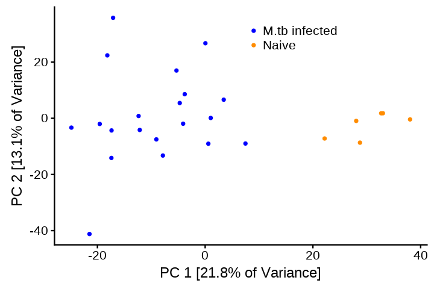


### Figure 1B (Principle Component Analysis of infected mice)


```R
mouse.exprs.Mtb = mouse.exprs.log[,pheno.data$infection.status == "Mtb"]
PCA.mouse.Mtb = prcomp(t(mouse.exprs.Mtb), scale.=T)
gg.PCA.mouse.Mtb = as.data.frame(PCA.mouse.Mtb$x[,1:5])

std_dev = PCA.mouse.Mtb$sdev
pr_var = std_dev^2
prop_varex = pr_var / sum(pr_var)

stage = ifelse(pheno.data[pheno.data$infection.status=="Mtb",]$time.point.days <= 60,
               "early",
               "late")

gg.PCA.mouse.Mtb$stage = as.factor(stage)

Time.PCA.plot = ggplot(data=gg.PCA.mouse.Mtb, aes(x=PC1, y= PC2)) +
            geom_point(aes(col=stage), size=1) + scale_color_manual(name="",
                                                              labels=c("Early (30 - 60 days)", "Late (90 - 150 days)"),
                                                              values=c("early"="black", "late"="red")) +
                theme(legend.position=c(0.50,0.90), legend.text = element_text(size=12))  + 
                labs(x=paste("PC 1 [", format(prop_varex[1]*100, digits=3, nsmall=1), "% of Variance]", sep=""), 
                     y=paste("PC 2 [", format(prop_varex[2]*100, digits=3, nsmall=1), "% of Variance]", sep="")) +
            theme(legend.position=c(0.4,0.90))

Time.PCA.plot
```


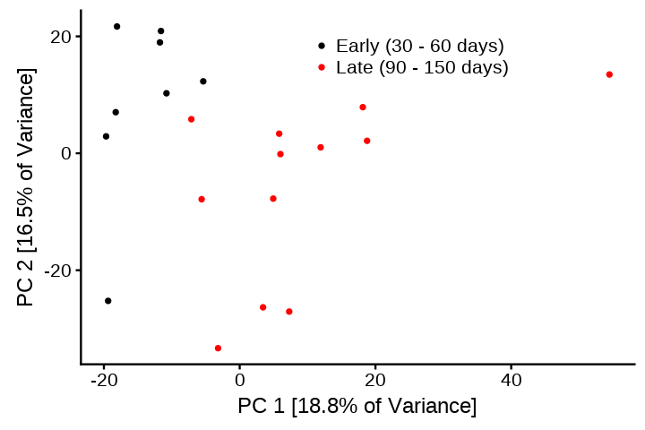


### Figure 1C (Classification of early vs. late time periods post-infection)


```R
set.seed(100)

mouse.table.class = as.data.frame(t(mouse.exprs.log[,pheno.data$infection.status == "Mtb"]))
mouse.table.class$stage = as.factor(stage)
mouse.rf.class = randomForest(stage~., data=mouse.table.class)
```


```R
class.plot = my.roc(1 - mouse.rf.class$votes[,2], mouse.table.class$stage, "early")
gg.class.plot = ggroc(list(mouse=class.plot), legacy.axes=TRUE) +
                geom_abline(intercept = 0, slope = 1, color = "lightgrey", size = 0.25) + 
                ggtitle("Early vs. Late Time Period") + theme(plot.title = element_text(size=12, face="plain")) +
                scale_color_manual(name="M.tb Infected Mice",
                                  labels=expression("AUC 0.99, p ="~1.6~ "x" ~10^{-5} ~ " "),
                                  values=c("mouse"="black")) +
            theme(legend.position=c(0.30,0.20), legend.title = element_text(size=12), legend.text = element_text(size=11))  
gg.class.plot
```

    [1] "This is the AUC:"
    Area under the curve: 0.9896
    [1] "This is the AUC p-value:"
    [1] 1.58768e-05
    [1] "This is the AUC 95% Confidence Interval"
    95% CI: 0.9607-1 (DeLong)


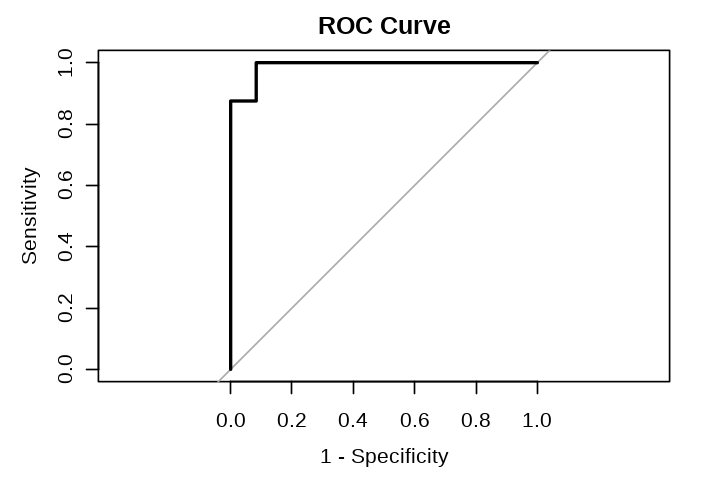


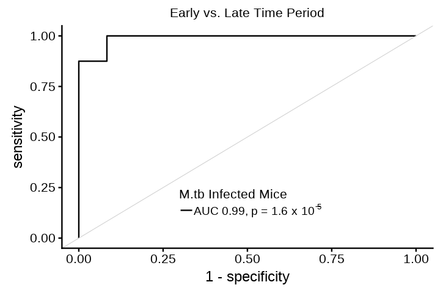


### Figure 1D (Regression of time post-infection)


```R
mouse.table.regress = as.data.frame(t(mouse.exprs.log[,pheno.data$infection.status == "Mtb"]))
mouse.table.regress$time.point.days = pheno.data[pheno.data$infection.status=="Mtb",]$time.point.days
set.seed(100)
C57.rf.regres = randomForest(time.point.days~., data=mouse.table.regress, importance=T)
predictions = data.frame(C57.predicted=C57.rf.regres$predicted, C57.time.point.days = mouse.table.regress$time.point.days)

set.seed(100)
regress.plot = ggplot(predictions, aes(C57.time.point.days, C57.predicted))+ 
                  geom_point() + 
                  geom_smooth() + theme_bw() + 
                  labs(x="Days Post Infection", y="Predicted Days Post Infection", size=14) + 
                  ggtitle("Regression on Time Post Infection") +
                  theme(plot.title = element_text(hjust = 0.5, size=12)) +
scale_x_continuous(breaks=c(30, 60, 90, 120, 150)) +
                scale_y_continuous(breaks=c(30, 60, 90, 120, 150))
regress.plot
```

    Warning message in randomForest.default(m, y, ...):
    “The response has five or fewer unique values.  Are you sure you want to do regression?”`geom_smooth()` using method = 'loess'


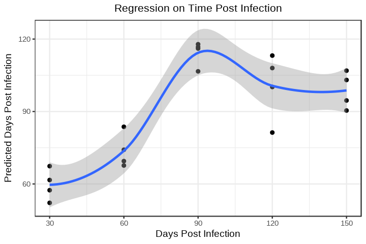


## Figure 2 Macaque Analysis

- This code reproduces the analysis of Figure 2, showing that "Blood genome-wide RNA expression discriminates early vs. late M.tb infection time periods in cynomolgus macaques"

### Install and Load Required Libraries


```R
source("https://bioconductor.org/biocLite.R")
if (!require("Biobase")) {
  biocLite("Biobase")
  library("Biobase")
}
if (!require("GEOquery")) {
  biocLite("GEOquery")
  library("GEOquery")
}

if (!require("sva")) {
  biocLite("sva")
  library("sva")
}

if (!require("ranger")) {
  install.packages("ranger")
  library("ranger")
}

if (!require("ggplot2")) {
  install.packages("ggplot2")
  library("ggplot2")
}

if (!require("glmnet")) {
  install.packages("glmnet")
  library("glmnet")
}

if (!require("gbm")) {
  install.packages("gbm")
  library("gbm")
}

if (!require("kernlab")) {
  install.packages("kernlab")
  library("kernlab")
}

if (!require("caret")) {
  install.packages("caret")
  library("caret")
}
if (!require("dplyr")) {
  install.packages("dplyr")
  library("dplyr")
}

if (!require("ggsignif")) {
  install.packages("ggsignif")
  library("ggsignif")
}

if (!require("doParallel")) {
  install.packages("doParallel")
  library("doParallel")
}

if (!require("cowplot")) {
  install.packages("cowplot")
  library("cowplot")
}

if (!require("pROC")) {
    # pROC 1.12.0 is required, and may not be the default installation:
    packageUrl<- "https://cran.r-project.org/src/contrib/Archive/pROC/pROC_1.12.0.tar.gz"
    install.packages(packageUrl, repos=NULL, type='source')
    library("pROC")
}
```

    Bioconductor version 3.6 (BiocInstaller 1.28.0), ?biocLite for help
    A new version of Bioconductor is available after installing the most recent
      version of R; see http://bioconductor.org/install
    Loading required package: gbm
    Loading required package: survival
    
    Attaching package: ‘survival’
    
    The following object is masked from ‘package:boot’:
    
        aml
    
    The following object is masked from ‘package:caret’:
    
        cluster
    
    Loading required package: splines
    Loaded gbm 2.1.3
    Loading required package: kernlab
    
    Attaching package: ‘kernlab’
    
    The following object is masked from ‘package:CircStats’:
    
        rvm
    
    The following object is masked from ‘package:ggplot2’:
    
        alpha
    
    Loading required package: ggsignif


### Load the data


```R
source("utils_submission.R")
```


```R
monkey.path = paste(path, "/data/GSE84152", sep="")
```


```R
monkey.gset = getGEO(filename=paste(monkey.path, "GSE84152_series_matrix.txt.gz", sep="/"), 
             destdir=monkey.path)
```


```R
monkey.gset
```


    ExpressionSet (storageMode: lockedEnvironment)
    assayData: 47323 features, 470 samples 
      element names: exprs 
    protocolData: none
    phenoData
      sampleNames: GSM2227793 GSM2227794 ... GSM2228262 (470 total)
      varLabels: title geo_accession ... wbc:ch1 (95 total)
      varMetadata: labelDescription
    featureData
      featureNames: ILMN_1343291 ILMN_1343295 ... ILMN_3311190 (47323
        total)
      fvarLabels: ID Species ... GB_ACC (30 total)
      fvarMetadata: Column Description labelDescription
    experimentData: use 'experimentData(object)'
    Annotation: GPL10558 


```R
raw.expres = read.table(file = paste(monkey.path, "GSE84152_non-normalized.txt", sep="/"), header=T , sep="\t")
```

#### Process the phenotype table, filter probes expressed in at least 5% of samples (Detection Pvalue < 0.01)


```R
pheno = filter.monkey.pheno(pData(monkey.gset))
```

                  title ChIP hyb.chamber  dataset synchroset monkeyid time.point
    GSM2227793  M16_150    1           1 Training         No      M16        150
    GSM2227794    M17_3    1           1 Training         No      M17          3
    GSM2227795  M8_Pre2    1           1 Training         No       M8          1
    GSM2227796   M19_56    1           1 Training         No      M19         56
    GSM2227797   M19_90    1           1 Training         No      M19         90
    GSM2227798     M1_7    1           1 Training         No       M1          7
    GSM2227799   M18_20    1           1 Training         No      M18         20
    GSM2227800   M15_90    1           1 Training         No      M15         90
    GSM2227801    M1_42    1           1 Training         No       M1         42
    GSM2227802  M13_180    1           1 Training        Yes      M13        180
    GSM2227803   M17_10    1           1 Training         No      M17         10
    GSM2227804   M18_10    1           1 Training         No      M18         10
    GSM2227805   M6_120    2           1 Training         No       M6        120
    GSM2227806   M14_90    2           1 Training         No      M14         90
    GSM2227807   M15_20    2           1 Training         No      M15         20
    GSM2227808  M17_120    2           1 Training         No      M17        120
    GSM2227809    M2_42    2           1 Training         No       M2         42
    GSM2227810   M9_120    2           1 Training         No       M9        120
    GSM2227811    M17_7    2           1 Training         No      M17          7
    GSM2227812    M9_30    2           1 Training         No       M9         30
    GSM2227813  M16_120    2           1 Training         No      M16        120
    GSM2227814   M3_180    2           1 Training        Yes       M3        180
    GSM2227815    M3_30    2           1 Training         No       M3         30
    GSM2227816  M19_150    2           1 Training        Yes      M19        150
    GSM2227817    M19_3    3           1 Training         No      M19          3
    GSM2227818    M1_20    3           1 Training         No       M1         20
    GSM2227819    M11_7    3           1 Training         No      M11          7
    GSM2227820  M18_120    3           1 Training         No      M18        120
    GSM2227821    M14_3    3           1 Training         No      M14          3
    GSM2227822     M7_3    3           1 Training         No       M7          3
    GSM2227823   M8_150    3           1 Training         No       M8        150
    GSM2227824  M4_Pre2    3           1 Training         No       M4          1
    GSM2227825    M4_56    3           1 Training         No       M4         56
    GSM2227826 M17_Pre1    3           1 Training        Yes      M17          0
    GSM2227827    M9_90    3           1 Training         No       M9         90
    GSM2227828    M1_56    4           1 Training         No       M1         56
    GSM2227829 M18_Pre1    4           1 Training        Yes      M18          0
    GSM2227830 M13_Pre2    4           1 Training         No      M13          1
    GSM2227831  M3_Pre2    4           1 Training         No       M3          1
    GSM2227832    M4_20    4           1 Training         No       M4         20
    GSM2227833  M16_180    4           1 Training        Yes      M16        180
    GSM2227834   M18_30    4           1 Training         No      M18         30
    GSM2227835    M6_42    4           1 Training         No       M6         42
    GSM2227836    M2_20    4           1 Training         No       M2         20
    GSM2227837   M14_30    4           1 Training         No      M14         30
    GSM2227838 M14_Pre2    4           1 Training         No      M14          1
    GSM2227839   M5_150    4           1 Training         No       M5        150
    GSM2227840  M8_Pre1    5           2 Training        Yes       M8          0
    GSM2227841   M13_42    5           2 Training         No      M13         42
    GSM2227842   M19_30    5           2 Training         No      M19         30
    GSM2227843  M12_150    5           2 Training         No      M12        150
    GSM2227844    M7_56    5           2 Training         No       M7         56
    GSM2227845    M15_3    5           2 Training         No      M15          3
    GSM2227846    M15_7    5           2 Training         No      M15          7
    GSM2227847   M1_180    5           2 Training        Yes       M1        180
    GSM2227848    M5_42    5           2 Training         No       M5         42
    GSM2227849  M3_Pre1    5           2 Training        Yes       M3          0
    GSM2227850    M13_7    5           2 Training         No      M13          7
    GSM2227851     M4_3    5           2 Training         No       M4          3
    GSM2227852   M14_10    6           2 Training         No      M14         10
    GSM2227853 M10_Pre1    6           2 Training        Yes      M10          0
    GSM2227854    M5_10    6           2 Training         No       M5         10
    GSM2227855   M2_150    6           2 Training         No       M2        150
    GSM2227856   M3_150    6           2 Training         No       M3        150
    GSM2227857  M12_120    6           2 Training         No      M12        120
    GSM2227858    M7_42    6           2 Training         No       M7         42
    GSM2227859   M16_30    6           2 Training         No      M16         30
    GSM2227860     M2_3    6           2 Training         No       M2          3
    GSM2227861  M19_120    6           2 Training         No      M19        120
    GSM2227862     M5_7    6           2 Training         No       M5          7
    GSM2227863    M4_10    6           2 Training         No       M4         10
    GSM2227864   M13_90    7           2 Training         No      M13         90
    GSM2227865   M3_120    7           2 Training         No       M3        120
    GSM2227866   M18_90    7           2 Training         No      M18         90
    GSM2227867    M12_7    7           2 Training         No      M12          7
    GSM2227868  M17_150    7           2 Training         No      M17        150
    GSM2227869   M4_150    7           2 Training         No       M4        150
    GSM2227870  M6_Pre1    7           2 Training        Yes       M6          0
    GSM2227871  M13_150    7           2 Training         No      M13        150
    GSM2227872  M15_120    7           2 Training         No      M15        120
    GSM2227873   M18_56    7           2 Training         No      M18         56
    GSM2227874  M4_Pre1    7           2 Training        Yes       M4          0
    GSM2227875    M9_42    7           2 Training         No       M9         42
    GSM2227876    M9_10    8           2 Training         No       M9         10
    GSM2227877   M6_150    8           2 Training         No       M6        150
    GSM2227878   M8_120    8           2 Training         No       M8        120
    GSM2227879   M14_20    8           2 Training         No      M14         20
    GSM2227880    M9_20    8           2 Training         No       M9         20
    GSM2227881     M3_7    8           2 Training         No       M3          7
    GSM2227882 M18_Pre2    8           2 Training         No      M18          1
    GSM2227883    M3_20    8           2 Training         No       M3         20
    GSM2227884   M10_90    8           2 Training        Yes      M10         90
    GSM2227885  M1_Pre1    8           2 Training        Yes       M1          0
    GSM2227886   M16_90    8           2 Training         No      M16         90
    GSM2227887 M12_Pre1    9           3 Training        Yes      M12          0
    GSM2227888    M18_7    9           3 Training         No      M18          7
    GSM2227889    M5_90    9           3 Training         No       M5         90
    GSM2227890   M11_56    9           3 Training         No      M11         56
    GSM2227891    M10_7    9           3 Training         No      M10          7
    GSM2227892     M8_3    9           3 Training         No       M8          3
    GSM2227893   M7_180    9           3 Training        Yes       M7        180
    GSM2227894    M6_30    9           3 Training         No       M6         30
    GSM2227895   M13_56    9           3 Training         No      M13         56
    GSM2227896  M7_Pre1    9           3 Training        Yes       M7          0
    GSM2227897  M1_Pre2    9           3 Training         No       M1          1
    GSM2227898    M2_56    9           3 Training         No       M2         56
    GSM2227899    M8_30   10           3 Training         No       M8         30
    GSM2227900  M15_150   10           3 Training         No      M15        150
    GSM2227901     M5_3   10           3 Training         No       M5          3
    GSM2227902    M7_10   10           3 Training         No       M7         10
    GSM2227903    M7_30   10           3 Training         No       M7         30
    GSM2227904     M7_7   10           3 Training         No       M7          7
    GSM2227905    M6_90   10           3 Training         No       M6         90
    GSM2227906   M13_10   10           3 Training         No      M13         10
    GSM2227907 M16_Pre1   10           3 Training        Yes      M16          0
    GSM2227908  M11_120   10           3 Training         No      M11        120
    GSM2227909  M14_150   10           3 Training         No      M14        150
    GSM2227910    M13_3   10           3 Training         No      M13          3
    GSM2227911 M16_Pre2   11           3 Training         No      M16          1
    GSM2227912  M12_180   11           3 Training        Yes      M12        180
    GSM2227913  M13_120   11           3 Training         No      M13        120
    GSM2227914    M1_90   11           3 Training         No       M1         90
    GSM2227915   M12_42   11           3 Training         No      M12         42
    GSM2227916     M3_3   11           3 Training         No       M3          3
    GSM2227917   M15_42   11           3 Training         No      M15         42
    GSM2227918   M5_180   11           3 Training        Yes       M5        180
    GSM2227919    M7_90   11           3 Training         No       M7         90
    GSM2227920   M15_10   11           3 Training         No      M15         10
    GSM2227921  M2_Pre2   11           3 Training         No       M2          1
    GSM2227922  M7_Pre2   12           3 Training         No       M7          1
    GSM2227923    M5_56   12           3 Training         No       M5         56
    GSM2227924    M6_20   12           3 Training         No       M6         20
    GSM2227925   M10_30   12           3 Training         No      M10         30
    GSM2227926   M9_180   12           3 Training        Yes       M9        180
    GSM2227927     M6_3   12           3 Training         No       M6          3
    GSM2227928   M10_56   12           3 Training         No      M10         56
    GSM2227929   M16_10   12           3 Training         No      M16         10
    GSM2227930   M10_10   12           3 Training         No      M10         10
    GSM2227931    M10_3   12           3 Training         No      M10          3
    GSM2227932 M15_Pre2   12           3 Training         No      M15          1
    GSM2227933    M9_56   12           3 Training         No       M9         56
    GSM2227934   M15_30   13           4 Training         No      M15         30
    GSM2227935    M3_90   13           4 Training         No       M3         90
    GSM2227936     M4_7   13           4 Training         No       M4          7
    GSM2227937    M12_3   13           4 Training         No      M12          3
    GSM2227938    M19_7   13           4 Training         No      M19          7
    GSM2227939    M7_20   13           4 Training         No       M7         20
    GSM2227940    M14_7   13           4 Training         No      M14          7
    GSM2227941 M13_Pre1   13           4 Training        Yes      M13          0
    GSM2227942   M11_10   13           4 Training         No      M11         10
    GSM2227943   M13_30   13           4 Training         No      M13         30
    GSM2227944   M17_56   13           4 Training         No      M17         56
    GSM2227945   M16_56   13           4 Training         No      M16         56
    GSM2227946     M9_7   14           4 Training         No       M9          7
    GSM2227947   M1_150   14           4 Training         No       M1        150
    GSM2227948     M1_3   14           4 Training         No       M1          3
    GSM2227949    M5_20   14           4 Training         No       M5         20
    GSM2227950   M12_20   14           4 Training         No      M12         20
    GSM2227951   M14_42   14           4 Training         No      M14         42
    GSM2227952    M8_20   14           4 Training         No       M8         20
    GSM2227953    M8_10   14           4 Training         No       M8         10
    GSM2227954   M19_42   14           4 Training         No      M19         42
    GSM2227955    M4_42   14           4 Training         No       M4         42
    GSM2227956   M19_20   14           4 Training         No      M19         20
    GSM2227957   M15_56   14           4 Training         No      M15         56
    GSM2227958   M18_42   15           4 Training         No      M18         42
    GSM2227959     M6_7   15           4 Training         No       M6          7
    GSM2227960   M2_180   15           4 Training        Yes       M2        180
    GSM2227961   M19_10   15           4 Training         No      M19         10
    GSM2227962    M4_30   15           4 Training         No       M4         30
    GSM2227963   M16_42   15           4 Training         No      M16         42
    GSM2227964    M3_42   15           4 Training         No       M3         42
    GSM2227965   M9_150   15           4 Training         No       M9        150
    GSM2227966 M11_Pre1   15           4 Training        Yes      M11          0
    GSM2227967    M11_3   15           4 Training         No      M11          3
    GSM2227968    M8_56   15           4 Training         No       M8         56
    GSM2227969  M17_180   15           4 Training        Yes      M17        180
    GSM2227970  M18_150   16           4 Training        Yes      M18        150
    GSM2227971    M4_90   16           4 Training         No       M4         90
    GSM2227972 M15_Pre1   16           4 Training        Yes      M15          0
    GSM2227973  M15_180   16           4 Training        Yes      M15        180
    GSM2227974    M1_30   16           4 Training         No       M1         30
    GSM2227975  M11_150   16           4 Training         No      M11        150
    GSM2227976   M4_120   16           4 Training         No       M4        120
    GSM2227977    M16_7   16           4 Training         No      M16          7
    GSM2227978    M8_42   16           4 Training         No       M8         42
    GSM2227979   M12_10   16           4 Training         No      M12         10
    GSM2227980    M2_90   16           4 Training         No       M2         90
    GSM2227981     M2_7   16           4 Training         No       M2          7
    GSM2227982    M1_10   17           5 Training         No       M1         10
    GSM2227983   M11_42   17           5 Training         No      M11         42
    GSM2227984   M7_150   17           5 Training         No       M7        150
    GSM2227985   M14_56   17           5 Training         No      M14         56
    GSM2227986   M10_20   17           5 Training         No      M10         20
    GSM2227987  M11_180   17           5 Training        Yes      M11        180
    GSM2227988    M5_30   17           5 Training         No       M5         30
    GSM2227989 M12_Pre2   17           5 Training         No      M12          1
    GSM2227990  M2_Pre1   17           5 Training        Yes       M2          0
    GSM2227991  M9_Pre1   17           5 Training        Yes       M9          0
    GSM2227992  M6_Pre2   17           5 Training         No       M6          1
    GSM2227993   M1_120   17           5 Training         No       M1        120
    GSM2227994  M5_Pre2   18           5 Training         No       M5          1
    GSM2227995    M2_10   18           5 Training         No       M2         10
    GSM2227996     M9_3   18           5 Training         No       M9          3
    GSM2227997   M7_120   18           5 Training         No       M7        120
    GSM2227998  M5_Pre1   18           5 Training        Yes       M5          0
    GSM2227999    M2_30   18           5 Training         No       M2         30
    GSM2228000    M16_3   18           5 Training         No      M16          3
    GSM2228001   M11_30   18           5 Training         No      M11         30
    GSM2228002   M10_42   18           5 Training         No      M10         42
    GSM2228003   M12_30   18           5 Training         No      M12         30
    GSM2228004   M12_56   18           5 Training         No      M12         56
    GSM2228005   M17_90   18           5 Training         No      M17         90
    GSM2228006  M14_120   19           5 Training         No      M14        120
    GSM2228007     M8_7   19           5 Training         No       M8          7
    GSM2228008 M14_Pre1   19           5 Training        Yes      M14          0
    GSM2228009   M12_90   19           5 Training         No      M12         90
    GSM2228010    M8_90   19           5 Training         No       M8         90
    GSM2228011   M8_180   19           5 Training        Yes       M8        180
    GSM2228012   M4_180   19           5 Training        Yes       M4        180
    GSM2228013    M3_10   19           5 Training         No       M3         10
    GSM2228014 M10_Pre2   19           5 Training         No      M10          1
    GSM2228015   M6_180   19           5 Training        Yes       M6        180
    GSM2228016    M3_56   19           5 Training         No       M3         56
    GSM2228017   M5_120   20           5 Training         No       M5        120
    GSM2228018   M17_30   20           5 Training         No      M17         30
    GSM2228019   M16_20   20           5 Training         No      M16         20
    GSM2228020   M11_20   20           5 Training         No      M11         20
    GSM2228021   M17_42   20           5 Training         No      M17         42
    GSM2228022  M14_180   20           5 Training        Yes      M14        180
    GSM2228023   M13_20   20           5 Training         No      M13         20
    GSM2228024   M11_90   20           5 Training         No      M11         90
    GSM2228025   M17_20   20           5 Training         No      M17         20
    GSM2228026    M6_56   20           5 Training         No       M6         56
    GSM2228027   M2_120   20           5 Training         No       M2        120
    GSM2228028 M19_Pre1   20           5 Training        Yes      M19          0
    GSM2228029    M6_10   21           6 Training         No       M6         10
    GSM2228030    M18_3   21           6 Training         No      M18          3
    GSM2228031 M24_Pre1   22           7     Test        Yes      M24          0
    GSM2228032  M32_120   22           7     Test         No      M32        120
    GSM2228033   M36_10   22           7     Test         No      M36         10
    GSM2228034   M20_56   22           7     Test         No      M20         56
    GSM2228035   M23_90   22           7     Test        Yes      M23         90
    GSM2228036   M24_90   22           7     Test         No      M24         90
    GSM2228037   M34_42   22           7     Test         No      M34         42
    GSM2228038   M29_90   22           7     Test         No      M29         90
    GSM2228039   M28_10   23           7     Test         No      M28         10
    GSM2228040    M33_7   23           7     Test         No      M33          7
    GSM2228041  M28_180   23           7     Test        Yes      M28        180
    GSM2228042   M31_10   23           7     Test         No      M31         10
    GSM2228043    M33_3   23           7     Test         No      M33          3
    GSM2228044   M29_20   23           7     Test         No      M29         20
    GSM2228045 M23_Pre1   23           7     Test        Yes      M23          0
    GSM2228046  M20_180   23           7     Test        Yes      M20        180
    GSM2228047  M28_150   23           7     Test         No      M28        150
    GSM2228048 M25_Pre2   23           7     Test         No      M25          1
    GSM2228049  M33_150   24           7     Test         No      M33        150
    GSM2228050  M20_150   24           7     Test         No      M20        150
    GSM2228051  M22_150   24           7     Test         No      M22        150
    GSM2228052    M23_7   24           7     Test         No      M23          7
    GSM2228053   M36_42   24           7     Test         No      M36         42
    GSM2228054   M23_42   24           7     Test         No      M23         42
    GSM2228055  M29_150   24           7     Test         No      M29        150
    GSM2228056   M34_30   24           7     Test         No      M34         30
    GSM2228057   M26_56   24           7     Test         No      M26         56
    GSM2228058   M30_56   24           7     Test         No      M30         56
    GSM2228059   M27_90   24           7     Test         No      M27         90
    GSM2228060   M27_10   24           7     Test         No      M27         10
    GSM2228061   M22_10   25           7     Test         No      M22         10
    GSM2228062   M29_42   25           7     Test         No      M29         42
    GSM2228063    M38_3   25           7     Test         No      M38          3
    GSM2228064 M28_Pre1   25           7     Test        Yes      M28          0
    GSM2228065   M38_90   25           7     Test         No      M38         90
    GSM2228066  M21_180   25           7     Test        Yes      M21        180
    GSM2228067 M29_Pre1   25           7     Test        Yes      M29          0
    GSM2228068    M34_3   25           7     Test         No      M34          3
    GSM2228069   M25_90   25           7     Test         No      M25         90
    GSM2228070   M22_30   25           7     Test         No      M22         30
    GSM2228071 M25_Pre1   25           7     Test        Yes      M25          0
    GSM2228072   M20_10   26           8     Test         No      M20         10
    GSM2228073  M29_180   26           8     Test        Yes      M29        180
    GSM2228074   M31_56   26           8     Test         No      M31         56
    GSM2228075   M27_20   26           8     Test         No      M27         20
    GSM2228076   M23_10   26           8     Test         No      M23         10
    GSM2228077  M30_180   26           8     Test        Yes      M30        180
    GSM2228078   M26_42   26           8     Test         No      M26         42
    GSM2228079 M23_Pre2   26           8     Test         No      M23          1
    GSM2228080   M35_56   26           8     Test         No      M35         56
    GSM2228081 M26_Pre2   26           8     Test         No      M26          1
    GSM2228082   M36_20   26           8     Test         No      M36         20
    GSM2228083    M30_3   27           8     Test         No      M30          3
    GSM2228084   M28_90   27           8     Test         No      M28         90
    GSM2228085   M30_42   27           8     Test         No      M30         42
    GSM2228086   M34_10   27           8     Test         No      M34         10
    GSM2228087 M37_Pre2   27           8     Test         No      M37          1
    GSM2228088  M37_180   27           8     Test        Yes      M37        180
    GSM2228089   M33_56   27           8     Test         No      M33         56
    GSM2228090   M20_90   27           8     Test         No      M20         90
    GSM2228091  M36_180   27           8     Test        Yes      M36        180
    GSM2228092   M25_30   27           8     Test         No      M25         30
    GSM2228093   M23_56   28           8     Test         No      M23         56
    GSM2228094   M21_42   28           8     Test         No      M21         42
    GSM2228095   M26_90   28           8     Test         No      M26         90
    GSM2228096   M21_30   28           8     Test         No      M21         30
    GSM2228097   M34_20   28           8     Test         No      M34         20
    GSM2228098  M22_180   28           8     Test        Yes      M22        180
    GSM2228099   M21_56   28           8     Test         No      M21         56
    GSM2228100   M32_30   28           8     Test         No      M32         30
    GSM2228101 M35_Pre1   28           8     Test        Yes      M35          0
    GSM2228102  M26_180   29           8     Test        Yes      M26        180
    GSM2228103 M32_Pre2   29           8     Test         No      M32          1
    GSM2228104   M37_90   29           8     Test         No      M37         90
    GSM2228105  M27_180   29           8     Test        Yes      M27        180
    GSM2228106  M38_120   29           8     Test         No      M38        120
    GSM2228107 M31_Pre2   29           8     Test         No      M31          1
    GSM2228108   M30_20   29           8     Test         No      M30         20
    GSM2228109 M37_Pre1   29           8     Test        Yes      M37          0
    GSM2228110    M27_7   29           8     Test         No      M27          7
    GSM2228111   M21_10   29           8     Test         No      M21         10
    GSM2228112  M34_120   29           8     Test         No      M34        120
    GSM2228113   M32_10   29           8     Test         No      M32         10
    GSM2228114   M29_10   30           9     Test         No      M29         10
    GSM2228115   M27_56   30           9     Test         No      M27         56
    GSM2228116  M25_180   30           9     Test        Yes      M25        180
    GSM2228117    M35_7   30           9     Test         No      M35          7
    GSM2228118   M23_20   30           9     Test         No      M23         20
    GSM2228119  M31_120   30           9     Test         No      M31        120
    GSM2228120  M21_120   30           9     Test         No      M21        120
    GSM2228121   M22_90   30           9     Test         No      M22         90
    GSM2228122   M33_42   30           9     Test         No      M33         42
    GSM2228123   M38_20   30           9     Test         No      M38         20
    GSM2228124    M28_7   31           9     Test         No      M28          7
    GSM2228125    M35_3   31           9     Test         No      M35          3
    GSM2228126  M35_120   31           9     Test         No      M35        120
    GSM2228127 M22_Pre1   31           9     Test        Yes      M22          0
    GSM2228128  M20_120   31           9     Test         No      M20        120
    GSM2228129   M28_42   31           9     Test         No      M28         42
    GSM2228130   M28_20   31           9     Test         No      M28         20
    GSM2228131   M35_90   31           9     Test         No      M35         90
    GSM2228132  M31_150   31           9     Test         No      M31        150
    GSM2228133   M29_56   31           9     Test         No      M29         56
    GSM2228134   M29_30   31           9     Test         No      M29         30
    GSM2228135  M35_150   32           9     Test         No      M35        150
    GSM2228136  M30_150   32           9     Test         No      M30        150
    GSM2228137 M27_Pre1   32           9     Test        Yes      M27          0
    GSM2228138   M37_42   32           9     Test         No      M37         42
    GSM2228139  M24_120   32           9     Test         No      M24        120
    GSM2228140   M21_90   32           9     Test         No      M21         90
    GSM2228141   M36_56   32           9     Test         No      M36         56
    GSM2228142    M32_7   32           9     Test         No      M32          7
    GSM2228143   M28_56   32           9     Test         No      M28         56
    GSM2228144   M24_56   32           9     Test         No      M24         56
    GSM2228145  M34_150   33           9     Test         No      M34        150
    GSM2228146   M25_56   33           9     Test         No      M25         56
    GSM2228147   M24_30   33           9     Test         No      M24         30
    GSM2228148    M36_7   33           9     Test         No      M36          7
    GSM2228149   M32_56   33           9     Test         No      M32         56
    GSM2228150 M30_Pre2   33           9     Test         No      M30          1
    GSM2228151  M25_120   33           9     Test         No      M25        120
    GSM2228152  M32_180   33           9     Test        Yes      M32        180
    GSM2228153  M33_120   33           9     Test         No      M33        120
    GSM2228154   M23_30   33           9     Test         No      M23         30
    GSM2228155    M26_7   34          10     Test         No      M26          7
    GSM2228156 M35_Pre2   34          10     Test         No      M35          1
    GSM2228157   M32_90   34          10     Test         No      M32         90
    GSM2228158  M36_120   34          10     Test         No      M36        120
    GSM2228159 M36_Pre2   34          10     Test         No      M36          1
    GSM2228160   M38_56   34          10     Test         No      M38         56
    GSM2228161   M30_10   34          10     Test         No      M30         10
    GSM2228162  M29_120   34          10     Test         No      M29        120
    GSM2228163    M24_7   34          10     Test         No      M24          7
    GSM2228164   M25_20   34          10     Test         No      M25         20
    GSM2228165   M38_42   35          10     Test         No      M38         42
    GSM2228166   M37_30   35          10     Test         No      M37         30
    GSM2228167  M30_120   35          10     Test         No      M30        120
    GSM2228168   M24_10   35          10     Test         No      M24         10
    GSM2228169 M22_Pre2   35          10     Test         No      M22          1
    GSM2228170   M34_56   35          10     Test         No      M34         56
    GSM2228171   M35_42   35          10     Test         No      M35         42
    GSM2228172  M38_150   35          10     Test        Yes      M38        150
    GSM2228173    M31_7   35          10     Test         No      M31          7
    GSM2228174    M37_3   35          10     Test         No      M37          3
    GSM2228175 M24_Pre2   35          10     Test         No      M24          1
    GSM2228176   M30_30   35          10     Test         No      M30         30
    GSM2228177  M26_150   36          10     Test         No      M26        150
    GSM2228178    M32_3   36          10     Test         No      M32          3
    GSM2228179   M37_20   36          10     Test         No      M37         20
    GSM2228180  M33_180   36          10     Test        Yes      M33        180
    GSM2228181   M35_20   36          10     Test         No      M35         20
    GSM2228182  M28_120   36          10     Test         No      M28        120
    GSM2228183   M36_90   36          10     Test         No      M36         90
    GSM2228184 M29_Pre2   36          10     Test         No      M29          1
    GSM2228185   M31_20   36          10     Test         No      M31         20
    GSM2228186   M37_10   36          10     Test         No      M37         10
    GSM2228187 M36_Pre1   37          10     Test        Yes      M36          0
    GSM2228188   M32_20   37          10     Test         No      M32         20
    GSM2228189   M32_42   37          10     Test         No      M32         42
    GSM2228190  M31_180   37          10     Test        Yes      M31        180
    GSM2228191 M34_Pre2   37          10     Test         No      M34          1
    GSM2228192  M36_150   37          10     Test         No      M36        150
    GSM2228193   M31_90   37          10     Test         No      M31         90
    GSM2228194    M31_3   37          10     Test         No      M31          3
    GSM2228195 M32_Pre1   37          10     Test        Yes      M32          0
    GSM2228196  M24_180   37          10     Test        Yes      M24        180
    GSM2228197   M31_42   37          10     Test         No      M31         42
    GSM2228198 M38_Pre1   37          10     Test        Yes      M38          0
    GSM2228199   M24_42   38          11     Test         No      M24         42
    GSM2228200 M34_Pre1   38          11     Test        Yes      M34          0
    GSM2228201   M37_56   38          11     Test         No      M37         56
    GSM2228202  M27_120   38          11     Test         No      M27        120
    GSM2228203  M26_120   38          11     Test         No      M26        120
    GSM2228204  M25_150   38          11     Test         No      M25        150
    GSM2228205   M33_10   38          11     Test         No      M33         10
    GSM2228206 M31_Pre1   38          11     Test        Yes      M31          0
    GSM2228207   M38_10   38          11     Test         No      M38         10
    GSM2228208  M37_150   38          11     Test         No      M37        150
    GSM2228209 M27_Pre2   38          11     Test         No      M27          1
    GSM2228210    M34_7   39          11     Test         No      M34          7
    GSM2228211   M20_42   39          11     Test         No      M20         42
    GSM2228212  M37_120   39          11     Test         No      M37        120
    GSM2228213 M21_Pre1   39          11     Test        Yes      M21          0
    GSM2228214    M30_7   39          11     Test         No      M30          7
    GSM2228215   M22_20   39          11     Test         No      M22         20
    GSM2228216   M25_10   39          11     Test         No      M25         10
    GSM2228217 M21_Pre2   39          11     Test         No      M21          1
    GSM2228218   M22_42   39          11     Test         No      M22         42
    GSM2228219    M38_7   39          11     Test         No      M38          7
    GSM2228220 M33_Pre2   39          11     Test         No      M33          1
    GSM2228221   M35_10   39          11     Test         No      M35         10
    GSM2228222    M25_7   40          11     Test         No      M25          7
    GSM2228223   M34_90   40          11     Test         No      M34         90
    GSM2228224   M33_30   40          11     Test         No      M33         30
    GSM2228225   M26_20   40          11     Test         No      M26         20
    GSM2228226 M33_Pre1   40          11     Test        Yes      M33          0
    GSM2228227 M38_Pre2   40          11     Test         No      M38          1
    GSM2228228   M20_20   40          11     Test         No      M20         20
    GSM2228229   M33_90   40          11     Test         No      M33         90
    GSM2228230  M24_150   40          11     Test         No      M24        150
    GSM2228231  M27_150   40          11     Test         No      M27        150
    GSM2228232   M38_30   40          11     Test         No      M38         30
    GSM2228233 M30_Pre1   40          11     Test        Yes      M30          0
    GSM2228234    M36_3   41          11     Test         No      M36          3
    GSM2228235    M20_7   41          11     Test         No      M20          7
    GSM2228236    M37_7   41          11     Test         No      M37          7
    GSM2228237  M35_180   41          11     Test        Yes      M35        180
    GSM2228238   M26_30   41          11     Test         No      M26         30
    GSM2228239  M22_120   41          11     Test         No      M22        120
    GSM2228240  M32_150   41          11     Test         No      M32        150
    GSM2228241    M22_7   41          11     Test         No      M22          7
    GSM2228242   M24_20   41          11     Test         No      M24         20
    GSM2228243   M33_20   41          11     Test         No      M33         20
    GSM2228244   M28_30   42          12     Test         No      M28         30
    GSM2228245   M35_30   42          12     Test         No      M35         30
    GSM2228246   M20_30   42          12     Test         No      M20         30
    GSM2228247   M36_30   42          12     Test         No      M36         30
    GSM2228248    M21_7   42          12     Test         No      M21          7
    GSM2228249 M26_Pre1   42          12     Test        Yes      M26          0
    GSM2228250   M27_30   42          12     Test         No      M27         30
    GSM2228251   M22_56   42          12     Test         No      M22         56
    GSM2228252 M20_Pre1   42          12     Test        Yes      M20          0
    GSM2228253   M25_42   42          12     Test         No      M25         42
    GSM2228254   M30_90   43          12     Test         No      M30         90
    GSM2228255  M34_180   43          12     Test        Yes      M34        180
    GSM2228256    M29_7   43          12     Test         No      M29          7
    GSM2228257   M27_42   43          12     Test         No      M27         42
    GSM2228258   M21_20   43          12     Test         No      M21         20
    GSM2228259 M28_Pre2   43          12     Test         No      M28          1
    GSM2228260 M20_Pre2   43          12     Test         No      M20          1
    GSM2228261  M21_150   43          12     Test         No      M21        150
    GSM2228262   M26_10   43          12     Test         No      M26         10
               infection.time clinical.status description           description.1
    GSM2227793             M5          Active     M16_150 6303256020_A.AVG_Signal
    GSM2227794             D3          Latent       M17_3 6303256020_B.AVG_Signal
    GSM2227795           Pre2          Active     M8_Pre2 6303256020_C.AVG_Signal
    GSM2227796            D56          Active      M19_56 6303256020_D.AVG_Signal
    GSM2227797             M3          Active      M19_90 6303256020_E.AVG_Signal
    GSM2227798             D7          Active        M1_7 6303256020_F.AVG_Signal
    GSM2227799            D20          Active      M18_20 6303256020_G.AVG_Signal
    GSM2227800             M3          Latent      M15_90 6303256020_H.AVG_Signal
    GSM2227801            D42          Active       M1_42 6303256020_I.AVG_Signal
    GSM2227802             M6          Latent     M13_180 6303256020_J.AVG_Signal
    GSM2227803            D10          Latent      M17_10 6303256020_K.AVG_Signal
    GSM2227804            D10          Active      M18_10 6303256020_L.AVG_Signal
    GSM2227805             M4          Active      M6_120 6303256032_A.AVG_Signal
    GSM2227806             M3          Latent      M14_90 6303256032_B.AVG_Signal
    GSM2227807            D20          Latent      M15_20 6303256032_C.AVG_Signal
    GSM2227808             M4          Latent     M17_120 6303256032_D.AVG_Signal
    GSM2227809            D42          Active       M2_42 6303256032_E.AVG_Signal
    GSM2227810             M4          Latent      M9_120 6303256032_F.AVG_Signal
    GSM2227811             D7          Latent       M17_7 6303256032_G.AVG_Signal
    GSM2227812            D30          Latent       M9_30 6303256032_H.AVG_Signal
    GSM2227813             M4          Active     M16_120 6303256032_I.AVG_Signal
    GSM2227814             M6          Latent      M3_180 6303256032_J.AVG_Signal
    GSM2227815            D30          Latent       M3_30 6303256032_K.AVG_Signal
    GSM2227816             M5          Active     M19_150 6303256032_L.AVG_Signal
    GSM2227817             D3          Active       M19_3 6303256034_A.AVG_Signal
    GSM2227818            D20          Active       M1_20 6303256034_B.AVG_Signal
    GSM2227819             D7          Latent       M11_7 6303256034_C.AVG_Signal
    GSM2227820             M4          Active     M18_120 6303256034_D.AVG_Signal
    GSM2227821             D3          Latent       M14_3 6303256034_E.AVG_Signal
    GSM2227822             D3          Latent        M7_3 6303256034_F.AVG_Signal
    GSM2227823             M5          Active      M8_150 6303256034_G.AVG_Signal
    GSM2227824           Pre2          Latent     M4_Pre2 6303256034_I.AVG_Signal
    GSM2227825            D56          Latent       M4_56 6303256034_J.AVG_Signal
    GSM2227826           Pre1          Latent    M17_Pre1 6303256034_K.AVG_Signal
    GSM2227827             M3          Latent       M9_90 6303256034_L.AVG_Signal
    GSM2227828            D56          Active       M1_56 6303256038_A.AVG_Signal
    GSM2227829           Pre1          Active    M18_Pre1 6303256038_B.AVG_Signal
    GSM2227830           Pre2          Latent    M13_Pre2 6303256038_C.AVG_Signal
    GSM2227831           Pre2          Latent     M3_Pre2 6303256038_D.AVG_Signal
    GSM2227832            D20          Latent       M4_20 6303256038_E.AVG_Signal
    GSM2227833             M6          Active     M16_180 6303256038_F.AVG_Signal
    GSM2227834            D30          Active      M18_30 6303256038_G.AVG_Signal
    GSM2227835            D42          Active       M6_42 6303256038_H.AVG_Signal
    GSM2227836            D20          Active       M2_20 6303256038_I.AVG_Signal
    GSM2227837            D30          Latent      M14_30 6303256038_J.AVG_Signal
    GSM2227838           Pre2          Latent    M14_Pre2 6303256038_K.AVG_Signal
    GSM2227839             M5          Latent      M5_150 6303256038_L.AVG_Signal
    GSM2227840           Pre1          Active     M8_Pre1 6303256042_A.AVG_Signal
    GSM2227841            D42          Latent      M13_42 6303256042_B.AVG_Signal
    GSM2227842            D30          Active      M19_30 6303256042_C.AVG_Signal
    GSM2227843             M5          Active     M12_150 6303256042_D.AVG_Signal
    GSM2227844            D56          Latent       M7_56 6303256042_E.AVG_Signal
    GSM2227845             D3          Latent       M15_3 6303256042_F.AVG_Signal
    GSM2227846             D7          Latent       M15_7 6303256042_G.AVG_Signal
    GSM2227847             M6          Active      M1_180 6303256042_H.AVG_Signal
    GSM2227848            D42          Latent       M5_42 6303256042_I.AVG_Signal
    GSM2227849           Pre1          Latent     M3_Pre1 6303256042_J.AVG_Signal
    GSM2227850             D7          Latent       M13_7 6303256042_K.AVG_Signal
    GSM2227851             D3          Latent        M4_3 6303256042_L.AVG_Signal
    GSM2227852            D10          Latent      M14_10 6303281024_A.AVG_Signal
    GSM2227853           Pre1          Active    M10_Pre1 6303281024_B.AVG_Signal
    GSM2227854            D10          Latent       M5_10 6303281024_C.AVG_Signal
    GSM2227855             M5          Active      M2_150 6303281024_D.AVG_Signal
    GSM2227856             M5          Latent      M3_150 6303281024_E.AVG_Signal
    GSM2227857             M4          Active     M12_120 6303281024_F.AVG_Signal
    GSM2227858            D42          Latent       M7_42 6303281024_G.AVG_Signal
    GSM2227859            D30          Active      M16_30 6303281024_H.AVG_Signal
    GSM2227860             D3          Active        M2_3 6303281024_I.AVG_Signal
    GSM2227861             M4          Active     M19_120 6303281024_J.AVG_Signal
    GSM2227862             D7          Latent        M5_7 6303281024_K.AVG_Signal
    GSM2227863            D10          Latent       M4_10 6303281024_L.AVG_Signal
    GSM2227864             M3          Latent      M13_90 7196763028_A.AVG_Signal
    GSM2227865             M4          Latent      M3_120 7196763028_B.AVG_Signal
    GSM2227866             M3          Active      M18_90 7196763028_C.AVG_Signal
    GSM2227867             D7          Active       M12_7 7196763028_D.AVG_Signal
    GSM2227868             M5          Latent     M17_150 7196763028_E.AVG_Signal
    GSM2227869             M5          Latent      M4_150 7196763028_F.AVG_Signal
    GSM2227870           Pre1          Active     M6_Pre1 7196763028_G.AVG_Signal
    GSM2227871             M5          Latent     M13_150 7196763028_H.AVG_Signal
    GSM2227872             M4          Latent     M15_120 7196763028_I.AVG_Signal
    GSM2227873            D56          Active      M18_56 7196763028_J.AVG_Signal
    GSM2227874           Pre1          Latent     M4_Pre1 7196763028_K.AVG_Signal
    GSM2227875            D42          Latent       M9_42 7196763028_L.AVG_Signal
    GSM2227876            D10          Latent       M9_10 7196763044_A.AVG_Signal
    GSM2227877             M5          Active      M6_150 7196763044_B.AVG_Signal
    GSM2227878             M4          Active      M8_120 7196763044_C.AVG_Signal
    GSM2227879            D20          Latent      M14_20 7196763044_D.AVG_Signal
    GSM2227880            D20          Latent       M9_20 7196763044_F.AVG_Signal
    GSM2227881             D7          Latent        M3_7 7196763044_G.AVG_Signal
    GSM2227882           Pre2          Active    M18_Pre2 7196763044_H.AVG_Signal
    GSM2227883            D20          Latent       M3_20 7196763044_I.AVG_Signal
    GSM2227884             M3          Active      M10_90 7196763044_J.AVG_Signal
    GSM2227885           Pre1          Active     M1_Pre1 7196763044_K.AVG_Signal
    GSM2227886             M3          Active      M16_90 7196763044_L.AVG_Signal
    GSM2227887           Pre1          Active    M12_Pre1 7196763048_A.AVG_Signal
    GSM2227888             D7          Active       M18_7 7196763048_B.AVG_Signal
    GSM2227889             M3          Latent       M5_90 7196763048_C.AVG_Signal
    GSM2227890            D56          Latent      M11_56 7196763048_D.AVG_Signal
    GSM2227891             D7          Active       M10_7 7196763048_E.AVG_Signal
    GSM2227892             D3          Active        M8_3 7196763048_F.AVG_Signal
    GSM2227893             M6          Latent      M7_180 7196763048_G.AVG_Signal
    GSM2227894            D30          Active       M6_30 7196763048_H.AVG_Signal
    GSM2227895            D56          Latent      M13_56 7196763048_I.AVG_Signal
    GSM2227896           Pre1          Latent     M7_Pre1 7196763048_J.AVG_Signal
    GSM2227897           Pre2          Active     M1_Pre2 7196763048_K.AVG_Signal
    GSM2227898            D56          Active       M2_56 7196763048_L.AVG_Signal
    GSM2227899            D30          Active       M8_30 7196763054_A.AVG_Signal
    GSM2227900             M5          Latent     M15_150 7196763054_B.AVG_Signal
    GSM2227901             D3          Latent        M5_3 7196763054_C.AVG_Signal
    GSM2227902            D10          Latent       M7_10 7196763054_D.AVG_Signal
    GSM2227903            D30          Latent       M7_30 7196763054_E.AVG_Signal
    GSM2227904             D7          Latent        M7_7 7196763054_F.AVG_Signal
    GSM2227905             M3          Active       M6_90 7196763054_G.AVG_Signal
    GSM2227906            D10          Latent      M13_10 7196763054_H.AVG_Signal
    GSM2227907           Pre1          Active    M16_Pre1 7196763054_I.AVG_Signal
    GSM2227908             M4          Latent     M11_120 7196763054_J.AVG_Signal
    GSM2227909             M5          Latent     M14_150 7196763054_K.AVG_Signal
    GSM2227910             D3          Latent       M13_3 7196763054_L.AVG_Signal
    GSM2227911           Pre2          Active    M16_Pre2 7196763056_A.AVG_Signal
    GSM2227912             M6          Active     M12_180 7196763056_C.AVG_Signal
    GSM2227913             M4          Latent     M13_120 7196763056_D.AVG_Signal
    GSM2227914             M3          Active       M1_90 7196763056_E.AVG_Signal
    GSM2227915            D42          Active      M12_42 7196763056_F.AVG_Signal
    GSM2227916             D3          Latent        M3_3 7196763056_G.AVG_Signal
    GSM2227917            D42          Latent      M15_42 7196763056_H.AVG_Signal
    GSM2227918             M6          Latent      M5_180 7196763056_I.AVG_Signal
    GSM2227919             M3          Latent       M7_90 7196763056_J.AVG_Signal
    GSM2227920            D10          Latent      M15_10 7196763056_K.AVG_Signal
    GSM2227921           Pre2          Active     M2_Pre2 7196763056_L.AVG_Signal
    GSM2227922           Pre2          Latent     M7_Pre2 7196763057_A.AVG_Signal
    GSM2227923            D56          Latent       M5_56 7196763057_B.AVG_Signal
    GSM2227924            D20          Active       M6_20 7196763057_C.AVG_Signal
    GSM2227925            D30          Active      M10_30 7196763057_D.AVG_Signal
    GSM2227926             M6          Latent      M9_180 7196763057_E.AVG_Signal
    GSM2227927             D3          Active        M6_3 7196763057_F.AVG_Signal
    GSM2227928            D56          Active      M10_56 7196763057_G.AVG_Signal
    GSM2227929            D10          Active      M16_10 7196763057_H.AVG_Signal
    GSM2227930            D10          Active      M10_10 7196763057_I.AVG_Signal
    GSM2227931             D3          Active       M10_3 7196763057_J.AVG_Signal
    GSM2227932           Pre2          Latent    M15_Pre2 7196763057_K.AVG_Signal
    GSM2227933            D56          Latent       M9_56 7196763057_L.AVG_Signal
    GSM2227934            D30          Latent      M15_30 7196763059_A.AVG_Signal
    GSM2227935             M3          Latent       M3_90 7196763059_B.AVG_Signal
    GSM2227936             D7          Latent        M4_7 7196763059_C.AVG_Signal
    GSM2227937             D3          Active       M12_3 7196763059_D.AVG_Signal
    GSM2227938             D7          Active       M19_7 7196763059_E.AVG_Signal
    GSM2227939            D20          Latent       M7_20 7196763059_F.AVG_Signal
    GSM2227940             D7          Latent       M14_7 7196763059_G.AVG_Signal
    GSM2227941           Pre1          Latent    M13_Pre1 7196763059_H.AVG_Signal
    GSM2227942            D10          Latent      M11_10 7196763059_I.AVG_Signal
    GSM2227943            D30          Latent      M13_30 7196763059_J.AVG_Signal
    GSM2227944            D56          Latent      M17_56 7196763059_K.AVG_Signal
    GSM2227945            D56          Active      M16_56 7196763059_L.AVG_Signal
    GSM2227946             D7          Latent        M9_7 7196763068_A.AVG_Signal
    GSM2227947             M5          Active      M1_150 7196763068_B.AVG_Signal
    GSM2227948             D3          Active        M1_3 7196763068_C.AVG_Signal
    GSM2227949            D20          Latent       M5_20 7196763068_D.AVG_Signal
    GSM2227950            D20          Active      M12_20 7196763068_E.AVG_Signal
    GSM2227951            D42          Latent      M14_42 7196763068_F.AVG_Signal
    GSM2227952            D20          Active       M8_20 7196763068_G.AVG_Signal
    GSM2227953            D10          Active       M8_10 7196763068_H.AVG_Signal
    GSM2227954            D42          Active      M19_42 7196763068_I.AVG_Signal
    GSM2227955            D42          Latent       M4_42 7196763068_J.AVG_Signal
    GSM2227956            D20          Active      M19_20 7196763068_K.AVG_Signal
    GSM2227957            D56          Latent      M15_56 7196763068_L.AVG_Signal
    GSM2227958            D42          Active      M18_42 7196763078_A.AVG_Signal
    GSM2227959             D7          Active        M6_7 7196763078_B.AVG_Signal
    GSM2227960             M6          Active      M2_180 7196763078_C.AVG_Signal
    GSM2227961            D10          Active      M19_10 7196763078_D.AVG_Signal
    GSM2227962            D30          Latent       M4_30 7196763078_E.AVG_Signal
    GSM2227963            D42          Active      M16_42 7196763078_F.AVG_Signal
    GSM2227964            D42          Latent       M3_42 7196763078_G.AVG_Signal
    GSM2227965             M5          Latent      M9_150 7196763078_H.AVG_Signal
    GSM2227966           Pre1          Latent    M11_Pre1 7196763078_I.AVG_Signal
    GSM2227967             D3          Latent       M11_3 7196763078_J.AVG_Signal
    GSM2227968            D56          Active       M8_56 7196763078_K.AVG_Signal
    GSM2227969             M6          Latent     M17_180 7196763078_L.AVG_Signal
    GSM2227970             M5          Active     M18_150 7196763081_A.AVG_Signal
    GSM2227971             M3          Latent       M4_90 7196763081_B.AVG_Signal
    GSM2227972           Pre1          Latent    M15_Pre1 7196763081_C.AVG_Signal
    GSM2227973             M6          Latent     M15_180 7196763081_D.AVG_Signal
    GSM2227974            D30          Active       M1_30 7196763081_E.AVG_Signal
    GSM2227975             M5          Latent     M11_150 7196763081_F.AVG_Signal
    GSM2227976             M4          Latent      M4_120 7196763081_G.AVG_Signal
    GSM2227977             D7          Active       M16_7 7196763081_H.AVG_Signal
    GSM2227978            D42          Active       M8_42 7196763081_I.AVG_Signal
    GSM2227979            D10          Active      M12_10 7196763081_J.AVG_Signal
    GSM2227980             M3          Active       M2_90 7196763081_K.AVG_Signal
    GSM2227981             D7          Active        M2_7 7196763081_L.AVG_Signal
    GSM2227982            D10          Active       M1_10 7196763087_A.AVG_Signal
    GSM2227983            D42          Latent      M11_42 7196763087_B.AVG_Signal
    GSM2227984             M5          Latent      M7_150 7196763087_C.AVG_Signal
    GSM2227985            D56          Latent      M14_56 7196763087_D.AVG_Signal
    GSM2227986            D20          Active      M10_20 7196763087_E.AVG_Signal
    GSM2227987             M6          Latent     M11_180 7196763087_F.AVG_Signal
    GSM2227988            D30          Latent       M5_30 7196763087_G.AVG_Signal
    GSM2227989           Pre2          Active    M12_Pre2 7196763087_H.AVG_Signal
    GSM2227990           Pre1          Active     M2_Pre1 7196763087_I.AVG_Signal
    GSM2227991           Pre1          Latent     M9_Pre1 7196763087_J.AVG_Signal
    GSM2227992           Pre2          Active     M6_Pre2 7196763087_K.AVG_Signal
    GSM2227993             M4          Active      M1_120 7196763087_L.AVG_Signal
    GSM2227994           Pre2          Latent     M5_Pre2 7196771004_A.AVG_Signal
    GSM2227995            D10          Active       M2_10 7196771004_B.AVG_Signal
    GSM2227996             D3          Latent        M9_3 7196771004_C.AVG_Signal
    GSM2227997             M4          Latent      M7_120 7196771004_D.AVG_Signal
    GSM2227998           Pre1          Latent     M5_Pre1 7196771004_E.AVG_Signal
    GSM2227999            D30          Active       M2_30 7196771004_F.AVG_Signal
    GSM2228000             D3          Active       M16_3 7196771004_G.AVG_Signal
    GSM2228001            D30          Latent      M11_30 7196771004_H.AVG_Signal
    GSM2228002            D42          Active      M10_42 7196771004_I.AVG_Signal
    GSM2228003            D30          Active      M12_30 7196771004_J.AVG_Signal
    GSM2228004            D56          Active      M12_56 7196771004_K.AVG_Signal
    GSM2228005             M3          Latent      M17_90 7196771004_L.AVG_Signal
    GSM2228006             M4          Latent     M14_120 7196771005_A.AVG_Signal
    GSM2228007             D7          Active        M8_7 7196771005_B.AVG_Signal
    GSM2228008           Pre1          Latent    M14_Pre1 7196771005_C.AVG_Signal
    GSM2228009             M3          Active      M12_90 7196771005_D.AVG_Signal
    GSM2228010             M3          Active       M8_90 7196771005_E.AVG_Signal
    GSM2228011             M6          Active      M8_180 7196771005_G.AVG_Signal
    GSM2228012             M6          Latent      M4_180 7196771005_H.AVG_Signal
    GSM2228013            D10          Latent       M3_10 7196771005_I.AVG_Signal
    GSM2228014           Pre2          Active    M10_Pre2 7196771005_J.AVG_Signal
    GSM2228015             M6          Active      M6_180 7196771005_K.AVG_Signal
    GSM2228016            D56          Latent       M3_56 7196771005_L.AVG_Signal
    GSM2228017             M4          Latent      M5_120 7196771011_A.AVG_Signal
    GSM2228018            D30          Latent      M17_30 7196771011_B.AVG_Signal
    GSM2228019            D20          Active      M16_20 7196771011_C.AVG_Signal
    GSM2228020            D20          Latent      M11_20 7196771011_D.AVG_Signal
    GSM2228021            D42          Latent      M17_42 7196771011_E.AVG_Signal
    GSM2228022             M6          Latent     M14_180 7196771011_F.AVG_Signal
    GSM2228023            D20          Latent      M13_20 7196771011_G.AVG_Signal
    GSM2228024             M3          Latent      M11_90 7196771011_H.AVG_Signal
    GSM2228025            D20          Latent      M17_20 7196771011_I.AVG_Signal
    GSM2228026            D56          Active       M6_56 7196771011_J.AVG_Signal
    GSM2228027             M4          Active      M2_120 7196771011_K.AVG_Signal
    GSM2228028           Pre1          Active    M19_Pre1 7196771011_L.AVG_Signal
    GSM2228029            D10          Active       M6_10 7196798073_J.AVG_Signal
    GSM2228030             D3          Active       M18_3 7196798073_K.AVG_Signal
    GSM2228031           Pre1          Active    M24_Pre1 9248833066_A.AVG_Signal
    GSM2228032             M4          Active     M32_120 9248833066_B.AVG_Signal
    GSM2228033            D10          Latent      M36_10 9248833066_D.AVG_Signal
    GSM2228034            D56          Latent      M20_56 9248833066_E.AVG_Signal
    GSM2228035             M3          Active      M23_90 9248833066_H.AVG_Signal
    GSM2228036             M3          Active      M24_90 9248833066_I.AVG_Signal
    GSM2228037            D42          Latent      M34_42 9248833066_J.AVG_Signal
    GSM2228038             M3          Latent      M29_90 9248833066_K.AVG_Signal
    GSM2228039            D10          Latent      M28_10 9248833068_A.AVG_Signal
    GSM2228040             D7          Latent       M33_7 9248833068_B.AVG_Signal
    GSM2228041             M6          Latent     M28_180 9248833068_C.AVG_Signal
    GSM2228042            D10          Active      M31_10 9248833068_D.AVG_Signal
    GSM2228043             D3          Latent       M33_3 9248833068_E.AVG_Signal
    GSM2228044            D20          Latent      M29_20 9248833068_F.AVG_Signal
    GSM2228045           Pre1          Active    M23_Pre1 9248833068_G.AVG_Signal
    GSM2228046             M6          Latent     M20_180 9248833068_H.AVG_Signal
    GSM2228047             M5          Latent     M28_150 9248833068_I.AVG_Signal
    GSM2228048           Pre2          Latent    M25_Pre2 9248833068_L.AVG_Signal
    GSM2228049             M5          Latent     M33_150 9248833069_A.AVG_Signal
    GSM2228050             M5          Latent     M20_150 9248833069_B.AVG_Signal
    GSM2228051             M5          Active     M22_150 9248833069_C.AVG_Signal
    GSM2228052             D7          Active       M23_7 9248833069_D.AVG_Signal
    GSM2228053            D42          Latent      M36_42 9248833069_E.AVG_Signal
    GSM2228054            D42          Active      M23_42 9248833069_F.AVG_Signal
    GSM2228055             M5          Latent     M29_150 9248833069_G.AVG_Signal
    GSM2228056            D30          Latent      M34_30 9248833069_H.AVG_Signal
    GSM2228057            D56          Latent      M26_56 9248833069_I.AVG_Signal
    GSM2228058            D56          Active      M30_56 9248833069_J.AVG_Signal
    GSM2228059             M3          Latent      M27_90 9248833069_K.AVG_Signal
    GSM2228060            D10          Latent      M27_10 9248833069_L.AVG_Signal
    GSM2228061            D10          Active      M22_10 9248833070_A.AVG_Signal
    GSM2228062            D42          Latent      M29_42 9248833070_C.AVG_Signal
    GSM2228063             D3          Active       M38_3 9248833070_D.AVG_Signal
    GSM2228064           Pre1          Latent    M28_Pre1 9248833070_E.AVG_Signal
    GSM2228065             M3          Active      M38_90 9248833070_F.AVG_Signal
    GSM2228066             M6          Latent     M21_180 9248833070_G.AVG_Signal
    GSM2228067           Pre1          Latent    M29_Pre1 9248833070_H.AVG_Signal
    GSM2228068             D3          Latent       M34_3 9248833070_I.AVG_Signal
    GSM2228069             M3          Latent      M25_90 9248833070_J.AVG_Signal
    GSM2228070            D30          Active      M22_30 9248833070_K.AVG_Signal
    GSM2228071           Pre1          Latent    M25_Pre1 9248833070_L.AVG_Signal
    GSM2228072            D10          Latent      M20_10 9248833072_A.AVG_Signal
    GSM2228073             M6          Latent     M29_180 9248833072_B.AVG_Signal
    GSM2228074            D56          Active      M31_56 9248833072_C.AVG_Signal
    GSM2228075            D20          Latent      M27_20 9248833072_D.AVG_Signal
    GSM2228076            D10          Active      M23_10 9248833072_E.AVG_Signal
    GSM2228077             M6          Active     M30_180 9248833072_F.AVG_Signal
    GSM2228078            D42          Latent      M26_42 9248833072_G.AVG_Signal
    GSM2228079           Pre2          Active    M23_Pre2 9248833072_H.AVG_Signal
    GSM2228080            D56          Latent      M35_56 9248833072_I.AVG_Signal
    GSM2228081           Pre2          Latent    M26_Pre2 9248833072_J.AVG_Signal
    GSM2228082            D20          Latent      M36_20 9248833072_K.AVG_Signal
    GSM2228083             D3          Active       M30_3 9248833073_A.AVG_Signal
    GSM2228084             M3          Latent      M28_90 9248833073_B.AVG_Signal
    GSM2228085            D42          Active      M30_42 9248833073_C.AVG_Signal
    GSM2228086            D10          Latent      M34_10 9248833073_D.AVG_Signal
    GSM2228087           Pre2          Latent    M37_Pre2 9248833073_G.AVG_Signal
    GSM2228088             M6          Latent     M37_180 9248833073_H.AVG_Signal
    GSM2228089            D56          Latent      M33_56 9248833073_I.AVG_Signal
    GSM2228090             M3          Latent      M20_90 9248833073_J.AVG_Signal
    GSM2228091             M6          Latent     M36_180 9248833073_K.AVG_Signal
    GSM2228092            D30          Latent      M25_30 9248833073_L.AVG_Signal
    GSM2228093            D56          Active      M23_56 9248833074_A.AVG_Signal
    GSM2228094            D42          Latent      M21_42 9248833074_C.AVG_Signal
    GSM2228095             M3          Latent      M26_90 9248833074_F.AVG_Signal
    GSM2228096            D30          Latent      M21_30 9248833074_G.AVG_Signal
    GSM2228097            D20          Latent      M34_20 9248833074_H.AVG_Signal
    GSM2228098             M6          Active     M22_180 9248833074_I.AVG_Signal
    GSM2228099            D56          Latent      M21_56 9248833074_J.AVG_Signal
    GSM2228100            D30          Active      M32_30 9248833074_K.AVG_Signal
    GSM2228101           Pre1          Latent    M35_Pre1 9248833074_L.AVG_Signal
    GSM2228102             M6          Latent     M26_180 9248833075_A.AVG_Signal
    GSM2228103           Pre2          Active    M32_Pre2 9248833075_B.AVG_Signal
    GSM2228104             M3          Latent      M37_90 9248833075_C.AVG_Signal
    GSM2228105             M6          Latent     M27_180 9248833075_D.AVG_Signal
    GSM2228106             M4          Active     M38_120 9248833075_E.AVG_Signal
    GSM2228107           Pre2          Active    M31_Pre2 9248833075_F.AVG_Signal
    GSM2228108            D20          Active      M30_20 9248833075_G.AVG_Signal
    GSM2228109           Pre1          Latent    M37_Pre1 9248833075_H.AVG_Signal
    GSM2228110             D7          Latent       M27_7 9248833075_I.AVG_Signal
    GSM2228111            D10          Latent      M21_10 9248833075_J.AVG_Signal
    GSM2228112             M4          Latent     M34_120 9248833075_K.AVG_Signal
    GSM2228113            D10          Active      M32_10 9248833075_L.AVG_Signal
    GSM2228114            D10          Latent      M29_10 9248833076_A.AVG_Signal
    GSM2228115            D56          Latent      M27_56 9248833076_B.AVG_Signal
    GSM2228116             M6          Latent     M25_180 9248833076_D.AVG_Signal
    GSM2228117             D7          Latent       M35_7 9248833076_E.AVG_Signal
    GSM2228118            D20          Active      M23_20 9248833076_F.AVG_Signal
    GSM2228119             M4          Active     M31_120 9248833076_G.AVG_Signal
    GSM2228120             M4          Latent     M21_120 9248833076_H.AVG_Signal
    GSM2228121             M3          Active      M22_90 9248833076_I.AVG_Signal
    GSM2228122            D42          Latent      M33_42 9248833076_J.AVG_Signal
    GSM2228123            D20          Active      M38_20 9248833076_K.AVG_Signal
    GSM2228124             D7          Latent       M28_7 9248833077_A.AVG_Signal
    GSM2228125             D3          Latent       M35_3 9248833077_B.AVG_Signal
    GSM2228126             M4          Latent     M35_120 9248833077_C.AVG_Signal
    GSM2228127           Pre1          Active    M22_Pre1 9248833077_D.AVG_Signal
    GSM2228128             M4          Latent     M20_120 9248833077_E.AVG_Signal
    GSM2228129            D42          Latent      M28_42 9248833077_F.AVG_Signal
    GSM2228130            D20          Latent      M28_20 9248833077_G.AVG_Signal
    GSM2228131             M3          Latent      M35_90 9248833077_H.AVG_Signal
    GSM2228132             M5          Active     M31_150 9248833077_I.AVG_Signal
    GSM2228133            D56          Latent      M29_56 9248833077_K.AVG_Signal
    GSM2228134            D30          Latent      M29_30 9248833077_L.AVG_Signal
    GSM2228135             M5          Latent     M35_150 9248833079_A.AVG_Signal
    GSM2228136             M5          Active     M30_150 9248833079_B.AVG_Signal
    GSM2228137           Pre1          Latent    M27_Pre1 9248833079_C.AVG_Signal
    GSM2228138            D42          Latent      M37_42 9248833079_E.AVG_Signal
    GSM2228139             M4          Active     M24_120 9248833079_F.AVG_Signal
    GSM2228140             M3          Latent      M21_90 9248833079_G.AVG_Signal
    GSM2228141            D56          Latent      M36_56 9248833079_I.AVG_Signal
    GSM2228142             D7          Active       M32_7 9248833079_J.AVG_Signal
    GSM2228143            D56          Latent      M28_56 9248833079_K.AVG_Signal
    GSM2228144            D56          Active      M24_56 9248833079_L.AVG_Signal
    GSM2228145             M5          Latent     M34_150 9248833081_A.AVG_Signal
    GSM2228146            D56          Latent      M25_56 9248833081_B.AVG_Signal
    GSM2228147            D30          Active      M24_30 9248833081_C.AVG_Signal
    GSM2228148             D7          Latent       M36_7 9248833081_D.AVG_Signal
    GSM2228149            D56          Active      M32_56 9248833081_E.AVG_Signal
    GSM2228150           Pre2          Active    M30_Pre2 9248833081_F.AVG_Signal
    GSM2228151             M4          Latent     M25_120 9248833081_G.AVG_Signal
    GSM2228152             M6          Active     M32_180 9248833081_J.AVG_Signal
    GSM2228153             M4          Latent     M33_120 9248833081_K.AVG_Signal
    GSM2228154            D30          Active      M23_30 9248833081_L.AVG_Signal
    GSM2228155             D7          Latent       M26_7 9248833084_A.AVG_Signal
    GSM2228156           Pre2          Latent    M35_Pre2 9248833084_B.AVG_Signal
    GSM2228157             M3          Active      M32_90 9248833084_C.AVG_Signal
    GSM2228158             M4          Latent     M36_120 9248833084_F.AVG_Signal
    GSM2228159           Pre2          Latent    M36_Pre2 9248833084_G.AVG_Signal
    GSM2228160            D56          Active      M38_56 9248833084_H.AVG_Signal
    GSM2228161            D10          Active      M30_10 9248833084_I.AVG_Signal
    GSM2228162             M4          Latent     M29_120 9248833084_J.AVG_Signal
    GSM2228163             D7          Active       M24_7 9248833084_K.AVG_Signal
    GSM2228164            D20          Latent      M25_20 9248833084_L.AVG_Signal
    GSM2228165            D42          Active      M38_42 9248833086_A.AVG_Signal
    GSM2228166            D30          Latent      M37_30 9248833086_B.AVG_Signal
    GSM2228167             M4          Active     M30_120 9248833086_C.AVG_Signal
    GSM2228168            D10          Active      M24_10 9248833086_D.AVG_Signal
    GSM2228169           Pre2          Active    M22_Pre2 9248833086_E.AVG_Signal
    GSM2228170            D56          Latent      M34_56 9248833086_F.AVG_Signal
    GSM2228171            D42          Latent      M35_42 9248833086_G.AVG_Signal
    GSM2228172             M5          Active     M38_150 9248833086_H.AVG_Signal
    GSM2228173             D7          Active       M31_7 9248833086_I.AVG_Signal
    GSM2228174             D3          Latent       M37_3 9248833086_J.AVG_Signal
    GSM2228175           Pre2          Active    M24_Pre2 9248833086_K.AVG_Signal
    GSM2228176            D30          Active      M30_30 9248833086_L.AVG_Signal
    GSM2228177             M5          Latent     M26_150 9248833087_A.AVG_Signal
    GSM2228178             D3          Active       M32_3 9248833087_B.AVG_Signal
    GSM2228179            D20          Latent      M37_20 9248833087_C.AVG_Signal
    GSM2228180             M6          Latent     M33_180 9248833087_D.AVG_Signal
    GSM2228181            D20          Latent      M35_20 9248833087_G.AVG_Signal
    GSM2228182             M4          Latent     M28_120 9248833087_H.AVG_Signal
    GSM2228183             M3          Latent      M36_90 9248833087_I.AVG_Signal
    GSM2228184           Pre2          Latent    M29_Pre2 9248833087_J.AVG_Signal
    GSM2228185            D20          Active      M31_20 9248833087_K.AVG_Signal
    GSM2228186            D10          Latent      M37_10 9248833087_L.AVG_Signal
    GSM2228187           Pre1          Latent    M36_Pre1 9248833089_A.AVG_Signal
    GSM2228188            D20          Active      M32_20 9248833089_B.AVG_Signal
    GSM2228189            D42          Active      M32_42 9248833089_C.AVG_Signal
    GSM2228190             M6          Active     M31_180 9248833089_D.AVG_Signal
    GSM2228191           Pre2          Latent    M34_Pre2 9248833089_E.AVG_Signal
    GSM2228192             M5          Latent     M36_150 9248833089_F.AVG_Signal
    GSM2228193             M3          Active      M31_90 9248833089_G.AVG_Signal
    GSM2228194             D3          Active       M31_3 9248833089_H.AVG_Signal
    GSM2228195           Pre1          Active    M32_Pre1 9248833089_I.AVG_Signal
    GSM2228196             M6          Active     M24_180 9248833089_J.AVG_Signal
    GSM2228197            D42          Active      M31_42 9248833089_K.AVG_Signal
    GSM2228198           Pre1          Active    M38_Pre1 9248833089_L.AVG_Signal
    GSM2228199            D42          Active      M24_42 9248833090_A.AVG_Signal
    GSM2228200           Pre1          Latent    M34_Pre1 9248833090_B.AVG_Signal
    GSM2228201            D56          Latent      M37_56 9248833090_C.AVG_Signal
    GSM2228202             M4          Latent     M27_120 9248833090_D.AVG_Signal
    GSM2228203             M4          Latent     M26_120 9248833090_E.AVG_Signal
    GSM2228204             M5          Latent     M25_150 9248833090_F.AVG_Signal
    GSM2228205            D10          Latent      M33_10 9248833090_G.AVG_Signal
    GSM2228206           Pre1          Active    M31_Pre1 9248833090_H.AVG_Signal
    GSM2228207            D10          Active      M38_10 9248833090_J.AVG_Signal
    GSM2228208             M5          Latent     M37_150 9248833090_K.AVG_Signal
    GSM2228209           Pre2          Latent    M27_Pre2 9248833090_L.AVG_Signal
    GSM2228210             D7          Latent       M34_7 9248833091_A.AVG_Signal
    GSM2228211            D42          Latent      M20_42 9248833091_B.AVG_Signal
    GSM2228212             M4          Latent     M37_120 9248833091_C.AVG_Signal
    GSM2228213           Pre1          Latent    M21_Pre1 9248833091_D.AVG_Signal
    GSM2228214             D7          Active       M30_7 9248833091_E.AVG_Signal
    GSM2228215            D20          Active      M22_20 9248833091_F.AVG_Signal
    GSM2228216            D10          Latent      M25_10 9248833091_G.AVG_Signal
    GSM2228217           Pre2          Latent    M21_Pre2 9248833091_H.AVG_Signal
    GSM2228218            D42          Active      M22_42 9248833091_I.AVG_Signal
    GSM2228219             D7          Active       M38_7 9248833091_J.AVG_Signal
    GSM2228220           Pre2          Latent    M33_Pre2 9248833091_K.AVG_Signal
    GSM2228221            D10          Latent      M35_10 9248833091_L.AVG_Signal
    GSM2228222             D7          Latent       M25_7 9248833092_A.AVG_Signal
    GSM2228223             M3          Latent      M34_90 9248833092_B.AVG_Signal
    GSM2228224            D30          Latent      M33_30 9248833092_C.AVG_Signal
    GSM2228225            D20          Latent      M26_20 9248833092_D.AVG_Signal
    GSM2228226           Pre1          Latent    M33_Pre1 9248833092_E.AVG_Signal
    GSM2228227           Pre2          Active    M38_Pre2 9248833092_F.AVG_Signal
    GSM2228228            D20          Latent      M20_20 9248833092_G.AVG_Signal
    GSM2228229             M3          Latent      M33_90 9248833092_H.AVG_Signal
    GSM2228230             M5          Active     M24_150 9248833092_I.AVG_Signal
    GSM2228231             M5          Latent     M27_150 9248833092_J.AVG_Signal
    GSM2228232            D30          Active      M38_30 9248833092_K.AVG_Signal
    GSM2228233           Pre1          Active    M30_Pre1 9248833092_L.AVG_Signal
    GSM2228234             D3          Latent       M36_3 9248833093_C.AVG_Signal
    GSM2228235             D7          Latent       M20_7 9248833093_D.AVG_Signal
    GSM2228236             D7          Latent       M37_7 9248833093_E.AVG_Signal
    GSM2228237             M6          Latent     M35_180 9248833093_F.AVG_Signal
    GSM2228238            D30          Latent      M26_30 9248833093_G.AVG_Signal
    GSM2228239             M4          Active     M22_120 9248833093_H.AVG_Signal
    GSM2228240             M5          Active     M32_150 9248833093_I.AVG_Signal
    GSM2228241             D7          Active       M22_7 9248833093_J.AVG_Signal
    GSM2228242            D20          Active      M24_20 9248833093_K.AVG_Signal
    GSM2228243            D20          Latent      M33_20 9248833093_L.AVG_Signal
    GSM2228244            D30          Latent      M28_30 9248833095_A.AVG_Signal
    GSM2228245            D30          Latent      M35_30 9248833095_B.AVG_Signal
    GSM2228246            D30          Latent      M20_30 9248833095_C.AVG_Signal
    GSM2228247            D30          Latent      M36_30 9248833095_D.AVG_Signal
    GSM2228248             D7          Latent       M21_7 9248833095_E.AVG_Signal
    GSM2228249           Pre1          Latent    M26_Pre1 9248833095_F.AVG_Signal
    GSM2228250            D30          Latent      M27_30 9248833095_I.AVG_Signal
    GSM2228251            D56          Active      M22_56 9248833095_J.AVG_Signal
    GSM2228252           Pre1          Latent    M20_Pre1 9248833095_K.AVG_Signal
    GSM2228253            D42          Latent      M25_42 9248833095_L.AVG_Signal
    GSM2228254             M3          Active      M30_90 9248833101_A.AVG_Signal
    GSM2228255             M6          Latent     M34_180 9248833101_B.AVG_Signal
    GSM2228256             D7          Latent       M29_7 9248833101_C.AVG_Signal
    GSM2228257            D42          Latent      M27_42 9248833101_D.AVG_Signal
    GSM2228258            D20          Latent      M21_20 9248833101_E.AVG_Signal
    GSM2228259           Pre2          Latent    M28_Pre2 9248833101_F.AVG_Signal
    GSM2228260           Pre2          Latent    M20_Pre2 9248833101_G.AVG_Signal
    GSM2228261             M5          Latent     M21_150 9248833101_H.AVG_Signal
    GSM2228262            D10          Latent      M26_10 9248833101_I.AVG_Signal
               time.point.comb
    GSM2227793             150
    GSM2227794               3
    GSM2227795               0
    GSM2227796              56
    GSM2227797              90
    GSM2227798               7
    GSM2227799              20
    GSM2227800              90
    GSM2227801              42
    GSM2227802             180
    GSM2227803              10
    GSM2227804              10
    GSM2227805             120
    GSM2227806              90
    GSM2227807              20
    GSM2227808             120
    GSM2227809              42
    GSM2227810             120
    GSM2227811               7
    GSM2227812              30
    GSM2227813             120
    GSM2227814             180
    GSM2227815              30
    GSM2227816             150
    GSM2227817               3
    GSM2227818              20
    GSM2227819               7
    GSM2227820             120
    GSM2227821               3
    GSM2227822               3
    GSM2227823             150
    GSM2227824               0
    GSM2227825              56
    GSM2227826               0
    GSM2227827              90
    GSM2227828              56
    GSM2227829               0
    GSM2227830               0
    GSM2227831               0
    GSM2227832              20
    GSM2227833             180
    GSM2227834              30
    GSM2227835              42
    GSM2227836              20
    GSM2227837              30
    GSM2227838               0
    GSM2227839             150
    GSM2227840               0
    GSM2227841              42
    GSM2227842              30
    GSM2227843             150
    GSM2227844              56
    GSM2227845               3
    GSM2227846               7
    GSM2227847             180
    GSM2227848              42
    GSM2227849               0
    GSM2227850               7
    GSM2227851               3
    GSM2227852              10
    GSM2227853               0
    GSM2227854              10
    GSM2227855             150
    GSM2227856             150
    GSM2227857             120
    GSM2227858              42
    GSM2227859              30
    GSM2227860               3
    GSM2227861             120
    GSM2227862               7
    GSM2227863              10
    GSM2227864              90
    GSM2227865             120
    GSM2227866              90
    GSM2227867               7
    GSM2227868             150
    GSM2227869             150
    GSM2227870               0
    GSM2227871             150
    GSM2227872             120
    GSM2227873              56
    GSM2227874               0
    GSM2227875              42
    GSM2227876              10
    GSM2227877             150
    GSM2227878             120
    GSM2227879              20
    GSM2227880              20
    GSM2227881               7
    GSM2227882               0
    GSM2227883              20
    GSM2227884              90
    GSM2227885               0
    GSM2227886              90
    GSM2227887               0
    GSM2227888               7
    GSM2227889              90
    GSM2227890              56
    GSM2227891               7
    GSM2227892               3
    GSM2227893             180
    GSM2227894              30
    GSM2227895              56
    GSM2227896               0
    GSM2227897               0
    GSM2227898              56
    GSM2227899              30
    GSM2227900             150
    GSM2227901               3
    GSM2227902              10
    GSM2227903              30
    GSM2227904               7
    GSM2227905              90
    GSM2227906              10
    GSM2227907               0
    GSM2227908             120
    GSM2227909             150
    GSM2227910               3
    GSM2227911               0
    GSM2227912             180
    GSM2227913             120
    GSM2227914              90
    GSM2227915              42
    GSM2227916               3
    GSM2227917              42
    GSM2227918             180
    GSM2227919              90
    GSM2227920              10
    GSM2227921               0
    GSM2227922               0
    GSM2227923              56
    GSM2227924              20
    GSM2227925              30
    GSM2227926             180
    GSM2227927               3
    GSM2227928              56
    GSM2227929              10
    GSM2227930              10
    GSM2227931               3
    GSM2227932               0
    GSM2227933              56
    GSM2227934              30
    GSM2227935              90
    GSM2227936               7
    GSM2227937               3
    GSM2227938               7
    GSM2227939              20
    GSM2227940               7
    GSM2227941               0
    GSM2227942              10
    GSM2227943              30
    GSM2227944              56
    GSM2227945              56
    GSM2227946               7
    GSM2227947             150
    GSM2227948               3
    GSM2227949              20
    GSM2227950              20
    GSM2227951              42
    GSM2227952              20
    GSM2227953              10
    GSM2227954              42
    GSM2227955              42
    GSM2227956              20
    GSM2227957              56
    GSM2227958              42
    GSM2227959               7
    GSM2227960             180
    GSM2227961              10
    GSM2227962              30
    GSM2227963              42
    GSM2227964              42
    GSM2227965             150
    GSM2227966               0
    GSM2227967               3
    GSM2227968              56
    GSM2227969             180
    GSM2227970             150
    GSM2227971              90
    GSM2227972               0
    GSM2227973             180
    GSM2227974              30
    GSM2227975             150
    GSM2227976             120
    GSM2227977               7
    GSM2227978              42
    GSM2227979              10
    GSM2227980              90
    GSM2227981               7
    GSM2227982              10
    GSM2227983              42
    GSM2227984             150
    GSM2227985              56
    GSM2227986              20
    GSM2227987             180
    GSM2227988              30
    GSM2227989               0
    GSM2227990               0
    GSM2227991               0
    GSM2227992               0
    GSM2227993             120
    GSM2227994               0
    GSM2227995              10
    GSM2227996               3
    GSM2227997             120
    GSM2227998               0
    GSM2227999              30
    GSM2228000               3
    GSM2228001              30
    GSM2228002              42
    GSM2228003              30
    GSM2228004              56
    GSM2228005              90
    GSM2228006             120
    GSM2228007               7
    GSM2228008               0
    GSM2228009              90
    GSM2228010              90
    GSM2228011             180
    GSM2228012             180
    GSM2228013              10
    GSM2228014               0
    GSM2228015             180
    GSM2228016              56
    GSM2228017             120
    GSM2228018              30
    GSM2228019              20
    GSM2228020              20
    GSM2228021              42
    GSM2228022             180
    GSM2228023              20
    GSM2228024              90
    GSM2228025              20
    GSM2228026              56
    GSM2228027             120
    GSM2228028               0
    GSM2228029              10
    GSM2228030               3
    GSM2228031               0
    GSM2228032             120
    GSM2228033              10
    GSM2228034              56
    GSM2228035              90
    GSM2228036              90
    GSM2228037              42
    GSM2228038              90
    GSM2228039              10
    GSM2228040               7
    GSM2228041             180
    GSM2228042              10
    GSM2228043               3
    GSM2228044              20
    GSM2228045               0
    GSM2228046             180
    GSM2228047             150
    GSM2228048               0
    GSM2228049             150
    GSM2228050             150
    GSM2228051             150
    GSM2228052               7
    GSM2228053              42
    GSM2228054              42
    GSM2228055             150
    GSM2228056              30
    GSM2228057              56
    GSM2228058              56
    GSM2228059              90
    GSM2228060              10
    GSM2228061              10
    GSM2228062              42
    GSM2228063               3
    GSM2228064               0
    GSM2228065              90
    GSM2228066             180
    GSM2228067               0
    GSM2228068               3
    GSM2228069              90
    GSM2228070              30
    GSM2228071               0
    GSM2228072              10
    GSM2228073             180
    GSM2228074              56
    GSM2228075              20
    GSM2228076              10
    GSM2228077             180
    GSM2228078              42
    GSM2228079               0
    GSM2228080              56
    GSM2228081               0
    GSM2228082              20
    GSM2228083               3
    GSM2228084              90
    GSM2228085              42
    GSM2228086              10
    GSM2228087               0
    GSM2228088             180
    GSM2228089              56
    GSM2228090              90
    GSM2228091             180
    GSM2228092              30
    GSM2228093              56
    GSM2228094              42
    GSM2228095              90
    GSM2228096              30
    GSM2228097              20
    GSM2228098             180
    GSM2228099              56
    GSM2228100              30
    GSM2228101               0
    GSM2228102             180
    GSM2228103               0
    GSM2228104              90
    GSM2228105             180
    GSM2228106             120
    GSM2228107               0
    GSM2228108              20
    GSM2228109               0
    GSM2228110               7
    GSM2228111              10
    GSM2228112             120
    GSM2228113              10
    GSM2228114              10
    GSM2228115              56
    GSM2228116             180
    GSM2228117               7
    GSM2228118              20
    GSM2228119             120
    GSM2228120             120
    GSM2228121              90
    GSM2228122              42
    GSM2228123              20
    GSM2228124               7
    GSM2228125               3
    GSM2228126             120
    GSM2228127               0
    GSM2228128             120
    GSM2228129              42
    GSM2228130              20
    GSM2228131              90
    GSM2228132             150
    GSM2228133              56
    GSM2228134              30
    GSM2228135             150
    GSM2228136             150
    GSM2228137               0
    GSM2228138              42
    GSM2228139             120
    GSM2228140              90
    GSM2228141              56
    GSM2228142               7
    GSM2228143              56
    GSM2228144              56
    GSM2228145             150
    GSM2228146              56
    GSM2228147              30
    GSM2228148               7
    GSM2228149              56
    GSM2228150               0
    GSM2228151             120
    GSM2228152             180
    GSM2228153             120
    GSM2228154              30
    GSM2228155               7
    GSM2228156               0
    GSM2228157              90
    GSM2228158             120
    GSM2228159               0
    GSM2228160              56
    GSM2228161              10
    GSM2228162             120
    GSM2228163               7
    GSM2228164              20
    GSM2228165              42
    GSM2228166              30
    GSM2228167             120
    GSM2228168              10
    GSM2228169               0
    GSM2228170              56
    GSM2228171              42
    GSM2228172             150
    GSM2228173               7
    GSM2228174               3
    GSM2228175               0
    GSM2228176              30
    GSM2228177             150
    GSM2228178               3
    GSM2228179              20
    GSM2228180             180
    GSM2228181              20
    GSM2228182             120
    GSM2228183              90
    GSM2228184               0
    GSM2228185              20
    GSM2228186              10
    GSM2228187               0
    GSM2228188              20
    GSM2228189              42
    GSM2228190             180
    GSM2228191               0
    GSM2228192             150
    GSM2228193              90
    GSM2228194               3
    GSM2228195               0
    GSM2228196             180
    GSM2228197              42
    GSM2228198               0
    GSM2228199              42
    GSM2228200               0
    GSM2228201              56
    GSM2228202             120
    GSM2228203             120
    GSM2228204             150
    GSM2228205              10
    GSM2228206               0
    GSM2228207              10
    GSM2228208             150
    GSM2228209               0
    GSM2228210               7
    GSM2228211              42
    GSM2228212             120
    GSM2228213               0
    GSM2228214               7
    GSM2228215              20
    GSM2228216              10
    GSM2228217               0
    GSM2228218              42
    GSM2228219               7
    GSM2228220               0
    GSM2228221              10
    GSM2228222               7
    GSM2228223              90
    GSM2228224              30
    GSM2228225              20
    GSM2228226               0
    GSM2228227               0
    GSM2228228              20
    GSM2228229              90
    GSM2228230             150
    GSM2228231             150
    GSM2228232              30
    GSM2228233               0
    GSM2228234               3
    GSM2228235               7
    GSM2228236               7
    GSM2228237             180
    GSM2228238              30
    GSM2228239             120
    GSM2228240             150
    GSM2228241               7
    GSM2228242              20
    GSM2228243              20
    GSM2228244              30
    GSM2228245              30
    GSM2228246              30
    GSM2228247              30
    GSM2228248               7
    GSM2228249               0
    GSM2228250              30
    GSM2228251              56
    GSM2228252               0
    GSM2228253              42
    GSM2228254              90
    GSM2228255             180
    GSM2228256               7
    GSM2228257              42
    GSM2228258              20
    GSM2228259               0
    GSM2228260               0
    GSM2228261             150
    GSM2228262              10


```R
PAL.5 = get.monkey.expressed.genes(raw.expres)
```

    [1] "Genes expressed in at least 5 % of samples: 15083"


```R
expres = process.monkey.exprs(exprs(monkey.gset), PAL.5)
```

### Batch correct expression data by hybridization chamber and dataset as in Gideon et al. 2016


```R
modcombat<-model.matrix(~1, data=pheno)
combat_dataset= ComBat(dat=expres, batch=pheno$dataset, mod=modcombat, par.prior=TRUE, prior.plots=TRUE)
expres = ComBat(dat=combat_dataset, batch=pheno$hyb.chamber, mod=modcombat, par.prior=TRUE, prior.plots=TRUE)
  

```

    Found2batches
    Adjusting for0covariate(s) or covariate level(s)


    Standardizing Data across genes


    Fitting L/S model and finding priors
    Finding parametric adjustments
    Adjusting the Data
    
    Found12batches
    Adjusting for0covariate(s) or covariate level(s)


    Standardizing Data across genes


    Fitting L/S model and finding priors
    Finding parametric adjustments
    Adjusting the Data
    


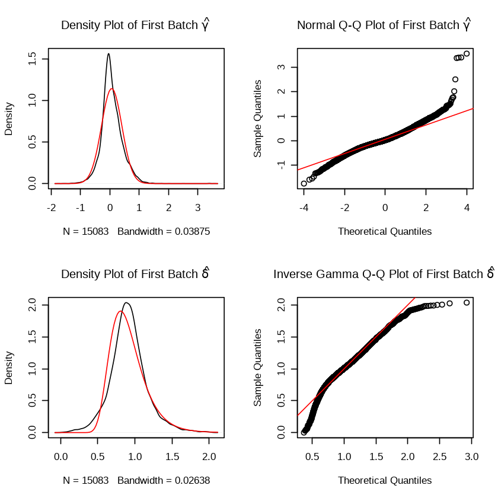


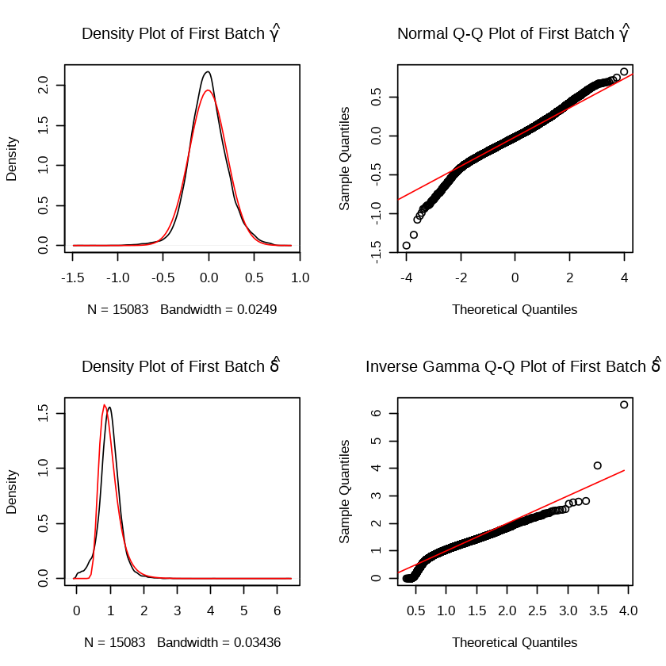


### Statistically Filter the genes by 60% most variable genes


```R
cut = 0.6

filter = function(x) {IQR(x) / median(x)}
genes.range = apply(expres, 1, filter)
criteria = quantile(genes.range, c(1-cut))

genes.f = rownames(expres)[genes.range > criteria]
expres = expres[genes.f,]
```

### Focus on time points 20 - 180 days, and store a copy of the pheno table


```R
expres = expres[, pheno$time.point > 10]
pheno = pheno[pheno$time.point > 10,]
```


```R
pheno$time.period = as.factor(ifelse(pheno$time.point >= 90,
                                             "late",
                                             "early"))
```


```R
write.table(pheno, file = paste(monkey.path, "PhenoData_processed.txt", sep="/"),sep="\t")
```


```R
pheno = read.table(file = paste(monkey.path, "PhenoData_processed.txt", sep="/"),sep="\t")
```


```R
pheno
```


<table>
<thead><tr><th></th><th scope=col>title</th><th scope=col>ChIP</th><th scope=col>hyb.chamber</th><th scope=col>dataset</th><th scope=col>synchroset</th><th scope=col>monkeyid</th><th scope=col>time.point</th><th scope=col>infection.time</th><th scope=col>clinical.status</th><th scope=col>description</th><th scope=col>description.1</th><th scope=col>time.point.comb</th><th scope=col>time.period</th></tr></thead>
<tbody>
	<tr><th scope=row>GSM2227793</th><td>M16_150                </td><td>1                      </td><td>1                      </td><td>Training               </td><td>No                     </td><td>M16                    </td><td>150                    </td><td>M5                     </td><td>Active                 </td><td>M16_150                </td><td>6303256020_A.AVG_Signal</td><td>150                    </td><td>late                   </td></tr>
	<tr><th scope=row>GSM2227796</th><td>M19_56                 </td><td>1                      </td><td>1                      </td><td>Training               </td><td>No                     </td><td>M19                    </td><td> 56                    </td><td>D56                    </td><td>Active                 </td><td>M19_56                 </td><td>6303256020_D.AVG_Signal</td><td> 56                    </td><td>early                  </td></tr>
	<tr><th scope=row>GSM2227797</th><td>M19_90                 </td><td>1                      </td><td>1                      </td><td>Training               </td><td>No                     </td><td>M19                    </td><td> 90                    </td><td>M3                     </td><td>Active                 </td><td>M19_90                 </td><td>6303256020_E.AVG_Signal</td><td> 90                    </td><td>late                   </td></tr>
	<tr><th scope=row>GSM2227799</th><td>M18_20                 </td><td>1                      </td><td>1                      </td><td>Training               </td><td>No                     </td><td>M18                    </td><td> 20                    </td><td>D20                    </td><td>Active                 </td><td>M18_20                 </td><td>6303256020_G.AVG_Signal</td><td> 20                    </td><td>early                  </td></tr>
	<tr><th scope=row>GSM2227800</th><td>M15_90                 </td><td>1                      </td><td>1                      </td><td>Training               </td><td>No                     </td><td>M15                    </td><td> 90                    </td><td>M3                     </td><td>Latent                 </td><td>M15_90                 </td><td>6303256020_H.AVG_Signal</td><td> 90                    </td><td>late                   </td></tr>
	<tr><th scope=row>GSM2227801</th><td>M1_42                  </td><td>1                      </td><td>1                      </td><td>Training               </td><td>No                     </td><td>M1                     </td><td> 42                    </td><td>D42                    </td><td>Active                 </td><td>M1_42                  </td><td>6303256020_I.AVG_Signal</td><td> 42                    </td><td>early                  </td></tr>
	<tr><th scope=row>GSM2227802</th><td>M13_180                </td><td>1                      </td><td>1                      </td><td>Training               </td><td>Yes                    </td><td>M13                    </td><td>180                    </td><td>M6                     </td><td>Latent                 </td><td>M13_180                </td><td>6303256020_J.AVG_Signal</td><td>180                    </td><td>late                   </td></tr>
	<tr><th scope=row>GSM2227805</th><td>M6_120                 </td><td>2                      </td><td>1                      </td><td>Training               </td><td>No                     </td><td>M6                     </td><td>120                    </td><td>M4                     </td><td>Active                 </td><td>M6_120                 </td><td>6303256032_A.AVG_Signal</td><td>120                    </td><td>late                   </td></tr>
	<tr><th scope=row>GSM2227806</th><td>M14_90                 </td><td>2                      </td><td>1                      </td><td>Training               </td><td>No                     </td><td>M14                    </td><td> 90                    </td><td>M3                     </td><td>Latent                 </td><td>M14_90                 </td><td>6303256032_B.AVG_Signal</td><td> 90                    </td><td>late                   </td></tr>
	<tr><th scope=row>GSM2227807</th><td>M15_20                 </td><td>2                      </td><td>1                      </td><td>Training               </td><td>No                     </td><td>M15                    </td><td> 20                    </td><td>D20                    </td><td>Latent                 </td><td>M15_20                 </td><td>6303256032_C.AVG_Signal</td><td> 20                    </td><td>early                  </td></tr>
	<tr><th scope=row>GSM2227808</th><td>M17_120                </td><td>2                      </td><td>1                      </td><td>Training               </td><td>No                     </td><td>M17                    </td><td>120                    </td><td>M4                     </td><td>Latent                 </td><td>M17_120                </td><td>6303256032_D.AVG_Signal</td><td>120                    </td><td>late                   </td></tr>
	<tr><th scope=row>GSM2227809</th><td>M2_42                  </td><td>2                      </td><td>1                      </td><td>Training               </td><td>No                     </td><td>M2                     </td><td> 42                    </td><td>D42                    </td><td>Active                 </td><td>M2_42                  </td><td>6303256032_E.AVG_Signal</td><td> 42                    </td><td>early                  </td></tr>
	<tr><th scope=row>GSM2227810</th><td>M9_120                 </td><td>2                      </td><td>1                      </td><td>Training               </td><td>No                     </td><td>M9                     </td><td>120                    </td><td>M4                     </td><td>Latent                 </td><td>M9_120                 </td><td>6303256032_F.AVG_Signal</td><td>120                    </td><td>late                   </td></tr>
	<tr><th scope=row>GSM2227812</th><td>M9_30                  </td><td>2                      </td><td>1                      </td><td>Training               </td><td>No                     </td><td>M9                     </td><td> 30                    </td><td>D30                    </td><td>Latent                 </td><td>M9_30                  </td><td>6303256032_H.AVG_Signal</td><td> 30                    </td><td>early                  </td></tr>
	<tr><th scope=row>GSM2227813</th><td>M16_120                </td><td>2                      </td><td>1                      </td><td>Training               </td><td>No                     </td><td>M16                    </td><td>120                    </td><td>M4                     </td><td>Active                 </td><td>M16_120                </td><td>6303256032_I.AVG_Signal</td><td>120                    </td><td>late                   </td></tr>
	<tr><th scope=row>GSM2227814</th><td>M3_180                 </td><td>2                      </td><td>1                      </td><td>Training               </td><td>Yes                    </td><td>M3                     </td><td>180                    </td><td>M6                     </td><td>Latent                 </td><td>M3_180                 </td><td>6303256032_J.AVG_Signal</td><td>180                    </td><td>late                   </td></tr>
	<tr><th scope=row>GSM2227815</th><td>M3_30                  </td><td>2                      </td><td>1                      </td><td>Training               </td><td>No                     </td><td>M3                     </td><td> 30                    </td><td>D30                    </td><td>Latent                 </td><td>M3_30                  </td><td>6303256032_K.AVG_Signal</td><td> 30                    </td><td>early                  </td></tr>
	<tr><th scope=row>GSM2227816</th><td>M19_150                </td><td>2                      </td><td>1                      </td><td>Training               </td><td>Yes                    </td><td>M19                    </td><td>150                    </td><td>M5                     </td><td>Active                 </td><td>M19_150                </td><td>6303256032_L.AVG_Signal</td><td>150                    </td><td>late                   </td></tr>
	<tr><th scope=row>GSM2227818</th><td>M1_20                  </td><td>3                      </td><td>1                      </td><td>Training               </td><td>No                     </td><td>M1                     </td><td> 20                    </td><td>D20                    </td><td>Active                 </td><td>M1_20                  </td><td>6303256034_B.AVG_Signal</td><td> 20                    </td><td>early                  </td></tr>
	<tr><th scope=row>GSM2227820</th><td>M18_120                </td><td>3                      </td><td>1                      </td><td>Training               </td><td>No                     </td><td>M18                    </td><td>120                    </td><td>M4                     </td><td>Active                 </td><td>M18_120                </td><td>6303256034_D.AVG_Signal</td><td>120                    </td><td>late                   </td></tr>
	<tr><th scope=row>GSM2227823</th><td>M8_150                 </td><td>3                      </td><td>1                      </td><td>Training               </td><td>No                     </td><td>M8                     </td><td>150                    </td><td>M5                     </td><td>Active                 </td><td>M8_150                 </td><td>6303256034_G.AVG_Signal</td><td>150                    </td><td>late                   </td></tr>
	<tr><th scope=row>GSM2227825</th><td>M4_56                  </td><td>3                      </td><td>1                      </td><td>Training               </td><td>No                     </td><td>M4                     </td><td> 56                    </td><td>D56                    </td><td>Latent                 </td><td>M4_56                  </td><td>6303256034_J.AVG_Signal</td><td> 56                    </td><td>early                  </td></tr>
	<tr><th scope=row>GSM2227827</th><td>M9_90                  </td><td>3                      </td><td>1                      </td><td>Training               </td><td>No                     </td><td>M9                     </td><td> 90                    </td><td>M3                     </td><td>Latent                 </td><td>M9_90                  </td><td>6303256034_L.AVG_Signal</td><td> 90                    </td><td>late                   </td></tr>
	<tr><th scope=row>GSM2227828</th><td>M1_56                  </td><td>4                      </td><td>1                      </td><td>Training               </td><td>No                     </td><td>M1                     </td><td> 56                    </td><td>D56                    </td><td>Active                 </td><td>M1_56                  </td><td>6303256038_A.AVG_Signal</td><td> 56                    </td><td>early                  </td></tr>
	<tr><th scope=row>GSM2227832</th><td>M4_20                  </td><td>4                      </td><td>1                      </td><td>Training               </td><td>No                     </td><td>M4                     </td><td> 20                    </td><td>D20                    </td><td>Latent                 </td><td>M4_20                  </td><td>6303256038_E.AVG_Signal</td><td> 20                    </td><td>early                  </td></tr>
	<tr><th scope=row>GSM2227833</th><td>M16_180                </td><td>4                      </td><td>1                      </td><td>Training               </td><td>Yes                    </td><td>M16                    </td><td>180                    </td><td>M6                     </td><td>Active                 </td><td>M16_180                </td><td>6303256038_F.AVG_Signal</td><td>180                    </td><td>late                   </td></tr>
	<tr><th scope=row>GSM2227834</th><td>M18_30                 </td><td>4                      </td><td>1                      </td><td>Training               </td><td>No                     </td><td>M18                    </td><td> 30                    </td><td>D30                    </td><td>Active                 </td><td>M18_30                 </td><td>6303256038_G.AVG_Signal</td><td> 30                    </td><td>early                  </td></tr>
	<tr><th scope=row>GSM2227835</th><td>M6_42                  </td><td>4                      </td><td>1                      </td><td>Training               </td><td>No                     </td><td>M6                     </td><td> 42                    </td><td>D42                    </td><td>Active                 </td><td>M6_42                  </td><td>6303256038_H.AVG_Signal</td><td> 42                    </td><td>early                  </td></tr>
	<tr><th scope=row>GSM2227836</th><td>M2_20                  </td><td>4                      </td><td>1                      </td><td>Training               </td><td>No                     </td><td>M2                     </td><td> 20                    </td><td>D20                    </td><td>Active                 </td><td>M2_20                  </td><td>6303256038_I.AVG_Signal</td><td> 20                    </td><td>early                  </td></tr>
	<tr><th scope=row>GSM2227837</th><td>M14_30                 </td><td>4                      </td><td>1                      </td><td>Training               </td><td>No                     </td><td>M14                    </td><td> 30                    </td><td>D30                    </td><td>Latent                 </td><td>M14_30                 </td><td>6303256038_J.AVG_Signal</td><td> 30                    </td><td>early                  </td></tr>
	<tr><th scope=row>⋮</th><td>⋮</td><td>⋮</td><td>⋮</td><td>⋮</td><td>⋮</td><td>⋮</td><td>⋮</td><td>⋮</td><td>⋮</td><td>⋮</td><td>⋮</td><td>⋮</td><td>⋮</td></tr>
	<tr><th scope=row>GSM2228211</th><td>M20_42                 </td><td>39                     </td><td>11                     </td><td>Test                   </td><td>No                     </td><td>M20                    </td><td> 42                    </td><td>D42                    </td><td>Latent                 </td><td>M20_42                 </td><td>9248833091_B.AVG_Signal</td><td> 42                    </td><td>early                  </td></tr>
	<tr><th scope=row>GSM2228212</th><td>M37_120                </td><td>39                     </td><td>11                     </td><td>Test                   </td><td>No                     </td><td>M37                    </td><td>120                    </td><td>M4                     </td><td>Latent                 </td><td>M37_120                </td><td>9248833091_C.AVG_Signal</td><td>120                    </td><td>late                   </td></tr>
	<tr><th scope=row>GSM2228215</th><td>M22_20                 </td><td>39                     </td><td>11                     </td><td>Test                   </td><td>No                     </td><td>M22                    </td><td> 20                    </td><td>D20                    </td><td>Active                 </td><td>M22_20                 </td><td>9248833091_F.AVG_Signal</td><td> 20                    </td><td>early                  </td></tr>
	<tr><th scope=row>GSM2228218</th><td>M22_42                 </td><td>39                     </td><td>11                     </td><td>Test                   </td><td>No                     </td><td>M22                    </td><td> 42                    </td><td>D42                    </td><td>Active                 </td><td>M22_42                 </td><td>9248833091_I.AVG_Signal</td><td> 42                    </td><td>early                  </td></tr>
	<tr><th scope=row>GSM2228223</th><td>M34_90                 </td><td>40                     </td><td>11                     </td><td>Test                   </td><td>No                     </td><td>M34                    </td><td> 90                    </td><td>M3                     </td><td>Latent                 </td><td>M34_90                 </td><td>9248833092_B.AVG_Signal</td><td> 90                    </td><td>late                   </td></tr>
	<tr><th scope=row>GSM2228224</th><td>M33_30                 </td><td>40                     </td><td>11                     </td><td>Test                   </td><td>No                     </td><td>M33                    </td><td> 30                    </td><td>D30                    </td><td>Latent                 </td><td>M33_30                 </td><td>9248833092_C.AVG_Signal</td><td> 30                    </td><td>early                  </td></tr>
	<tr><th scope=row>GSM2228225</th><td>M26_20                 </td><td>40                     </td><td>11                     </td><td>Test                   </td><td>No                     </td><td>M26                    </td><td> 20                    </td><td>D20                    </td><td>Latent                 </td><td>M26_20                 </td><td>9248833092_D.AVG_Signal</td><td> 20                    </td><td>early                  </td></tr>
	<tr><th scope=row>GSM2228228</th><td>M20_20                 </td><td>40                     </td><td>11                     </td><td>Test                   </td><td>No                     </td><td>M20                    </td><td> 20                    </td><td>D20                    </td><td>Latent                 </td><td>M20_20                 </td><td>9248833092_G.AVG_Signal</td><td> 20                    </td><td>early                  </td></tr>
	<tr><th scope=row>GSM2228229</th><td>M33_90                 </td><td>40                     </td><td>11                     </td><td>Test                   </td><td>No                     </td><td>M33                    </td><td> 90                    </td><td>M3                     </td><td>Latent                 </td><td>M33_90                 </td><td>9248833092_H.AVG_Signal</td><td> 90                    </td><td>late                   </td></tr>
	<tr><th scope=row>GSM2228230</th><td>M24_150                </td><td>40                     </td><td>11                     </td><td>Test                   </td><td>No                     </td><td>M24                    </td><td>150                    </td><td>M5                     </td><td>Active                 </td><td>M24_150                </td><td>9248833092_I.AVG_Signal</td><td>150                    </td><td>late                   </td></tr>
	<tr><th scope=row>GSM2228231</th><td>M27_150                </td><td>40                     </td><td>11                     </td><td>Test                   </td><td>No                     </td><td>M27                    </td><td>150                    </td><td>M5                     </td><td>Latent                 </td><td>M27_150                </td><td>9248833092_J.AVG_Signal</td><td>150                    </td><td>late                   </td></tr>
	<tr><th scope=row>GSM2228232</th><td>M38_30                 </td><td>40                     </td><td>11                     </td><td>Test                   </td><td>No                     </td><td>M38                    </td><td> 30                    </td><td>D30                    </td><td>Active                 </td><td>M38_30                 </td><td>9248833092_K.AVG_Signal</td><td> 30                    </td><td>early                  </td></tr>
	<tr><th scope=row>GSM2228237</th><td>M35_180                </td><td>41                     </td><td>11                     </td><td>Test                   </td><td>Yes                    </td><td>M35                    </td><td>180                    </td><td>M6                     </td><td>Latent                 </td><td>M35_180                </td><td>9248833093_F.AVG_Signal</td><td>180                    </td><td>late                   </td></tr>
	<tr><th scope=row>GSM2228238</th><td>M26_30                 </td><td>41                     </td><td>11                     </td><td>Test                   </td><td>No                     </td><td>M26                    </td><td> 30                    </td><td>D30                    </td><td>Latent                 </td><td>M26_30                 </td><td>9248833093_G.AVG_Signal</td><td> 30                    </td><td>early                  </td></tr>
	<tr><th scope=row>GSM2228239</th><td>M22_120                </td><td>41                     </td><td>11                     </td><td>Test                   </td><td>No                     </td><td>M22                    </td><td>120                    </td><td>M4                     </td><td>Active                 </td><td>M22_120                </td><td>9248833093_H.AVG_Signal</td><td>120                    </td><td>late                   </td></tr>
	<tr><th scope=row>GSM2228240</th><td>M32_150                </td><td>41                     </td><td>11                     </td><td>Test                   </td><td>No                     </td><td>M32                    </td><td>150                    </td><td>M5                     </td><td>Active                 </td><td>M32_150                </td><td>9248833093_I.AVG_Signal</td><td>150                    </td><td>late                   </td></tr>
	<tr><th scope=row>GSM2228242</th><td>M24_20                 </td><td>41                     </td><td>11                     </td><td>Test                   </td><td>No                     </td><td>M24                    </td><td> 20                    </td><td>D20                    </td><td>Active                 </td><td>M24_20                 </td><td>9248833093_K.AVG_Signal</td><td> 20                    </td><td>early                  </td></tr>
	<tr><th scope=row>GSM2228243</th><td>M33_20                 </td><td>41                     </td><td>11                     </td><td>Test                   </td><td>No                     </td><td>M33                    </td><td> 20                    </td><td>D20                    </td><td>Latent                 </td><td>M33_20                 </td><td>9248833093_L.AVG_Signal</td><td> 20                    </td><td>early                  </td></tr>
	<tr><th scope=row>GSM2228244</th><td>M28_30                 </td><td>42                     </td><td>12                     </td><td>Test                   </td><td>No                     </td><td>M28                    </td><td> 30                    </td><td>D30                    </td><td>Latent                 </td><td>M28_30                 </td><td>9248833095_A.AVG_Signal</td><td> 30                    </td><td>early                  </td></tr>
	<tr><th scope=row>GSM2228245</th><td>M35_30                 </td><td>42                     </td><td>12                     </td><td>Test                   </td><td>No                     </td><td>M35                    </td><td> 30                    </td><td>D30                    </td><td>Latent                 </td><td>M35_30                 </td><td>9248833095_B.AVG_Signal</td><td> 30                    </td><td>early                  </td></tr>
	<tr><th scope=row>GSM2228246</th><td>M20_30                 </td><td>42                     </td><td>12                     </td><td>Test                   </td><td>No                     </td><td>M20                    </td><td> 30                    </td><td>D30                    </td><td>Latent                 </td><td>M20_30                 </td><td>9248833095_C.AVG_Signal</td><td> 30                    </td><td>early                  </td></tr>
	<tr><th scope=row>GSM2228247</th><td>M36_30                 </td><td>42                     </td><td>12                     </td><td>Test                   </td><td>No                     </td><td>M36                    </td><td> 30                    </td><td>D30                    </td><td>Latent                 </td><td>M36_30                 </td><td>9248833095_D.AVG_Signal</td><td> 30                    </td><td>early                  </td></tr>
	<tr><th scope=row>GSM2228250</th><td>M27_30                 </td><td>42                     </td><td>12                     </td><td>Test                   </td><td>No                     </td><td>M27                    </td><td> 30                    </td><td>D30                    </td><td>Latent                 </td><td>M27_30                 </td><td>9248833095_I.AVG_Signal</td><td> 30                    </td><td>early                  </td></tr>
	<tr><th scope=row>GSM2228251</th><td>M22_56                 </td><td>42                     </td><td>12                     </td><td>Test                   </td><td>No                     </td><td>M22                    </td><td> 56                    </td><td>D56                    </td><td>Active                 </td><td>M22_56                 </td><td>9248833095_J.AVG_Signal</td><td> 56                    </td><td>early                  </td></tr>
	<tr><th scope=row>GSM2228253</th><td>M25_42                 </td><td>42                     </td><td>12                     </td><td>Test                   </td><td>No                     </td><td>M25                    </td><td> 42                    </td><td>D42                    </td><td>Latent                 </td><td>M25_42                 </td><td>9248833095_L.AVG_Signal</td><td> 42                    </td><td>early                  </td></tr>
	<tr><th scope=row>GSM2228254</th><td>M30_90                 </td><td>43                     </td><td>12                     </td><td>Test                   </td><td>No                     </td><td>M30                    </td><td> 90                    </td><td>M3                     </td><td>Active                 </td><td>M30_90                 </td><td>9248833101_A.AVG_Signal</td><td> 90                    </td><td>late                   </td></tr>
	<tr><th scope=row>GSM2228255</th><td>M34_180                </td><td>43                     </td><td>12                     </td><td>Test                   </td><td>Yes                    </td><td>M34                    </td><td>180                    </td><td>M6                     </td><td>Latent                 </td><td>M34_180                </td><td>9248833101_B.AVG_Signal</td><td>180                    </td><td>late                   </td></tr>
	<tr><th scope=row>GSM2228257</th><td>M27_42                 </td><td>43                     </td><td>12                     </td><td>Test                   </td><td>No                     </td><td>M27                    </td><td> 42                    </td><td>D42                    </td><td>Latent                 </td><td>M27_42                 </td><td>9248833101_D.AVG_Signal</td><td> 42                    </td><td>early                  </td></tr>
	<tr><th scope=row>GSM2228258</th><td>M21_20                 </td><td>43                     </td><td>12                     </td><td>Test                   </td><td>No                     </td><td>M21                    </td><td> 20                    </td><td>D20                    </td><td>Latent                 </td><td>M21_20                 </td><td>9248833101_E.AVG_Signal</td><td> 20                    </td><td>early                  </td></tr>
	<tr><th scope=row>GSM2228261</th><td>M21_150                </td><td>43                     </td><td>12                     </td><td>Test                   </td><td>No                     </td><td>M21                    </td><td>150                    </td><td>M5                     </td><td>Latent                 </td><td>M21_150                </td><td>9248833101_H.AVG_Signal</td><td>150                    </td><td>late                   </td></tr>
</tbody>
</table>


### Divide the data into a training and test set (70-30 split), with preserved ratio of monkeys with latent or active tuberculosis.

- This split was performed in python, which is located Macaque_analysis_train_test_set_split.ipynb


```R
test.latent.monkeys = c('M13', 'M27', 'M34', 'M15', 'M35', 'M36')
test.active.monkeys = c('M1', 'M16', 'M32', 'M18', 'M23')
```


```R
test.rows = rownames(pheno[pheno$monkeyid %in% union(test.latent.monkeys, test.active.monkeys),])
train.rows = setdiff(rownames(pheno), test.rows)

if (dim(expres)[1] > dim(expres)[2])
    expres = t(expres)

pheno.train = droplevels(pheno[train.rows,])
pheno.test = droplevels(pheno[test.rows,])
expres.train = expres[train.rows,]
expres.test = expres[test.rows,]
```

### Create grouped k-folds according to monkey within the training set. With random seed set to 100, this gives 9-folds


```R
set.seed(100)
folds = groupKFold(pheno.train$monkeyid, k=10)
for (fold in lapply(folds, function(x) {pheno.train$monkeyid[x]}))
    print(length((as.character(fold))))

lapply(folds, function(x, y) table(y[x]), y = pheno.train$monkeyid)
```

    [1] 202
    [1] 194
    [1] 186
    [1] 174
    [1] 187
    [1] 179
    [1] 186
    [1] 178
    [1] 194


    $Fold1
    
    M10 M11 M12 M14 M17 M19  M2 M20 M21 M22 M24 M25 M26 M28 M29  M3 M30 M31 M33 M37 
      5   8   8   0   8   7   8   8   8   8   8   8   8   8   8   8   8   7   8   8 
    M38  M4  M5  M6  M7  M8  M9 
      7   8   8   8   8   8   8 
    
    $Fold2
    
    M10 M11 M12 M14 M17 M19  M2 M20 M21 M22 M24 M25 M26 M28 M29  M3 M30 M31 M33 M37 
      5   8   8   8   8   7   8   8   8   0   8   8   8   8   8   8   8   7   8   8 
    M38  M4  M5  M6  M7  M8  M9 
      7   8   8   8   8   0   8 
    
    $Fold3
    
    M10 M11 M12 M14 M17 M19  M2 M20 M21 M22 M24 M25 M26 M28 M29  M3 M30 M31 M33 M37 
      5   0   8   8   8   7   8   8   8   8   8   8   0   8   8   8   0   7   8   8 
    M38  M4  M5  M6  M7  M8  M9 
      7   8   8   8   8   8   8 
    
    $Fold4
    
    M10 M11 M12 M14 M17 M19  M2 M20 M21 M22 M24 M25 M26 M28 M29  M3 M30 M31 M33 M37 
      0   8   8   8   8   7   8   0   8   8   8   8   8   0   8   8   8   0   0   8 
    M38  M4  M5  M6  M7  M8  M9 
      7   8   8   8   8   8   8 
    
    $Fold5
    
    M10 M11 M12 M14 M17 M19  M2 M20 M21 M22 M24 M25 M26 M28 M29  M3 M30 M31 M33 M37 
      5   8   8   8   0   0   8   8   8   8   8   8   8   8   8   8   8   7   8   8 
    M38  M4  M5  M6  M7  M8  M9 
      7   8   8   8   0   8   8 
    
    $Fold6
    
    M10 M11 M12 M14 M17 M19  M2 M20 M21 M22 M24 M25 M26 M28 M29  M3 M30 M31 M33 M37 
      5   8   0   8   8   7   8   8   0   8   8   8   8   8   8   8   8   7   8   8 
    M38  M4  M5  M6  M7  M8  M9 
      0   8   0   8   8   8   8 
    
    $Fold7
    
    M10 M11 M12 M14 M17 M19  M2 M20 M21 M22 M24 M25 M26 M28 M29  M3 M30 M31 M33 M37 
      5   8   8   8   8   7   8   8   8   8   0   8   8   8   8   0   8   7   8   0 
    M38  M4  M5  M6  M7  M8  M9 
      7   8   8   8   8   8   8 
    
    $Fold8
    
    M10 M11 M12 M14 M17 M19  M2 M20 M21 M22 M24 M25 M26 M28 M29  M3 M30 M31 M33 M37 
      5   8   8   8   8   7   8   8   8   8   8   8   8   8   0   8   8   7   8   8 
    M38  M4  M5  M6  M7  M8  M9 
      7   0   8   0   8   8   0 
    
    $Fold9
    
    M10 M11 M12 M14 M17 M19  M2 M20 M21 M22 M24 M25 M26 M28 M29  M3 M30 M31 M33 M37 
      5   8   8   8   8   7   0   8   8   8   8   0   8   8   8   8   8   7   8   8 
    M38  M4  M5  M6  M7  M8  M9 
      7   8   8   8   8   8   8 


### Reproduce Supplementary Figure S2 (this takes quite a bit of time)


```R
seed=7

# Now we are going to loop over different models

start_time <- Sys.time()

cluster = makeCluster(detectCores()-3) # Leaving 3 for other jobs
registerDoParallel(cluster)

methods = c("gbm", "svmRadial", "svmPoly", "ranger", "glmnet")

models = list()


#folds
control <- trainControl(method="cv", index=folds, search="random", allowParallel=TRUE, savePredictions='final',
                       classProbs=TRUE, summaryFunction=twoClassSummary)

for (alg in methods) {
    set.seed(seed)
    print("I have gotten to model:")
    print(alg)
    model = train(expres.train, pheno.train$time.period,  method=alg, tuneLength=50, trControl=control,
                 metric="ROC")
    models[[alg]] = model
}

stopCluster(cluster)
registerDoSEQ()

end_time <- Sys.time()
print(end_time - start_time)
```


```R
results = resamples(models)
bwplot(results)
```

### Reproduce Figure 2A,B, using glmnet. Do a larger hyperparameter search to find the optimally performing model on the training set.


```R
set.seed(100)

n = 10000
lambda.grid = c(10 ^ runif(n, min = log10(1e-5), max = log10(1e2)))
alpha.grid = runif(length(lambda.grid), min = 0.00, 1.0)

train.grid = data.frame(lambda = sample(lambda.grid, length(lambda.grid)),
                       alpha = sample(alpha.grid, length(lambda.grid)))
```


```R
seed=7

start_time <- Sys.time()

cluster = makeCluster(detectCores()-3) # Leaving 3 for other jobs
registerDoParallel(cluster)

methods = c( "glmnet")

models = list()

control <- trainControl(method="cv", index=folds, allowParallel=TRUE, savePredictions='final',
                       classProbs=TRUE, summaryFunction=twoClassSummary)

for (alg in methods) {
    set.seed(seed)
    print("I have gotten to model:")
    print(alg)
    model = train(expres.train, pheno.train$time.period,  method=alg, trControl=control, tuneGrid=train.grid,
                 metric="ROC")
    models[[alg]] = model
}

stopCluster(cluster)
registerDoSEQ()

end_time <- Sys.time()
print(end_time - start_time)
```

    [1] "I have gotten to model:"
    [1] "glmnet"
    Time difference of 2.033721 hours


```R
glmres = models$glmnet$results
graph.hyper(glmres$alpha, log10(glmres$lambda), glmres$ROC)
```


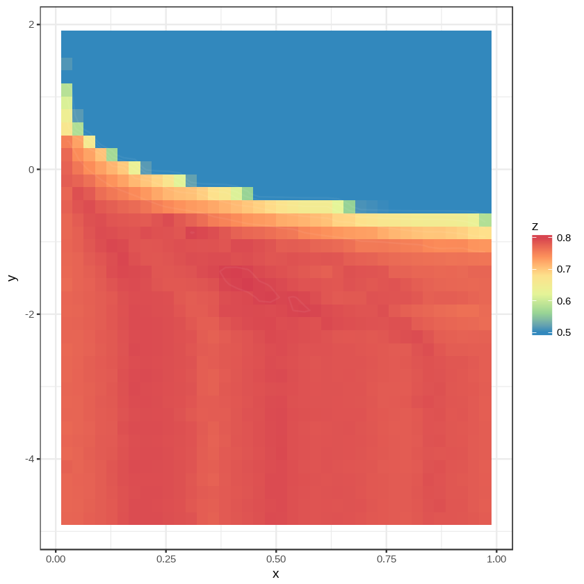


#### Figure 2A


```R
models.monkey.ROC = models
model.monkey.ROC = models.monkey.ROC$glmnet

glmnet.monkey.val.ROC = my.roc(model.monkey.ROC$pred$early, model.monkey.ROC$pred$obs, "early")

pred.monkey.test = predict(model.monkey.ROC, newdata = expres.test, type="prob")
glmnet.monkey.ROC = my.roc(pred.monkey.test$early,
                          pheno.test$time.period,
                          "early")
```

    [1] "This is the AUC:"
    Area under the curve: 0.7835
    [1] "This is the AUC p-value:"
    [1] 6.39348e-13
    [1] "This is the AUC 95% Confidence Interval"
    95% CI: 0.7222-0.8448 (DeLong)
    [1] "This is the AUC:"
    Area under the curve: 0.808
    [1] "This is the AUC p-value:"
    [1] 2.039996e-07
    [1] "This is the AUC 95% Confidence Interval"
    95% CI: 0.7122-0.9037 (DeLong)


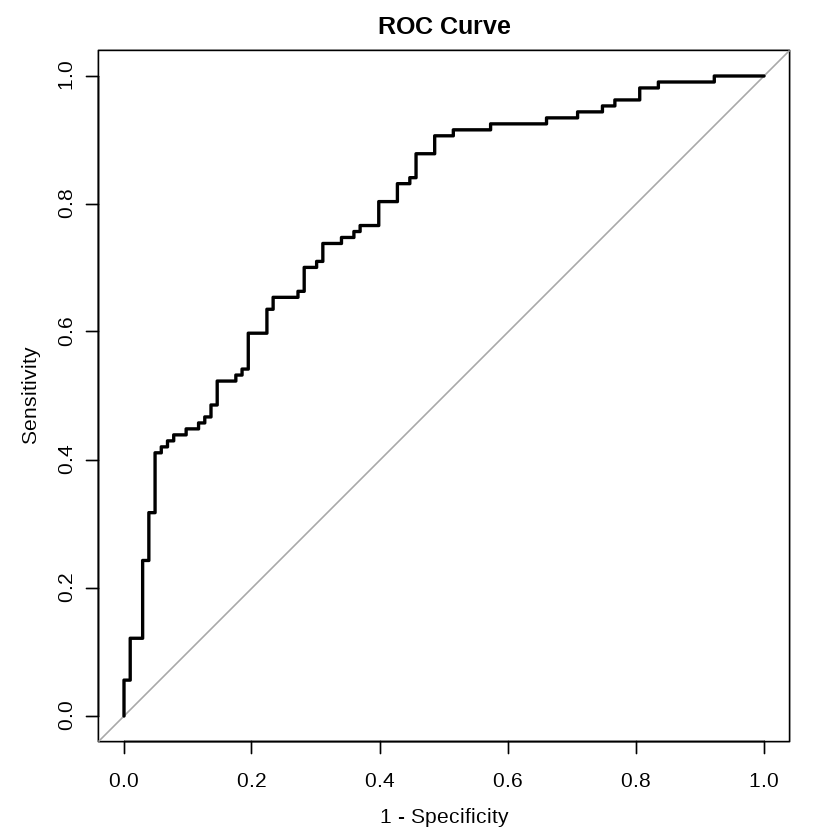


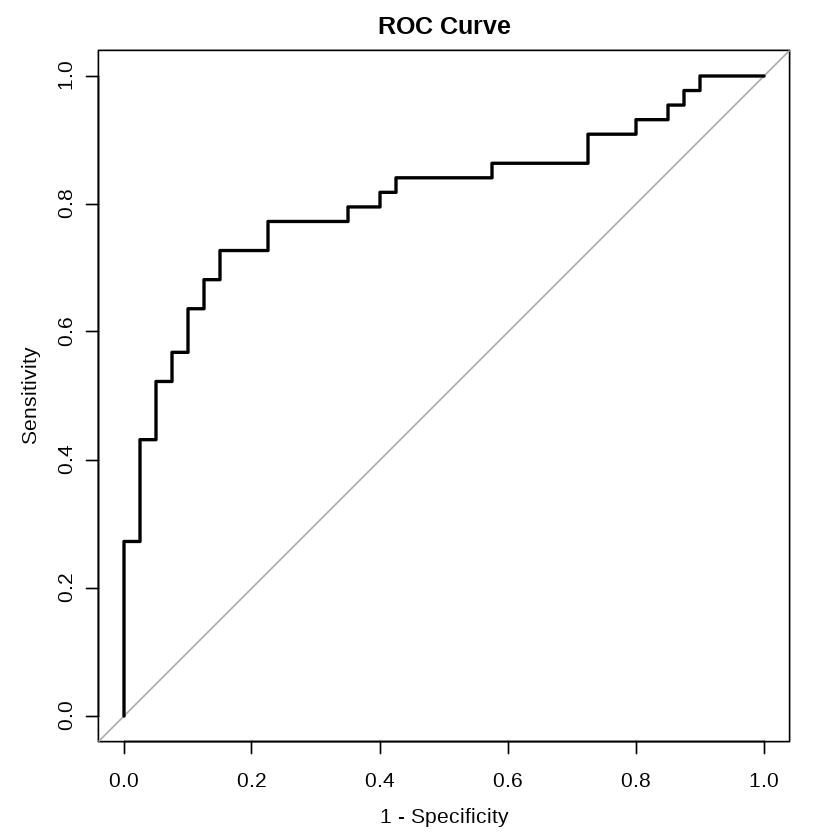


```R
monkey.class.plot = ggroc(list(CV=glmnet.monkey.val.ROC, test=glmnet.monkey.ROC), legacy.axes=TRUE) +
                geom_abline(intercept = 0, slope = 1, color = "lightgrey", size = 0.25) + 
                ggtitle("Early vs. Late Time Period") + theme(plot.title = element_text(size=12, face="plain")) +
                scale_color_manual(name="M.tb Infected Macaques",
                                  labels=c("CV" =expression("CV: AUC 0.78, p ="~5.6~ "x" ~10^{-13} ~ " "),
                                           "test"=expression("Test: AUC 0.81, p ="~1.6~ "x" ~10^{-7} ~ " ")),
                                   #expression("Average Conc of S- on plates" ~
                          #(mu ~ moles ~ cm^{-2} ~ "dry wt")),
                                  values=c("CV"="blue", "test"="red")) +
            theme(legend.position=c(0.30,0.20), legend.title = element_text(size=12), legend.text = element_text(size=11)) 
monkey.class.plot
```


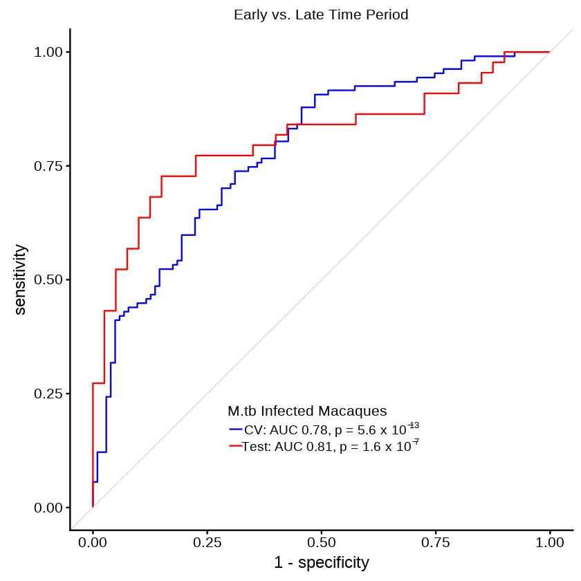


#### Figure 2B


```R
monkey.val.preds = models.monkey.ROC$glmnet$pred
pred.monkey.test  = predict(models.monkey.ROC$glmnet, newdata=expres.test)

# Calculate ratio of active to latent in all actual and predicted early and late time periods, in both validation and test set

a.l.early.val = sum(dplyr::filter(pheno.train, time.period=="early")$clinical.status == "Active") / length(dplyr::filter(pheno.train, time.period=="early")$clinical.status)
a.l.late.val = sum(dplyr::filter(pheno.train, time.period=="late")$clinical.status == "Active") / length(dplyr::filter(pheno.train, time.period=="late")$clinical.status)

a.l.p.early.val = sum(pheno.train[monkey.val.preds$pred == "early",]$clinical.status=="Active") / length(pheno.train[monkey.val.preds$pred == "early",]$clinical.status)
a.l.p.late.val = sum(pheno.train[monkey.val.preds$pred == "late",]$clinical.status=="Active") / length(pheno.train[monkey.val.preds$pred == "late",]$clinical.status)


# Calculate ratio of active to latent in all actual and predicted early and late time periods, in both validation and test set
a.l.early.test = sum(dplyr::filter(pheno.test, time.period=="early")$clinical.status == "Active") / length(dplyr::filter(pheno.test, time.period=="early")$clinical.status)
a.l.late.test = sum(dplyr::filter(pheno.test, time.period=="late")$clinical.status == "Active") / length(dplyr::filter(pheno.test, time.period=="late")$clinical.status)

a.l.p.early.test = sum(pheno.test[pred.monkey.test  == "early",]$clinical.status=="Active") / length(pheno.test[pred.monkey.test  == "early",]$clinical.status)
a.l.p.late.test = sum(pheno.test[pred.monkey.test  == "late",]$clinical.status=="Active") / length(pheno.test[pred.monkey.test  == "late",]$clinical.status)


t.period = c("Early", "Predicted Early", "Early", "Predicted Early")
partition = as.factor(c("Cross-Validation", "Cross-Validation", "Test", "Test"))
active_prop = c(a.l.early.val, a.l.p.early.val, a.l.early.test, a.l.p.early.test)
partition = factor(partition, levels(partition)[c(which(levels(partition) == "Cross-Validation"),
                                                  which(levels(partition) == "Test"))])

disease.confound = data.frame(t.period=as.factor(t.period), partition=partition, active_prop=active_prop)


n.act.early.val = sum(dplyr::filter(pheno.train, time.period=="early")$clinical.status == "Active")
n.tot.early.val = length(dplyr::filter(pheno.train, time.period=="early")$clinical.status)

n.act.p.early.val = sum(pheno.train[monkey.val.preds$pred == "early",]$clinical.status=="Active")
n.tot.p.early.val = length(pheno.train[monkey.val.preds$pred == "early",]$clinical.status)


fisher.test(matrix(c(n.act.early.val, 
                     n.tot.early.val - n.act.early.val,
                     n.act.p.early.val,
                     n.tot.p.early.val - n.act.p.early.val), ncol=2))


n.act.early.test = sum(dplyr::filter(pheno.test, time.period=="early")$clinical.status == "Active")
n.tot.early.test = length(dplyr::filter(pheno.test, time.period=="early")$clinical.status)

n.act.p.early.test = sum(pheno.test[pred.monkey.test  == "early",]$clinical.status=="Active")
n.tot.p.early.test = length(pheno.test[pred.monkey.test  == "early",]$clinical.status)


fisher.test(matrix(c(n.act.early.test, 
                     n.tot.early.test - n.act.early.test,
                     n.act.p.early.test,
                     n.tot.p.early.test - n.act.p.early.test), ncol=2))
```


    
    	Fisher's Exact Test for Count Data
    
    data:  
    p-value = 0.8893
    alternative hypothesis: true odds ratio is not equal to 1
    95 percent confidence interval:
     0.5304016 1.7128232
    sample estimates:
    odds ratio 
     0.9533132 


    
    	Fisher's Exact Test for Count Data
    
    data:  
    p-value = 1
    alternative hypothesis: true odds ratio is not equal to 1
    95 percent confidence interval:
     0.4008563 2.3838605
    sample estimates:
    odds ratio 
     0.9784834 


```R
a.l.plot = ggplot(disease.confound, aes(x=t.period, y=active_prop)) + geom_bar(stat="identity") + facet_grid(~partition) +
    labs(#x="Time Period Post Infection",
        y="Proportion of Samples from\nMacaques with Active TB") +
ggtitle("Risk of TB", subtitle="Stratified by Predicted Time Period") + theme(plot.title = element_text(size=12, face="plain", hjust=0.5), 
                                                                              plot.subtitle=element_text(size=11, face="plain", hjust=0.5)) +
ylim(0, 1.0) +
geom_signif(comparisons=list(c("Early", "Predicted Early")),
                               y_position=c(0.75),
              annotations = c("1.0"), vjust=-0.5,#step_increase = 4.3, #vjust = 0.4, tip_length = 0.015, textsize=3.5) 
             tip_length=0) + theme(panel.background = element_rect(fill = "white", colour = "white", size = 4)) +
                scale_x_discrete(labels=c("Early" = "Early", "Predicted Early"="Predicted\nEarly")) +
theme(axis.title.x=element_blank())
```


```R
a.l.plot
```


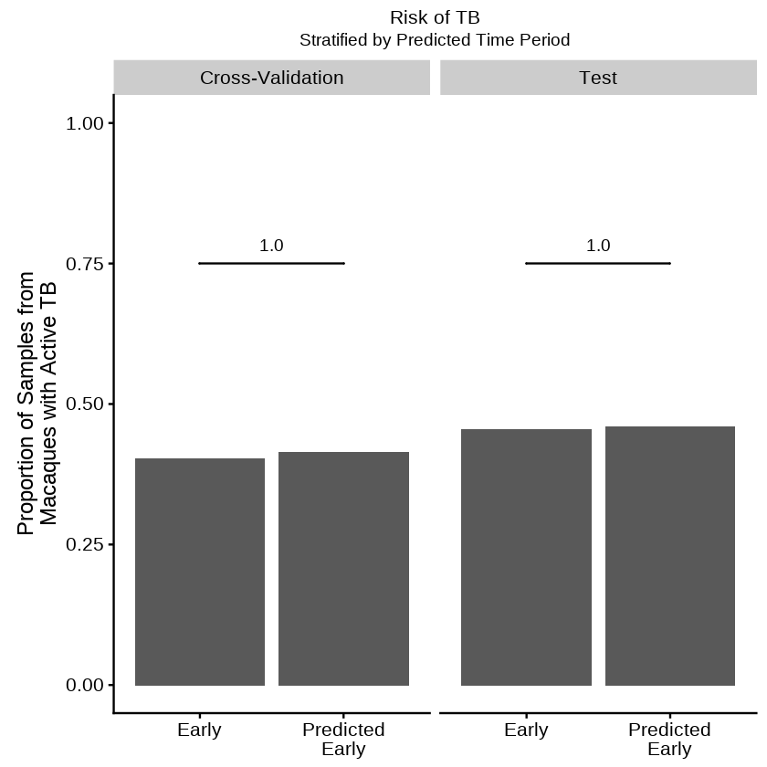


### Reproduce Figure 2C-F, using glmnet for regression. Do a hyperparameter search to find the optimally performing model on the training set.


```R
set.seed(100)

n = 1000
lambda.grid = c(10 ^ runif(n, min = log10(1e0), max = log10(1e2)))

alpha.grid = runif(length(lambda.grid), min = 0.00, 1.00)

train.grid = data.frame(lambda = sample(lambda.grid, length(lambda.grid)),
                       alpha = sample(alpha.grid, length(lambda.grid)))

```


```R
seed=7

library(doParallel)

start_time <- Sys.time()

cluster = makeCluster(detectCores()-3) # Leaving 3 for other jobs
registerDoParallel(cluster)

methods = c("glmnet")


models = list()


#folds
control <- trainControl(method="cv", index=folds, savePredictions = 'final', allowParallel=TRUE)

for (alg in methods) {
    set.seed(seed)
    print("I have gotten to model:")
    print(alg)
    model = train(expres.train, pheno.train$time.point, tuneGrid = train.grid, method=alg, trControl=control) # 
    models[[alg]] = model
}

stopCluster(cluster)
registerDoSEQ()

end_time <- Sys.time()
print(end_time - start_time)
```

    [1] "I have gotten to model:"
    [1] "glmnet"


    Warning message in nominalTrainWorkflow(x = x, y = y, wts = weights, info = trainInfo, :
    “There were missing values in resampled performance measures.”

    Time difference of 11.28674 mins


```R
glmres = models$glmnet$results
graph.hyper(glmres$alpha, log10(glmres$lambda), glmres$MAE)

```


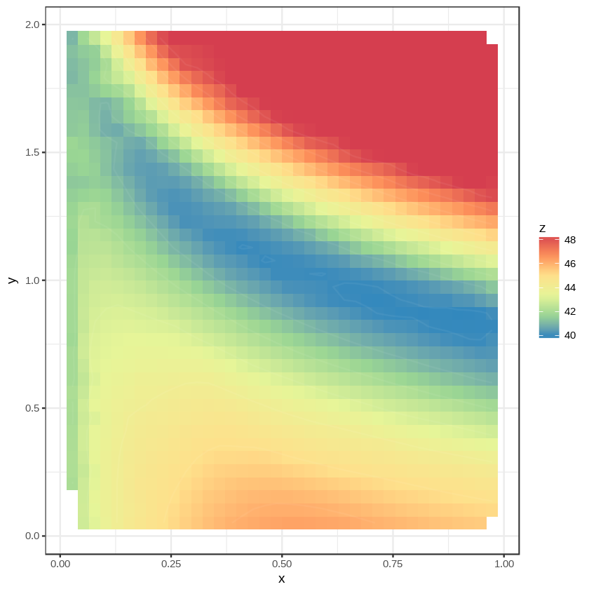


```R
regress.model = models
```


```R
val.regress.model = regress.model
val.pred = val.regress.model$glmnet$pred
all.metrics(val.pred$obs, val.pred$pred)

regress.model.glm = regress.model$glmnet
pred.regress.test = predict(regress.model.glm, newdata = expres.test)
time.point.obs = pheno.test$time.point

all.metrics(time.point.obs, pred.regress.test)
```

    [1] "Root Mean Squared Error (RMSE)"
    [1] 47.86508
    [1] "Mean Absolute Error"
    [1] 39.73711
    [1] "Median Absolute Error"
    [1] 37.99128
    [1] "Pearson Correlation Coefficient"
    [1] 0.4826416
    [1] "Pearson Correlation Signifcance Test"
    
    	Pearson's product-moment correlation
    
    data:  truth and pred
    t = 7.9477, df = 208, p-value = 1.187e-13
    alternative hypothesis: true correlation is not equal to 0
    95 percent confidence interval:
     0.3715288 0.5801238
    sample estimates:
          cor 
    0.4826416 
    
    [1] "Spearman Correlation Signifcance Test"


    Warning message in cor.test.default(truth, pred, method = "spearman"):
    “Cannot compute exact p-value with ties”

    
    	Spearman's rank correlation rho
    
    data:  truth and pred
    S = 734230, p-value = 3.161e-16
    alternative hypothesis: true rho is not equal to 0
    sample estimates:
          rho 
    0.5242953 
    
    [1] "R squared"
    [1] 0.2329429
    [1] "Root Mean Squared Error (RMSE)"
    [1] 45.5731
    [1] "Mean Absolute Error"
    [1] 38.65272
    [1] "Median Absolute Error"
    [1] 35.31099
    [1] "Pearson Correlation Coefficient"
    [1] 0.538675
    [1] "Pearson Correlation Signifcance Test"
    
    	Pearson's product-moment correlation
    
    data:  truth and pred
    t = 5.7897, df = 82, p-value = 1.253e-07
    alternative hypothesis: true correlation is not equal to 0
    95 percent confidence interval:
     0.3666206 0.6751030
    sample estimates:
         cor 
    0.538675 
    
    [1] "Spearman Correlation Signifcance Test"


    Warning message in cor.test.default(truth, pred, method = "spearman"):
    “Cannot compute exact p-value with ties”

    
    	Spearman's rank correlation rho
    
    data:  truth and pred
    S = 39168, p-value = 1.237e-09
    alternative hypothesis: true rho is not equal to 0
    sample estimates:
          rho 
    0.6034374 
    
    [1] "R squared"
    [1] 0.2901708


#### Perform regression only on samples at 90 day time point or less


```R
expres.train.90 = expres.train[pheno.train$time.point <= 90,]
pheno.train.90 = pheno.train[pheno.train$time.point <= 90,]
```


```R
set.seed(100)
pheno.train.90 = dplyr::filter(pheno.train, time.point<=90)
folds.90 = groupKFold(pheno.train.90$monkeyid, k=10)
for (fold in lapply(folds.90, function(x) {pheno.train.90$monkeyid[x]}))
    print(length((as.character(fold))))

lapply(folds.90, function(x, y) table(y[x]), y = pheno.train.90$monkeyid)
```

    [1] 129
    [1] 124
    [1] 119
    [1] 110
    [1] 119
    [1] 114
    [1] 119
    [1] 114
    [1] 124


    $Fold1
    
    M10 M11 M12 M14 M17 M19  M2 M20 M21 M22 M24 M25 M26 M28 M29  M3 M30 M31 M33 M37 
      5   5   5   0   5   5   5   5   5   5   5   5   5   5   5   5   5   4   5   5 
    M38  M4  M5  M6  M7  M8  M9 
      5   5   5   5   5   5   5 
    
    $Fold2
    
    M10 M11 M12 M14 M17 M19  M2 M20 M21 M22 M24 M25 M26 M28 M29  M3 M30 M31 M33 M37 
      5   5   5   5   5   5   5   5   5   0   5   5   5   5   5   5   5   4   5   5 
    M38  M4  M5  M6  M7  M8  M9 
      5   5   5   5   5   0   5 
    
    $Fold3
    
    M10 M11 M12 M14 M17 M19  M2 M20 M21 M22 M24 M25 M26 M28 M29  M3 M30 M31 M33 M37 
      5   0   5   5   5   5   5   5   5   5   5   5   0   5   5   5   0   4   5   5 
    M38  M4  M5  M6  M7  M8  M9 
      5   5   5   5   5   5   5 
    
    $Fold4
    
    M10 M11 M12 M14 M17 M19  M2 M20 M21 M22 M24 M25 M26 M28 M29  M3 M30 M31 M33 M37 
      0   5   5   5   5   5   5   0   5   5   5   5   5   0   5   5   5   0   0   5 
    M38  M4  M5  M6  M7  M8  M9 
      5   5   5   5   5   5   5 
    
    $Fold5
    
    M10 M11 M12 M14 M17 M19  M2 M20 M21 M22 M24 M25 M26 M28 M29  M3 M30 M31 M33 M37 
      5   5   5   5   0   0   5   5   5   5   5   5   5   5   5   5   5   4   5   5 
    M38  M4  M5  M6  M7  M8  M9 
      5   5   5   5   0   5   5 
    
    $Fold6
    
    M10 M11 M12 M14 M17 M19  M2 M20 M21 M22 M24 M25 M26 M28 M29  M3 M30 M31 M33 M37 
      5   5   0   5   5   5   5   5   0   5   5   5   5   5   5   5   5   4   5   5 
    M38  M4  M5  M6  M7  M8  M9 
      0   5   0   5   5   5   5 
    
    $Fold7
    
    M10 M11 M12 M14 M17 M19  M2 M20 M21 M22 M24 M25 M26 M28 M29  M3 M30 M31 M33 M37 
      5   5   5   5   5   5   5   5   5   5   0   5   5   5   5   0   5   4   5   0 
    M38  M4  M5  M6  M7  M8  M9 
      5   5   5   5   5   5   5 
    
    $Fold8
    
    M10 M11 M12 M14 M17 M19  M2 M20 M21 M22 M24 M25 M26 M28 M29  M3 M30 M31 M33 M37 
      5   5   5   5   5   5   5   5   5   5   5   5   5   5   0   5   5   4   5   5 
    M38  M4  M5  M6  M7  M8  M9 
      5   0   5   0   5   5   0 
    
    $Fold9
    
    M10 M11 M12 M14 M17 M19  M2 M20 M21 M22 M24 M25 M26 M28 M29  M3 M30 M31 M33 M37 
      5   5   5   5   5   5   0   5   5   5   5   0   5   5   5   5   5   4   5   5 
    M38  M4  M5  M6  M7  M8  M9 
      5   5   5   5   5   5   5 


```R
set.seed(100)

n = 1000
lambda.grid = c(10 ^ runif(n, min = log10(1e-12), max = log10(1e4)))

alpha.grid = runif(length(lambda.grid), min = 0.00, 1.00)

train.grid = data.frame(lambda = sample(lambda.grid, length(lambda.grid)),
                       alpha = sample(alpha.grid, length(lambda.grid)))

```


```R
seed=7

library(doParallel)

start_time <- Sys.time()

cluster = makeCluster(detectCores()-3) # Leaving 3 for other jobs
registerDoParallel(cluster)

methods = c("glmnet")

models = list()

control <- trainControl(method="cv", index=folds.90, savePredictions = 'final', allowParallel=TRUE)

for (alg in methods) {
    set.seed(seed)
    print("I have gotten to model:")
    print(alg)
    model = train(expres.train.90, pheno.train.90$time.point, tuneGrid = train.grid, method=alg, trControl=control) # 
    models[[alg]] = model
}

stopCluster(cluster)
registerDoSEQ()

end_time <- Sys.time()
print(end_time - start_time)
```

    [1] "I have gotten to model:"
    [1] "glmnet"


    Warning message in nominalTrainWorkflow(x = x, y = y, wts = weights, info = trainInfo, :
    “There were missing values in resampled performance measures.”

    Time difference of 7.724496 mins


```R
glmres = models$glmnet$results
graph.hyper(glmres$alpha, log10(glmres$lambda), glmres$MAE)

```


```R
regress.model.90 = models
val.pred.90 = regress.model.90$glmnet$pred
all.metrics(val.pred.90$obs, val.pred.90$pred)

regress.model.90.glm = regress.model.90$glmnet
pred.regress.test.90 = predict(regress.model.90.glm, newdata = expres.test[pheno.test$time.point <= 90,])
time.point.90 = dplyr::filter(pheno.test, time.point <= 90)$time.point
all.metrics(time.point.90, pred.regress.test.90)
```

    [1] "Root Mean Squared Error (RMSE)"
    [1] 20.93642
    [1] "Mean Absolute Error"
    [1] 16.82706
    [1] "Median Absolute Error"
    [1] 15.81807
    [1] "Pearson Correlation Coefficient"
    [1] 0.5149904
    [1] "Pearson Correlation Signifcance Test"
    
    	Pearson's product-moment correlation
    
    data:  truth and pred
    t = 6.9025, df = 132, p-value = 1.937e-10
    alternative hypothesis: true correlation is not equal to 0
    95 percent confidence interval:
     0.3784548 0.6295924
    sample estimates:
          cor 
    0.5149904 
    
    [1] "Spearman Correlation Signifcance Test"


    Warning message in cor.test.default(truth, pred, method = "spearman"):
    “Cannot compute exact p-value with ties”

    
    	Spearman's rank correlation rho
    
    data:  truth and pred
    S = 188940, p-value = 5.1e-11
    alternative hypothesis: true rho is not equal to 0
    sample estimates:
          rho 
    0.5288156 
    
    [1] "R squared"
    [1] 0.2652151
    [1] "Root Mean Squared Error (RMSE)"
    [1] 22.10746
    [1] "Mean Absolute Error"
    [1] 16.9703
    [1] "Median Absolute Error"
    [1] 14.23728
    [1] "Pearson Correlation Coefficient"
    [1] 0.4550192
    [1] "Pearson Correlation Signifcance Test"
    
    	Pearson's product-moment correlation
    
    data:  truth and pred
    t = 3.72, df = 53, p-value = 0.0004825
    alternative hypothesis: true correlation is not equal to 0
    95 percent confidence interval:
     0.2157686 0.6427291
    sample estimates:
          cor 
    0.4550192 
    
    [1] "Spearman Correlation Signifcance Test"


    Warning message in cor.test.default(truth, pred, method = "spearman"):
    “Cannot compute exact p-value with ties”

    
    	Spearman's rank correlation rho
    
    data:  truth and pred
    S = 14542, p-value = 0.0002446
    alternative hypothesis: true rho is not equal to 0
    sample estimates:
          rho 
    0.4754011 
    
    [1] "R squared"
    [1] 0.2070425


#### Plot Figures 4C-F


```R
test.model = data.frame(obs=pheno.test$time.point, pred=pred.regress.test)

test.model.90 = data.frame(obs=time.point.90, pred=pred.regress.test.90)
```


```R
glm.graph.val = generate.regres.graph(val.pred, "Regression on Time Post Infection\n(Cross-Validation)")
glm.graph.test = generate.regres.graph(test.model, "Regression on Time Post Infection\n(Test)")

glm.graph.val.90 = generate.regres.graph(val.pred.90, "Regression on Time Post Infection\n(Cross-Validation, first 90 days)", break.90=T)
glm.graph.test.90 = generate.regres.graph(test.model.90, "Regression on Time Post Infection\n(Test, first 90 days)", break.90=T)


allregressions= plot_grid(glm.graph.val,
                          glm.graph.test,
                          glm.graph.val.90,
                          glm.graph.test.90,
                          labels = toupper(c(letters[1:4], align="h")))

allregressions

```


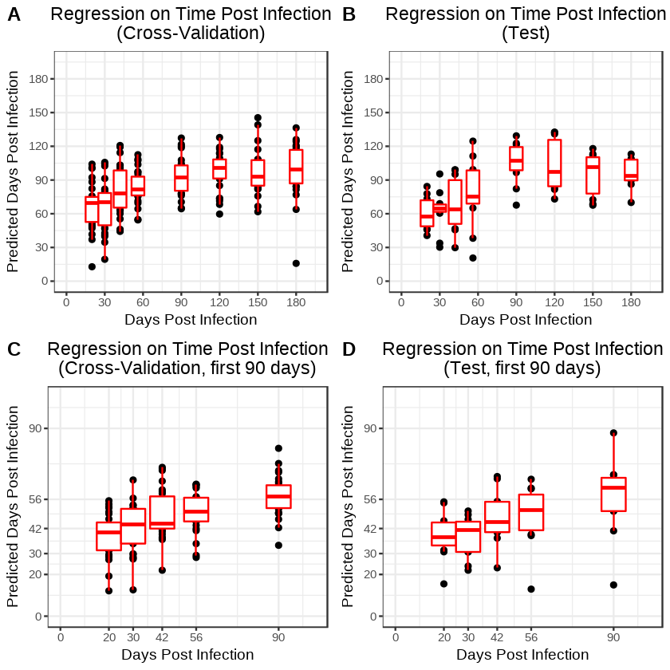


## Figure 3 Human Analysis (Grand Challenges 6-74 cohort)

- This code reproduces the analysis of Figure 3, showing that "Blood genome-wide gene expression predicts time since active TB exposure in humans"

### Load and Install Required Libraries


```R
if (!require("preprocessCore")) {
  source("https://bioconductor.org/biocLite.R")
  biocLite("preprocessCore")
  library("preprocessCore")
}

source("https://bioconductor.org/biocLite.R")
if (!require("Biobase")) {
  biocLite("Biobase")
  library("Biobase")
}
if (!require("GEOquery")) {
  biocLite("GEOquery")
  library("GEOquery")
}

if (!require("ggplot2")) {
  install.packages("ggplot2")
  library("ggplot2")
}

if (!require("glmnet")) {
  install.packages("glmnet")
  library("glmnet")
}

if (!require("caret")) {
  install.packages("caret")
  library("caret")
}
if (!require("dplyr")) {
  install.packages("dplyr")
  library("dplyr")
}

if (!require("ggsignif")) {
  install.packages("ggsignif")
  library("ggsignif")
}

if (!require("doParallel")) {
  install.packages("doParallel")
  library("doParallel")
}

if (!require("cowplot")) {
  install.packages("cowplot")
  library("cowplot")
}

if (!require("pROC")) {
    # pROC 1.12.0 is required, and may not be the default installation:
    packageUrl<- "https://cran.r-project.org/src/contrib/Archive/pROC/pROC_1.12.0.tar.gz"
    install.packages(packageUrl, repos=NULL, type='source')
    library("pROC")
}

```

    Loading required package: preprocessCore
    Bioconductor version 3.6 (BiocInstaller 1.28.0), ?biocLite for help
    A new version of Bioconductor is available after installing the most recent
      version of R; see http://bioconductor.org/install


### Load and preprocess data and prepare for machine learning


```R
source("utils_submission.R")

Sul.path = paste(path, "/data/GSE94438", sep="")

human.pheno.set = getGEO(filename=paste(Sul.path, "GSE94438_series_matrix.txt.gz", sep="/"),
             destdir=Sul.path)

human.pheno = filter.human.pheno(pData(human.pheno.set))

human.exprs.set = read.csv(file=paste(Sul.path, "GSE94438_rawCounts_GeneNames_AllSamples.csv", sep="/"), header=T, row.names = 1)
human.exprs = filter.human.exprs(human.exprs.set, human.pheno)
```

    Parsed with column specification:
    cols(
      .default = col_character()
    )
    See spec(...) for full column specifications.
    Using locally cached version of GPL11154 found here:
    ./data/GSE94438/GPL11154.soft 
    Warning message in filter.human.pheno(pData(human.pheno.set)):
    “NAs introduced by coercion”Warning message in filter.human.pheno(pData(human.pheno.set)):
    “NAs introduced by coercion”Warning message in filter.human.pheno(pData(human.pheno.set)):
    “NAs introduced by coercion”

               age code gender group site subjectid time.from.exposure.months
    GSM2475704  NA  672     NA    NA   NA        NA                        NA
    GSM2475705  NA  694     NA    NA   NA        NA                        NA
    GSM2475706  NA  695     NA    NA   NA        NA                        NA
    GSM2475722  NA  994     NA    NA   NA        NA                        NA
    GSM2475742  NA 1061     NA    NA   NA        NA                        NA
    GSM2475748  NA 1194     NA    NA   NA        NA                        NA
               time.to.tb.months
    GSM2475704                NA
    GSM2475705                NA
    GSM2475706                NA
    GSM2475722                NA
    GSM2475742                NA
    GSM2475748                NA
     [1] "GSM2475598" "GSM2475603" "GSM2475587" "GSM2475592" "GSM2475599"
     [6] "GSM2475604" "GSM2475360" "GSM2475387" "GSM2475362" "GSM2475389"
    [11] "GSM2475402" "GSM2475555" "GSM2475361" "GSM2475388" "GSM2475359"
    [16] "GSM2475390" "GSM2475588" "GSM2475593" "GSM2475591" "GSM2475596"
    [21] "GSM2475589" "GSM2475594" "GSM2475590" "GSM2475595" "GSM2475597"
    [26] "GSM2475602" "GSM2475579" "GSM2475601" "GSM2475600" "GSM2475605"
    [31] "GSM2475403" "GSM2475554"
     [1] 128 128 195 195 217 217 284 284 320 320 45  45  562 562 632 632 740 740 744
    [20] 744 746 746 806 806 844 844 897 897 904 904 96  96 
    418 Levels: 1002 1007 1009 1010 1011 1014 1019 1020 1027 1028 1029 1030 ... 1194
    [1] "15"
    [1] Test
    16 Levels:  09/G262 10/G261 2006 2007 2008 2009 F KHHC26 M Not R S ... unmatched
    [1] "72"
    [1] Test
    16 Levels:  09/G262 10/G261 2006 2007 2008 2009 F KHHC26 M Not R S ... unmatched
    [1] "92"
    [1] Test
    16 Levels:  09/G262 10/G261 2006 2007 2008 2009 F KHHC26 M Not R S ... unmatched
    [1] "99"
    [1] Test
    16 Levels:  09/G262 10/G261 2006 2007 2008 2009 F KHHC26 M Not R S ... unmatched
    [1] "358"
    [1] Test
    16 Levels:  09/G262 10/G261 2006 2007 2008 2009 F KHHC26 M Not R S ... unmatched
    [1] "376"
    [1] Test
    16 Levels:  09/G262 10/G261 2006 2007 2008 2009 F KHHC26 M Not R S ... unmatched
    [1] "524"
    [1] Test
    16 Levels:  09/G262 10/G261 2006 2007 2008 2009 F KHHC26 M Not R S ... unmatched
    [1] "729"
    [1] Test
    16 Levels:  09/G262 10/G261 2006 2007 2008 2009 F KHHC26 M Not R S ... unmatched
    [1] "730"
    [1] Test
    16 Levels:  09/G262 10/G261 2006 2007 2008 2009 F KHHC26 M Not R S ... unmatched
    [1] "1066"
    [1] Test
    16 Levels:  09/G262 10/G261 2006 2007 2008 2009 F KHHC26 M Not R S ... unmatched
    [1] "1114"
    [1] Test
    16 Levels:  09/G262 10/G261 2006 2007 2008 2009 F KHHC26 M Not R S ... unmatched
    [1] "1116"
    [1] Test
    16 Levels:  09/G262 10/G261 2006 2007 2008 2009 F KHHC26 M Not R S ... unmatched
    [1] "1231"
    [1] Test
    16 Levels:  09/G262 10/G261 2006 2007 2008 2009 F KHHC26 M Not R S ... unmatched
    [1] "1233"
    [1] Test
    16 Levels:  09/G262 10/G261 2006 2007 2008 2009 F KHHC26 M Not R S ... unmatched
    [1] "5319"
    [1] Test
    16 Levels:  09/G262 10/G261 2006 2007 2008 2009 F KHHC26 M Not R S ... unmatched
    [1] "5358"
    [1] Test
    16 Levels:  09/G262 10/G261 2006 2007 2008 2009 F KHHC26 M Not R S ... unmatched
    [1] "5360"
    [1] Test
    16 Levels:  09/G262 10/G261 2006 2007 2008 2009 F KHHC26 M Not R S ... unmatched
    [1] "5365"
    [1] Test
    16 Levels:  09/G262 10/G261 2006 2007 2008 2009 F KHHC26 M Not R S ... unmatched
    [1] "08/G329"
    [1] Test
    16 Levels:  09/G262 10/G261 2006 2007 2008 2009 F KHHC26 M Not R S ... unmatched
    [1] "08/G568"
    [1] Test
    16 Levels:  09/G262 10/G261 2006 2007 2008 2009 F KHHC26 M Not R S ... unmatched
    [1] "08/G595"
    [1] Test
    16 Levels:  09/G262 10/G261 2006 2007 2008 2009 F KHHC26 M Not R S ... unmatched
    [1] "09/G131"
    [1] Test
    16 Levels:  09/G262 10/G261 2006 2007 2008 2009 F KHHC26 M Not R S ... unmatched
    [1] "09/G168"
    [1] Test
    16 Levels:  09/G262 10/G261 2006 2007 2008 2009 F KHHC26 M Not R S ... unmatched
    [1] "09/G238"
    [1] Test
    16 Levels:  09/G262 10/G261 2006 2007 2008 2009 F KHHC26 M Not R S ... unmatched
    [1] "09/G403"
    [1] Test
    16 Levels:  09/G262 10/G261 2006 2007 2008 2009 F KHHC26 M Not R S ... unmatched
    [1] "ARHHC16"
    [1] Test
    16 Levels:  09/G262 10/G261 2006 2007 2008 2009 F KHHC26 M Not R S ... unmatched
    [1] "DZHHC38"
    [1] Test
    16 Levels:  09/G262 10/G261 2006 2007 2008 2009 F KHHC26 M Not R S ... unmatched
    [1] "DZHHC84"
    [1] Test
    16 Levels:  09/G262 10/G261 2006 2007 2008 2009 F KHHC26 M Not R S ... unmatched
    [1] "KAZHHC50"
    [1] Test
    16 Levels:  09/G262 10/G261 2006 2007 2008 2009 F KHHC26 M Not R S ... unmatched
    [1] "KFHHC15"
    [1] Test
    16 Levels:  09/G262 10/G261 2006 2007 2008 2009 F KHHC26 M Not R S ... unmatched
    [1] "KHHC04"
    [1] Test
    16 Levels:  09/G262 10/G261 2006 2007 2008 2009 F KHHC26 M Not R S ... unmatched
    [1] "KHHC32"
    [1] Test
    16 Levels:  09/G262 10/G261 2006 2007 2008 2009 F KHHC26 M Not R S ... unmatched
    [1] "KHHC36"
    [1] Test
    16 Levels:  09/G262 10/G261 2006 2007 2008 2009 F KHHC26 M Not R S ... unmatched
    [1] "KHHC41"
    [1] Test
    16 Levels:  09/G262 10/G261 2006 2007 2008 2009 F KHHC26 M Not R S ... unmatched
    [1] "LDHHC18"
    [1] Test
    16 Levels:  09/G262 10/G261 2006 2007 2008 2009 F KHHC26 M Not R S ... unmatched
    [1] "MESHHC04"
    [1] Test
    16 Levels:  09/G262 10/G261 2006 2007 2008 2009 F KHHC26 M Not R S ... unmatched
    [1] "TEKHHC10"
    [1] Test
    84 Levels:  07/G123 07/G225 07/G437 07/G438 07/G468 08/G245 08/G249 ... W23HHC132
    [1] "TEKHHC74"
    [1] Test
    16 Levels:  09/G262 10/G261 2006 2007 2008 2009 F KHHC26 M Not R S ... unmatched
    [1] "W23HHC15"
    [1] Test
    16 Levels:  09/G262 10/G261 2006 2007 2008 2009 F KHHC26 M Not R S ... unmatched
    [1] "W23HHC21"
    [1] Test
    16 Levels:  09/G262 10/G261 2006 2007 2008 2009 F KHHC26 M Not R S ... unmatched
    [1] "W23HHC29"
    [1] Test
    84 Levels:  07/G123 07/G225 07/G437 07/G438 07/G468 08/G245 08/G249 ... W23HHC132
    [1] "W23HHC61"
    [1] Test
    16 Levels:  09/G262 10/G261 2006 2007 2008 2009 F KHHC26 M Not R S ... unmatched
    [1] "1115"
    [1] Test
    21 Levels:  10 11 14 15 18 19 2008 2010 21 23 24 5 6 7 8 9 characterists ... Training
    [1] "10/G289"
    [1] Test
    Levels:  19 21 22 24 failed for QC Test Training
    [1] "DZHHC96"
    [1] Test
    21 Levels:  10 11 14 15 18 19 2008 2010 21 23 24 5 6 7 8 9 characterists ... Training
    [1] "Subjects not assigned a training-test set that are now training"
    
     09/G455  09/G476  LDHHC10 91420103 91451104    92245 
           2        2        1        1        1        1 
    [1] "about to return new data frame"
    [1] "Are all the codes in the expression data in the same order as the codes in pheno?"
    [1] TRUE


```R
# Filter out genes whose counts are <= 5 in 50% of samples
exprs.j.keep = apply(human.exprs <= 5, 1, mean) <= 0.5

human.exprs.fil = human.exprs[exprs.j.keep,]

human.exprs.qn = as.data.frame(normalize.quantiles(as.matrix(human.exprs.fil)))
colnames(human.exprs.qn) = colnames(human.exprs.fil)
rownames(human.exprs.qn) = rownames(human.exprs.fil)
human.exprs.log = log2(human.exprs.qn + 1)

human.pheno.6mo = human.pheno

# Randomly sample 50% of AHRI site to training set and test set for this new human.pheno

AHRI.subj = unique(dplyr::filter(human.pheno, site == "AHRI")$subjectid)
set.seed(100)
AHRI.subj.train = sample(AHRI.subj, length(AHRI.subj) / 2)
human.pheno.6mo$dataset[human.pheno.6mo$subjectid %in% AHRI.subj.train] = "Training"

# Filter pheno and splice expression table to include only AHRI and MRC sites and to include only 0 and 6 month time points

human.pheno.6mo = droplevels(dplyr::filter(human.pheno.6mo, site %in% c("AHRI", "MRC"), time.from.exposure.months %in% c(0, 6)))
human.pheno.6mo$status = ifelse(human.pheno.6mo$group == "Control", "control", "progressor")

human.exprs.log.6mo = human.exprs.log[, colnames(human.exprs.log) %in% human.pheno.6mo$code]

dim(human.pheno.6mo)
dim(human.exprs.log.6mo)
head(human.pheno.6mo)
head(human.exprs.log.6mo)

human.pheno.6mo.train = droplevels(dplyr::filter(human.pheno.6mo, dataset == "Training"))
human.pheno.6mo.test = droplevels(dplyr::filter(human.pheno.6mo, dataset != "Training"))

human.exprs.train = t(human.exprs.log.6mo[,as.character(human.pheno.6mo.train$code)])
human.exprs.test = t(human.exprs.log.6mo[, as.character(human.pheno.6mo.test$code)])

set.seed(100)
folds.6mo = groupKFold(human.pheno.6mo.train$subjectid, k=10)
for (fold in lapply(folds.6mo, function(x) {human.pheno.6mo.train$subjectid[x]}))
    print(length((as.character(fold))))

lapply(folds.6mo, function(x, y) table(y[x]), y = human.pheno.6mo.train$subjectid)

```


<ol class=list-inline>
	<li>183</li>
	<li>10</li>
</ol>


<ol class=list-inline>
	<li>14842</li>
	<li>183</li>
</ol>


<table>
<thead><tr><th scope=col>age</th><th scope=col>code</th><th scope=col>gender</th><th scope=col>group</th><th scope=col>site</th><th scope=col>subjectid</th><th scope=col>time.from.exposure.months</th><th scope=col>time.to.tb.months</th><th scope=col>dataset</th><th scope=col>status</th></tr></thead>
<tbody>
	<tr><td>21        </td><td>231       </td><td>F         </td><td>case (TB) </td><td>AHRI      </td><td>KHHC151   </td><td>6         </td><td>14        </td><td>Training  </td><td>progressor</td></tr>
	<tr><td>20        </td><td>235       </td><td>F         </td><td>case (TB) </td><td>AHRI      </td><td>ARHHC63   </td><td>6         </td><td>15        </td><td>Test      </td><td>progressor</td></tr>
	<tr><td>26        </td><td>248       </td><td>M         </td><td>case (TB) </td><td>MRC       </td><td>07/G300   </td><td>0         </td><td>10        </td><td>Training  </td><td>progressor</td></tr>
	<tr><td>37        </td><td>267       </td><td>M         </td><td>Control   </td><td>MRC       </td><td>07/G354   </td><td>0         </td><td>NA        </td><td>Training  </td><td>control   </td></tr>
	<tr><td>52        </td><td>270       </td><td>M         </td><td>Control   </td><td>MRC       </td><td>07/G419   </td><td>0         </td><td>NA        </td><td>Training  </td><td>control   </td></tr>
	<tr><td>16        </td><td>272       </td><td>M         </td><td>case (TB) </td><td>MRC       </td><td>08/G245   </td><td>6         </td><td>21        </td><td>Training  </td><td>progressor</td></tr>
</tbody>
</table>


<table>
<thead><tr><th></th><th scope=col>231</th><th scope=col>235</th><th scope=col>248</th><th scope=col>267</th><th scope=col>270</th><th scope=col>272</th><th scope=col>277</th><th scope=col>280</th><th scope=col>285</th><th scope=col>287</th><th scope=col>⋯</th><th scope=col>1039</th><th scope=col>1040</th><th scope=col>1042</th><th scope=col>1061</th><th scope=col>1062</th><th scope=col>1084</th><th scope=col>1103</th><th scope=col>1164</th><th scope=col>1196</th><th scope=col>1198</th></tr></thead>
<tbody>
	<tr><th scope=row>ENSG00000000003</th><td> 3.826839</td><td> 5.279328</td><td> 2.217418</td><td> 3.662508</td><td> 3.885174</td><td> 2.970809</td><td> 4.176669</td><td> 3.862171</td><td> 5.404434</td><td> 5.123012</td><td>⋯        </td><td> 3.180125</td><td> 3.511572</td><td> 3.050806</td><td> 4.116613</td><td> 4.390661</td><td> 3.430704</td><td> 3.462273</td><td> 3.820456</td><td> 3.981523</td><td> 4.013839</td></tr>
	<tr><th scope=row>ENSG00000000419</th><td>10.121752</td><td>10.581316</td><td> 9.294640</td><td> 9.041296</td><td> 9.401630</td><td> 8.575936</td><td> 9.333196</td><td> 8.252973</td><td> 8.657032</td><td> 9.411003</td><td>⋯        </td><td> 9.264556</td><td> 8.536755</td><td> 8.565981</td><td> 9.309794</td><td> 9.017231</td><td> 9.191936</td><td> 8.375149</td><td> 9.565224</td><td> 8.902844</td><td> 8.801773</td></tr>
	<tr><th scope=row>ENSG00000000457</th><td> 9.459834</td><td> 8.883254</td><td> 9.519146</td><td> 9.757906</td><td> 9.430516</td><td> 9.547550</td><td> 9.566795</td><td> 9.662788</td><td> 9.785935</td><td> 9.889297</td><td>⋯        </td><td> 9.833115</td><td> 9.669295</td><td> 9.875289</td><td> 9.878426</td><td> 9.429308</td><td> 9.901105</td><td> 9.736088</td><td> 9.484452</td><td> 9.909653</td><td> 9.569499</td></tr>
	<tr><th scope=row>ENSG00000000460</th><td> 6.416530</td><td> 6.349474</td><td> 6.880727</td><td> 6.929954</td><td> 6.691453</td><td> 7.306078</td><td> 6.617279</td><td> 6.199483</td><td> 6.889960</td><td> 6.757782</td><td>⋯        </td><td> 6.474170</td><td> 6.603600</td><td> 5.668603</td><td> 5.783255</td><td> 6.526940</td><td> 6.760125</td><td> 6.606920</td><td> 6.516270</td><td> 6.182759</td><td> 7.985547</td></tr>
	<tr><th scope=row>ENSG00000000938</th><td>15.108717</td><td>14.928224</td><td>15.240641</td><td>14.853718</td><td>14.983593</td><td>15.225416</td><td>14.213299</td><td>15.136584</td><td>15.240641</td><td>14.811619</td><td>⋯        </td><td>14.876220</td><td>15.194902</td><td>15.136584</td><td>14.916084</td><td>15.413775</td><td>15.588929</td><td>15.288608</td><td>15.280180</td><td>15.304140</td><td>14.842417</td></tr>
	<tr><th scope=row>ENSG00000000971</th><td> 6.363433</td><td> 3.774454</td><td> 5.468685</td><td> 8.320455</td><td> 7.171517</td><td> 4.327480</td><td> 6.725656</td><td> 4.918202</td><td> 6.291429</td><td> 5.876739</td><td>⋯        </td><td> 4.470137</td><td> 4.897124</td><td> 6.403551</td><td> 3.435532</td><td> 6.407795</td><td> 6.964143</td><td> 6.228401</td><td> 5.672357</td><td> 5.804559</td><td> 3.141842</td></tr>
</tbody>
</table>


    [1] 112
    [1] 107
    [1] 98
    [1] 99
    [1] 101
    [1] 103
    [1] 102
    [1] 103
    [1] 105
    [1] 105


    $Fold01
    
      07/G189   07/G274   07/G277   07/G300   07/G351   07/G354   07/G368   07/G370 
            1         1         1         0         1         1         1         1 
      07/G419   08/G136   08/G141   08/G160   08/G245   08/G260   08/G324   08/G333 
            1         1         1         1         1         2         2         1 
      08/G343   08/G367   08/G400   08/G407   08/G415   08/G423   08/G424   08/G433 
            1         2         1         1         1         1         1         2 
      08/G493   08/G494   08/G541   08/G587   08/G596   08/G606   08/G613   08/G643 
            1         1         1         1         1         1         1         1 
      08/G652   08/G654   08/G695   08/G701   08/G703   08/G714   08/G715   08/G726 
            2         1         1         1         2         1         1         1 
      08/G782   08/G788   08/G797   08/G800   08/G810   08/G814   08/G893   09/G120 
            1         1         2         1         1         1         1         1 
      09/G133   09/G135   09/G179   09/G188   09/G196   09/G202   09/G204   09/G223 
            1         1         1         2         1         2         2         2 
      09/G224   09/G228   09/G247   09/G367   09/G371   09/G377   09/G388   09/G389 
            1         1         1         2         2         1         1         1 
      09/G390   09/G435   09/G442   09/G445   09/G455   09/G476   09/G477   09/G497 
            1         1         1         1         2         2         2         1 
      09/G524   10/G139   10/G178   10/G215   10/G407   DZHHC26   DZHHC69   KFHHC21 
            1         1         1         2         1         1         2         0 
       KHHC05   KHHC121   KHHC151    KHHC26   MOHHC04   MOHHC21  TEKHHC04 TEKHHC105 
            1         1         2         2         0         2         1         1 
     W23HHC03  W23HHC04  W23HHC08 W23HHC132  W23HHC58  W23HHC78 
            1         1         1         1         1         1 
    
    $Fold02
    
      07/G189   07/G274   07/G277   07/G300   07/G351   07/G354   07/G368   07/G370 
            1         1         1         1         1         1         1         1 
      07/G419   08/G136   08/G141   08/G160   08/G245   08/G260   08/G324   08/G333 
            1         0         1         1         1         2         2         1 
      08/G343   08/G367   08/G400   08/G407   08/G415   08/G423   08/G424   08/G433 
            1         2         1         1         1         1         1         2 
      08/G493   08/G494   08/G541   08/G587   08/G596   08/G606   08/G613   08/G643 
            1         0         1         1         1         1         1         1 
      08/G652   08/G654   08/G695   08/G701   08/G703   08/G714   08/G715   08/G726 
            2         1         1         1         0         1         1         0 
      08/G782   08/G788   08/G797   08/G800   08/G810   08/G814   08/G893   09/G120 
            1         1         2         1         1         1         1         1 
      09/G133   09/G135   09/G179   09/G188   09/G196   09/G202   09/G204   09/G223 
            1         1         1         0         1         2         2         2 
      09/G224   09/G228   09/G247   09/G367   09/G371   09/G377   09/G388   09/G389 
            0         1         1         2         2         1         1         1 
      09/G390   09/G435   09/G442   09/G445   09/G455   09/G476   09/G477   09/G497 
            1         1         1         1         2         2         2         1 
      09/G524   10/G139   10/G178   10/G215   10/G407   DZHHC26   DZHHC69   KFHHC21 
            1         1         1         2         1         1         2         1 
       KHHC05   KHHC121   KHHC151    KHHC26   MOHHC04   MOHHC21  TEKHHC04 TEKHHC105 
            1         1         2         2         1         2         1         1 
     W23HHC03  W23HHC04  W23HHC08 W23HHC132  W23HHC58  W23HHC78 
            1         1         1         1         1         1 
    
    $Fold03
    
      07/G189   07/G274   07/G277   07/G300   07/G351   07/G354   07/G368   07/G370 
            1         0         1         1         1         1         1         1 
      07/G419   08/G136   08/G141   08/G160   08/G245   08/G260   08/G324   08/G333 
            1         1         1         1         0         2         2         1 
      08/G343   08/G367   08/G400   08/G407   08/G415   08/G423   08/G424   08/G433 
            0         2         1         1         1         1         1         2 
      08/G493   08/G494   08/G541   08/G587   08/G596   08/G606   08/G613   08/G643 
            1         1         1         1         1         0         1         1 
      08/G652   08/G654   08/G695   08/G701   08/G703   08/G714   08/G715   08/G726 
            2         1         1         1         2         1         1         1 
      08/G782   08/G788   08/G797   08/G800   08/G810   08/G814   08/G893   09/G120 
            1         1         2         1         1         1         1         1 
      09/G133   09/G135   09/G179   09/G188   09/G196   09/G202   09/G204   09/G223 
            0         1         1         2         0         0         2         0 
      09/G224   09/G228   09/G247   09/G367   09/G371   09/G377   09/G388   09/G389 
            1         0         1         0         2         1         1         1 
      09/G390   09/G435   09/G442   09/G445   09/G455   09/G476   09/G477   09/G497 
            1         1         1         1         0         2         2         1 
      09/G524   10/G139   10/G178   10/G215   10/G407   DZHHC26   DZHHC69   KFHHC21 
            1         1         1         2         1         1         2         1 
       KHHC05   KHHC121   KHHC151    KHHC26   MOHHC04   MOHHC21  TEKHHC04 TEKHHC105 
            1         1         2         2         1         2         1         0 
     W23HHC03  W23HHC04  W23HHC08 W23HHC132  W23HHC58  W23HHC78 
            1         1         1         0         1         1 
    
    $Fold04
    
      07/G189   07/G274   07/G277   07/G300   07/G351   07/G354   07/G368   07/G370 
            0         1         1         1         1         1         1         0 
      07/G419   08/G136   08/G141   08/G160   08/G245   08/G260   08/G324   08/G333 
            1         1         1         1         1         0         2         1 
      08/G343   08/G367   08/G400   08/G407   08/G415   08/G423   08/G424   08/G433 
            1         0         0         1         1         1         1         2 
      08/G493   08/G494   08/G541   08/G587   08/G596   08/G606   08/G613   08/G643 
            1         1         1         1         1         1         1         1 
      08/G652   08/G654   08/G695   08/G701   08/G703   08/G714   08/G715   08/G726 
            0         1         1         1         2         1         1         1 
      08/G782   08/G788   08/G797   08/G800   08/G810   08/G814   08/G893   09/G120 
            0         1         2         1         1         1         1         1 
      09/G133   09/G135   09/G179   09/G188   09/G196   09/G202   09/G204   09/G223 
            1         0         0         2         1         2         2         2 
      09/G224   09/G228   09/G247   09/G367   09/G371   09/G377   09/G388   09/G389 
            1         1         1         2         2         1         1         1 
      09/G390   09/G435   09/G442   09/G445   09/G455   09/G476   09/G477   09/G497 
            1         0         1         1         2         2         2         0 
      09/G524   10/G139   10/G178   10/G215   10/G407   DZHHC26   DZHHC69   KFHHC21 
            1         1         1         2         1         1         2         1 
       KHHC05   KHHC121   KHHC151    KHHC26   MOHHC04   MOHHC21  TEKHHC04 TEKHHC105 
            1         1         2         2         1         2         1         1 
     W23HHC03  W23HHC04  W23HHC08 W23HHC132  W23HHC58  W23HHC78 
            0         1         1         1         0         1 
    
    $Fold05
    
      07/G189   07/G274   07/G277   07/G300   07/G351   07/G354   07/G368   07/G370 
            1         1         1         1         0         0         1         1 
      07/G419   08/G136   08/G141   08/G160   08/G245   08/G260   08/G324   08/G333 
            1         1         1         1         1         2         2         1 
      08/G343   08/G367   08/G400   08/G407   08/G415   08/G423   08/G424   08/G433 
            1         2         1         1         1         1         1         2 
      08/G493   08/G494   08/G541   08/G587   08/G596   08/G606   08/G613   08/G643 
            0         1         1         1         1         1         0         1 
      08/G652   08/G654   08/G695   08/G701   08/G703   08/G714   08/G715   08/G726 
            2         1         1         1         2         1         1         1 
      08/G782   08/G788   08/G797   08/G800   08/G810   08/G814   08/G893   09/G120 
            1         1         2         1         1         0         1         1 
      09/G133   09/G135   09/G179   09/G188   09/G196   09/G202   09/G204   09/G223 
            1         1         1         2         1         2         2         2 
      09/G224   09/G228   09/G247   09/G367   09/G371   09/G377   09/G388   09/G389 
            1         1         1         2         0         1         1         1 
      09/G390   09/G435   09/G442   09/G445   09/G455   09/G476   09/G477   09/G497 
            0         1         0         0         2         2         0         1 
      09/G524   10/G139   10/G178   10/G215   10/G407   DZHHC26   DZHHC69   KFHHC21 
            1         1         1         2         1         1         2         1 
       KHHC05   KHHC121   KHHC151    KHHC26   MOHHC04   MOHHC21  TEKHHC04 TEKHHC105 
            0         1         2         2         1         2         1         1 
     W23HHC03  W23HHC04  W23HHC08 W23HHC132  W23HHC58  W23HHC78 
            1         1         1         1         1         0 
    
    $Fold06
    
      07/G189   07/G274   07/G277   07/G300   07/G351   07/G354   07/G368   07/G370 
            1         1         0         1         1         1         1         1 
      07/G419   08/G136   08/G141   08/G160   08/G245   08/G260   08/G324   08/G333 
            0         1         1         1         1         2         2         1 
      08/G343   08/G367   08/G400   08/G407   08/G415   08/G423   08/G424   08/G433 
            1         2         1         1         0         1         0         2 
      08/G493   08/G494   08/G541   08/G587   08/G596   08/G606   08/G613   08/G643 
            1         1         1         1         0         1         1         1 
      08/G652   08/G654   08/G695   08/G701   08/G703   08/G714   08/G715   08/G726 
            2         1         1         1         2         1         1         1 
      08/G782   08/G788   08/G797   08/G800   08/G810   08/G814   08/G893   09/G120 
            1         1         2         1         1         1         1         1 
      09/G133   09/G135   09/G179   09/G188   09/G196   09/G202   09/G204   09/G223 
            1         1         1         2         1         2         0         2 
      09/G224   09/G228   09/G247   09/G367   09/G371   09/G377   09/G388   09/G389 
            1         1         0         2         2         1         1         1 
      09/G390   09/G435   09/G442   09/G445   09/G455   09/G476   09/G477   09/G497 
            1         1         1         1         2         2         2         1 
      09/G524   10/G139   10/G178   10/G215   10/G407   DZHHC26   DZHHC69   KFHHC21 
            0         1         1         2         1         1         2         1 
       KHHC05   KHHC121   KHHC151    KHHC26   MOHHC04   MOHHC21  TEKHHC04 TEKHHC105 
            1         0         2         2         1         0         1         1 
     W23HHC03  W23HHC04  W23HHC08 W23HHC132  W23HHC58  W23HHC78 
            1         1         1         1         1         1 
    
    $Fold07
    
      07/G189   07/G274   07/G277   07/G300   07/G351   07/G354   07/G368   07/G370 
            1         1         1         1         1         1         1         1 
      07/G419   08/G136   08/G141   08/G160   08/G245   08/G260   08/G324   08/G333 
            1         1         0         1         1         2         2         0 
      08/G343   08/G367   08/G400   08/G407   08/G415   08/G423   08/G424   08/G433 
            1         2         1         0         1         1         1         2 
      08/G493   08/G494   08/G541   08/G587   08/G596   08/G606   08/G613   08/G643 
            1         1         1         1         1         1         1         1 
      08/G652   08/G654   08/G695   08/G701   08/G703   08/G714   08/G715   08/G726 
            2         1         0         1         2         0         1         1 
      08/G782   08/G788   08/G797   08/G800   08/G810   08/G814   08/G893   09/G120 
            1         1         2         1         0         1         1         1 
      09/G133   09/G135   09/G179   09/G188   09/G196   09/G202   09/G204   09/G223 
            1         1         1         2         1         2         2         2 
      09/G224   09/G228   09/G247   09/G367   09/G371   09/G377   09/G388   09/G389 
            1         1         1         2         2         0         1         0 
      09/G390   09/G435   09/G442   09/G445   09/G455   09/G476   09/G477   09/G497 
            1         1         1         1         2         0         2         1 
      09/G524   10/G139   10/G178   10/G215   10/G407   DZHHC26   DZHHC69   KFHHC21 
            1         1         0         0         1         1         2         1 
       KHHC05   KHHC121   KHHC151    KHHC26   MOHHC04   MOHHC21  TEKHHC04 TEKHHC105 
            1         1         2         2         1         2         1         1 
     W23HHC03  W23HHC04  W23HHC08 W23HHC132  W23HHC58  W23HHC78 
            1         1         1         1         1         1 
    
    $Fold08
    
      07/G189   07/G274   07/G277   07/G300   07/G351   07/G354   07/G368   07/G370 
            1         1         1         1         1         1         1         1 
      07/G419   08/G136   08/G141   08/G160   08/G245   08/G260   08/G324   08/G333 
            1         1         1         1         1         2         0         1 
      08/G343   08/G367   08/G400   08/G407   08/G415   08/G423   08/G424   08/G433 
            1         2         1         1         1         0         1         0 
      08/G493   08/G494   08/G541   08/G587   08/G596   08/G606   08/G613   08/G643 
            1         1         0         1         1         1         1         1 
      08/G652   08/G654   08/G695   08/G701   08/G703   08/G714   08/G715   08/G726 
            2         1         1         1         2         1         1         1 
      08/G782   08/G788   08/G797   08/G800   08/G810   08/G814   08/G893   09/G120 
            1         1         0         1         1         1         0         1 
      09/G133   09/G135   09/G179   09/G188   09/G196   09/G202   09/G204   09/G223 
            1         1         1         2         1         2         2         2 
      09/G224   09/G228   09/G247   09/G367   09/G371   09/G377   09/G388   09/G389 
            1         1         1         2         2         1         1         1 
      09/G390   09/G435   09/G442   09/G445   09/G455   09/G476   09/G477   09/G497 
            1         1         1         1         2         2         2         1 
      09/G524   10/G139   10/G178   10/G215   10/G407   DZHHC26   DZHHC69   KFHHC21 
            1         1         1         2         1         0         2         1 
       KHHC05   KHHC121   KHHC151    KHHC26   MOHHC04   MOHHC21  TEKHHC04 TEKHHC105 
            1         1         2         2         1         2         0         1 
     W23HHC03  W23HHC04  W23HHC08 W23HHC132  W23HHC58  W23HHC78 
            1         0         1         1         1         1 
    
    $Fold09
    
      07/G189   07/G274   07/G277   07/G300   07/G351   07/G354   07/G368   07/G370 
            1         1         1         1         1         1         0         1 
      07/G419   08/G136   08/G141   08/G160   08/G245   08/G260   08/G324   08/G333 
            1         1         1         0         1         2         2         1 
      08/G343   08/G367   08/G400   08/G407   08/G415   08/G423   08/G424   08/G433 
            1         2         1         1         1         1         1         2 
      08/G493   08/G494   08/G541   08/G587   08/G596   08/G606   08/G613   08/G643 
            1         1         1         0         1         1         1         1 
      08/G652   08/G654   08/G695   08/G701   08/G703   08/G714   08/G715   08/G726 
            2         1         1         0         2         1         1         1 
      08/G782   08/G788   08/G797   08/G800   08/G810   08/G814   08/G893   09/G120 
            1         0         2         0         1         1         1         0 
      09/G133   09/G135   09/G179   09/G188   09/G196   09/G202   09/G204   09/G223 
            1         1         1         2         1         2         2         2 
      09/G224   09/G228   09/G247   09/G367   09/G371   09/G377   09/G388   09/G389 
            1         1         1         2         2         1         1         1 
      09/G390   09/G435   09/G442   09/G445   09/G455   09/G476   09/G477   09/G497 
            1         1         1         1         2         2         2         1 
      09/G524   10/G139   10/G178   10/G215   10/G407   DZHHC26   DZHHC69   KFHHC21 
            1         1         1         2         0         1         0         1 
       KHHC05   KHHC121   KHHC151    KHHC26   MOHHC04   MOHHC21  TEKHHC04 TEKHHC105 
            1         1         2         2         1         2         1         1 
     W23HHC03  W23HHC04  W23HHC08 W23HHC132  W23HHC58  W23HHC78 
            1         1         1         1         1         1 
    
    $Fold10
    
      07/G189   07/G274   07/G277   07/G300   07/G351   07/G354   07/G368   07/G370 
            1         1         1         1         1         1         1         1 
      07/G419   08/G136   08/G141   08/G160   08/G245   08/G260   08/G324   08/G333 
            1         1         1         1         1         2         2         1 
      08/G343   08/G367   08/G400   08/G407   08/G415   08/G423   08/G424   08/G433 
            1         2         1         1         1         1         1         2 
      08/G493   08/G494   08/G541   08/G587   08/G596   08/G606   08/G613   08/G643 
            1         1         1         1         1         1         1         0 
      08/G652   08/G654   08/G695   08/G701   08/G703   08/G714   08/G715   08/G726 
            2         0         1         1         2         1         0         1 
      08/G782   08/G788   08/G797   08/G800   08/G810   08/G814   08/G893   09/G120 
            1         1         2         1         1         1         1         1 
      09/G133   09/G135   09/G179   09/G188   09/G196   09/G202   09/G204   09/G223 
            1         1         1         2         1         2         2         2 
      09/G224   09/G228   09/G247   09/G367   09/G371   09/G377   09/G388   09/G389 
            1         1         1         2         2         1         0         1 
      09/G390   09/G435   09/G442   09/G445   09/G455   09/G476   09/G477   09/G497 
            1         1         1         1         2         2         2         1 
      09/G524   10/G139   10/G178   10/G215   10/G407   DZHHC26   DZHHC69   KFHHC21 
            1         0         1         2         1         1         2         1 
       KHHC05   KHHC121   KHHC151    KHHC26   MOHHC04   MOHHC21  TEKHHC04 TEKHHC105 
            1         1         0         0         1         2         1         1 
     W23HHC03  W23HHC04  W23HHC08 W23HHC132  W23HHC58  W23HHC78 
            1         1         0         1         1         1 


### Filter genes that differ between 0 and 6 month time points with Wilcoxon test


```R
start_time <- Sys.time()

cluster = makeCluster(detectCores()-3) # Leaving 3 for other jobs
registerDoParallel(cluster)

print("Made the clusters")

myFunc <- caretSBF
myFunc$summary <- twoClassSummary
myFunc$score <- function(x, y) {
  out <- wilcox.test(x ~ y)$p.value
  out
}

filtercontrol.lm = sbfControl(functions = myFunc, method = "cv",  index=folds.6mo,  allowParallel=TRUE) 
set.seed(10)
wilcoxWithFilter.lm = sbf(human.exprs.train, as.factor(human.pheno.6mo.train$time.from.exposure.months), sbfControl = filtercontrol.lm)
print("Did the feature selection")
stopCluster(cluster)
registerDoSEQ()

end_time <- Sys.time()
print(end_time - start_time)
```

    [1] "Made the clusters"
    [1] "Did the feature selection"
    Time difference of 11.11606 mins


```R
optvars = wilcoxWithFilter.lm$optVariables
```


```R
length(optvars)
```


2524


### Perform hyperparameter search on training set to discriminate 0 and 6 month time points post exposure


```R
set.seed(100)

n = 1000
lambda.grid = c(10 ^ runif(n, min = log10(1e-6), max = log10(1e2)))

alpha.grid = runif(length(lambda.grid), min = 0.00, 1.00)

train.grid = data.frame(lambda = sample(lambda.grid, length(lambda.grid)),
                       alpha = sample(alpha.grid, length(lambda.grid)))

```


```R
time.period.from.exposure = as.factor(ifelse(human.pheno.6mo.train$time.from.exposure.months == "0", "early", "late"))
test.time.period.from.exposure = as.factor(ifelse(human.pheno.6mo.test$time.from.exposure.months == "0", "early", "late"))
```


```R
seed=7

start_time <- Sys.time()

cluster = makeCluster(detectCores()-3) # Leaving 3 for other jobs
registerDoParallel(cluster)

methods = c("glmnet")

models = list()


control <- trainControl(method="cv", index=folds.6mo, savePredictions = 'final', allowParallel=TRUE,
                       classProbs=TRUE, summaryFunction=twoClassSummary) # Use AUC to pick the best model

for (alg in methods) {
    set.seed(seed)
    print("I have gotten to model:")
    print(alg)
    model = train(human.exprs.train[, colnames(human.exprs.train) %in% c(optvars)],
                  time.period.from.exposure,
                  method=alg, tuneGrid = train.grid, trControl=control,
                 metric="ROC")
    models[[alg]] = model
}

stopCluster(cluster)
registerDoSEQ()

end_time <- Sys.time()
print(end_time - start_time)
```

    [1] "I have gotten to model:"
    [1] "glmnet"


    Warning message in nominalTrainWorkflow(x = x, y = y, wts = weights, info = trainInfo, :
    “There were missing values in resampled performance measures.”

    Time difference of 1.90817 mins


```R
glmres = models$glmnet$results
graph.hyper(glmres$alpha, log10(glmres$lambda), glmres$ROC)
```


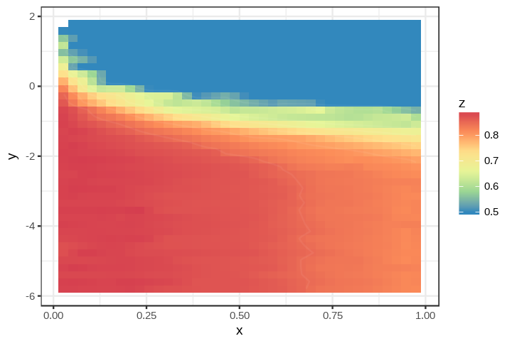


### Figure 3B


```R
human.exposure.model = models$glmnet

glmnet.human.exposure.val.ROC = my.roc(human.exposure.model$pred$early, human.exposure.model$pred$obs, "early")

pred.human.exposure.test.prob = predict(human.exposure.model, newdata = human.exprs.test[, colnames(human.exprs.test) %in% c(optvars)], type="prob")

glmnet.human.exposure.test.ROC <- my.roc(pred.human.exposure.test.prob$early,
                        test.time.period.from.exposure,
                     "early", title="Glmnet ROC")
```

    [1] "This is the AUC:"
    Area under the curve: 0.8986
    [1] "This is the AUC p-value:"
    [1] 1.822595e-13
    [1] "This is the AUC 95% Confidence Interval"
    95% CI: 0.8418-0.9554 (DeLong)
    [1] "This is the AUC:"
    Area under the curve: 0.6879
    [1] "This is the AUC p-value:"
    [1] 0.003761691
    [1] "This is the AUC 95% Confidence Interval"
    95% CI: 0.561-0.8148 (DeLong)


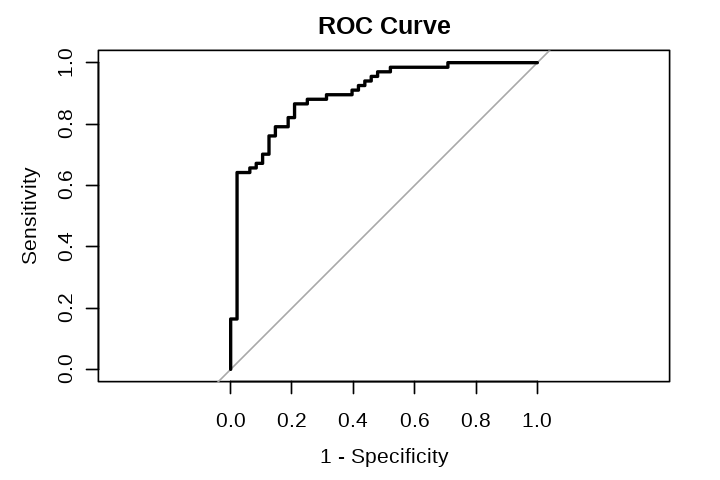


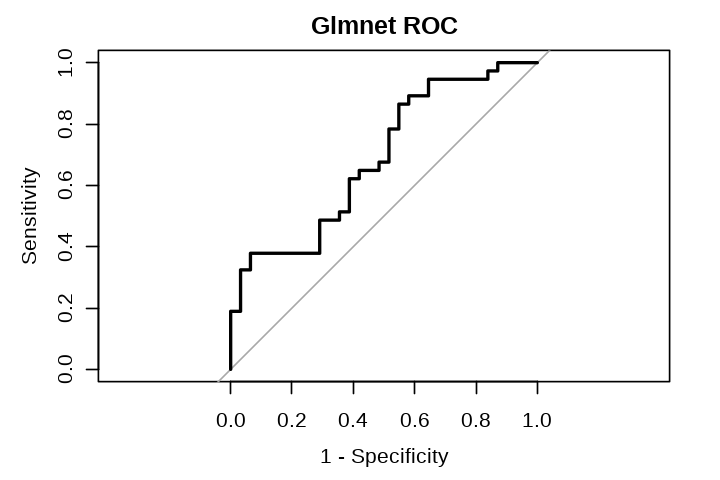


```R
human.exposure.plot = ggroc(list(CV=glmnet.human.exposure.val.ROC, 
                                           test=glmnet.human.exposure.test.ROC), 
                                      legacy.axes=TRUE) +
                geom_abline(intercept = 0, slope = 1, color = "lightgrey", size = 0.25) + 
                ggtitle("Baseline vs. 6 Month Time Points") + theme(plot.title = element_text(size=12, face="plain")) +
                scale_color_manual(name="Healthy Household Contacts",
                                  labels=c("CV" =expression("CV: AUC 0.90, p ="~1.9~ "x" ~10^{-13} ~ " "),
                                           "test"=expression("Test: AUC 0.69, p = 0.0039")),
                                  values=c("CV"="blue", "test"="red")) +
            theme(legend.position=c(0.30,0.20), legend.title = element_text(size=12), legend.text = element_text(size=11)) 
human.exposure.plot
```


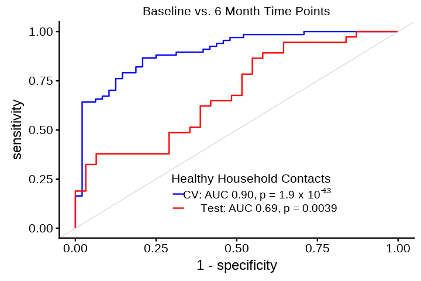


### Figure 3C


```R
pred.human.exposure.val = human.exposure.model$pred
pred.human.exposure.test = predict(human.exposure.model, newdata = human.exprs.test[, colnames(human.exprs.test) %in% c(optvars)])

# Calculate ratio of case (TB) to control in all actual and predicted 0 and 6 time periods, in both validation and test set
a.l.0.val = sum(dplyr::filter(human.pheno.6mo.train, time.from.exposure.months=="0")$group == "case (TB)") / length(dplyr::filter(human.pheno.6mo.train, time.from.exposure.months=="0")$group)
a.l.6.val = sum(dplyr::filter(human.pheno.6mo.train, time.from.exposure.months=="6")$group == "case (TB)") / length(dplyr::filter(human.pheno.6mo.train, time.from.exposure.months=="6")$group)

a.l.p.0.val = sum(human.pheno.6mo.train[pred.human.exposure.val$pred == "early",]$group=="case (TB)") / length(human.pheno.6mo.train[pred.human.exposure.val$pred == "early",]$group)
a.l.p.6.val = sum(human.pheno.6mo.train[pred.human.exposure.val$pred == "late",]$group=="case (TB)") / length(human.pheno.6mo.train[pred.human.exposure.val$pred == "late",]$group)


# Calculate ratio of case (TB) to control in all actual and predicted 0 and 6 time periods, in both validation and test set
a.l.0.test = sum(dplyr::filter(human.pheno.6mo.test, time.from.exposure.months=="0")$group == "case (TB)") / length(dplyr::filter(human.pheno.6mo.test, time.from.exposure.months=="0")$group)
a.l.6.test = sum(dplyr::filter(human.pheno.6mo.test, time.from.exposure.months=="6")$group == "case (TB)") / length(dplyr::filter(human.pheno.6mo.test, time.from.exposure.months=="6")$group)

a.l.p.0.test = sum(human.pheno.6mo.test[pred.human.exposure.test == "early",]$group=="case (TB)") / length(human.pheno.6mo.test[pred.human.exposure.test == "early",]$group)
a.l.p.6.test = sum(human.pheno.6mo.test[pred.human.exposure.test == "late",]$group=="case (TB)") / length(human.pheno.6mo.test[pred.human.exposure.test == "late",]$group)


t.period = c("Baseline", "Predicted Baseline", "Baseline", "Predicted Baseline")
partition = as.factor(c("Cross-Validation", "Cross-Validation", "Test", "Test"))
progressor_prop = c(a.l.0.val, a.l.p.0.val, a.l.0.test, a.l.p.0.test)
partition = factor(partition, levels(partition)[c(which(levels(partition) == "Cross-Validation"),
                                                  which(levels(partition) == "Test"))])

disease.confound.human = data.frame(t.period=as.factor(t.period), partition=partition, progressor_prop=progressor_prop)


n.act.early.val = sum(dplyr::filter(human.pheno.6mo.train, time.from.exposure.months=="0")$group == "case (TB)")
n.tot.early.val = length(dplyr::filter(human.pheno.6mo.train, time.from.exposure.months=="0")$group)

n.act.p.early.val = sum(human.pheno.6mo.train[pred.human.exposure.val$pred == "early",]$group=="case (TB)")
n.tot.p.early.val = length(human.pheno.6mo.train[pred.human.exposure.val$pred == "early",]$group)


fisher.test(matrix(c(n.act.early.val, 
                     n.tot.early.val - n.act.early.val,
                     n.act.p.early.val,
                     n.tot.p.early.val - n.act.p.early.val), ncol=2))

n.act.early.test = sum(dplyr::filter(human.pheno.6mo.test, time.from.exposure.months=="0")$group == "case (TB)")
n.tot.early.test = length(dplyr::filter(human.pheno.6mo.test, time.from.exposure.months=="0")$group)

n.act.p.early.test = sum(human.pheno.6mo.test[pred.human.exposure.test == "early",]$group=="case (TB)")
n.tot.p.early.test = length(human.pheno.6mo.test[pred.human.exposure.test == "early",]$group)


fisher.test(matrix(c(n.act.early.test, 
                     n.tot.early.test - n.act.early.test,
                     n.act.p.early.test,
                     n.tot.p.early.test - n.act.p.early.test), ncol=2))
```


    
    	Fisher's Exact Test for Count Data
    
    data:  
    p-value = 1
    alternative hypothesis: true odds ratio is not equal to 1
    95 percent confidence interval:
     0.4482757 2.2172025
    sample estimates:
    odds ratio 
      0.999015 


    
    	Fisher's Exact Test for Count Data
    
    data:  
    p-value = 1
    alternative hypothesis: true odds ratio is not equal to 1
    95 percent confidence interval:
     0.3354192 3.6486152
    sample estimates:
    odds ratio 
      1.105678 


```R
a.l.human.plot = ggplot(disease.confound.human, aes(x=t.period, y=progressor_prop)) + geom_bar(stat="identity") + facet_grid(~partition) +
    labs(
        y="Proportion of Samples from Humans\nwho progress to Active TB") +
ggtitle("Risk of TB", subtitle="Stratified by Predicted Time Point") + theme(plot.title = element_text(size=12, face="plain", hjust=0.5), 
                                                                              plot.subtitle=element_text(size=11, face="plain", hjust=0.5)) +
ylim(0, 1.0) +
geom_signif(comparisons=list(c("Baseline", "Predicted Baseline")),
                            y_position=c(0.75),    
              annotations = c("1.0"), vjust=-0.5, 
             tip_length=0) + theme(panel.background = element_rect(fill = "white", colour = "white", size = 4)) +
                scale_x_discrete(labels=c("Baseline" = "Baseline", "Predicted Baseline"="Predicted\nBaseline")) +
theme(axis.title.x=element_blank())

a.l.human.plot
```


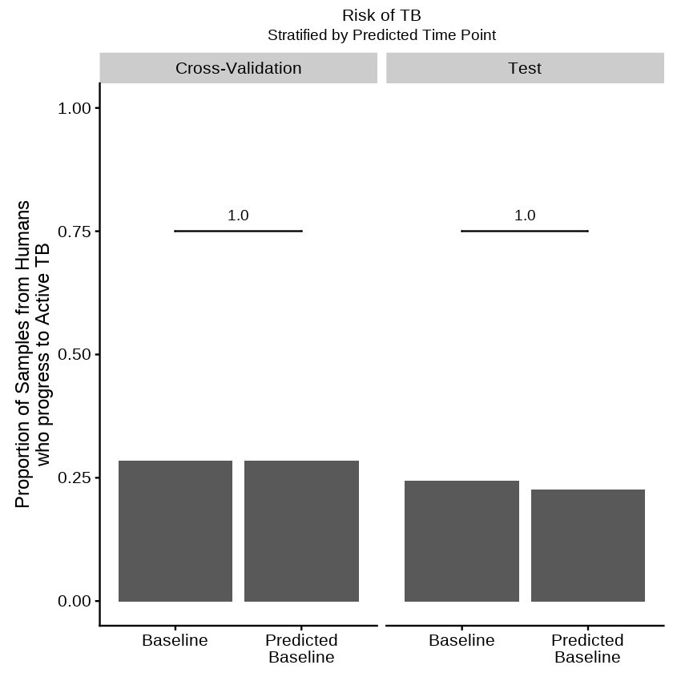


### Reproduce figure 3A, showing that published signatures of risk of TB do not predict time since exposure

#### Load the data (must load previous human data beforehand) and train the models


```R
Sul.genes = c("GAS6", "SEPT4", "CD1C", "BLK")
Sul.genes.sel = c("C1QC", "TRAV27", "ANRKD22", "OSBPL10")

ACS.genes = c("ANKRD22",
 "APOL1",
 "BATF2",
 "ETV7",
 "FCGR1A",
 "FCGR1B",
 "GBP1",
 "GBP2",
 "GBP4",
 "GBP5",
 "SCARF1",
 "SEPT4",
 "SERPING1",
 "STAT1",
 "TAP1",
 "TRAFD1"
)

ACS.transcripts = row.names(human.exprs.set)[match(unique(ACS.genes), human.exprs.set$symbol)]
Sul.transcripts = row.names(human.exprs.set)[match(unique(Sul.genes), human.exprs.set$symbol)]
Sul.transcripts.sel = row.names(human.exprs.set)[match(unique(Sul.genes.sel), human.exprs.set$symbol)]

human.exprs.train.ACS = human.exprs.train[, colnames(human.exprs.train) %in% ACS.transcripts]
human.exprs.train.Sul = human.exprs.train[, colnames(human.exprs.train) %in% Sul.transcripts]
human.exprs.train.Sul.sel = human.exprs.train[, colnames(human.exprs.train) %in% Sul.transcripts.sel]

human.exprs.test.ACS = human.exprs.test[, colnames(human.exprs.test) %in% ACS.transcripts]
human.exprs.test.Sul = human.exprs.test[, colnames(human.exprs.test) %in% Sul.transcripts]
human.exprs.test.Sul.sel = human.exprs.test[, colnames(human.exprs.test) %in% Sul.transcripts.sel]

human.exprs.train.TB.genes = human.exprs.train[, colnames(human.exprs.train) %in% c(ACS.transcripts,
                                                                                    Sul.transcripts,
                                                                                    Sul.transcripts.sel)]
human.exprs.test.TB.genes = human.exprs.test[, colnames(human.exprs.test) %in% c(ACS.transcripts,
                                                                                    Sul.transcripts,
                                                                                    Sul.transcripts.sel)]

time.period.from.exposure = as.factor(ifelse(human.pheno.6mo.train$time.from.exposure.months == "0", "early", "late"))
test.time.period.from.exposure = as.factor(ifelse(human.pheno.6mo.test$time.from.exposure.months == "0", "early", "late"))
```


```R
seed=7

start_time <- Sys.time()

cluster = makeCluster(detectCores()-3) # Leaving 3 for other jobs
registerDoParallel(cluster)

methods = c("glmnet")

models = list()

control <- trainControl(method="cv", index=folds.6mo, search="random", savePredictions = 'final', allowParallel=TRUE,
                       classProbs=TRUE, summaryFunction=twoClassSummary) # Use AUC to pick the best model

for (alg in methods) {
    set.seed(seed)
    print("I have gotten to model:")
    print(alg)
    model = train(human.exprs.train.ACS, 
                  as.factor(time.period.from.exposure), 
                  method=alg, tuneLength=30, trControl=control,
                 metric="ROC")
    models[[alg]] = model
}

stopCluster(cluster)
registerDoSEQ()

end_time <- Sys.time()
print(end_time - start_time)
```

    [1] "I have gotten to model:"
    [1] "glmnet"


    Warning message in nominalTrainWorkflow(x = x, y = y, wts = weights, info = trainInfo, :
    “There were missing values in resampled performance measures.”

    Time difference of 40.93105 secs


```R
ACS.human.exposure.model = models$glmnet
```


```R
seed=7


start_time <- Sys.time()

cluster = makeCluster(detectCores()-3) # Leaving 3 for other jobs
registerDoParallel(cluster)

methods = c("glmnet")

models = list()

control <- trainControl(method="cv", index=folds.6mo, search="random", savePredictions = 'final', allowParallel=TRUE,
                       classProbs=TRUE, summaryFunction=twoClassSummary) # Use AUC to pick the best model

for (alg in methods) {
    set.seed(seed)
    print("I have gotten to model:")
    print(alg)
    model = train(human.exprs.train.Sul, 
                  as.factor(time.period.from.exposure), 
                  method=alg, tuneLength=30, trControl=control,
                 metric="ROC")
    models[[alg]] = model
}

stopCluster(cluster)
registerDoSEQ()

end_time <- Sys.time()
print(end_time - start_time)
```

    [1] "I have gotten to model:"
    [1] "glmnet"


    Warning message in nominalTrainWorkflow(x = x, y = y, wts = weights, info = trainInfo, :
    “There were missing values in resampled performance measures.”

    Time difference of 32.12168 secs


```R
RISK4.human.exposure.model =models$glmnet
```


```R
seed=7


start_time <- Sys.time()

cluster = makeCluster(detectCores()-3) # Leaving 3 for other jobs
registerDoParallel(cluster)

methods = c("glmnet")

models = list()


control <- trainControl(method="cv", index=folds.6mo, search="random", savePredictions = 'final', allowParallel=TRUE,
                       classProbs=TRUE, summaryFunction=twoClassSummary) # Use AUC to pick the best model

for (alg in methods) {
    set.seed(seed)
    print("I have gotten to model:")
    print(alg)
    model = train(human.exprs.train.Sul.sel, 
                  as.factor(time.period.from.exposure), 
                  method=alg, tuneLength=30, trControl=control,
                 metric="ROC")
    models[[alg]] = model
}

stopCluster(cluster)
registerDoSEQ()

end_time <- Sys.time()
print(end_time - start_time)
```

    [1] "I have gotten to model:"
    [1] "glmnet"


    Warning message in nominalTrainWorkflow(x = x, y = y, wts = weights, info = trainInfo, :
    “There were missing values in resampled performance measures.”

    Time difference of 32.76669 secs


```R
Sul.sel.human.exposure.model = models$glmnet
```


```R
seed=7


start_time <- Sys.time()

cluster = makeCluster(detectCores()-3) # Leaving 3 for other jobs
registerDoParallel(cluster)

methods = c("glmnet")

models = list()


control <- trainControl(method="cv", index=folds.6mo, search="random", savePredictions = 'final', allowParallel=TRUE,
                       classProbs=TRUE, summaryFunction=twoClassSummary) # Use AUC to pick the best model

for (alg in methods) {
    set.seed(seed)
    print("I have gotten to model:")
    print(alg)
    model = train(human.exprs.train.TB.genes, 
                  as.factor(time.period.from.exposure), 
                  method=alg, tuneLength=30, trControl=control,
                 metric="ROC")
    models[[alg]] = model
}

stopCluster(cluster)
registerDoSEQ()

end_time <- Sys.time()
print(end_time - start_time)
```

    [1] "I have gotten to model:"
    [1] "glmnet"


    Warning message in nominalTrainWorkflow(x = x, y = y, wts = weights, info = trainInfo, :
    “There were missing values in resampled performance measures.”

    Time difference of 32.29566 secs


```R
TB.genes.human.exposure.model = models$glmnet
```

#### Figure 3A


```R
pred.human.test.ACS.exposure = predict(ACS.human.exposure.model, newdata = human.exprs.test.ACS, type="prob")

glmnet.human.test.ACS.exposure.ROC <- my.roc(pred.human.test.ACS.exposure$early,
                        test.time.period.from.exposure,
                     "early", title="Glmnet ROC")
```

    [1] "This is the AUC:"
    Area under the curve: 0.5815
    [1] "This is the AUC p-value:"
    [1] 0.1269821
    [1] "This is the AUC 95% Confidence Interval"
    95% CI: 0.4387-0.7243 (DeLong)


```R
pred.human.test.RISK4.exposure = predict(RISK4.human.exposure.model, newdata = human.exprs.test.Sul , type="prob")

glmnet.human.test.RISK4.exposure.ROC <- my.roc(pred.human.test.RISK4.exposure$early,
                        test.time.period.from.exposure,
                     "early", title="Glmnet ROC")
```

    [1] "This is the AUC:"
    Area under the curve: 0.5527
    [1] "This is the AUC p-value:"
    [1] 0.7724687
    [1] "This is the AUC 95% Confidence Interval"
    95% CI: 0.4103-0.6952 (DeLong)


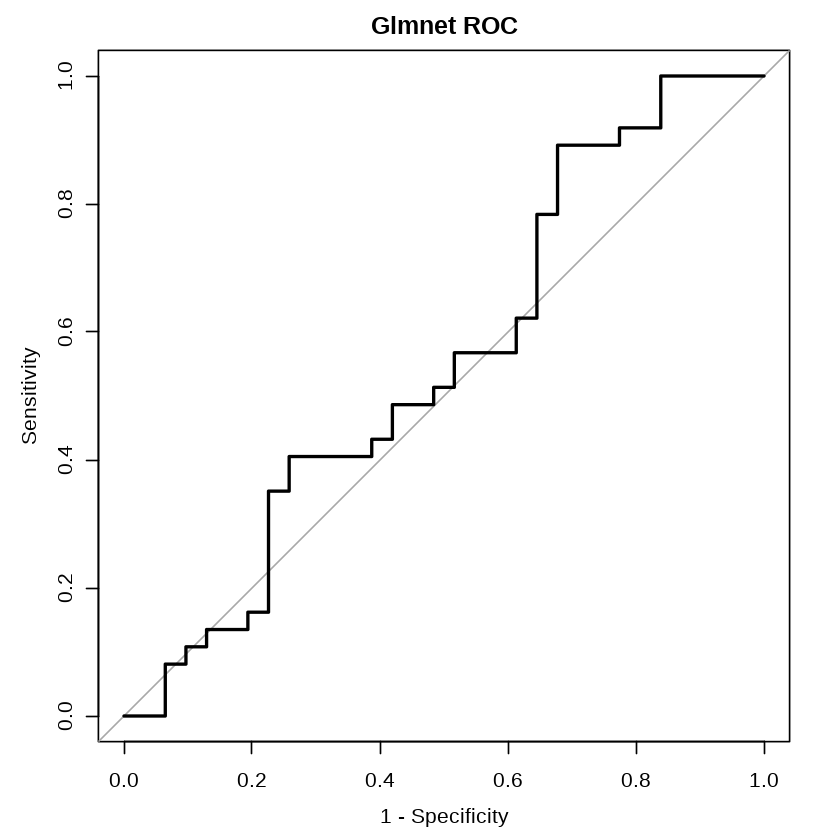


```R
pred.human.test.Sul.sel.exposure = predict(Sul.sel.human.exposure.model, newdata = human.exprs.test.Sul.sel , type="prob")

glmnet.human.test.Sul.sel.exposure.ROC <- my.roc(pred.human.test.Sul.sel.exposure$early,
                        test.time.period.from.exposure,
                     "early", title="Glmnet ROC")
```

    [1] "This is the AUC:"
    Area under the curve: 0.5514
    [1] "This is the AUC p-value:"


    Warning message in wilcox.test.default(pred[obs == 1], pred[obs == 0], alternative = "great"):
    “cannot compute exact p-value with ties”

    [1] 0.2356543
    [1] "This is the AUC 95% Confidence Interval"
    95% CI: 0.4123-0.6905 (DeLong)


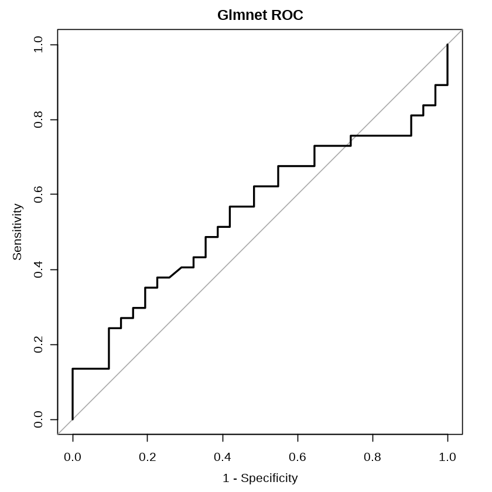


```R
pred.human.test.TB.genes.exposure = predict(TB.genes.human.exposure.model, newdata = human.exprs.test.TB.genes , type="prob")

glmnet.human.test.TB.genes.exposure.ROC <- my.roc(pred.human.test.TB.genes.exposure$early,
                        test.time.period.from.exposure,
                     "early", title="Glmnet ROC")
```

    [1] "This is the AUC:"
    Area under the curve: 0.5623
    [1] "This is the AUC p-value:"
    [1] 0.1921917
    [1] "This is the AUC 95% Confidence Interval"
    95% CI: 0.4197-0.7049 (DeLong)


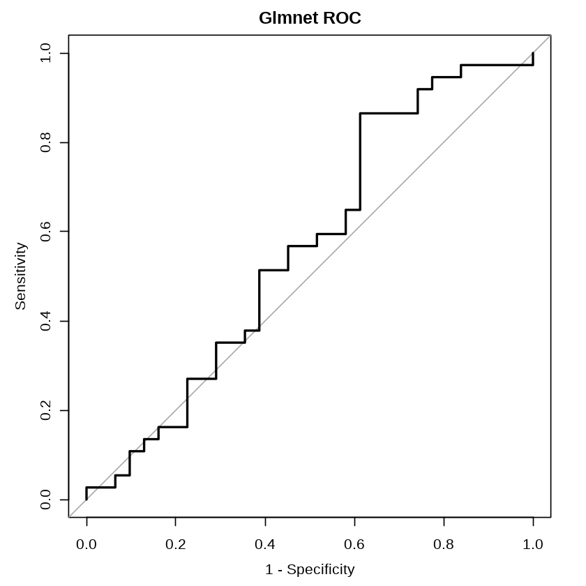


```R
human.riskgenes.exposure.plot = ggroc(list(ACS=glmnet.human.test.ACS.exposure.ROC, 
                                           RISK4=glmnet.human.test.RISK4.exposure.ROC,
                                            Sel=glmnet.human.test.Sul.sel.exposure.ROC,
                                          TB=glmnet.human.test.TB.genes.exposure.ROC), 
                                      legacy.axes=TRUE) +
                geom_abline(intercept = 0, slope = 1, color = "lightgrey", size = 0.25) + 
                ggtitle("Baseline vs. 6 Month Time Points\n(TB Risk Genes)") + theme(plot.title = element_text(size=12, face="plain")) +
                scale_color_manual(name="       Healthy Household Contacts", 
                                  labels=c("ACS" =expression("ACS COR: AUC 0.58, p = 0.13"),
                                           "RISK4"=expression("RISK4: AUC 0.55, p = 0.77"),
                                           "Sel"=expression("Suliman et al post hoc:\nAUC 0.55, p = 0.24"),
                                          "TB"=expression("All: AUC 0.56, p = 0.19")),
                                  values=c("ACS"="red", "RISK4"="blue", "Sel"="darkgreen", "TB"="black")) +
            theme(legend.position=c(0.30,0.20), legend.title = element_text(size=12), legend.text = element_text(size=11))  
human.riskgenes.exposure.plot
```


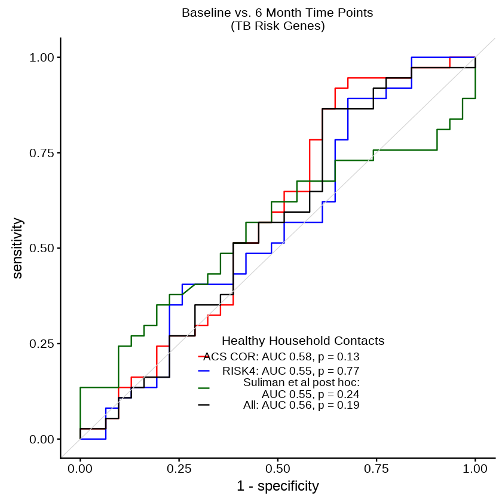


### Reproduce figure 3D, showing that the genes in our signature of time since exposure cannot predict risk of TB in the GC6-74 cohort.

#### Select the genes in our signature and train a model with these genes to predict risk of TB progression.


```R
human.exposure.glmnet = human.exposure.model$finalModel

coefs.human.6mo = coef(human.exposure.glmnet , s=models$glmnet$bestTune$lambda)

nonzero.coefs.r = data.frame(name = coefs.human.6mo@Dimnames[[1]][coefs.human.6mo@i + 1], coefficient = coefs.human.6mo@x)
sort.coeffs.r = nonzero.coefs.r[order(-abs(nonzero.coefs.r$coefficient)), ]#, sort(abs(nonzero.coefs$coefficient), T)

genes.coefs.r = sort.coeffs.r$name[2:length(sort.coeffs.r$name)]
```


```R
length(genes.coefs.r)
```


254


```R
set.seed(100)

n = 1000
lambda.grid = c(10 ^ runif(n, min = log10(1e-6), max = log10(1e2)))

alpha.grid = runif(length(lambda.grid), min = 0.00, 1.00)

train.grid = data.frame(lambda = sample(lambda.grid, length(lambda.grid)),
                       alpha = sample(alpha.grid, length(lambda.grid)))

```


```R
seed=7

start_time <- Sys.time()

cluster = makeCluster(detectCores()-3) # Leaving 3 for other jobs
registerDoParallel(cluster)

methods = c("glmnet")

models = list()


control <- trainControl(method="cv", index=folds.6mo, savePredictions = 'final', allowParallel=TRUE,
                       classProbs=TRUE, summaryFunction=twoClassSummary) # Use AUC to pick the best model

for (alg in methods) {
    set.seed(seed)
    print("I have gotten to model:")
    print(alg)
    model = train(human.exprs.train[,colnames(human.exprs.train) %in% as.character(genes.coefs.r)], 
                  as.factor(human.pheno.6mo.train$status), 
                  method=alg, tuneGrid = train.grid, trControl=control,
                 metric="ROC")
    models[[alg]] = model
}

stopCluster(cluster)
registerDoSEQ()

end_time <- Sys.time()
print(end_time - start_time)
```

    [1] "I have gotten to model:"
    [1] "glmnet"


    Warning message in nominalTrainWorkflow(x = x, y = y, wts = weights, info = trainInfo, :
    “There were missing values in resampled performance measures.”

    Time difference of 57.74353 secs


```R
human.TB.from.exposure.model = models$glmnet
exposure.genes = genes.coefs.r
```

#### Figure 3D


```R
pred.human.TB.from.exposure.test = predict(human.TB.from.exposure.model, newdata = human.exprs.test[,colnames(human.exprs.test) %in% as.character(exposure.genes)])


confusionMatrix(human.TB.from.exposure.model$pred$pred, human.TB.from.exposure.model$pred$obs, positive= "progressor")
confusionMatrix(pred.human.TB.from.exposure.test, as.factor(human.pheno.6mo.test$status), positive = "progressor")

glmnet.human.TB.from.exposure.val.ROC = my.roc(human.TB.from.exposure.model$pred$progressor, human.TB.from.exposure.model$pred$obs, "progressor")

pred.human.TB.from.exposure.test.prob = predict(human.TB.from.exposure.model, newdata = human.exprs.test[,colnames(human.exprs.test) %in% as.character(exposure.genes)], type="prob")

glmnet.human.TB.from.exposure.test.ROC <- my.roc(pred.human.TB.from.exposure.test.prob$progressor,
                        as.factor(human.pheno.6mo.test$status),
                     "progressor", title="Glmnet ROC")
```


    Confusion Matrix and Statistics
    
                Reference
    Prediction   control progressor
      control         83         32
      progressor       0          0
                                              
                   Accuracy : 0.7217          
                     95% CI : (0.6305, 0.8013)
        No Information Rate : 0.7217          
        P-Value [Acc > NIR] : 0.5475          
                                              
                      Kappa : 0               
     Mcnemar's Test P-Value : 4.251e-08       
                                              
                Sensitivity : 0.0000          
                Specificity : 1.0000          
             Pos Pred Value :    NaN          
             Neg Pred Value : 0.7217          
                 Prevalence : 0.2783          
             Detection Rate : 0.0000          
       Detection Prevalence : 0.0000          
          Balanced Accuracy : 0.5000          
                                              
           'Positive' Class : progressor      
                                              


    Confusion Matrix and Statistics
    
                Reference
    Prediction   control progressor
      control         52         16
      progressor       0          0
                                              
                   Accuracy : 0.7647          
                     95% CI : (0.6462, 0.8591)
        No Information Rate : 0.7647          
        P-Value [Acc > NIR] : 0.5665583       
                                              
                      Kappa : 0               
     Mcnemar's Test P-Value : 0.0001768       
                                              
                Sensitivity : 0.0000          
                Specificity : 1.0000          
             Pos Pred Value :    NaN          
             Neg Pred Value : 0.7647          
                 Prevalence : 0.2353          
             Detection Rate : 0.0000          
       Detection Prevalence : 0.0000          
          Balanced Accuracy : 0.5000          
                                              
           'Positive' Class : progressor      
                                              


    [1] "This is the AUC:"
    Area under the curve: 0.5693
    [1] "This is the AUC p-value:"
    [1] 0.8752258
    [1] "This is the AUC 95% Confidence Interval"
    95% CI: 0.4409-0.6977 (DeLong)
    [1] "This is the AUC:"
    Area under the curve: 0.6322
    [1] "This is the AUC p-value:"
    [1] 0.05669511
    [1] "This is the AUC 95% Confidence Interval"
    95% CI: 0.4645-0.7999 (DeLong)


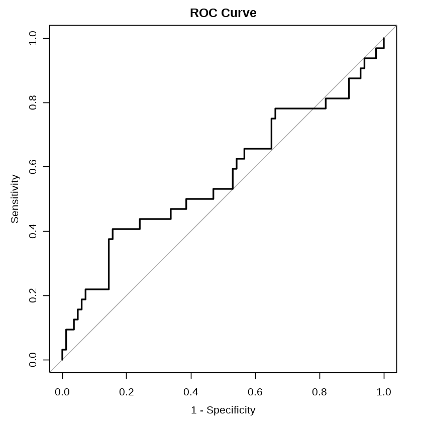


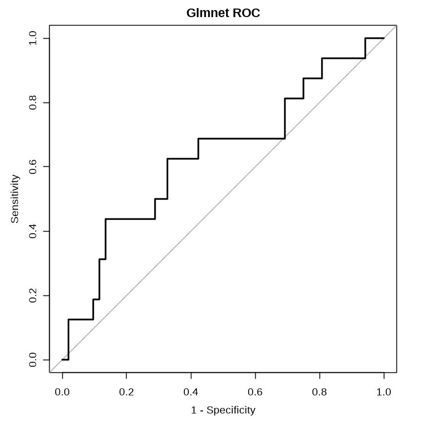


```R
human.TB.from.exposure.plot = ggroc(list(CV=glmnet.human.TB.from.exposure.val.ROC , 
                                           test=glmnet.human.TB.from.exposure.test.ROC ), 
                                      legacy.axes=TRUE) +
                geom_abline(intercept = 0, slope = 1, color = "lightgrey", size = 0.25) + 
                ggtitle("Risk of TB Prediction\n(Time Since Exposure Genes)") + theme(plot.title = element_text(size=12, face="plain")) +
                scale_color_manual(name="Healthy Household Contacts",
                                  labels=c("CV" =expression("CV: AUC 0.56, p = 0.85"),
                                           "test"=expression("Test: AUC 0.62, p = 0.069")),
                                  values=c("CV"="blue", "test"="red")) +
            theme(legend.position=c(0.30,0.20), legend.title = element_text(size=12), legend.text = element_text(size=11)) 
human.TB.from.exposure.plot
```


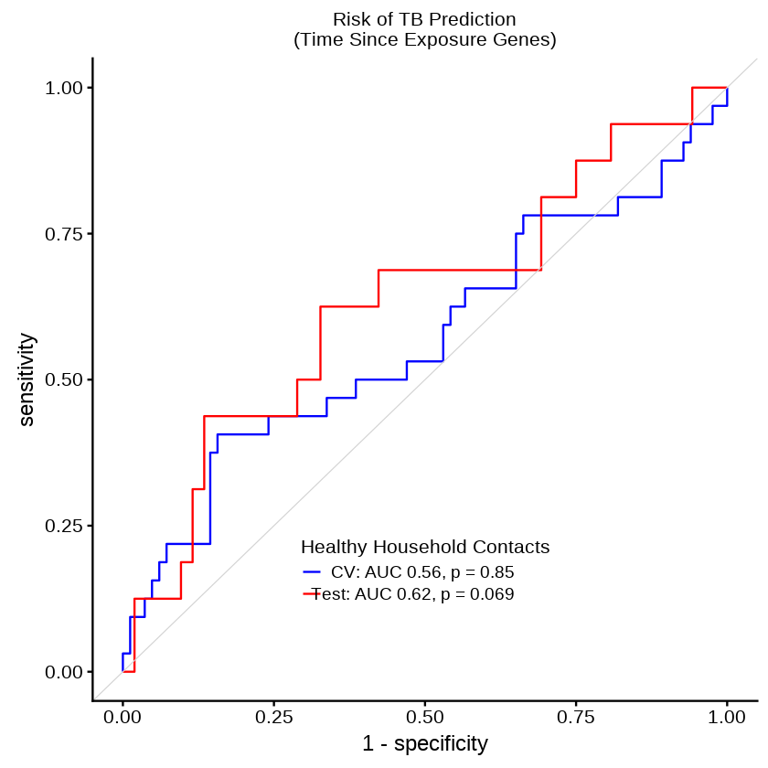


## Figure 4 Human Analysis (Grand Challenges 6-74 cohort, Adolescent Cohort Study, Singhania et al UK, South Africa and Leicester cohort studies, Small Adolescent Infection Acquisition study)

- This code reproduces the analysis of Figure 4, showing that "Application of gene expression signature of time since active TB exposure to ACS cohort and Leicester cohort confirms its identification of recent exposure in humans"

### Load and Install Required Libraries


```R
if (!require("preprocessCore")) {
  source("https://bioconductor.org/biocLite.R")
  biocLite("preprocessCore")
  library("preprocessCore")
}

source("https://bioconductor.org/biocLite.R")
if (!require("Biobase")) {
  biocLite("Biobase")
  library("Biobase")
}
if (!require("GEOquery")) {
  biocLite("GEOquery")
  library("GEOquery")
}

if (!require("ggplot2")) {
  install.packages("ggplot2")
  library("ggplot2")
}

if (!require("glmnet")) {
  install.packages("glmnet")
  library("glmnet")
}

if (!require("caret")) {
  install.packages("caret")
  library("caret")
}
if (!require("dplyr")) {
  install.packages("dplyr")
  library("dplyr")
}

if (!require("ggsignif")) {
  install.packages("ggsignif")
  library("ggsignif")
}

if (!require("doParallel")) {
  install.packages("doParallel")
  library("doParallel")
}

if (!require("cowplot")) {
  install.packages("cowplot")
  library("cowplot")
}

if (!require("pROC")) {
    # pROC 1.12.0 is required, and may not be the default installation:
    packageUrl<- "https://cran.r-project.org/src/contrib/Archive/pROC/pROC_1.12.0.tar.gz"
    install.packages(packageUrl, repos=NULL, type='source')
    library("pROC")
}

```

    Loading required package: preprocessCore
    Bioconductor version 3.6 (BiocInstaller 1.28.0), ?biocLite for help
    A new version of Bioconductor is available after installing the most recent
      version of R; see http://bioconductor.org/install
    Loading required package: Biobase
    Loading required package: BiocGenerics
    Loading required package: parallel
    
    Attaching package: ‘BiocGenerics’
    
    The following objects are masked from ‘package:parallel’:
    
        clusterApply, clusterApplyLB, clusterCall, clusterEvalQ,
        clusterExport, clusterMap, parApply, parCapply, parLapply,
        parLapplyLB, parRapply, parSapply, parSapplyLB
    
    The following objects are masked from ‘package:stats’:
    
        IQR, mad, sd, var, xtabs
    
    The following objects are masked from ‘package:base’:
    
        anyDuplicated, append, as.data.frame, cbind, colMeans, colnames,
        colSums, do.call, duplicated, eval, evalq, Filter, Find, get, grep,
        grepl, intersect, is.unsorted, lapply, lengths, Map, mapply, match,
        mget, order, paste, pmax, pmax.int, pmin, pmin.int, Position, rank,
        rbind, Reduce, rowMeans, rownames, rowSums, sapply, setdiff, sort,
        table, tapply, union, unique, unsplit, which, which.max, which.min
    
    Welcome to Bioconductor
    
        Vignettes contain introductory material; view with
        'browseVignettes()'. To cite Bioconductor, see
        'citation("Biobase")', and for packages 'citation("pkgname")'.
    
    Loading required package: GEOquery
    Setting options('download.file.method.GEOquery'='auto')
    Setting options('GEOquery.inmemory.gpl'=FALSE)
    Loading required package: ggplot2
    Loading required package: glmnet
    Loading required package: Matrix
    Loading required package: foreach
    Loaded glmnet 2.0-13
    
    Loading required package: caret
    Loading required package: lattice
    Loading required package: dplyr
    
    Attaching package: ‘dplyr’
    
    The following object is masked from ‘package:Biobase’:
    
        combine
    
    The following objects are masked from ‘package:BiocGenerics’:
    
        combine, intersect, setdiff, union
    
    The following objects are masked from ‘package:stats’:
    
        filter, lag
    
    The following objects are masked from ‘package:base’:
    
        intersect, setdiff, setequal, union
    
    Loading required package: ggsignif
    Loading required package: doParallel
    Loading required package: iterators
    Loading required package: cowplot
    
    Attaching package: ‘cowplot’
    
    The following object is masked from ‘package:ggplot2’:
    
        ggsave
    
    Loading required package: pROC
    Type 'citation("pROC")' for a citation.
    
    Attaching package: ‘pROC’
    
    The following object is masked from ‘package:glmnet’:
    
        auc
    
    The following object is masked from ‘package:BiocGenerics’:
    
        var
    
    The following objects are masked from ‘package:stats’:
    
        cov, smooth, var
    


### Reproduce Analysis for Figure 4A

#### Load and co-process the data from the ARCHS4 resource for GC6-74 and ACS

#### To download data from the ARCHS4 resource
 - In a web browser go to https://amp.pharm.mssm.edu/archs4/data.html
 - Search for GSE94438 (GC6-74) and click the download link (a zipped folder with a gene_count.tsv file is downloaded)
 - Do the same for for GSE79362 (ACS) 
 - Move the respective files into their data/GSE... folder in this repository and rename: "gene_count_GSE[GSE # here].tsv"


```R
source("utils_submission.R")

Sul.path = paste(path, "/data/GSE94438", sep="")
ACS.path = paste(path, "/data/GSE79362", sep="")

Sul.pheno.set = getGEO(filename=paste(Sul.path, "GSE94438_series_matrix.txt.gz", sep="/"),
             destdir=Sul.path)

Sul.pheno = filter.human.pheno(pData(Sul.pheno.set))

ACS.pheno.set = getGEO(filename=paste(ACS.path, "GSE79362_series_matrix.txt.gz", sep="/"),
             destdir=Sul.path)

ACS.pheno = filter.ACS.pheno(pData(ACS.pheno.set))
```

    Parsed with column specification:
    cols(
      .default = col_character()
    )
    See spec(...) for full column specifications.
    Using locally cached version of GPL11154 found here:
    /master/rault/TB/data/GSE94438/GPL11154.soft 
    Warning message in filter.human.pheno(pData(human.pheno.set)):
    “NAs introduced by coercion”Warning message in filter.human.pheno(pData(human.pheno.set)):
    “NAs introduced by coercion”Warning message in filter.human.pheno(pData(human.pheno.set)):
    “NAs introduced by coercion”

               age code gender group site subjectid time.from.exposure.months
    GSM2475704  NA  672     NA    NA   NA        NA                        NA
    GSM2475705  NA  694     NA    NA   NA        NA                        NA
    GSM2475706  NA  695     NA    NA   NA        NA                        NA
    GSM2475722  NA  994     NA    NA   NA        NA                        NA
    GSM2475742  NA 1061     NA    NA   NA        NA                        NA
    GSM2475748  NA 1194     NA    NA   NA        NA                        NA
               time.to.tb.months
    GSM2475704                NA
    GSM2475705                NA
    GSM2475706                NA
    GSM2475722                NA
    GSM2475742                NA
    GSM2475748                NA
     [1] "GSM2475598" "GSM2475603" "GSM2475587" "GSM2475592" "GSM2475599"
     [6] "GSM2475604" "GSM2475360" "GSM2475387" "GSM2475362" "GSM2475389"
    [11] "GSM2475402" "GSM2475555" "GSM2475361" "GSM2475388" "GSM2475359"
    [16] "GSM2475390" "GSM2475588" "GSM2475593" "GSM2475591" "GSM2475596"
    [21] "GSM2475589" "GSM2475594" "GSM2475590" "GSM2475595" "GSM2475597"
    [26] "GSM2475602" "GSM2475579" "GSM2475601" "GSM2475600" "GSM2475605"
    [31] "GSM2475403" "GSM2475554"
     [1] 128 128 195 195 217 217 284 284 320 320 45  45  562 562 632 632 740 740 744
    [20] 744 746 746 806 806 844 844 897 897 904 904 96  96 
    418 Levels: 1002 1007 1009 1010 1011 1014 1019 1020 1027 1028 1029 1030 ... 1194
    [1] "15"
    [1] Test
    16 Levels:  09/G262 10/G261 2006 2007 2008 2009 F KHHC26 M Not R S ... unmatched
    [1] "72"
    [1] Test
    16 Levels:  09/G262 10/G261 2006 2007 2008 2009 F KHHC26 M Not R S ... unmatched
    [1] "92"
    [1] Test
    16 Levels:  09/G262 10/G261 2006 2007 2008 2009 F KHHC26 M Not R S ... unmatched
    [1] "99"
    [1] Test
    16 Levels:  09/G262 10/G261 2006 2007 2008 2009 F KHHC26 M Not R S ... unmatched
    [1] "358"
    [1] Test
    16 Levels:  09/G262 10/G261 2006 2007 2008 2009 F KHHC26 M Not R S ... unmatched
    [1] "376"
    [1] Test
    16 Levels:  09/G262 10/G261 2006 2007 2008 2009 F KHHC26 M Not R S ... unmatched
    [1] "524"
    [1] Test
    16 Levels:  09/G262 10/G261 2006 2007 2008 2009 F KHHC26 M Not R S ... unmatched
    [1] "729"
    [1] Test
    16 Levels:  09/G262 10/G261 2006 2007 2008 2009 F KHHC26 M Not R S ... unmatched
    [1] "730"
    [1] Test
    16 Levels:  09/G262 10/G261 2006 2007 2008 2009 F KHHC26 M Not R S ... unmatched
    [1] "1066"
    [1] Test
    16 Levels:  09/G262 10/G261 2006 2007 2008 2009 F KHHC26 M Not R S ... unmatched
    [1] "1114"
    [1] Test
    16 Levels:  09/G262 10/G261 2006 2007 2008 2009 F KHHC26 M Not R S ... unmatched
    [1] "1116"
    [1] Test
    16 Levels:  09/G262 10/G261 2006 2007 2008 2009 F KHHC26 M Not R S ... unmatched
    [1] "1231"
    [1] Test
    16 Levels:  09/G262 10/G261 2006 2007 2008 2009 F KHHC26 M Not R S ... unmatched
    [1] "1233"
    [1] Test
    16 Levels:  09/G262 10/G261 2006 2007 2008 2009 F KHHC26 M Not R S ... unmatched
    [1] "5319"
    [1] Test
    16 Levels:  09/G262 10/G261 2006 2007 2008 2009 F KHHC26 M Not R S ... unmatched
    [1] "5358"
    [1] Test
    16 Levels:  09/G262 10/G261 2006 2007 2008 2009 F KHHC26 M Not R S ... unmatched
    [1] "5360"
    [1] Test
    16 Levels:  09/G262 10/G261 2006 2007 2008 2009 F KHHC26 M Not R S ... unmatched
    [1] "5365"
    [1] Test
    16 Levels:  09/G262 10/G261 2006 2007 2008 2009 F KHHC26 M Not R S ... unmatched
    [1] "08/G329"
    [1] Test
    16 Levels:  09/G262 10/G261 2006 2007 2008 2009 F KHHC26 M Not R S ... unmatched
    [1] "08/G568"
    [1] Test
    16 Levels:  09/G262 10/G261 2006 2007 2008 2009 F KHHC26 M Not R S ... unmatched
    [1] "08/G595"
    [1] Test
    16 Levels:  09/G262 10/G261 2006 2007 2008 2009 F KHHC26 M Not R S ... unmatched
    [1] "09/G131"
    [1] Test
    16 Levels:  09/G262 10/G261 2006 2007 2008 2009 F KHHC26 M Not R S ... unmatched
    [1] "09/G168"
    [1] Test
    16 Levels:  09/G262 10/G261 2006 2007 2008 2009 F KHHC26 M Not R S ... unmatched
    [1] "09/G238"
    [1] Test
    16 Levels:  09/G262 10/G261 2006 2007 2008 2009 F KHHC26 M Not R S ... unmatched
    [1] "09/G403"
    [1] Test
    16 Levels:  09/G262 10/G261 2006 2007 2008 2009 F KHHC26 M Not R S ... unmatched
    [1] "ARHHC16"
    [1] Test
    16 Levels:  09/G262 10/G261 2006 2007 2008 2009 F KHHC26 M Not R S ... unmatched
    [1] "DZHHC38"
    [1] Test
    16 Levels:  09/G262 10/G261 2006 2007 2008 2009 F KHHC26 M Not R S ... unmatched
    [1] "DZHHC84"
    [1] Test
    16 Levels:  09/G262 10/G261 2006 2007 2008 2009 F KHHC26 M Not R S ... unmatched
    [1] "KAZHHC50"
    [1] Test
    16 Levels:  09/G262 10/G261 2006 2007 2008 2009 F KHHC26 M Not R S ... unmatched
    [1] "KFHHC15"
    [1] Test
    16 Levels:  09/G262 10/G261 2006 2007 2008 2009 F KHHC26 M Not R S ... unmatched
    [1] "KHHC04"
    [1] Test
    16 Levels:  09/G262 10/G261 2006 2007 2008 2009 F KHHC26 M Not R S ... unmatched
    [1] "KHHC32"
    [1] Test
    16 Levels:  09/G262 10/G261 2006 2007 2008 2009 F KHHC26 M Not R S ... unmatched
    [1] "KHHC36"
    [1] Test
    16 Levels:  09/G262 10/G261 2006 2007 2008 2009 F KHHC26 M Not R S ... unmatched
    [1] "KHHC41"
    [1] Test
    16 Levels:  09/G262 10/G261 2006 2007 2008 2009 F KHHC26 M Not R S ... unmatched
    [1] "LDHHC18"
    [1] Test
    16 Levels:  09/G262 10/G261 2006 2007 2008 2009 F KHHC26 M Not R S ... unmatched
    [1] "MESHHC04"
    [1] Test
    16 Levels:  09/G262 10/G261 2006 2007 2008 2009 F KHHC26 M Not R S ... unmatched
    [1] "TEKHHC10"
    [1] Test
    84 Levels:  07/G123 07/G225 07/G437 07/G438 07/G468 08/G245 08/G249 ... W23HHC132
    [1] "TEKHHC74"
    [1] Test
    16 Levels:  09/G262 10/G261 2006 2007 2008 2009 F KHHC26 M Not R S ... unmatched
    [1] "W23HHC15"
    [1] Test
    16 Levels:  09/G262 10/G261 2006 2007 2008 2009 F KHHC26 M Not R S ... unmatched
    [1] "W23HHC21"
    [1] Test
    16 Levels:  09/G262 10/G261 2006 2007 2008 2009 F KHHC26 M Not R S ... unmatched
    [1] "W23HHC29"
    [1] Test
    84 Levels:  07/G123 07/G225 07/G437 07/G438 07/G468 08/G245 08/G249 ... W23HHC132
    [1] "W23HHC61"
    [1] Test
    16 Levels:  09/G262 10/G261 2006 2007 2008 2009 F KHHC26 M Not R S ... unmatched
    [1] "1115"
    [1] Test
    21 Levels:  10 11 14 15 18 19 2008 2010 21 23 24 5 6 7 8 9 characterists ... Training
    [1] "10/G289"
    [1] Test
    Levels:  19 21 22 24 failed for QC Test Training
    [1] "DZHHC96"
    [1] Test
    21 Levels:  10 11 14 15 18 19 2008 2010 21 23 24 5 6 7 8 9 characterists ... Training
    [1] "Subjects not assigned a training-test set that are now training"
    
     09/G455  09/G476  LDHHC10 91420103 91451104    92245 
           2        2        1        1        1        1 
    [1] "about to return new data frame"


    Parsed with column specification:
    cols(
      .default = col_character()
    )
    See spec(...) for full column specifications.
    Using locally cached version of GPL11154 found here:
    /master/rault/TB/data/GSE94438/GPL11154.soft 
    Warning message in filter.ACS.pheno(pData(ACS.pheno.set)):
    “NAs introduced by coercion”

    [1] "about to return new data frame"


```R
# Common names for progressor
Sul.pheno$group = ifelse(Sul.pheno$group == "Control", "control", "progressor")
ACS.pheno$group = ifelse(ACS.pheno$group == "control (non-progressor)", "control", "progressor")

ACS.exprs = read.table(paste(ACS.path, "gene_count_GSE79362.tsv", sep="/"), header=T, row.names=1)
ACS.exprs = filter.HUMAN.exprs(ACS.exprs, ACS.pheno)
Sul.exprs = read.table(paste(Sul.path, "gene_count_GSE94438.tsv", sep="/"), header=T, row.names=1)
Sul.exprs = filter.HUMAN.exprs(Sul.exprs, Sul.pheno)

all.exprs = cbind(ACS.exprs, Sul.exprs)

# Filter out genes whose counts are <= 5 in 50% of samples
exprs.j.keep = apply(all.exprs <= 5, 1, mean) <= 0.5

exprs.fil = all.exprs[exprs.j.keep,]

exprs.qn = as.data.frame(normalize.quantiles(as.matrix(exprs.fil)))
colnames(exprs.qn) = colnames(exprs.fil)
rownames(exprs.qn) = rownames(exprs.fil)
exprs.log = log2(exprs.qn + 1)

Sul.exprs.log = exprs.log[, colnames(exprs.log) %in% row.names(Sul.pheno)]
ACS.exprs.log = exprs.log[, colnames(exprs.log) %in% row.names(ACS.pheno)]

ACS.exprs.log = t(ACS.exprs.log)
```

    [1] "Identical column and rownames between exprs and pheno tables?"
    [1] TRUE
    [1] "Identical column and rownames between exprs and pheno tables?"
    [1] TRUE


#### Repeat process of Figure 3B to build a model from GC6-74 data to predict time since TB exposure


```R
Sul.pheno.6mo = Sul.pheno

# Randomly sample 50% of AHRI site to training set and test set for this new Sul.pheno

AHRI.subj = unique(dplyr::filter(Sul.pheno, site == "AHRI")$subjectid)
set.seed(100)
AHRI.subj.train = sample(AHRI.subj, length(AHRI.subj) / 2)
Sul.pheno.6mo$dataset[Sul.pheno.6mo$subjectid %in% AHRI.subj.train] = "Training"


# dplyr::filter pheno and expression table to include only AHRI and MRC sites and to include only 0 and 6 month time points

Sul.pheno.6mo = droplevels(Sul.pheno.6mo[Sul.pheno.6mo$site %in% c("AHRI", "MRC") & Sul.pheno.6mo$time.from.exposure.months %in% c(0, 6),])

Sul.exprs.log.6mo = Sul.exprs.log[, colnames(Sul.exprs.log) %in% row.names(Sul.pheno.6mo)]

Sul.pheno.6mo.train = droplevels(Sul.pheno.6mo[ Sul.pheno.6mo$dataset == "Training",])
Sul.pheno.6mo.test = droplevels(Sul.pheno.6mo[ Sul.pheno.6mo$dataset != "Training",])

Sul.exprs.train = t(Sul.exprs.log.6mo[,row.names(Sul.pheno.6mo.train)])
Sul.exprs.test = t(Sul.exprs.log.6mo[, row.names(Sul.pheno.6mo.test)])

set.seed(100)
folds.6mo = groupKFold(Sul.pheno.6mo.train$subjectid, k=10)
for (fold in lapply(folds.6mo, function(x) {Sul.pheno.6mo.train$subjectid[x]}))
    print(length((as.character(fold))))

lapply(folds.6mo, function(x, y) table(y[x]), y = Sul.pheno.6mo.train$subjectid)

time.period.from.exposure = as.factor(ifelse(Sul.pheno.6mo.train$time.from.exposure.months == "0", "early", "late"))
test.time.period.from.exposure = as.factor(ifelse(Sul.pheno.6mo.test$time.from.exposure.months == "0", "early", "late"))
```

    [1] 112
    [1] 107
    [1] 98
    [1] 99
    [1] 101
    [1] 103
    [1] 102
    [1] 103
    [1] 105
    [1] 105


    $Fold01
    
      07/G189   07/G274   07/G277   07/G300   07/G351   07/G354   07/G368   07/G370 
            1         1         1         0         1         1         1         1 
      07/G419   08/G136   08/G141   08/G160   08/G245   08/G260   08/G324   08/G333 
            1         1         1         1         1         2         2         1 
      08/G343   08/G367   08/G400   08/G407   08/G415   08/G423   08/G424   08/G433 
            1         2         1         1         1         1         1         2 
      08/G493   08/G494   08/G541   08/G587   08/G596   08/G606   08/G613   08/G643 
            1         1         1         1         1         1         1         1 
      08/G652   08/G654   08/G695   08/G701   08/G703   08/G714   08/G715   08/G726 
            2         1         1         1         2         1         1         1 
      08/G782   08/G788   08/G797   08/G800   08/G810   08/G814   08/G893   09/G120 
            1         1         2         1         1         1         1         1 
      09/G133   09/G135   09/G179   09/G188   09/G196   09/G202   09/G204   09/G223 
            1         1         1         2         1         2         2         2 
      09/G224   09/G228   09/G247   09/G367   09/G371   09/G377   09/G388   09/G389 
            1         1         1         2         2         1         1         1 
      09/G390   09/G435   09/G442   09/G445   09/G455   09/G476   09/G477   09/G497 
            1         1         1         1         2         2         2         1 
      09/G524   10/G139   10/G178   10/G215   10/G407   DZHHC26   DZHHC69   KFHHC21 
            1         1         1         2         1         1         2         0 
       KHHC05   KHHC121   KHHC151    KHHC26   MOHHC04   MOHHC21  TEKHHC04 TEKHHC105 
            1         1         2         2         0         2         1         1 
     W23HHC03  W23HHC04  W23HHC08 W23HHC132  W23HHC58  W23HHC78 
            1         1         1         1         1         1 
    
    $Fold02
    
      07/G189   07/G274   07/G277   07/G300   07/G351   07/G354   07/G368   07/G370 
            1         1         1         1         1         1         1         1 
      07/G419   08/G136   08/G141   08/G160   08/G245   08/G260   08/G324   08/G333 
            1         0         1         1         1         2         2         1 
      08/G343   08/G367   08/G400   08/G407   08/G415   08/G423   08/G424   08/G433 
            1         2         1         1         1         1         1         2 
      08/G493   08/G494   08/G541   08/G587   08/G596   08/G606   08/G613   08/G643 
            1         0         1         1         1         1         1         1 
      08/G652   08/G654   08/G695   08/G701   08/G703   08/G714   08/G715   08/G726 
            2         1         1         1         0         1         1         0 
      08/G782   08/G788   08/G797   08/G800   08/G810   08/G814   08/G893   09/G120 
            1         1         2         1         1         1         1         1 
      09/G133   09/G135   09/G179   09/G188   09/G196   09/G202   09/G204   09/G223 
            1         1         1         0         1         2         2         2 
      09/G224   09/G228   09/G247   09/G367   09/G371   09/G377   09/G388   09/G389 
            0         1         1         2         2         1         1         1 
      09/G390   09/G435   09/G442   09/G445   09/G455   09/G476   09/G477   09/G497 
            1         1         1         1         2         2         2         1 
      09/G524   10/G139   10/G178   10/G215   10/G407   DZHHC26   DZHHC69   KFHHC21 
            1         1         1         2         1         1         2         1 
       KHHC05   KHHC121   KHHC151    KHHC26   MOHHC04   MOHHC21  TEKHHC04 TEKHHC105 
            1         1         2         2         1         2         1         1 
     W23HHC03  W23HHC04  W23HHC08 W23HHC132  W23HHC58  W23HHC78 
            1         1         1         1         1         1 
    
    $Fold03
    
      07/G189   07/G274   07/G277   07/G300   07/G351   07/G354   07/G368   07/G370 
            1         0         1         1         1         1         1         1 
      07/G419   08/G136   08/G141   08/G160   08/G245   08/G260   08/G324   08/G333 
            1         1         1         1         0         2         2         1 
      08/G343   08/G367   08/G400   08/G407   08/G415   08/G423   08/G424   08/G433 
            0         2         1         1         1         1         1         2 
      08/G493   08/G494   08/G541   08/G587   08/G596   08/G606   08/G613   08/G643 
            1         1         1         1         1         0         1         1 
      08/G652   08/G654   08/G695   08/G701   08/G703   08/G714   08/G715   08/G726 
            2         1         1         1         2         1         1         1 
      08/G782   08/G788   08/G797   08/G800   08/G810   08/G814   08/G893   09/G120 
            1         1         2         1         1         1         1         1 
      09/G133   09/G135   09/G179   09/G188   09/G196   09/G202   09/G204   09/G223 
            0         1         1         2         0         0         2         0 
      09/G224   09/G228   09/G247   09/G367   09/G371   09/G377   09/G388   09/G389 
            1         0         1         0         2         1         1         1 
      09/G390   09/G435   09/G442   09/G445   09/G455   09/G476   09/G477   09/G497 
            1         1         1         1         0         2         2         1 
      09/G524   10/G139   10/G178   10/G215   10/G407   DZHHC26   DZHHC69   KFHHC21 
            1         1         1         2         1         1         2         1 
       KHHC05   KHHC121   KHHC151    KHHC26   MOHHC04   MOHHC21  TEKHHC04 TEKHHC105 
            1         1         2         2         1         2         1         0 
     W23HHC03  W23HHC04  W23HHC08 W23HHC132  W23HHC58  W23HHC78 
            1         1         1         0         1         1 
    
    $Fold04
    
      07/G189   07/G274   07/G277   07/G300   07/G351   07/G354   07/G368   07/G370 
            0         1         1         1         1         1         1         0 
      07/G419   08/G136   08/G141   08/G160   08/G245   08/G260   08/G324   08/G333 
            1         1         1         1         1         0         2         1 
      08/G343   08/G367   08/G400   08/G407   08/G415   08/G423   08/G424   08/G433 
            1         0         0         1         1         1         1         2 
      08/G493   08/G494   08/G541   08/G587   08/G596   08/G606   08/G613   08/G643 
            1         1         1         1         1         1         1         1 
      08/G652   08/G654   08/G695   08/G701   08/G703   08/G714   08/G715   08/G726 
            0         1         1         1         2         1         1         1 
      08/G782   08/G788   08/G797   08/G800   08/G810   08/G814   08/G893   09/G120 
            0         1         2         1         1         1         1         1 
      09/G133   09/G135   09/G179   09/G188   09/G196   09/G202   09/G204   09/G223 
            1         0         0         2         1         2         2         2 
      09/G224   09/G228   09/G247   09/G367   09/G371   09/G377   09/G388   09/G389 
            1         1         1         2         2         1         1         1 
      09/G390   09/G435   09/G442   09/G445   09/G455   09/G476   09/G477   09/G497 
            1         0         1         1         2         2         2         0 
      09/G524   10/G139   10/G178   10/G215   10/G407   DZHHC26   DZHHC69   KFHHC21 
            1         1         1         2         1         1         2         1 
       KHHC05   KHHC121   KHHC151    KHHC26   MOHHC04   MOHHC21  TEKHHC04 TEKHHC105 
            1         1         2         2         1         2         1         1 
     W23HHC03  W23HHC04  W23HHC08 W23HHC132  W23HHC58  W23HHC78 
            0         1         1         1         0         1 
    
    $Fold05
    
      07/G189   07/G274   07/G277   07/G300   07/G351   07/G354   07/G368   07/G370 
            1         1         1         1         0         0         1         1 
      07/G419   08/G136   08/G141   08/G160   08/G245   08/G260   08/G324   08/G333 
            1         1         1         1         1         2         2         1 
      08/G343   08/G367   08/G400   08/G407   08/G415   08/G423   08/G424   08/G433 
            1         2         1         1         1         1         1         2 
      08/G493   08/G494   08/G541   08/G587   08/G596   08/G606   08/G613   08/G643 
            0         1         1         1         1         1         0         1 
      08/G652   08/G654   08/G695   08/G701   08/G703   08/G714   08/G715   08/G726 
            2         1         1         1         2         1         1         1 
      08/G782   08/G788   08/G797   08/G800   08/G810   08/G814   08/G893   09/G120 
            1         1         2         1         1         0         1         1 
      09/G133   09/G135   09/G179   09/G188   09/G196   09/G202   09/G204   09/G223 
            1         1         1         2         1         2         2         2 
      09/G224   09/G228   09/G247   09/G367   09/G371   09/G377   09/G388   09/G389 
            1         1         1         2         0         1         1         1 
      09/G390   09/G435   09/G442   09/G445   09/G455   09/G476   09/G477   09/G497 
            0         1         0         0         2         2         0         1 
      09/G524   10/G139   10/G178   10/G215   10/G407   DZHHC26   DZHHC69   KFHHC21 
            1         1         1         2         1         1         2         1 
       KHHC05   KHHC121   KHHC151    KHHC26   MOHHC04   MOHHC21  TEKHHC04 TEKHHC105 
            0         1         2         2         1         2         1         1 
     W23HHC03  W23HHC04  W23HHC08 W23HHC132  W23HHC58  W23HHC78 
            1         1         1         1         1         0 
    
    $Fold06
    
      07/G189   07/G274   07/G277   07/G300   07/G351   07/G354   07/G368   07/G370 
            1         1         0         1         1         1         1         1 
      07/G419   08/G136   08/G141   08/G160   08/G245   08/G260   08/G324   08/G333 
            0         1         1         1         1         2         2         1 
      08/G343   08/G367   08/G400   08/G407   08/G415   08/G423   08/G424   08/G433 
            1         2         1         1         0         1         0         2 
      08/G493   08/G494   08/G541   08/G587   08/G596   08/G606   08/G613   08/G643 
            1         1         1         1         0         1         1         1 
      08/G652   08/G654   08/G695   08/G701   08/G703   08/G714   08/G715   08/G726 
            2         1         1         1         2         1         1         1 
      08/G782   08/G788   08/G797   08/G800   08/G810   08/G814   08/G893   09/G120 
            1         1         2         1         1         1         1         1 
      09/G133   09/G135   09/G179   09/G188   09/G196   09/G202   09/G204   09/G223 
            1         1         1         2         1         2         0         2 
      09/G224   09/G228   09/G247   09/G367   09/G371   09/G377   09/G388   09/G389 
            1         1         0         2         2         1         1         1 
      09/G390   09/G435   09/G442   09/G445   09/G455   09/G476   09/G477   09/G497 
            1         1         1         1         2         2         2         1 
      09/G524   10/G139   10/G178   10/G215   10/G407   DZHHC26   DZHHC69   KFHHC21 
            0         1         1         2         1         1         2         1 
       KHHC05   KHHC121   KHHC151    KHHC26   MOHHC04   MOHHC21  TEKHHC04 TEKHHC105 
            1         0         2         2         1         0         1         1 
     W23HHC03  W23HHC04  W23HHC08 W23HHC132  W23HHC58  W23HHC78 
            1         1         1         1         1         1 
    
    $Fold07
    
      07/G189   07/G274   07/G277   07/G300   07/G351   07/G354   07/G368   07/G370 
            1         1         1         1         1         1         1         1 
      07/G419   08/G136   08/G141   08/G160   08/G245   08/G260   08/G324   08/G333 
            1         1         0         1         1         2         2         0 
      08/G343   08/G367   08/G400   08/G407   08/G415   08/G423   08/G424   08/G433 
            1         2         1         0         1         1         1         2 
      08/G493   08/G494   08/G541   08/G587   08/G596   08/G606   08/G613   08/G643 
            1         1         1         1         1         1         1         1 
      08/G652   08/G654   08/G695   08/G701   08/G703   08/G714   08/G715   08/G726 
            2         1         0         1         2         0         1         1 
      08/G782   08/G788   08/G797   08/G800   08/G810   08/G814   08/G893   09/G120 
            1         1         2         1         0         1         1         1 
      09/G133   09/G135   09/G179   09/G188   09/G196   09/G202   09/G204   09/G223 
            1         1         1         2         1         2         2         2 
      09/G224   09/G228   09/G247   09/G367   09/G371   09/G377   09/G388   09/G389 
            1         1         1         2         2         0         1         0 
      09/G390   09/G435   09/G442   09/G445   09/G455   09/G476   09/G477   09/G497 
            1         1         1         1         2         0         2         1 
      09/G524   10/G139   10/G178   10/G215   10/G407   DZHHC26   DZHHC69   KFHHC21 
            1         1         0         0         1         1         2         1 
       KHHC05   KHHC121   KHHC151    KHHC26   MOHHC04   MOHHC21  TEKHHC04 TEKHHC105 
            1         1         2         2         1         2         1         1 
     W23HHC03  W23HHC04  W23HHC08 W23HHC132  W23HHC58  W23HHC78 
            1         1         1         1         1         1 
    
    $Fold08
    
      07/G189   07/G274   07/G277   07/G300   07/G351   07/G354   07/G368   07/G370 
            1         1         1         1         1         1         1         1 
      07/G419   08/G136   08/G141   08/G160   08/G245   08/G260   08/G324   08/G333 
            1         1         1         1         1         2         0         1 
      08/G343   08/G367   08/G400   08/G407   08/G415   08/G423   08/G424   08/G433 
            1         2         1         1         1         0         1         0 
      08/G493   08/G494   08/G541   08/G587   08/G596   08/G606   08/G613   08/G643 
            1         1         0         1         1         1         1         1 
      08/G652   08/G654   08/G695   08/G701   08/G703   08/G714   08/G715   08/G726 
            2         1         1         1         2         1         1         1 
      08/G782   08/G788   08/G797   08/G800   08/G810   08/G814   08/G893   09/G120 
            1         1         0         1         1         1         0         1 
      09/G133   09/G135   09/G179   09/G188   09/G196   09/G202   09/G204   09/G223 
            1         1         1         2         1         2         2         2 
      09/G224   09/G228   09/G247   09/G367   09/G371   09/G377   09/G388   09/G389 
            1         1         1         2         2         1         1         1 
      09/G390   09/G435   09/G442   09/G445   09/G455   09/G476   09/G477   09/G497 
            1         1         1         1         2         2         2         1 
      09/G524   10/G139   10/G178   10/G215   10/G407   DZHHC26   DZHHC69   KFHHC21 
            1         1         1         2         1         0         2         1 
       KHHC05   KHHC121   KHHC151    KHHC26   MOHHC04   MOHHC21  TEKHHC04 TEKHHC105 
            1         1         2         2         1         2         0         1 
     W23HHC03  W23HHC04  W23HHC08 W23HHC132  W23HHC58  W23HHC78 
            1         0         1         1         1         1 
    
    $Fold09
    
      07/G189   07/G274   07/G277   07/G300   07/G351   07/G354   07/G368   07/G370 
            1         1         1         1         1         1         0         1 
      07/G419   08/G136   08/G141   08/G160   08/G245   08/G260   08/G324   08/G333 
            1         1         1         0         1         2         2         1 
      08/G343   08/G367   08/G400   08/G407   08/G415   08/G423   08/G424   08/G433 
            1         2         1         1         1         1         1         2 
      08/G493   08/G494   08/G541   08/G587   08/G596   08/G606   08/G613   08/G643 
            1         1         1         0         1         1         1         1 
      08/G652   08/G654   08/G695   08/G701   08/G703   08/G714   08/G715   08/G726 
            2         1         1         0         2         1         1         1 
      08/G782   08/G788   08/G797   08/G800   08/G810   08/G814   08/G893   09/G120 
            1         0         2         0         1         1         1         0 
      09/G133   09/G135   09/G179   09/G188   09/G196   09/G202   09/G204   09/G223 
            1         1         1         2         1         2         2         2 
      09/G224   09/G228   09/G247   09/G367   09/G371   09/G377   09/G388   09/G389 
            1         1         1         2         2         1         1         1 
      09/G390   09/G435   09/G442   09/G445   09/G455   09/G476   09/G477   09/G497 
            1         1         1         1         2         2         2         1 
      09/G524   10/G139   10/G178   10/G215   10/G407   DZHHC26   DZHHC69   KFHHC21 
            1         1         1         2         0         1         0         1 
       KHHC05   KHHC121   KHHC151    KHHC26   MOHHC04   MOHHC21  TEKHHC04 TEKHHC105 
            1         1         2         2         1         2         1         1 
     W23HHC03  W23HHC04  W23HHC08 W23HHC132  W23HHC58  W23HHC78 
            1         1         1         1         1         1 
    
    $Fold10
    
      07/G189   07/G274   07/G277   07/G300   07/G351   07/G354   07/G368   07/G370 
            1         1         1         1         1         1         1         1 
      07/G419   08/G136   08/G141   08/G160   08/G245   08/G260   08/G324   08/G333 
            1         1         1         1         1         2         2         1 
      08/G343   08/G367   08/G400   08/G407   08/G415   08/G423   08/G424   08/G433 
            1         2         1         1         1         1         1         2 
      08/G493   08/G494   08/G541   08/G587   08/G596   08/G606   08/G613   08/G643 
            1         1         1         1         1         1         1         0 
      08/G652   08/G654   08/G695   08/G701   08/G703   08/G714   08/G715   08/G726 
            2         0         1         1         2         1         0         1 
      08/G782   08/G788   08/G797   08/G800   08/G810   08/G814   08/G893   09/G120 
            1         1         2         1         1         1         1         1 
      09/G133   09/G135   09/G179   09/G188   09/G196   09/G202   09/G204   09/G223 
            1         1         1         2         1         2         2         2 
      09/G224   09/G228   09/G247   09/G367   09/G371   09/G377   09/G388   09/G389 
            1         1         1         2         2         1         0         1 
      09/G390   09/G435   09/G442   09/G445   09/G455   09/G476   09/G477   09/G497 
            1         1         1         1         2         2         2         1 
      09/G524   10/G139   10/G178   10/G215   10/G407   DZHHC26   DZHHC69   KFHHC21 
            1         0         1         2         1         1         2         1 
       KHHC05   KHHC121   KHHC151    KHHC26   MOHHC04   MOHHC21  TEKHHC04 TEKHHC105 
            1         1         0         0         1         2         1         1 
     W23HHC03  W23HHC04  W23HHC08 W23HHC132  W23HHC58  W23HHC78 
            1         1         0         1         1         1 


```R
start_time <- Sys.time()

cluster = makeCluster(detectCores()-3) # Leaving 3 for other jobs
registerDoParallel(cluster)

print("Made the clusters")

myFunc <- caretSBF
myFunc$summary <- twoClassSummary
myFunc$score <- function(x, y) {
  out <- wilcox.test(x ~ y)$p.value # Will have warnings due to ties; ignore for now.
  out
}

filtercontrol.lm = sbfControl(functions = myFunc, method = "cv",  index=folds.6mo,  allowParallel=TRUE) 
set.seed(10)
wilcoxWithFilter.lm = sbf(Sul.exprs.train, as.factor(Sul.pheno.6mo.train$time.from.exposure.months), sbfControl = filtercontrol.lm)

print("Did the feature selection")
stopCluster(cluster)
registerDoSEQ()


end_time <- Sys.time()
print(end_time - start_time)
```

    [1] "Made the clusters"
    [1] "Did the feature selection"
    Time difference of 12.02605 mins


```R
opt.Sul.vars = wilcoxWithFilter.lm$optVariables
```


```R
set.seed(100)

n = 1000
lambda.grid = c(10 ^ runif(n, min = log10(1e-6), max = log10(1e2)))

alpha.grid = runif(length(lambda.grid), min = 0.00, 1.00)

train.grid = data.frame(lambda = sample(lambda.grid, length(lambda.grid)),
                       alpha = sample(alpha.grid, length(lambda.grid)))
```


```R
seed=7

start_time <- Sys.time()

cluster = makeCluster(detectCores()-3) # Leaving 3 for other jobs
registerDoParallel(cluster)

methods = c("glmnet")

models = list()


control <- trainControl(method="cv", index=folds.6mo, savePredictions = 'final', allowParallel=TRUE,
                       classProbs=TRUE, summaryFunction=twoClassSummary) # Use AUC to pick the best model

for (alg in methods) {
    set.seed(seed)
    print("I have gotten to model:")
    print(alg)
    model = train(Sul.exprs.train[, colnames(Sul.exprs.train) %in% c(opt.Sul.vars)],
                  time.period.from.exposure,
                  method=alg, tuneGrid = train.grid, trControl=control,
                 metric="ROC")
    models[[alg]] = model
}


stopCluster(cluster)
registerDoSEQ()

end_time <- Sys.time()
print(end_time - start_time)
```

    [1] "I have gotten to model:"
    [1] "glmnet"


    Warning message in nominalTrainWorkflow(x = x, y = y, wts = weights, info = trainInfo, :
    “There were missing values in resampled performance measures.”

    Time difference of 2.016605 mins


```R
glmres = models$glmnet$results
graph.hyper (x=glmres$alpha, y=log10(glmres$lambda), z=glmres$ROC)
```


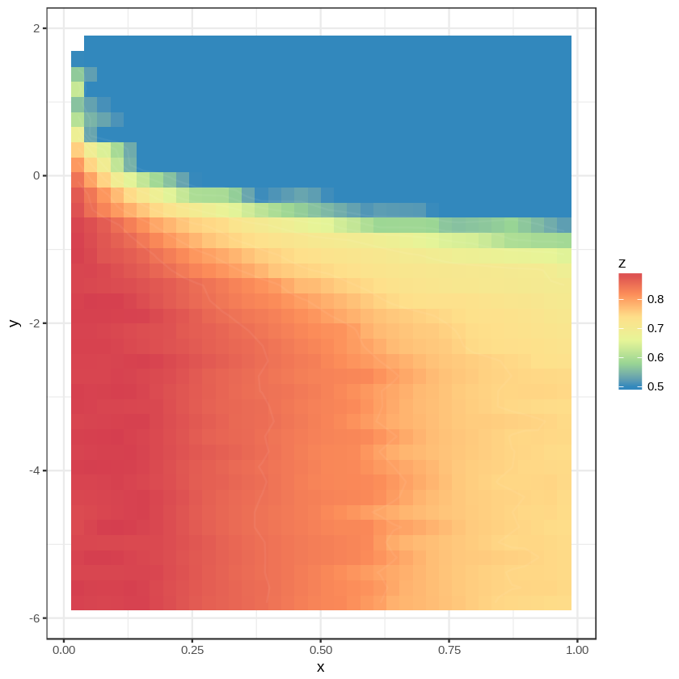


```R
human.expose.Sul.ACS.model = models$glmnet
```


```R
glmnet.Sul.val.ROC = my.roc(human.expose.Sul.ACS.model$pred$early, human.expose.Sul.ACS.model$pred$obs, "early")

pred.Sul.test.prob = predict(human.expose.Sul.ACS.model, newdata = Sul.exprs.test[, colnames(Sul.exprs.test) %in% c(opt.Sul.vars)], type="prob")

glmnet.Sul.test.ROC <- my.roc(pred.Sul.test.prob$early,
                        test.time.period.from.exposure,
                     "early", title="Glmnet ROC")
```

    [1] "This is the AUC:"
    Area under the curve: 0.8871
    [1] "This is the AUC p-value:"
    [1] 8.429174e-13
    [1] "This is the AUC 95% Confidence Interval"
    95% CI: 0.8234-0.9508 (DeLong)
    [1] "This is the AUC:"
    Area under the curve: 0.6548
    [1] "This is the AUC p-value:"
    [1] 0.01431948
    [1] "This is the AUC 95% Confidence Interval"
    95% CI: 0.5237-0.7858 (DeLong)


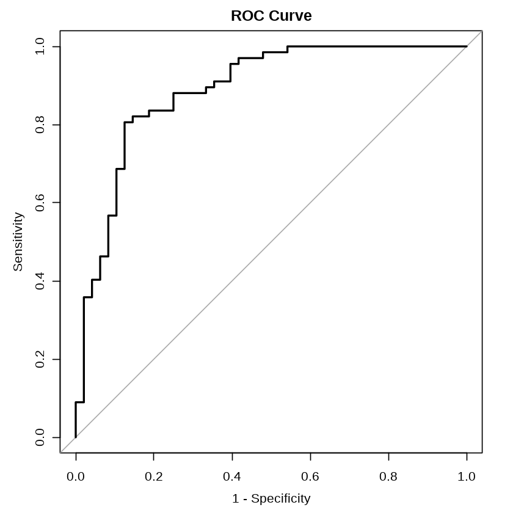


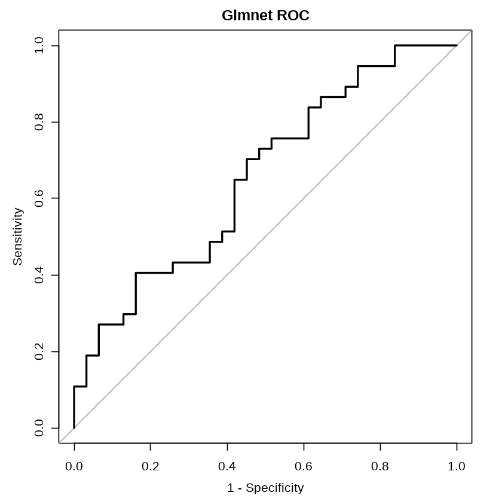


#### Figure 4A


```R
pred.ACS.expose = predict(human.expose.Sul.ACS.model, newdata = ACS.exprs.log[, colnames(ACS.exprs.log) %in% c(opt.Sul.vars)])
       
# Proportion of progressor samples with an early time point prediction
prop.ACS.prog.early = sum(pred.ACS.expose == "early" & ACS.pheno$group == "progressor") / sum(ACS.pheno$group == "progressor")
prop.ACS.prog.early     

# Proportion of control samples with an early time point prediction
prop.ACS.ctrl.early = sum(pred.ACS.expose == "early" & ACS.pheno$group == "control") / sum(ACS.pheno$group == "control")
       
fisher.test(matrix(c(sum(pred.ACS.expose == "early" & ACS.pheno$group == "progressor"), 
             sum(ACS.pheno$group == "progressor") - sum(pred.ACS.expose == "early" & ACS.pheno$group == "progressor"),

             sum(pred.ACS.expose == "early" & ACS.pheno$group == "control"), 
             sum(ACS.pheno$group == "control") - sum(pred.ACS.expose == "early" & ACS.pheno$group == "control")),
             ncol=2))

dis.status = c("Control", "Progressor")
early_prop = c(prop.ACS.ctrl.early, prop.ACS.prog.early)

ACS.exposure.prediction = data.frame(dis.status=as.factor(dis.status),  early_prop=early_prop)


```


0.954545454545455


    
    	Fisher's Exact Test for Count Data
    
    data:  
    p-value = 0.7696
    alternative hypothesis: true odds ratio is not equal to 1
    95 percent confidence interval:
     0.2344173 3.1198867
    sample estimates:
    odds ratio 
     0.8013923 


```R
ACS.exposure.plot = ggplot(ACS.exposure.prediction, aes(x=dis.status, y=early_prop)) + geom_bar(stat="identity")  +
    labs(
        y="Proportion of Samples\nPredicted as Baseline Timepoint") +
ggtitle("Predicted Time Since Exposure", subtitle="in ACS Cohort") + theme(plot.title = element_text(size=12, face="plain", hjust=0.5), 
                                                                              plot.subtitle=element_text(size=11, face="plain", hjust=0.5)) +

geom_signif(comparisons=list(c("Control", "Progressor")),
                               
              annotations = c("p = 1.0"), vjust=-0.4,  
             tip_length=0, y_position=1.075) + theme(panel.background = element_rect(fill = "white", colour = "white", size = 4)) +
      
scale_y_continuous(breaks=c(0.00, 0.25, 0.50, 0.75, 1.00), limits=c(0, 1.15)) +
theme(axis.title.x=element_blank())

ACS.exposure.plot
```


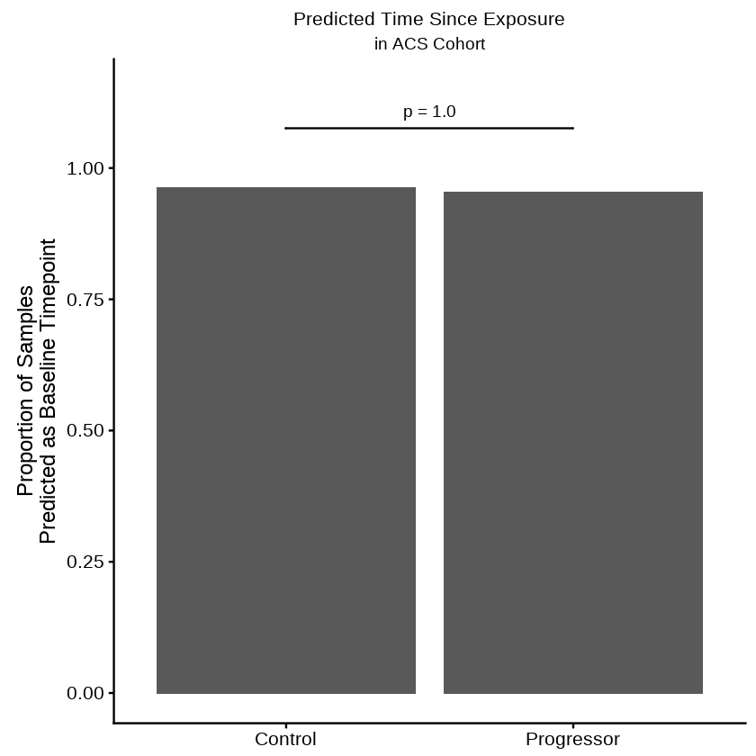


### Reproduce Analysis for Figures 4B-D

- This requires the code from Figure 3 to have been run beforehand

#### Load and co-process the data from the ARCHS4 resource for GC6-74 and Singhania et al 2018

#### To download Singhania et al 2018 data from the ARCHS4 resource:
 - These data are more difficult to extract due to GSE107995 being a multi-series record and not available by direct quiery at  https://amp.pharm.mssm.edu/archs4/data.html
 - We extracted these data from the entire gene expression table of the ARCHS4 resource:
     - Run download_ARCHS4_datatable.sh to download human_matrix.h5 v6 Date: 9/2018. Our analyses should be unchanged if the matrix is updated on the ARCHS4 website.
     - Run code in extract_ARCHS4_Singhania_etal.ipynb
 - The ARCHS4 data for GSE94438 (GC6-74) from Figure 4A are also required


```R
source("utils_submission.R")
```


```R
Sul.path = paste(path, "/data/GSE94438", sep="")

Sul.pheno.set = getGEO(filename=paste(Sul.path, "GSE94438_series_matrix.txt.gz", sep="/"),
             destdir=Sul.path)

Sul.pheno = filter.human.pheno(pData(Sul.pheno.set))

# Common names for progressor
Sul.pheno$group = ifelse(Sul.pheno$group == "Control", "control", "progressor")

Sul.exprs = read.table("data/Suliman_ACS_data_ARCHS4/gene_count_GSE94438.tsv", header=T, row.names=1)
Sul.exprs = filter.HUMAN.exprs(Sul.exprs, Sul.pheno) 
```

    Parsed with column specification:
    cols(
      .default = col_character()
    )
    See spec(...) for full column specifications.
    Using locally cached version of GPL11154 found here:
    ./data/GSE94438/GPL11154.soft 
    Warning message in filter.human.pheno(pData(Sul.pheno.set)):
    “NAs introduced by coercion”Warning message in filter.human.pheno(pData(Sul.pheno.set)):
    “NAs introduced by coercion”Warning message in filter.human.pheno(pData(Sul.pheno.set)):
    “NAs introduced by coercion”

               age code gender group site subjectid time.from.exposure.months
    GSM2475704  NA  672     NA    NA   NA        NA                        NA
    GSM2475705  NA  694     NA    NA   NA        NA                        NA
    GSM2475706  NA  695     NA    NA   NA        NA                        NA
    GSM2475722  NA  994     NA    NA   NA        NA                        NA
    GSM2475742  NA 1061     NA    NA   NA        NA                        NA
    GSM2475748  NA 1194     NA    NA   NA        NA                        NA
               time.to.tb.months
    GSM2475704                NA
    GSM2475705                NA
    GSM2475706                NA
    GSM2475722                NA
    GSM2475742                NA
    GSM2475748                NA
     [1] "GSM2475598" "GSM2475603" "GSM2475587" "GSM2475592" "GSM2475599"
     [6] "GSM2475604" "GSM2475360" "GSM2475387" "GSM2475362" "GSM2475389"
    [11] "GSM2475402" "GSM2475555" "GSM2475361" "GSM2475388" "GSM2475359"
    [16] "GSM2475390" "GSM2475588" "GSM2475593" "GSM2475591" "GSM2475596"
    [21] "GSM2475589" "GSM2475594" "GSM2475590" "GSM2475595" "GSM2475597"
    [26] "GSM2475602" "GSM2475579" "GSM2475601" "GSM2475600" "GSM2475605"
    [31] "GSM2475403" "GSM2475554"
     [1] 128 128 195 195 217 217 284 284 320 320 45  45  562 562 632 632 740 740 744
    [20] 744 746 746 806 806 844 844 897 897 904 904 96  96 
    418 Levels: 1002 1007 1009 1010 1011 1014 1019 1020 1027 1028 1029 1030 ... 1194
    [1] "15"
    [1] Test
    16 Levels:  09/G262 10/G261 2006 2007 2008 2009 F KHHC26 M Not R S ... unmatched
    [1] "72"
    [1] Test
    16 Levels:  09/G262 10/G261 2006 2007 2008 2009 F KHHC26 M Not R S ... unmatched
    [1] "92"
    [1] Test
    16 Levels:  09/G262 10/G261 2006 2007 2008 2009 F KHHC26 M Not R S ... unmatched
    [1] "99"
    [1] Test
    16 Levels:  09/G262 10/G261 2006 2007 2008 2009 F KHHC26 M Not R S ... unmatched
    [1] "358"
    [1] Test
    16 Levels:  09/G262 10/G261 2006 2007 2008 2009 F KHHC26 M Not R S ... unmatched
    [1] "376"
    [1] Test
    16 Levels:  09/G262 10/G261 2006 2007 2008 2009 F KHHC26 M Not R S ... unmatched
    [1] "524"
    [1] Test
    16 Levels:  09/G262 10/G261 2006 2007 2008 2009 F KHHC26 M Not R S ... unmatched
    [1] "729"
    [1] Test
    16 Levels:  09/G262 10/G261 2006 2007 2008 2009 F KHHC26 M Not R S ... unmatched
    [1] "730"
    [1] Test
    16 Levels:  09/G262 10/G261 2006 2007 2008 2009 F KHHC26 M Not R S ... unmatched
    [1] "1066"
    [1] Test
    16 Levels:  09/G262 10/G261 2006 2007 2008 2009 F KHHC26 M Not R S ... unmatched
    [1] "1114"
    [1] Test
    16 Levels:  09/G262 10/G261 2006 2007 2008 2009 F KHHC26 M Not R S ... unmatched
    [1] "1116"
    [1] Test
    16 Levels:  09/G262 10/G261 2006 2007 2008 2009 F KHHC26 M Not R S ... unmatched
    [1] "1231"
    [1] Test
    16 Levels:  09/G262 10/G261 2006 2007 2008 2009 F KHHC26 M Not R S ... unmatched
    [1] "1233"
    [1] Test
    16 Levels:  09/G262 10/G261 2006 2007 2008 2009 F KHHC26 M Not R S ... unmatched
    [1] "5319"
    [1] Test
    16 Levels:  09/G262 10/G261 2006 2007 2008 2009 F KHHC26 M Not R S ... unmatched
    [1] "5358"
    [1] Test
    16 Levels:  09/G262 10/G261 2006 2007 2008 2009 F KHHC26 M Not R S ... unmatched
    [1] "5360"
    [1] Test
    16 Levels:  09/G262 10/G261 2006 2007 2008 2009 F KHHC26 M Not R S ... unmatched
    [1] "5365"
    [1] Test
    16 Levels:  09/G262 10/G261 2006 2007 2008 2009 F KHHC26 M Not R S ... unmatched
    [1] "08/G329"
    [1] Test
    16 Levels:  09/G262 10/G261 2006 2007 2008 2009 F KHHC26 M Not R S ... unmatched
    [1] "08/G568"
    [1] Test
    16 Levels:  09/G262 10/G261 2006 2007 2008 2009 F KHHC26 M Not R S ... unmatched
    [1] "08/G595"
    [1] Test
    16 Levels:  09/G262 10/G261 2006 2007 2008 2009 F KHHC26 M Not R S ... unmatched
    [1] "09/G131"
    [1] Test
    16 Levels:  09/G262 10/G261 2006 2007 2008 2009 F KHHC26 M Not R S ... unmatched
    [1] "09/G168"
    [1] Test
    16 Levels:  09/G262 10/G261 2006 2007 2008 2009 F KHHC26 M Not R S ... unmatched
    [1] "09/G238"
    [1] Test
    16 Levels:  09/G262 10/G261 2006 2007 2008 2009 F KHHC26 M Not R S ... unmatched
    [1] "09/G403"
    [1] Test
    16 Levels:  09/G262 10/G261 2006 2007 2008 2009 F KHHC26 M Not R S ... unmatched
    [1] "ARHHC16"
    [1] Test
    16 Levels:  09/G262 10/G261 2006 2007 2008 2009 F KHHC26 M Not R S ... unmatched
    [1] "DZHHC38"
    [1] Test
    16 Levels:  09/G262 10/G261 2006 2007 2008 2009 F KHHC26 M Not R S ... unmatched
    [1] "DZHHC84"
    [1] Test
    16 Levels:  09/G262 10/G261 2006 2007 2008 2009 F KHHC26 M Not R S ... unmatched
    [1] "KAZHHC50"
    [1] Test
    16 Levels:  09/G262 10/G261 2006 2007 2008 2009 F KHHC26 M Not R S ... unmatched
    [1] "KFHHC15"
    [1] Test
    16 Levels:  09/G262 10/G261 2006 2007 2008 2009 F KHHC26 M Not R S ... unmatched
    [1] "KHHC04"
    [1] Test
    16 Levels:  09/G262 10/G261 2006 2007 2008 2009 F KHHC26 M Not R S ... unmatched
    [1] "KHHC32"
    [1] Test
    16 Levels:  09/G262 10/G261 2006 2007 2008 2009 F KHHC26 M Not R S ... unmatched
    [1] "KHHC36"
    [1] Test
    16 Levels:  09/G262 10/G261 2006 2007 2008 2009 F KHHC26 M Not R S ... unmatched
    [1] "KHHC41"
    [1] Test
    16 Levels:  09/G262 10/G261 2006 2007 2008 2009 F KHHC26 M Not R S ... unmatched
    [1] "LDHHC18"
    [1] Test
    16 Levels:  09/G262 10/G261 2006 2007 2008 2009 F KHHC26 M Not R S ... unmatched
    [1] "MESHHC04"
    [1] Test
    16 Levels:  09/G262 10/G261 2006 2007 2008 2009 F KHHC26 M Not R S ... unmatched
    [1] "TEKHHC10"
    [1] Test
    84 Levels:  07/G123 07/G225 07/G437 07/G438 07/G468 08/G245 08/G249 ... W23HHC132
    [1] "TEKHHC74"
    [1] Test
    16 Levels:  09/G262 10/G261 2006 2007 2008 2009 F KHHC26 M Not R S ... unmatched
    [1] "W23HHC15"
    [1] Test
    16 Levels:  09/G262 10/G261 2006 2007 2008 2009 F KHHC26 M Not R S ... unmatched
    [1] "W23HHC21"
    [1] Test
    16 Levels:  09/G262 10/G261 2006 2007 2008 2009 F KHHC26 M Not R S ... unmatched
    [1] "W23HHC29"
    [1] Test
    84 Levels:  07/G123 07/G225 07/G437 07/G438 07/G468 08/G245 08/G249 ... W23HHC132
    [1] "W23HHC61"
    [1] Test
    16 Levels:  09/G262 10/G261 2006 2007 2008 2009 F KHHC26 M Not R S ... unmatched
    [1] "1115"
    [1] Test
    21 Levels:  10 11 14 15 18 19 2008 2010 21 23 24 5 6 7 8 9 characterists ... Training
    [1] "10/G289"
    [1] Test
    Levels:  19 21 22 24 failed for QC Test Training
    [1] "DZHHC96"
    [1] Test
    21 Levels:  10 11 14 15 18 19 2008 2010 21 23 24 5 6 7 8 9 characterists ... Training
    [1] "Subjects not assigned a training-test set that are now training"
    
     09/G455  09/G476  LDHHC10 91420103 91451104    92245 
           2        2        1        1        1        1 
    [1] "about to return new data frame"
    [1] "Identical column and rownames between exprs and pheno tables?"
    [1] TRUE


```R
Garra.path = paste(path, "/data/GSE107995", sep="")
Garra.pheno.set = getGEO(filename=paste(Garra.path, "GSE107995_series_matrix.txt.gz", sep="/"),
             destdir=Garra.path)

Garra.pheno = filter.Garra.pheno(pData(Garra.pheno.set))
```

    Parsed with column specification:
    cols(
      .default = col_character()
    )
    See spec(...) for full column specifications.
    Using locally cached version of GPL20301 found here:
    ./data/GSE107995/GPL20301.soft 
    Warning message in filter.Garra.pheno(pData(Garra.pheno.set)):
    “NAs introduced by coercion”

                       title    
     Berry_London_Sample1 :  1  
     Berry_London_Sample10:  1  
     Berry_London_Sample11:  1  
     Berry_London_Sample12:  1  
     Berry_London_Sample13:  1  
     Berry_London_Sample14:  1  
     (Other)              :408  
                                         source_name_ch1 age_at_baseline_visit
     Longitudnal_Leicester_Control_Non_progressor:69     Min.   :16.00        
     Longitudnal_Leicester_LTBI_Non_progressor   :69     1st Qu.:30.00        
     Leicester_Active_TB                         :53     Median :39.00        
     Leicester_Control                           :50     Mean   :39.21        
     Leicester_LTBI                              :49     3rd Qu.:46.00        
     Berry_SouthAfrica_Validation_set_LTBI       :31     Max.   :84.00        
     (Other)                                     :93     NA's   :101          
           birth_place                    ethnicity    gender   
     Foreign_Born:263   South_Asia_ISC         :198   F   :111  
     UK_Born     : 50   British_Indian         : 29   M   :202  
     NA's        :101   British                : 21   NA's:101  
                        East_African_Kenya     : 13             
                        Central_Asia_Afganistan:  8             
                        (Other)                : 44             
                        NA's                   :101             
                 group     outlier         patient_id    smear_result
     Active_TB      : 90   No :364   Patient_035:  8   Negative:208  
     Control        :131   Yes: 50   Patient_012:  7   Positive:105  
     LTBI           :170             Patient_039:  7   NA's    :101  
     LTBI_Progressor: 23             Patient_040:  7                 
                                     Patient_047:  7                 
                                     Patient_103:  7                 
                                     (Other)    :371                 
                  tb_disease_type timepoint_months uk_arrival_year
     Contact_Non-Pulmonary:125    Baseline:191     Min.   :1961   
     Contact_Pulmonary    :135    1.1-2.0 : 27     1st Qu.:2000   
     Non-Pulmonary        : 10    3.1-4.0 : 22     Median :2008   
     Pulmonary            : 43    0.6-1.0 : 16     Mean   :2004   
     NA's                 :101    4.1-5.0 : 12     3rd Qu.:2012   
                                  (Other) : 45     Max.   :2016   
                                  NA's    :101     NA's   :151    
      visit_date        time.since.exposure.days
     Length:414         Min.   :-24.00          
     Class :character   1st Qu.:  0.00          
     Mode  :character   Median :  0.00          
                        Mean   : 45.11          
                        3rd Qu.: 76.00          
                        Max.   :412.00          
                        NA's   :104             


```R
dim(Garra.pheno)
```


<ol class=list-inline>
	<li>414</li>
	<li>15</li>
</ol>


```R
Garra.exprs = read.table(paste(Garra.path, "Singhania_et_al_expression_ARCHS4.csv", sep="/"), header=T, row.names=1, sep=",")
```


```R
dim(Garra.exprs)
```


<ol class=list-inline>
	<li>35238</li>
	<li>414</li>
</ol>


```R
all.exprs = cbind(Garra.exprs, Sul.exprs)
dim(all.exprs)
```


<ol class=list-inline>
	<li>35238</li>
	<li>829</li>
</ol>


```R
# Filter out genes whose counts are <= 5 in 50% of samples
exprs.j.keep = apply(all.exprs <= 5, 1, mean) <= 0.5

exprs.fil = all.exprs[exprs.j.keep,]

exprs.qn = as.data.frame(normalize.quantiles(as.matrix(exprs.fil)))
colnames(exprs.qn) = colnames(exprs.fil)
rownames(exprs.qn) = rownames(exprs.fil)
exprs.log = log2(exprs.qn + 1)


boxplot(log2(all.exprs+ 1), ylim=c(4,14))
boxplot(log2(exprs.fil+ 1), ylim=c(4,14))
boxplot(log2(exprs.qn+ 1), ylim=c(4,14))

```


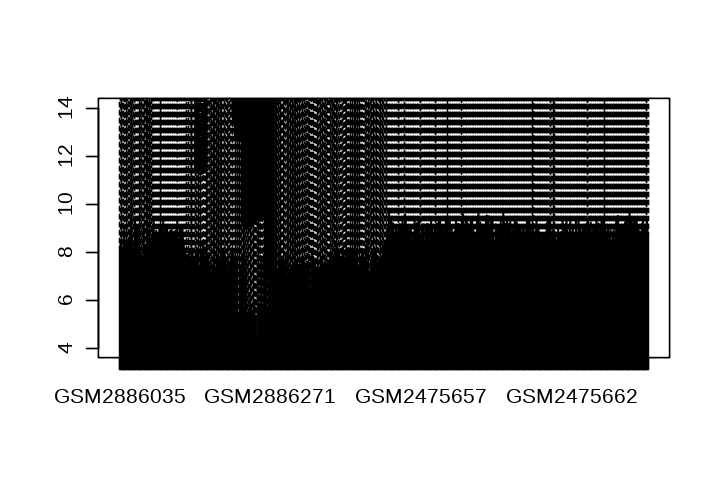


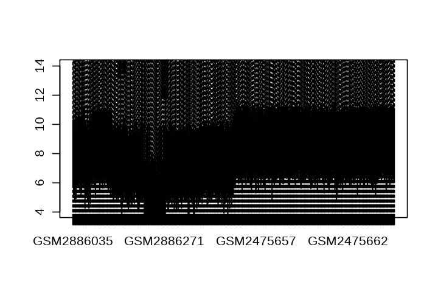


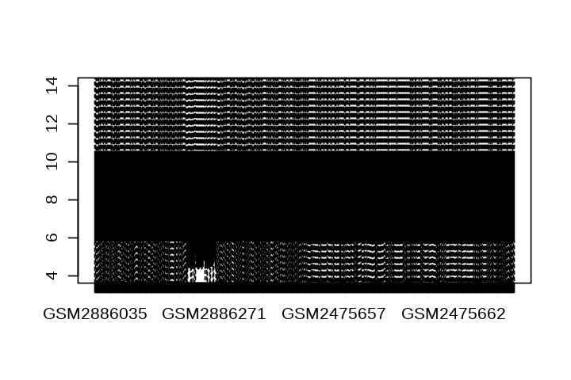


```R
Garra.exprs.log = exprs.log[, colnames(exprs.log) %in% row.names(Garra.pheno)]
Sul.exprs.log = exprs.log[, colnames(exprs.log) %in% row.names(Sul.pheno)]

identical(colnames(Garra.exprs.log), row.names(Garra.pheno))
```


TRUE


#### Repeat process of Figure 3B to build a model from GC6-74 data to predict time since TB exposure


```R
Sul.pheno.6mo = Sul.pheno

# Randomly sample 50% of AHRI site to training set and test set for this new Sul.pheno

AHRI.subj = unique(dplyr::filter(Sul.pheno, site == "AHRI")$subjectid)
set.seed(100)
AHRI.subj.train = sample(AHRI.subj, length(AHRI.subj) / 2)
Sul.pheno.6mo$dataset[Sul.pheno.6mo$subjectid %in% AHRI.subj.train] = "Training"


# dplyr::filter pheno and expression table to include only AHRI and MRC sites and to include only 0 and 6 month time points

Sul.pheno.6mo = droplevels(Sul.pheno.6mo[Sul.pheno.6mo$site %in% c("AHRI", "MRC") & Sul.pheno.6mo$time.from.exposure.months %in% c(0, 6),])

Sul.exprs.log.6mo = Sul.exprs.log[, colnames(Sul.exprs.log) %in% row.names(Sul.pheno.6mo)]

Sul.pheno.6mo.train = droplevels(Sul.pheno.6mo[ Sul.pheno.6mo$dataset == "Training",])
Sul.pheno.6mo.test = droplevels(Sul.pheno.6mo[ Sul.pheno.6mo$dataset != "Training",])

Sul.exprs.train = t(Sul.exprs.log.6mo[,row.names(Sul.pheno.6mo.train)])
Sul.exprs.test = t(Sul.exprs.log.6mo[, row.names(Sul.pheno.6mo.test)])

set.seed(100)
folds.6mo = groupKFold(Sul.pheno.6mo.train$subjectid, k=10)
for (fold in lapply(folds.6mo, function(x) {Sul.pheno.6mo.train$subjectid[x]}))
    print(length((as.character(fold))))

lapply(folds.6mo, function(x, y) table(y[x]), y = Sul.pheno.6mo.train$subjectid)

time.period.from.exposure = as.factor(ifelse(Sul.pheno.6mo.train$time.from.exposure.months == "0", "early", "late"))
test.time.period.from.exposure = as.factor(ifelse(Sul.pheno.6mo.test$time.from.exposure.months == "0", "early", "late"))
```

    [1] 112
    [1] 107
    [1] 98
    [1] 99
    [1] 101
    [1] 103
    [1] 102
    [1] 103
    [1] 105
    [1] 105


    $Fold01
    
      07/G189   07/G274   07/G277   07/G300   07/G351   07/G354   07/G368   07/G370 
            1         1         1         0         1         1         1         1 
      07/G419   08/G136   08/G141   08/G160   08/G245   08/G260   08/G324   08/G333 
            1         1         1         1         1         2         2         1 
      08/G343   08/G367   08/G400   08/G407   08/G415   08/G423   08/G424   08/G433 
            1         2         1         1         1         1         1         2 
      08/G493   08/G494   08/G541   08/G587   08/G596   08/G606   08/G613   08/G643 
            1         1         1         1         1         1         1         1 
      08/G652   08/G654   08/G695   08/G701   08/G703   08/G714   08/G715   08/G726 
            2         1         1         1         2         1         1         1 
      08/G782   08/G788   08/G797   08/G800   08/G810   08/G814   08/G893   09/G120 
            1         1         2         1         1         1         1         1 
      09/G133   09/G135   09/G179   09/G188   09/G196   09/G202   09/G204   09/G223 
            1         1         1         2         1         2         2         2 
      09/G224   09/G228   09/G247   09/G367   09/G371   09/G377   09/G388   09/G389 
            1         1         1         2         2         1         1         1 
      09/G390   09/G435   09/G442   09/G445   09/G455   09/G476   09/G477   09/G497 
            1         1         1         1         2         2         2         1 
      09/G524   10/G139   10/G178   10/G215   10/G407   DZHHC26   DZHHC69   KFHHC21 
            1         1         1         2         1         1         2         0 
       KHHC05   KHHC121   KHHC151    KHHC26   MOHHC04   MOHHC21  TEKHHC04 TEKHHC105 
            1         1         2         2         0         2         1         1 
     W23HHC03  W23HHC04  W23HHC08 W23HHC132  W23HHC58  W23HHC78 
            1         1         1         1         1         1 
    
    $Fold02
    
      07/G189   07/G274   07/G277   07/G300   07/G351   07/G354   07/G368   07/G370 
            1         1         1         1         1         1         1         1 
      07/G419   08/G136   08/G141   08/G160   08/G245   08/G260   08/G324   08/G333 
            1         0         1         1         1         2         2         1 
      08/G343   08/G367   08/G400   08/G407   08/G415   08/G423   08/G424   08/G433 
            1         2         1         1         1         1         1         2 
      08/G493   08/G494   08/G541   08/G587   08/G596   08/G606   08/G613   08/G643 
            1         0         1         1         1         1         1         1 
      08/G652   08/G654   08/G695   08/G701   08/G703   08/G714   08/G715   08/G726 
            2         1         1         1         0         1         1         0 
      08/G782   08/G788   08/G797   08/G800   08/G810   08/G814   08/G893   09/G120 
            1         1         2         1         1         1         1         1 
      09/G133   09/G135   09/G179   09/G188   09/G196   09/G202   09/G204   09/G223 
            1         1         1         0         1         2         2         2 
      09/G224   09/G228   09/G247   09/G367   09/G371   09/G377   09/G388   09/G389 
            0         1         1         2         2         1         1         1 
      09/G390   09/G435   09/G442   09/G445   09/G455   09/G476   09/G477   09/G497 
            1         1         1         1         2         2         2         1 
      09/G524   10/G139   10/G178   10/G215   10/G407   DZHHC26   DZHHC69   KFHHC21 
            1         1         1         2         1         1         2         1 
       KHHC05   KHHC121   KHHC151    KHHC26   MOHHC04   MOHHC21  TEKHHC04 TEKHHC105 
            1         1         2         2         1         2         1         1 
     W23HHC03  W23HHC04  W23HHC08 W23HHC132  W23HHC58  W23HHC78 
            1         1         1         1         1         1 
    
    $Fold03
    
      07/G189   07/G274   07/G277   07/G300   07/G351   07/G354   07/G368   07/G370 
            1         0         1         1         1         1         1         1 
      07/G419   08/G136   08/G141   08/G160   08/G245   08/G260   08/G324   08/G333 
            1         1         1         1         0         2         2         1 
      08/G343   08/G367   08/G400   08/G407   08/G415   08/G423   08/G424   08/G433 
            0         2         1         1         1         1         1         2 
      08/G493   08/G494   08/G541   08/G587   08/G596   08/G606   08/G613   08/G643 
            1         1         1         1         1         0         1         1 
      08/G652   08/G654   08/G695   08/G701   08/G703   08/G714   08/G715   08/G726 
            2         1         1         1         2         1         1         1 
      08/G782   08/G788   08/G797   08/G800   08/G810   08/G814   08/G893   09/G120 
            1         1         2         1         1         1         1         1 
      09/G133   09/G135   09/G179   09/G188   09/G196   09/G202   09/G204   09/G223 
            0         1         1         2         0         0         2         0 
      09/G224   09/G228   09/G247   09/G367   09/G371   09/G377   09/G388   09/G389 
            1         0         1         0         2         1         1         1 
      09/G390   09/G435   09/G442   09/G445   09/G455   09/G476   09/G477   09/G497 
            1         1         1         1         0         2         2         1 
      09/G524   10/G139   10/G178   10/G215   10/G407   DZHHC26   DZHHC69   KFHHC21 
            1         1         1         2         1         1         2         1 
       KHHC05   KHHC121   KHHC151    KHHC26   MOHHC04   MOHHC21  TEKHHC04 TEKHHC105 
            1         1         2         2         1         2         1         0 
     W23HHC03  W23HHC04  W23HHC08 W23HHC132  W23HHC58  W23HHC78 
            1         1         1         0         1         1 
    
    $Fold04
    
      07/G189   07/G274   07/G277   07/G300   07/G351   07/G354   07/G368   07/G370 
            0         1         1         1         1         1         1         0 
      07/G419   08/G136   08/G141   08/G160   08/G245   08/G260   08/G324   08/G333 
            1         1         1         1         1         0         2         1 
      08/G343   08/G367   08/G400   08/G407   08/G415   08/G423   08/G424   08/G433 
            1         0         0         1         1         1         1         2 
      08/G493   08/G494   08/G541   08/G587   08/G596   08/G606   08/G613   08/G643 
            1         1         1         1         1         1         1         1 
      08/G652   08/G654   08/G695   08/G701   08/G703   08/G714   08/G715   08/G726 
            0         1         1         1         2         1         1         1 
      08/G782   08/G788   08/G797   08/G800   08/G810   08/G814   08/G893   09/G120 
            0         1         2         1         1         1         1         1 
      09/G133   09/G135   09/G179   09/G188   09/G196   09/G202   09/G204   09/G223 
            1         0         0         2         1         2         2         2 
      09/G224   09/G228   09/G247   09/G367   09/G371   09/G377   09/G388   09/G389 
            1         1         1         2         2         1         1         1 
      09/G390   09/G435   09/G442   09/G445   09/G455   09/G476   09/G477   09/G497 
            1         0         1         1         2         2         2         0 
      09/G524   10/G139   10/G178   10/G215   10/G407   DZHHC26   DZHHC69   KFHHC21 
            1         1         1         2         1         1         2         1 
       KHHC05   KHHC121   KHHC151    KHHC26   MOHHC04   MOHHC21  TEKHHC04 TEKHHC105 
            1         1         2         2         1         2         1         1 
     W23HHC03  W23HHC04  W23HHC08 W23HHC132  W23HHC58  W23HHC78 
            0         1         1         1         0         1 
    
    $Fold05
    
      07/G189   07/G274   07/G277   07/G300   07/G351   07/G354   07/G368   07/G370 
            1         1         1         1         0         0         1         1 
      07/G419   08/G136   08/G141   08/G160   08/G245   08/G260   08/G324   08/G333 
            1         1         1         1         1         2         2         1 
      08/G343   08/G367   08/G400   08/G407   08/G415   08/G423   08/G424   08/G433 
            1         2         1         1         1         1         1         2 
      08/G493   08/G494   08/G541   08/G587   08/G596   08/G606   08/G613   08/G643 
            0         1         1         1         1         1         0         1 
      08/G652   08/G654   08/G695   08/G701   08/G703   08/G714   08/G715   08/G726 
            2         1         1         1         2         1         1         1 
      08/G782   08/G788   08/G797   08/G800   08/G810   08/G814   08/G893   09/G120 
            1         1         2         1         1         0         1         1 
      09/G133   09/G135   09/G179   09/G188   09/G196   09/G202   09/G204   09/G223 
            1         1         1         2         1         2         2         2 
      09/G224   09/G228   09/G247   09/G367   09/G371   09/G377   09/G388   09/G389 
            1         1         1         2         0         1         1         1 
      09/G390   09/G435   09/G442   09/G445   09/G455   09/G476   09/G477   09/G497 
            0         1         0         0         2         2         0         1 
      09/G524   10/G139   10/G178   10/G215   10/G407   DZHHC26   DZHHC69   KFHHC21 
            1         1         1         2         1         1         2         1 
       KHHC05   KHHC121   KHHC151    KHHC26   MOHHC04   MOHHC21  TEKHHC04 TEKHHC105 
            0         1         2         2         1         2         1         1 
     W23HHC03  W23HHC04  W23HHC08 W23HHC132  W23HHC58  W23HHC78 
            1         1         1         1         1         0 
    
    $Fold06
    
      07/G189   07/G274   07/G277   07/G300   07/G351   07/G354   07/G368   07/G370 
            1         1         0         1         1         1         1         1 
      07/G419   08/G136   08/G141   08/G160   08/G245   08/G260   08/G324   08/G333 
            0         1         1         1         1         2         2         1 
      08/G343   08/G367   08/G400   08/G407   08/G415   08/G423   08/G424   08/G433 
            1         2         1         1         0         1         0         2 
      08/G493   08/G494   08/G541   08/G587   08/G596   08/G606   08/G613   08/G643 
            1         1         1         1         0         1         1         1 
      08/G652   08/G654   08/G695   08/G701   08/G703   08/G714   08/G715   08/G726 
            2         1         1         1         2         1         1         1 
      08/G782   08/G788   08/G797   08/G800   08/G810   08/G814   08/G893   09/G120 
            1         1         2         1         1         1         1         1 
      09/G133   09/G135   09/G179   09/G188   09/G196   09/G202   09/G204   09/G223 
            1         1         1         2         1         2         0         2 
      09/G224   09/G228   09/G247   09/G367   09/G371   09/G377   09/G388   09/G389 
            1         1         0         2         2         1         1         1 
      09/G390   09/G435   09/G442   09/G445   09/G455   09/G476   09/G477   09/G497 
            1         1         1         1         2         2         2         1 
      09/G524   10/G139   10/G178   10/G215   10/G407   DZHHC26   DZHHC69   KFHHC21 
            0         1         1         2         1         1         2         1 
       KHHC05   KHHC121   KHHC151    KHHC26   MOHHC04   MOHHC21  TEKHHC04 TEKHHC105 
            1         0         2         2         1         0         1         1 
     W23HHC03  W23HHC04  W23HHC08 W23HHC132  W23HHC58  W23HHC78 
            1         1         1         1         1         1 
    
    $Fold07
    
      07/G189   07/G274   07/G277   07/G300   07/G351   07/G354   07/G368   07/G370 
            1         1         1         1         1         1         1         1 
      07/G419   08/G136   08/G141   08/G160   08/G245   08/G260   08/G324   08/G333 
            1         1         0         1         1         2         2         0 
      08/G343   08/G367   08/G400   08/G407   08/G415   08/G423   08/G424   08/G433 
            1         2         1         0         1         1         1         2 
      08/G493   08/G494   08/G541   08/G587   08/G596   08/G606   08/G613   08/G643 
            1         1         1         1         1         1         1         1 
      08/G652   08/G654   08/G695   08/G701   08/G703   08/G714   08/G715   08/G726 
            2         1         0         1         2         0         1         1 
      08/G782   08/G788   08/G797   08/G800   08/G810   08/G814   08/G893   09/G120 
            1         1         2         1         0         1         1         1 
      09/G133   09/G135   09/G179   09/G188   09/G196   09/G202   09/G204   09/G223 
            1         1         1         2         1         2         2         2 
      09/G224   09/G228   09/G247   09/G367   09/G371   09/G377   09/G388   09/G389 
            1         1         1         2         2         0         1         0 
      09/G390   09/G435   09/G442   09/G445   09/G455   09/G476   09/G477   09/G497 
            1         1         1         1         2         0         2         1 
      09/G524   10/G139   10/G178   10/G215   10/G407   DZHHC26   DZHHC69   KFHHC21 
            1         1         0         0         1         1         2         1 
       KHHC05   KHHC121   KHHC151    KHHC26   MOHHC04   MOHHC21  TEKHHC04 TEKHHC105 
            1         1         2         2         1         2         1         1 
     W23HHC03  W23HHC04  W23HHC08 W23HHC132  W23HHC58  W23HHC78 
            1         1         1         1         1         1 
    
    $Fold08
    
      07/G189   07/G274   07/G277   07/G300   07/G351   07/G354   07/G368   07/G370 
            1         1         1         1         1         1         1         1 
      07/G419   08/G136   08/G141   08/G160   08/G245   08/G260   08/G324   08/G333 
            1         1         1         1         1         2         0         1 
      08/G343   08/G367   08/G400   08/G407   08/G415   08/G423   08/G424   08/G433 
            1         2         1         1         1         0         1         0 
      08/G493   08/G494   08/G541   08/G587   08/G596   08/G606   08/G613   08/G643 
            1         1         0         1         1         1         1         1 
      08/G652   08/G654   08/G695   08/G701   08/G703   08/G714   08/G715   08/G726 
            2         1         1         1         2         1         1         1 
      08/G782   08/G788   08/G797   08/G800   08/G810   08/G814   08/G893   09/G120 
            1         1         0         1         1         1         0         1 
      09/G133   09/G135   09/G179   09/G188   09/G196   09/G202   09/G204   09/G223 
            1         1         1         2         1         2         2         2 
      09/G224   09/G228   09/G247   09/G367   09/G371   09/G377   09/G388   09/G389 
            1         1         1         2         2         1         1         1 
      09/G390   09/G435   09/G442   09/G445   09/G455   09/G476   09/G477   09/G497 
            1         1         1         1         2         2         2         1 
      09/G524   10/G139   10/G178   10/G215   10/G407   DZHHC26   DZHHC69   KFHHC21 
            1         1         1         2         1         0         2         1 
       KHHC05   KHHC121   KHHC151    KHHC26   MOHHC04   MOHHC21  TEKHHC04 TEKHHC105 
            1         1         2         2         1         2         0         1 
     W23HHC03  W23HHC04  W23HHC08 W23HHC132  W23HHC58  W23HHC78 
            1         0         1         1         1         1 
    
    $Fold09
    
      07/G189   07/G274   07/G277   07/G300   07/G351   07/G354   07/G368   07/G370 
            1         1         1         1         1         1         0         1 
      07/G419   08/G136   08/G141   08/G160   08/G245   08/G260   08/G324   08/G333 
            1         1         1         0         1         2         2         1 
      08/G343   08/G367   08/G400   08/G407   08/G415   08/G423   08/G424   08/G433 
            1         2         1         1         1         1         1         2 
      08/G493   08/G494   08/G541   08/G587   08/G596   08/G606   08/G613   08/G643 
            1         1         1         0         1         1         1         1 
      08/G652   08/G654   08/G695   08/G701   08/G703   08/G714   08/G715   08/G726 
            2         1         1         0         2         1         1         1 
      08/G782   08/G788   08/G797   08/G800   08/G810   08/G814   08/G893   09/G120 
            1         0         2         0         1         1         1         0 
      09/G133   09/G135   09/G179   09/G188   09/G196   09/G202   09/G204   09/G223 
            1         1         1         2         1         2         2         2 
      09/G224   09/G228   09/G247   09/G367   09/G371   09/G377   09/G388   09/G389 
            1         1         1         2         2         1         1         1 
      09/G390   09/G435   09/G442   09/G445   09/G455   09/G476   09/G477   09/G497 
            1         1         1         1         2         2         2         1 
      09/G524   10/G139   10/G178   10/G215   10/G407   DZHHC26   DZHHC69   KFHHC21 
            1         1         1         2         0         1         0         1 
       KHHC05   KHHC121   KHHC151    KHHC26   MOHHC04   MOHHC21  TEKHHC04 TEKHHC105 
            1         1         2         2         1         2         1         1 
     W23HHC03  W23HHC04  W23HHC08 W23HHC132  W23HHC58  W23HHC78 
            1         1         1         1         1         1 
    
    $Fold10
    
      07/G189   07/G274   07/G277   07/G300   07/G351   07/G354   07/G368   07/G370 
            1         1         1         1         1         1         1         1 
      07/G419   08/G136   08/G141   08/G160   08/G245   08/G260   08/G324   08/G333 
            1         1         1         1         1         2         2         1 
      08/G343   08/G367   08/G400   08/G407   08/G415   08/G423   08/G424   08/G433 
            1         2         1         1         1         1         1         2 
      08/G493   08/G494   08/G541   08/G587   08/G596   08/G606   08/G613   08/G643 
            1         1         1         1         1         1         1         0 
      08/G652   08/G654   08/G695   08/G701   08/G703   08/G714   08/G715   08/G726 
            2         0         1         1         2         1         0         1 
      08/G782   08/G788   08/G797   08/G800   08/G810   08/G814   08/G893   09/G120 
            1         1         2         1         1         1         1         1 
      09/G133   09/G135   09/G179   09/G188   09/G196   09/G202   09/G204   09/G223 
            1         1         1         2         1         2         2         2 
      09/G224   09/G228   09/G247   09/G367   09/G371   09/G377   09/G388   09/G389 
            1         1         1         2         2         1         0         1 
      09/G390   09/G435   09/G442   09/G445   09/G455   09/G476   09/G477   09/G497 
            1         1         1         1         2         2         2         1 
      09/G524   10/G139   10/G178   10/G215   10/G407   DZHHC26   DZHHC69   KFHHC21 
            1         0         1         2         1         1         2         1 
       KHHC05   KHHC121   KHHC151    KHHC26   MOHHC04   MOHHC21  TEKHHC04 TEKHHC105 
            1         1         0         0         1         2         1         1 
     W23HHC03  W23HHC04  W23HHC08 W23HHC132  W23HHC58  W23HHC78 
            1         1         0         1         1         1 


```R
start_time <- Sys.time()

cluster = makeCluster(detectCores()-3) # Leaving 3 for other jobs
registerDoParallel(cluster)

print("Made the clusters")

myFunc <- caretSBF
myFunc$summary <- twoClassSummary
myFunc$score <- function(x, y) {
  out <- wilcox.test(x ~ y)$p.value # Will have warnings due to ties; ignore for now.
  out
}

filtercontrol.lm = sbfControl(functions = myFunc, method = "cv",  index=folds.6mo,  allowParallel=TRUE) 
set.seed(10)
wilcoxWithFilter.lm = sbf(Sul.exprs.train, as.factor(Sul.pheno.6mo.train$time.from.exposure.months), sbfControl = filtercontrol.lm)

print("Did the feature selection")
stopCluster(cluster)
registerDoSEQ()


end_time <- Sys.time()
print(end_time - start_time)
```

    [1] "Made the clusters"
    [1] "Did the feature selection"
    Time difference of 11.56077 mins


```R
opt.Sul.Garra.vars = wilcoxWithFilter.lm$optVariables
```


```R
set.seed(100)

n = 1000
lambda.grid = c(10 ^ runif(n, min = log10(1e-6), max = log10(1e2)))

alpha.grid = runif(length(lambda.grid), min = 0.00, 1.00)

train.grid = data.frame(lambda = sample(lambda.grid, length(lambda.grid)),
                       alpha = sample(alpha.grid, length(lambda.grid)))
```


```R
seed=7

start_time <- Sys.time()

cluster = makeCluster(detectCores()-3) # Leaving 3 for other jobs
registerDoParallel(cluster)

methods = c("glmnet")

models = list()


control <- trainControl(method="cv", index=folds.6mo, savePredictions = 'final', allowParallel=TRUE,
                       classProbs=TRUE, summaryFunction=twoClassSummary) # Use AUC to pick the best model

for (alg in methods) {
    set.seed(seed)
    print("I have gotten to model:")
    print(alg)
    model = train(Sul.exprs.train[, colnames(Sul.exprs.train) %in% c(opt.Sul.Garra.vars)],
                  time.period.from.exposure,
                  method=alg, tuneGrid = train.grid, trControl=control,
                 metric="ROC")
    models[[alg]] = model
}


stopCluster(cluster)
registerDoSEQ()

end_time <- Sys.time()
print(end_time - start_time)
```

    [1] "I have gotten to model:"
    [1] "glmnet"


    Warning message in nominalTrainWorkflow(x = x, y = y, wts = weights, info = trainInfo, :
    “There were missing values in resampled performance measures.”

    Time difference of 1.947424 mins


```R
glmres = models$glmnet$results
graph.hyper (x=glmres$alpha, y=log10(glmres$lambda), z=glmres$ROC)
```


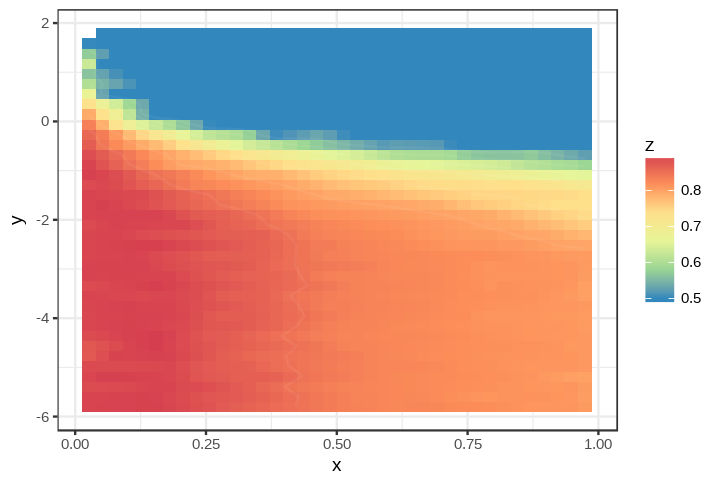


```R
human.expose.Sul.Garra.model = models$glmnet

glmnet.Sul.val.ROC = my.roc(human.expose.Sul.Garra.model$pred$early, human.expose.Sul.Garra.model$pred$obs, "early")

pred.Sul.test.prob = predict(human.expose.Sul.Garra.model, newdata = Sul.exprs.test[, colnames(Sul.exprs.test) %in% c(opt.Sul.Garra.vars)], type="prob")

glmnet.Sul.test.ROC <- my.roc(pred.Sul.test.prob$early,
                        test.time.period.from.exposure,
                     "early", title="Glmnet ROC")
```

    [1] "This is the AUC:"
    Area under the curve: 0.8831
    [1] "This is the AUC p-value:"
    [1] 1.428919e-12
    [1] "This is the AUC 95% Confidence Interval"
    95% CI: 0.8185-0.9477 (DeLong)
    [1] "This is the AUC:"
    Area under the curve: 0.6565
    [1] "This is the AUC p-value:"
    [1] 0.01342422
    [1] "This is the AUC 95% Confidence Interval"
    95% CI: 0.5255-0.7875 (DeLong)


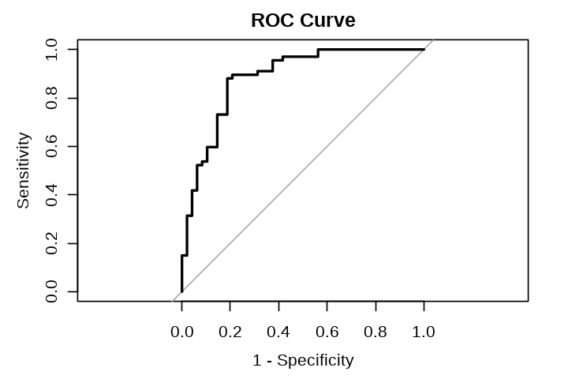


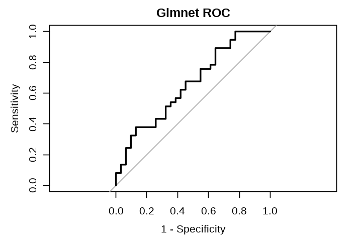


#### Load 18 month time points from GC6-74 cohort
- Requires results from Figure 3B


```R
# This is the GC6-74 data processed only by itself, from Figure 3B
dim(human.exprs.log)
```


<ol class=list-inline>
	<li>14842</li>
	<li>415</li>
</ol>


```R
human.pheno.gam.eth = human.pheno
human.pheno.gam.eth.18mo = droplevels(dplyr::filter(human.pheno.gam.eth, site %in% c("AHRI", "MRC"), time.from.exposure.months %in% c(18)))
human.exprs.log.gam.eth.18mo = human.exprs.log[, colnames(human.exprs.log) %in% human.pheno.gam.eth.18mo$code]
human.exprs.log.gam.eth.18mo = t(human.exprs.log.gam.eth.18mo)

human.pheno.sun = human.pheno
human.pheno.sun.18mo = droplevels(dplyr::filter(human.pheno.sun, site %in% c("SUN"), time.from.exposure.months %in% c(18)))
human.exprs.log.sun.18mo = human.exprs.log[, colnames(human.exprs.log) %in% human.pheno.sun.18mo$code]
human.exprs.log.sun.18mo = t(human.exprs.log.sun.18mo)

table(human.pheno.gam.eth.18mo$time.from.exposure.months)
table(human.pheno.sun.18mo$time.from.exposure.months)
```


    
    18 
    34 


    
    18 
    30 


#### Use GC6-74 0 vs 6 months post-exposure model to predict time since exposure in GC6-74 18 month time points and in the Singhania et al cohorts


```R
# optvars are the Wilcox filtered genes from Figure 3B
pred.human.exposure.gam.eth.18mo = predict(human.exposure.model, newdata = human.exprs.log.gam.eth.18mo[, colnames(human.exprs.log.gam.eth.18mo) %in% c(optvars)])
pred.human.exposure.sun.18mo = predict(human.exposure.model, newdata = human.exprs.log.sun.18mo[, colnames(human.exprs.log.sun.18mo) %in% c(optvars)])

ratio.gam.eth = sum(pred.human.exposure.gam.eth.18mo == "late") / length(pred.human.exposure.gam.eth.18mo)
ratio.sun = sum(pred.human.exposure.sun.18mo == "late") / length(pred.human.exposure.sun.18mo)
```


```R
ratio.gam.eth
ratio.sun
```


0.529411764705882


0.166666666666667


```R
pred.Garra.expose = predict(human.expose.Sul.Garra.model, newdata = t(Garra.exprs.log)[, rownames(Garra.exprs.log) %in% c(opt.Sul.Garra.vars)])
Garra.pheno$time.pred = pred.Garra.expose

table(Garra.pheno$time.pred, Garra.pheno$source_name_ch1)

Garra.pheno.contact = Garra.pheno[Garra.pheno$source_name_ch1 %in% c("Longitudnal_Leicester_Control_Non_progressor", 
                                                                     "Longitudnal_Leicester_LTBI_Non_progressor"),]
Garra.pheno.contact.ctrl = Garra.pheno[Garra.pheno$source_name_ch1 == "Longitudnal_Leicester_Control_Non_progressor",]
Garra.pheno.contact.ltbi = Garra.pheno[Garra.pheno$source_name_ch1 == "Longitudnal_Leicester_LTBI_Non_progressor",]

Garra.pheno.contact.ltbi.pos = dplyr::filter(Garra.pheno.contact.ltbi, patient_id %in% dplyr::filter(Garra.pheno.contact.ltbi, time.pred == "late")$patient_id)
Garra.pheno.contact.ctrl.pos = dplyr::filter(Garra.pheno.contact.ctrl, patient_id %in% dplyr::filter(Garra.pheno.contact.ctrl, time.pred == "late")$patient_id)

ratio.UK.ctrl = dim(filter(Garra.pheno,source_name_ch1 =="Berry_London_Test_set_Control", time.pred == "late" ))[1] / dim(filter(Garra.pheno,source_name_ch1 =="Berry_London_Test_set_Control" ))[1]
ratio.UK.SA.ltbi = dim(filter(Garra.pheno,source_name_ch1 %in% c("Berry_London_Test_set_LTBI", "Berry_SouthAfrica_Validation_set_LTBI"), time.pred == "late" ))[1] / dim(filter(Garra.pheno,source_name_ch1  %in% c("Berry_London_Test_set_LTBI", "Berry_SouthAfrica_Validation_set_LTBI") ))[1]
ratio.UK.SA.Leicester.activeTB = dim(filter(Garra.pheno,source_name_ch1 %in% c("Berry_London_Test_set_Active_TB", "Berry_SouthAfrica_Validation_set_Active_TB", "Leicester_Active_TB"), time.pred == "late" ))[1] /
    dim(filter(Garra.pheno,source_name_ch1  %in% c("Berry_London_Test_set_Active_TB", "Berry_SouthAfrica_Validation_set_Active_TB", "Leicester_Active_TB") ))[1]
ratio.Leicester.progTB = dim(filter(Garra.pheno,source_name_ch1 %in% c("Longitudnal_Leicester_LTBI_Progressor"), time.pred == "late" ))[1] /
    dim(filter(Garra.pheno,source_name_ch1  %in% c("Longitudnal_Leicester_LTBI_Progressor") ))[1]

long.subj = unique(filter(Garra.pheno,source_name_ch1 %in% c("Longitudnal_Leicester_LTBI_Non_progressor", "Longitudnal_Leicester_Control_Non_progressor"))$patient_id)
ratio.Leicester.ctrl = dim(filter(Garra.pheno,source_name_ch1 =="Leicester_Control", !(patient_id %in% long.subj), time.pred == "late" ))[1] / dim(filter(Garra.pheno,source_name_ch1 =="Leicester_Control", !(patient_id %in% long.subj),  ))[1]
ratio.Leicester.ltbi = dim(filter(Garra.pheno,source_name_ch1 =="Leicester_LTBI", !(patient_id %in% long.subj), time.pred == "late" ))[1] / dim(filter(Garra.pheno,source_name_ch1 =="Leicester_LTBI", !(patient_id %in% long.subj),  ))[1]
ratio.Leicester.long.ctrl = dim(filter(Garra.pheno,source_name_ch1 =="Longitudnal_Leicester_Control_Non_progressor", time.pred == "late" ))[1] / dim(filter(Garra.pheno,source_name_ch1 =="Longitudnal_Leicester_Control_Non_progressor" ))[1]
ratio.Leicester.long.ltbi = dim(filter(Garra.pheno,source_name_ch1 =="Longitudnal_Leicester_LTBI_Non_progressor", time.pred == "late" ))[1] / dim(filter(Garra.pheno,source_name_ch1 =="Longitudnal_Leicester_LTBI_Non_progressor" ))[1]

```


           
            Berry_London_Test_set_Active_TB Berry_London_Test_set_Control
      early                              21                            12
      late                                0                             0
           
            Berry_London_Test_set_LTBI Berry_SouthAfrica_Validation_set_Active_TB
      early                         21                                         16
      late                           0                                          0
           
            Berry_SouthAfrica_Validation_set_LTBI Leicester_Active_TB
      early                                    31                  53
      late                                      0                   0
           
            Leicester_Control Leicester_LTBI
      early                50             49
      late                  0              0
           
            Longitudnal_Leicester_Control_Non_progressor
      early                                           66
      late                                             3
           
            Longitudnal_Leicester_LTBI_Non_progressor
      early                                        57
      late                                         12
           
            Longitudnal_Leicester_LTBI_Progressor
      early                                    23
      late                                      0


```R
dim(dplyr::filter(Garra.pheno,source_name_ch1 =="Berry_London_Test_set_Control" ))[1]
dim(dplyr::filter(Garra.pheno,source_name_ch1  %in% c("Berry_London_Test_set_LTBI", "Berry_SouthAfrica_Validation_set_LTBI") ))[1]
dim(dplyr::filter(Garra.pheno,source_name_ch1  %in% c("Berry_London_Test_set_Active_TB", "Berry_SouthAfrica_Validation_set_Active_TB", "Leicester_Active_TB") ))[1]
dim(dplyr::filter(Garra.pheno,source_name_ch1  %in% c("Longitudnal_Leicester_LTBI_Progressor") ))[1]

dim(dplyr::filter(Garra.pheno,source_name_ch1 =="Leicester_Control", !(patient_id %in% long.subj),  ))[1]
dim(dplyr::filter(Garra.pheno,source_name_ch1 =="Leicester_LTBI", !(patient_id %in% long.subj),  ))[1]
dim(dplyr::filter(Garra.pheno,source_name_ch1 =="Longitudnal_Leicester_Control_Non_progressor" ))[1]
dim(dplyr::filter(Garra.pheno,source_name_ch1 =="Longitudnal_Leicester_LTBI_Non_progressor" ))[1]

dim(Garra.pheno)
```


12


52


90


23


35


33


69


69


<ol class=list-inline>
	<li>414</li>
	<li>16</li>
</ol>


```R
ratio.UK.ctrl
ratio.UK.SA.ltbi
ratio.UK.SA.Leicester.activeTB
ratio.Leicester.progTB
ratio.Leicester.ctrl
ratio.Leicester.ltbi
ratio.Leicester.long.ctrl 
ratio.Leicester.long.ltbi 
```


0


0


0


0


0


0


0.0434782608695652


0.173913043478261


```R
cohort = factor(c("GC6-74 18 mo\n(Gambia, Ethiopia)", "GC6-74 18 mo\n(South Africa)", 
                     "Uninfected Control\n(London)", "LTBI\n(London, South Africa)",
                    "Active TB\n(London, South Africa, Leicester)", "TB Progressor\n(Leicester)",
                    "IGRA- contact\n(Leicester, baseline only)", "IGRA+ contact\n(Leicester, baseline only)",
                    "IGRA- longitudinal contact\n(Leicester)", "IGRA+ longitudinal contact\n(Leicester)" ) ,
               ordered=TRUE,
               levels = c("GC6-74 18 mo\n(Gambia, Ethiopia)", "GC6-74 18 mo\n(South Africa)", 
                     "Uninfected Control\n(London)", "LTBI\n(London, South Africa)",
                    "Active TB\n(London, South Africa, Leicester)", "TB Progressor\n(Leicester)",
                    "IGRA- contact\n(Leicester, baseline only)", "IGRA+ contact\n(Leicester, baseline only)",
                    "IGRA- longitudinal contact\n(Leicester)", "IGRA+ longitudinal contact\n(Leicester)" ))

prop.6mo = c(ratio.gam.eth, ratio.sun, ratio.UK.ctrl, ratio.UK.SA.ltbi, ratio.UK.SA.Leicester.activeTB,
             ratio.Leicester.progTB, ratio.Leicester.ctrl, ratio.Leicester.ltbi, ratio.Leicester.long.ctrl ,
             ratio.Leicester.long.ltbi )

recent.contact.validation = data.frame(cohort=cohort, prop = prop.6mo)
```

#### Figure 4B


```R
validate.recent.exposure.plot = ggplot(recent.contact.validation, aes(x=cohort, y=prop)) + geom_bar(stat="identity")  +
    labs(y="Proportion of Samples\nPredicted as 6 Month\nTime Point Post-Exposure") +
ggtitle("Predicted Time Since Active TB Exposure", subtitle="in GC6-74, Berry et al and Leicester cohorts") + theme(plot.title = element_text(size=12, face="plain", hjust=0.5), 
                                                                          plot.subtitle=element_text(size=11, face="plain", hjust=0.5)) +
theme(axis.text.x=element_text(angle=45, hjust=1, size = 7)) +
scale_y_continuous(breaks=c(0.00, 0.1, 0.2, 0.3, 0.4, 0.50)) +
theme(axis.title.x=element_blank(),
     axis.title.y = element_text(size=9)) 

validate.recent.exposure.plot
```


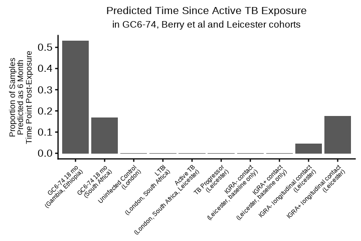


#### Figure 4C


```R
Garra.pheno.contact.ltbi.pos$time.pred.renamed = factor(ifelse(Garra.pheno.contact.ltbi.pos$time.pred == "early", 
                                                               "baseline", "6 month post-exposure"),
                                                        ordered=TRUE,
                                                        levels = c("baseline" , "6 month post-exposure")) 

pred.time.plot.pos = ggplot(Garra.pheno.contact.ltbi.pos, aes(time.since.exposure.days, time.pred.renamed, col=patient_id)) +
geom_point() +
    geom_line(aes(time.since.exposure.days, time.pred.renamed, group=patient_id)) +
    theme_bw() +
labs(x="Days Since Baseline Blood Collection", y="Model Prediction") + labs(color='Patient ID') + facet_wrap(~patient_id, ncol=2) + theme(
  strip.text.x = element_blank(), strip.text.y = element_blank(), strip.background = element_blank()
  
) + ggtitle("Predicted Time Since Active TB Exposure", subtitle="in IGRA+ recent contacts from Leicester") + theme(plot.title = element_text(size=12, face="plain", hjust=0.5), 
                                                                          plot.subtitle=element_text(size=11, face="plain", hjust=0.5)) +    # +

theme(axis.text.y = element_text(size=8),
      axis.text.x = element_text(size=6),
     legend.title = element_text(size=10),
     legend.text = element_text(size=7))

pred.time.plot.pos
```


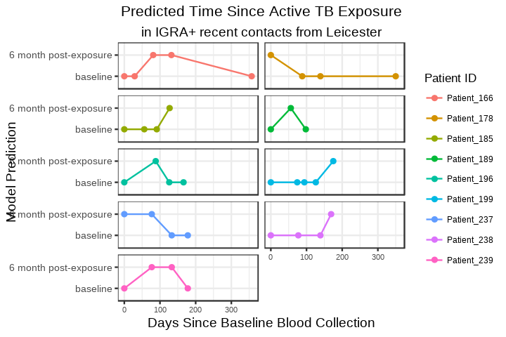


#### Figure 4D


```R
Garra.pheno.contact.ctrl.pos$time.pred.renamed = factor(ifelse(Garra.pheno.contact.ctrl.pos$time.pred == "early", 
                                                               "baseline", "6 month post-exposure"),
                                                        ordered=TRUE,
                                                        levels = c("baseline" , "6 month post-exposure"))

pred.time.plot.pos.ctrl = ggplot(Garra.pheno.contact.ctrl.pos, aes(time.since.exposure.days, time.pred.renamed, col=patient_id)) +
geom_point() +
    geom_line(aes(time.since.exposure.days, time.pred.renamed, group=patient_id)) +
    theme_bw() +
labs(x="Days Since Baseline Blood Collection", y="Model Prediction") + labs(color='Patient ID') + facet_wrap(~patient_id, ncol=2) + theme(
  strip.text.x = element_blank(), strip.text.y = element_blank(), strip.background = element_blank()
  
) + ggtitle("Predicted Time Since Active TB Exposure", subtitle="in IGRA- recent contacts from Leicester") + theme(plot.title = element_text(size=12, face="plain", hjust=0.5), 
                                                                          plot.subtitle=element_text(size=11, face="plain", hjust=0.5)) + #+
coord_fixed(ratio = 100) +
theme(axis.text.y = element_text(size=8),
      axis.text.x = element_text(size=6),
     legend.title = element_text(size=10),
     legend.text = element_text(size=7))


pred.time.plot.pos.ctrl 
```


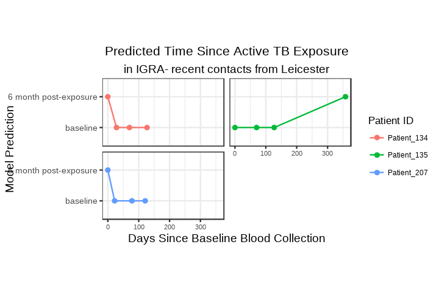


### Reproduce Analysis for Figure 4E

#### Load data and filter probes by detection p values by processing the .idat files


```R
if (!require("illuminaio")) {
  source("https://bioconductor.org/biocLite.R")
  biocLite("illuminaio")
  library("illuminaio")
}

if (!require("limma")) {
  source("https://bioconductor.org/biocLite.R")
  biocLite("limma")
  library("limma")
}
```

    Loading required package: limma
    
    Attaching package: ‘limma’
    
    The following object is masked from ‘package:BiocGenerics’:
    
        plotMA
    


```R
source("utils_submission.R")

ado.path =  paste(path, "/data/GSE116014", sep="")

ado.eset = getGEO(filename=paste(ado.path, "GSE116014_series_matrix.txt.gz", sep="/"), 
             destdir="data/GSE116014_adolescent/")
```

    Parsed with column specification:
    cols(
      .default = col_double(),
      ID_REF = col_character()
    )
    See spec(...) for full column specifications.
    Using locally cached version of GPL10558 found here:
    data/GSE116014_adolescent//GPL10558.soft 


```R
idatfiles <- dir(ado.path, pattern="idat", full.names=T)
bgxfile <- dir(ado.path, pattern="B.txt.gz", full.names=T)
x <- read.idat(idatfiles, bgxfile[1])
x$other$Detection <- detectionPValues(x)
dim(x$other$Detection)

```

    Reading manifest file /master/rault/TB/data/GSE116014/GPL10558_HumanHT-12_V4_0_R1_15002873_B.txt.gz ... Done
    	 /master/rault/TB/data/GSE116014/GSM3207067_8381645078_B_Grn.idat ... Done
    	 /master/rault/TB/data/GSE116014/GSM3207068_8381645078_C_Grn.idat ... Done
    	 /master/rault/TB/data/GSE116014/GSM3207069_8381645078_D_Grn.idat ... Done
    	 /master/rault/TB/data/GSE116014/GSM3207070_8381645078_E_Grn.idat ... Done
    	 /master/rault/TB/data/GSE116014/GSM3207071_8381645078_F_Grn.idat ... Done
    	 /master/rault/TB/data/GSE116014/GSM3207072_8381645078_G_Grn.idat ... Done
    	 /master/rault/TB/data/GSE116014/GSM3207073_8381645078_H_Grn.idat ... Done
    	 /master/rault/TB/data/GSE116014/GSM3207074_8381645078_I_Grn.idat ... Done
    	 /master/rault/TB/data/GSE116014/GSM3207075_8381645078_J_Grn.idat ... Done
    	 /master/rault/TB/data/GSE116014/GSM3207076_8381645078_K_Grn.idat ... Done
    	 /master/rault/TB/data/GSE116014/GSM3207077_8381645078_L_Grn.idat ... Done
    	 /master/rault/TB/data/GSE116014/GSM3207078_8381645088_A_Grn.idat ... Done
    	 /master/rault/TB/data/GSE116014/GSM3207079_8381645088_B_Grn.idat ... Done
    	 /master/rault/TB/data/GSE116014/GSM3207080_8381645088_C_Grn.idat ... Done
    	 /master/rault/TB/data/GSE116014/GSM3207081_8381645088_D_Grn.idat ... Done
    	 /master/rault/TB/data/GSE116014/GSM3207082_8381645088_E_Grn.idat ... Done
    	 /master/rault/TB/data/GSE116014/GSM3207083_8381645088_F_Grn.idat ... Done
    	 /master/rault/TB/data/GSE116014/GSM3207084_8381645088_G_Grn.idat ... Done
    	 /master/rault/TB/data/GSE116014/GSM3207085_8381645088_H_Grn.idat ... Done
    	 /master/rault/TB/data/GSE116014/GSM3207086_8381645088_I_Grn.idat ... Done
    	 /master/rault/TB/data/GSE116014/GSM3207087_8381645088_J_Grn.idat ... Done
    	 /master/rault/TB/data/GSE116014/GSM3207088_8381645088_K_Grn.idat ... Done
    	 /master/rault/TB/data/GSE116014/GSM3207089_8381645088_L_Grn.idat ... Done
    	 /master/rault/TB/data/GSE116014/GSM3207090_8381645095_A_Grn.idat ... Done
    	 /master/rault/TB/data/GSE116014/GSM3207091_8381645095_B_Grn.idat ... Done
    	 /master/rault/TB/data/GSE116014/GSM3207092_8381645095_C_Grn.idat ... Done
    	 /master/rault/TB/data/GSE116014/GSM3207093_8381645095_D_Grn.idat ... Done
    	 /master/rault/TB/data/GSE116014/GSM3207094_8381645095_E_Grn.idat ... Done
    	 /master/rault/TB/data/GSE116014/GSM3207095_8381645095_F_Grn.idat ... Done
    	 /master/rault/TB/data/GSE116014/GSM3207096_8381645095_G_Grn.idat ... Done
    	 /master/rault/TB/data/GSE116014/GSM3207097_8381645095_H_Grn.idat ... Done
    	 /master/rault/TB/data/GSE116014/GSM3207098_8381645095_I_Grn.idat ... Done
    	 /master/rault/TB/data/GSE116014/GSM3207099_8381645095_J_Grn.idat ... Done
    	 /master/rault/TB/data/GSE116014/GSM3207100_8381645095_K_Grn.idat ... Done
    	 /master/rault/TB/data/GSE116014/GSM3207101_8381645095_L_Grn.idat ... Done
    	 /master/rault/TB/data/GSE116014/GSM3207102_8381645096_A_Grn.idat ... Done
    	 /master/rault/TB/data/GSE116014/GSM3207103_8381645096_B_Grn.idat ... Done
    	 /master/rault/TB/data/GSE116014/GSM3207104_8381645096_C_Grn.idat ... Done
    	 /master/rault/TB/data/GSE116014/GSM3207105_8381645096_D_Grn.idat ... Done
    	 /master/rault/TB/data/GSE116014/GSM3207106_8381645096_E_Grn.idat ... Done
    	 /master/rault/TB/data/GSE116014/GSM3207107_8381645096_F_Grn.idat ... Done
    	 /master/rault/TB/data/GSE116014/GSM3207108_8381645096_G_Grn.idat ... Done
    	 /master/rault/TB/data/GSE116014/GSM3207109_8381645096_H_Grn.idat ... Done
    	 /master/rault/TB/data/GSE116014/GSM3207110_8381645096_I_Grn.idat ... Done
    	 /master/rault/TB/data/GSE116014/GSM3207111_8381645096_J_Grn.idat ... Done
    	 /master/rault/TB/data/GSE116014/GSM3207112_8381645096_K_Grn.idat ... Done
    	 /master/rault/TB/data/GSE116014/GSM3207113_8381645096_L_Grn.idat ... Done
    	 /master/rault/TB/data/GSE116014/GSM3207114_8292044004_A_Grn.idat ... Done
    	 /master/rault/TB/data/GSE116014/GSM3207115_8292044004_B_Grn.idat ... Done
    	 /master/rault/TB/data/GSE116014/GSM3207116_8292044004_C_Grn.idat ... Done
    	 /master/rault/TB/data/GSE116014/GSM3207117_8292044004_D_Grn.idat ... Done
    	 /master/rault/TB/data/GSE116014/GSM3207118_8292044004_E_Grn.idat ... Done
    	 /master/rault/TB/data/GSE116014/GSM3207119_8292044004_F_Grn.idat ... Done
    	 /master/rault/TB/data/GSE116014/GSM3207120_8292044004_G_Grn.idat ... Done
    	 /master/rault/TB/data/GSE116014/GSM3207121_8292044004_H_Grn.idat ... Done
    	 /master/rault/TB/data/GSE116014/GSM3207122_8292044004_I_Grn.idat ... Done
    	 /master/rault/TB/data/GSE116014/GSM3207123_8292044004_J_Grn.idat ... Done
    	 /master/rault/TB/data/GSE116014/GSM3207124_8292044004_K_Grn.idat ... Done
    	 /master/rault/TB/data/GSE116014/GSM3207125_8292044004_L_Grn.idat ... Done
    	 /master/rault/TB/data/GSE116014/GSM3207126_8381653006_B_Grn.idat ... Done
    	 /master/rault/TB/data/GSE116014/GSM3207127_8381653006_C_Grn.idat ... Done
    	 /master/rault/TB/data/GSE116014/GSM3207128_8381653006_D_Grn.idat ... Done
    	 /master/rault/TB/data/GSE116014/GSM3207129_8381653006_E_Grn.idat ... Done
    	 /master/rault/TB/data/GSE116014/GSM3207130_8381653006_F_Grn.idat ... Done
    	 /master/rault/TB/data/GSE116014/GSM3207131_8381653006_G_Grn.idat ... Done
    	 /master/rault/TB/data/GSE116014/GSM3207132_8381653006_H_Grn.idat ... Done
    	 /master/rault/TB/data/GSE116014/GSM3207133_8381653006_I_Grn.idat ... Done
    	 /master/rault/TB/data/GSE116014/GSM3207134_8381653006_J_Grn.idat ... Done
    	 /master/rault/TB/data/GSE116014/GSM3207135_8381653006_K_Grn.idat ... Done
    	 /master/rault/TB/data/GSE116014/GSM3207136_8381653006_L_Grn.idat ... Done
    	 /master/rault/TB/data/GSE116014/GSM3207137_8381688026_A_Grn.idat ... Done
    	 /master/rault/TB/data/GSE116014/GSM3207138_8381688026_B_Grn.idat ... Done
    	 /master/rault/TB/data/GSE116014/GSM3207139_8381688026_C_Grn.idat ... Done
    	 /master/rault/TB/data/GSE116014/GSM3207140_8381688026_D_Grn.idat ... Done
    	 /master/rault/TB/data/GSE116014/GSM3207141_8381688026_E_Grn.idat ... Done
    	 /master/rault/TB/data/GSE116014/GSM3207142_8381688026_F_Grn.idat ... Done
    	 /master/rault/TB/data/GSE116014/GSM3207143_8381688026_G_Grn.idat ... Done
    	 /master/rault/TB/data/GSE116014/GSM3207144_8381688026_H_Grn.idat ... Done
    	 /master/rault/TB/data/GSE116014/GSM3207145_8381688026_I_Grn.idat ... Done
    	 /master/rault/TB/data/GSE116014/GSM3207146_8381688026_J_Grn.idat ... Done
    	 /master/rault/TB/data/GSE116014/GSM3207147_8381688026_K_Grn.idat ... Done
    	 /master/rault/TB/data/GSE116014/GSM3207148_8381688026_L_Grn.idat ... Done
    Finished reading data.


<ol class=list-inline>
	<li>48118</li>
	<li>82</li>
</ol>


```R
row.names(x$other$Detection) = x$genes$Probe_Id
df = x$other$Detection
probe = as.character(row.names(df))
df = data.frame(df, probe=probe)
df = df[!duplicated(df$probe),]
df = df[match(featureNames(ado.eset), df$probe),]
row.names(df) = df$probe
df$probe=NULL
print(identical(featureNames(ado.eset), row.names(df)))
```

    Warning message in data.row.names(row.names, rowsi, i):
    “some row.names duplicated: 47233,47236,47238,47240,47242,47243,47246,47247,47251,47253,47255 --> row.names NOT used”

    [1] TRUE


```R
write.csv(df, paste(ado.path, "GSE116014_DetectionPValues.csv", sep="/"))
```


```R
dPvalues = read.csv(paste(ado.path, "GSE116014_DetectionPValues.csv", sep="/"), header=T, row.names=1)
```

#### Prepare data for training a model to predict time since first known QFT conversion (0 vs 6 months)


```R
det_pval_thresh = 0.01

# Choose genes expressed in 10% of samples
percent_samples= 0.10

PAL.10 = row.names(dPvalues)[apply(dPvalues <= det_pval_thresh, 1, mean) >= percent_samples]

ado.eset.PAL.10 = ado.eset[featureNames(ado.eset) %in% PAL.10,]

ado.exprs = exprs(ado.eset.PAL.10)
ado.pheno = pData(ado.eset.PAL.10)

colnames(ado.pheno) = gsub(" ",".", gsub(":ch1|\\(|\\)","",colnames(ado.pheno)))

ado.pheno = ado.pheno[,c('draw.day',
                         'latent.tb.status.at.blood.draw',
                         'patientid',
                         'relative.time.from.conversion.days',
                         'time.of.conversion.days',
                         'tissue')]
num.f = c  ('draw.day',
                         'relative.time.from.conversion.days',
                         'time.of.conversion.days')
            
for (f in num.f) {
    ado.pheno[,f] = as.numeric(ado.pheno[,f])
}

ado.exprs.qn = normalize.quantiles(ado.exprs)
row.names(ado.exprs.qn) = row.names(ado.exprs)
colnames(ado.exprs.qn) = colnames(ado.exprs)

ado.exprs.qn[ado.exprs.qn < 10] = 10
ado.exprs.log = log2(ado.exprs.qn)

cut = 0.6

filter.QR = function(x) {IQR(x) / median(x)}
genes.range = apply(ado.exprs.log, 1, filter.QR)
criteria = quantile(genes.range, c(1-cut))

genes.f = rownames(ado.exprs.log)[genes.range > criteria]
ado.exprs.var = ado.exprs.log[genes.f,]

ado.pheno.qft = ado.pheno[ado.pheno$relative.time.from.conversion.days %in% c(0,180),]

ntrain =  0.7 * length(unique(ado.pheno.qft$patientid))

ntest = 0.3 * length(unique(ado.pheno.qft$patientid))

set.seed(100)
train.patients = sample(unique(as.character(ado.pheno.qft$patientid)), ntrain)
test.patients = setdiff(unique(as.character(ado.pheno.qft$patientid)), train.patients)
print("Number of common patients between training and test set (should be 0)")
length(intersect(train.patients, test.patients))

ado.pheno.train = droplevels(ado.pheno.qft[ado.pheno.qft$patientid %in% train.patients,])
ado.pheno.test = droplevels(ado.pheno.qft[ado.pheno.qft$patientid %in% test.patients,])

ado.exprs.qft = ado.exprs.var[, colnames(ado.exprs.var) %in% row.names(ado.pheno.qft)]

ado.exprs.train = t(ado.exprs.qft[,ado.pheno.qft$patientid %in% train.patients])
ado.exprs.test = t(ado.exprs.qft[,ado.pheno.qft$patientid %in% test.patients])

set.seed(100)
folds.ado = groupKFold(ado.pheno.train$patientid, k=11)
for (fold in lapply(folds.ado, function(x) {ado.pheno.train$patientid[x]}))
    print(length((as.character(fold))))

lapply(folds.ado, function(x, y) table(y[x]), y = ado.pheno.train$patientid)
       
time.since.QFT.conversion = as.factor(ifelse(ado.pheno.train$relative.time.from.conversion.days == "0", "early", "late"))
test.time.since.QFT.conversion = as.factor(ifelse(ado.pheno.test$relative.time.from.conversion.days == "0", "early", "late"))
```

    [1] "Number of common patients between training and test set (should be 0)"


0


    [1] 37
    [1] 35
    [1] 35
    [1] 33
    [1] 33
    [1] 34
    [1] 34
    [1] 34
    [1] 32
    [1] 35


    $Fold01
    
    ID#: 04/0017 ID#: 04/0090 ID#: 04/0106 ID#: 04/0352 ID#: 04/0402 ID#: 04/0446 
               2            1            1            1            1            1 
    ID#: 04/0702 ID#: 04/0758 ID#: 04/0785 ID#: 04/0807 ID#: 04/0953 ID#: 04/0974 
               2            1            1            2            2            1 
    ID#: 04/1032 ID#: 04/1139 ID#: 04/1154 ID#: 04/1157 ID#: 04/1187 ID#: 04/1354 
               1            2            2            2            1            1 
    ID#: 07/0088 ID#: 07/0222 ID#: 07/0487 ID#: 07/0547 ID#: 07/0551 ID#: 07/0675 
               1            1            1            1            1            2 
    ID#: 07/0788 ID#: 07/0845 ID#: 07/0901 
               2            2            1 
    
    $Fold02
    
    ID#: 04/0017 ID#: 04/0090 ID#: 04/0106 ID#: 04/0344 ID#: 04/0352 ID#: 04/0402 
               2            1            1            1            1            1 
    ID#: 04/0446 ID#: 04/0702 ID#: 04/0758 ID#: 04/0807 ID#: 04/0953 ID#: 04/0974 
               1            2            1            2            2            1 
    ID#: 04/1032 ID#: 04/1139 ID#: 04/1154 ID#: 04/1157 ID#: 04/1187 ID#: 04/1354 
               1            2            2            2            1            1 
    ID#: 07/0088 ID#: 07/0222 ID#: 07/0487 ID#: 07/0547 ID#: 07/0551 ID#: 07/0675 
               1            1            1            1            1            2 
    ID#: 07/0845 ID#: 07/0901 
               2            1 
    
    $Fold03
    
    ID#: 04/0017 ID#: 04/0106 ID#: 04/0344 ID#: 04/0352 ID#: 04/0402 ID#: 04/0446 
               2            1            1            1            1            1 
    ID#: 04/0702 ID#: 04/0758 ID#: 04/0785 ID#: 04/0807 ID#: 04/0953 ID#: 04/0974 
               2            1            1            2            2            1 
    ID#: 04/1032 ID#: 04/1139 ID#: 04/1154 ID#: 04/1187 ID#: 04/1354 ID#: 07/0088 
               1            2            2            1            1            1 
    ID#: 07/0222 ID#: 07/0487 ID#: 07/0547 ID#: 07/0551 ID#: 07/0675 ID#: 07/0788 
               1            1            1            1            2            2 
    ID#: 07/0845 ID#: 07/0901 
               2            1 
    
    $Fold04
    
    ID#: 04/0090 ID#: 04/0106 ID#: 04/0344 ID#: 04/0352 ID#: 04/0402 ID#: 04/0446 
               1            1            1            1            1            1 
    ID#: 04/0702 ID#: 04/0758 ID#: 04/0785 ID#: 04/0807 ID#: 04/0953 ID#: 04/1032 
               2            1            1            2            2            1 
    ID#: 04/1139 ID#: 04/1154 ID#: 04/1157 ID#: 07/0088 ID#: 07/0222 ID#: 07/0487 
               2            2            2            1            1            1 
    ID#: 07/0547 ID#: 07/0551 ID#: 07/0675 ID#: 07/0788 ID#: 07/0845 ID#: 07/0901 
               1            1            2            2            2            1 
    
    $Fold05
    
    ID#: 04/0017 ID#: 04/0090 ID#: 04/0106 ID#: 04/0344 ID#: 04/0352 ID#: 04/0402 
               2            1            1            1            1            1 
    ID#: 04/0446 ID#: 04/0758 ID#: 04/0785 ID#: 04/0807 ID#: 04/0953 ID#: 04/0974 
               1            1            1            2            2            1 
    ID#: 04/1139 ID#: 04/1154 ID#: 04/1157 ID#: 04/1187 ID#: 04/1354 ID#: 07/0088 
               2            2            2            1            1            1 
    ID#: 07/0222 ID#: 07/0487 ID#: 07/0547 ID#: 07/0551 ID#: 07/0788 ID#: 07/0845 
               1            1            1            1            2            2 
    ID#: 07/0901 
               1 
    
    $Fold06
    
    ID#: 04/0017 ID#: 04/0090 ID#: 04/0106 ID#: 04/0344 ID#: 04/0446 ID#: 04/0702 
               2            1            1            1            1            2 
    ID#: 04/0758 ID#: 04/0785 ID#: 04/0807 ID#: 04/0953 ID#: 04/0974 ID#: 04/1032 
               1            1            2            2            1            1 
    ID#: 04/1139 ID#: 04/1154 ID#: 04/1157 ID#: 04/1187 ID#: 04/1354 ID#: 07/0088 
               2            2            2            1            1            1 
    ID#: 07/0487 ID#: 07/0551 ID#: 07/0675 ID#: 07/0788 ID#: 07/0845 ID#: 07/0901 
               1            1            2            2            2            1 
    
    $Fold07
    
    ID#: 04/0017 ID#: 04/0090 ID#: 04/0344 ID#: 04/0352 ID#: 04/0402 ID#: 04/0446 
               2            1            1            1            1            1 
    ID#: 04/0702 ID#: 04/0785 ID#: 04/0953 ID#: 04/0974 ID#: 04/1032 ID#: 04/1139 
               2            1            2            1            1            2 
    ID#: 04/1154 ID#: 04/1157 ID#: 04/1187 ID#: 04/1354 ID#: 07/0088 ID#: 07/0222 
               2            2            1            1            1            1 
    ID#: 07/0487 ID#: 07/0547 ID#: 07/0551 ID#: 07/0675 ID#: 07/0788 ID#: 07/0845 
               1            1            1            2            2            2 
    ID#: 07/0901 
               1 
    
    $Fold08
    
    ID#: 04/0017 ID#: 04/0090 ID#: 04/0106 ID#: 04/0344 ID#: 04/0352 ID#: 04/0402 
               2            1            1            1            1            1 
    ID#: 04/0446 ID#: 04/0702 ID#: 04/0758 ID#: 04/0785 ID#: 04/0807 ID#: 04/0953 
               1            2            1            1            2            2 
    ID#: 04/0974 ID#: 04/1032 ID#: 04/1139 ID#: 04/1157 ID#: 04/1187 ID#: 04/1354 
               1            1            2            2            1            1 
    ID#: 07/0222 ID#: 07/0547 ID#: 07/0551 ID#: 07/0675 ID#: 07/0788 ID#: 07/0845 
               1            1            1            2            2            2 
    ID#: 07/0901 
               1 
    
    $Fold09
    
    ID#: 04/0017 ID#: 04/0090 ID#: 04/0106 ID#: 04/0344 ID#: 04/0352 ID#: 04/0402 
               2            1            1            1            1            1 
    ID#: 04/0702 ID#: 04/0758 ID#: 04/0785 ID#: 04/0807 ID#: 04/0953 ID#: 04/0974 
               2            1            1            2            2            1 
    ID#: 04/1032 ID#: 04/1154 ID#: 04/1157 ID#: 04/1187 ID#: 04/1354 ID#: 07/0088 
               1            2            2            1            1            1 
    ID#: 07/0222 ID#: 07/0487 ID#: 07/0547 ID#: 07/0675 ID#: 07/0788 ID#: 07/0901 
               1            1            1            2            2            1 
    
    $Fold10
    
    ID#: 04/0017 ID#: 04/0090 ID#: 04/0106 ID#: 04/0344 ID#: 04/0352 ID#: 04/0402 
               2            1            1            1            1            1 
    ID#: 04/0446 ID#: 04/0702 ID#: 04/0758 ID#: 04/0785 ID#: 04/0807 ID#: 04/0974 
               1            2            1            1            2            1 
    ID#: 04/1032 ID#: 04/1139 ID#: 04/1154 ID#: 04/1157 ID#: 04/1187 ID#: 04/1354 
               1            2            2            2            1            1 
    ID#: 07/0088 ID#: 07/0222 ID#: 07/0487 ID#: 07/0547 ID#: 07/0551 ID#: 07/0675 
               1            1            1            1            1            2 
    ID#: 07/0788 ID#: 07/0845 
               2            2 


#### Train the model


```R
set.seed(100)

n = 1000
lambda.grid = c(10 ^ runif(n, min = log10(1e-5), max = log10(1e2)))
alpha.grid = runif(length(lambda.grid), min = 0.00, 1.0)

train.grid = data.frame(lambda = sample(lambda.grid, length(lambda.grid)),
                       alpha = sample(alpha.grid, length(lambda.grid)))
```


```R
seed=7

start_time <- Sys.time()

cluster = makeCluster(detectCores()-3) # Leaving 3 for other jobs
registerDoParallel(cluster)

methods = c("glmnet")

models = list()

control <- trainControl(method="cv", index=folds.ado, savePredictions='final', allowParallel=TRUE, 
                       classProbs=TRUE, summaryFunction=twoClassSummary)

for (alg in methods) {
    set.seed(seed)
    print("I have gotten to model:")
    print(alg)
    model = train(ado.exprs.train,
                  as.factor(time.since.QFT.conversion),  
                  method=alg, trControl=control,  tuneGrid=train.grid,
                 metric="ROC")
    models[[alg]] = model
}

stopCluster(cluster)
registerDoSEQ()

end_time <- Sys.time()
print(end_time - start_time)                     
```

    [1] "I have gotten to model:"
    [1] "glmnet"


    Warning message in nominalTrainWorkflow(x = x, y = y, wts = weights, info = trainInfo, :
    “There were missing values in resampled performance measures.”

    Time difference of 4.250001 mins


```R
glmres = models$glmnet$results
graph.hyper(x=glmres$alpha, y=log10(glmres$lambda), z=glmres$ROC)
```


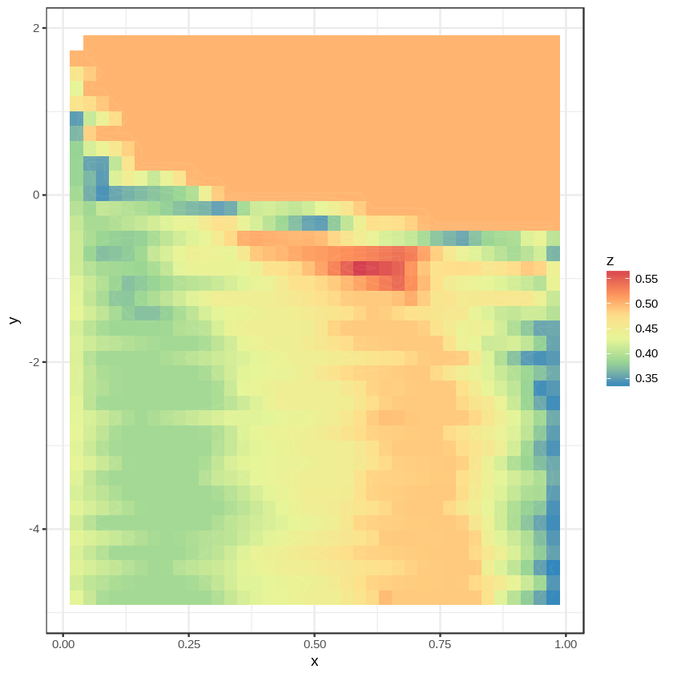


```R
human.QFT.model = models$glmnet 
```

#### Figure 4E


```R
glmnet.human.QFT.val.ROC = my.roc(human.QFT.model$pred$early, human.QFT.model$pred$obs, "early")
       
pred.human.QFT.test = predict(human.QFT.model, newdata = ado.exprs.test, type="prob")

glmnet.human.QFT.test.ROC = my.roc(pred.human.QFT.test$early,
                          test.time.since.QFT.conversion,
                          "early")
```

    [1] "This is the AUC:"
    Area under the curve: 0.6387
    [1] "This is the AUC p-value:"
    [1] 0.9282259
    [1] "This is the AUC 95% Confidence Interval"
    95% CI: 0.4577-0.8196 (DeLong)
    [1] "This is the AUC:"
    Area under the curve: 0.5444
    [1] "This is the AUC p-value:"
    [1] 0.6401524
    [1] "This is the AUC 95% Confidence Interval"
    95% CI: 0.2654-0.8234 (DeLong)


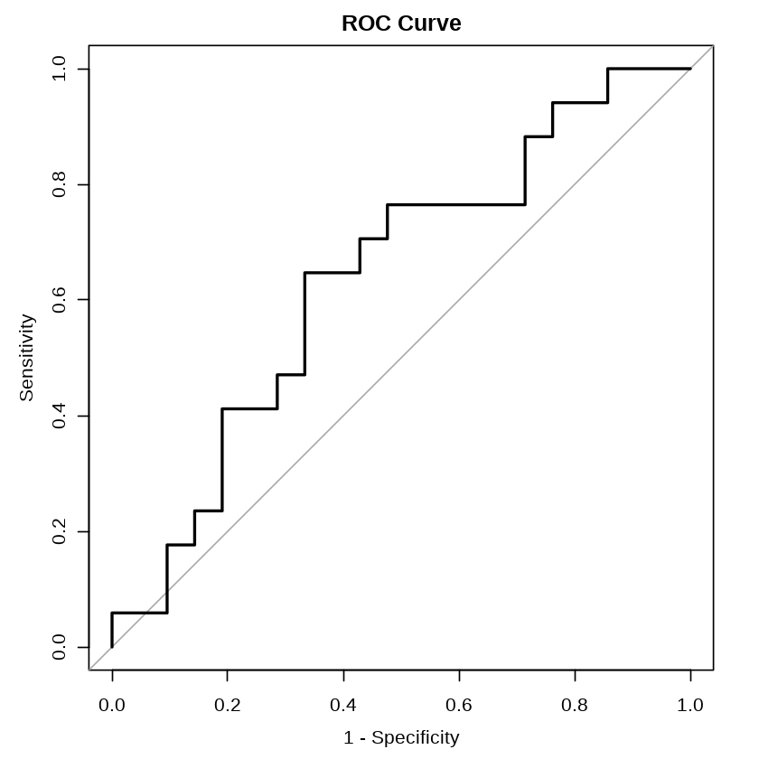


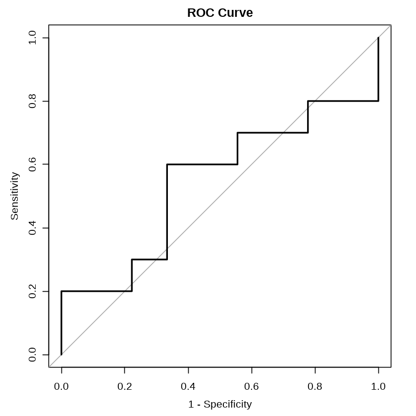


```R
human.QFT.plot = ggroc(list(CV=glmnet.human.QFT.val.ROC, 
                                           test=glmnet.human.QFT.test.ROC), 
                                      legacy.axes=TRUE) +
                geom_abline(intercept = 0, slope = 1, color = "lightgrey", size = 0.25) + 
                ggtitle("0 vs 6 months post first QFT+") + theme(plot.title = element_text(size=12, face="plain")) +
                scale_color_manual(name="M.tb Infected Adolescents",
                                  labels=c("CV" =expression("CV: AUC 0.64, p = 0.92"),
                                           "test"=expression("Test: AUC 0.54, p = 0.64")),
                                  values=c("CV"="blue", "test"="red")) +
            theme(legend.position=c(0.40,0.20), legend.title = element_text(size=10), legend.text = element_text(size=8)) 
human.QFT.plot
```


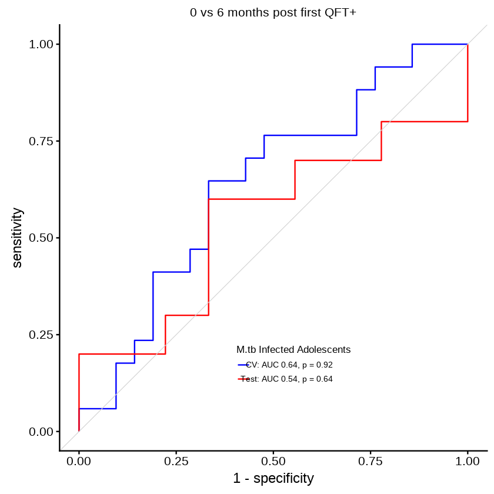


## Figure 5 Human Analysis (Grand Challenges 6-74 cohort)

- This code reproduces the cell-type analysis of Figure 5, showing that "Time since TB exposure in humans is associated with alteration in CD4+ T cell proportion"
- The Ingenuity Pathway Analysis for Figure 5E is excluded (commercial software)

### Load and Install Required Libraries


```R
if (!require("preprocessCore")) {
  source("https://bioconductor.org/biocLite.R")
  biocLite("preprocessCore")
  library("preprocessCore")
}

source("https://bioconductor.org/biocLite.R")
if (!require("Biobase")) {
  biocLite("Biobase")
  library("Biobase")
}
if (!require("GEOquery")) {
  biocLite("GEOquery")
  library("GEOquery")
}

if (!require("ggplot2")) {
  install.packages("ggplot2")
  library("ggplot2")
}

if (!require("glmnet")) {
  install.packages("glmnet")
  library("glmnet")
}

if (!require("caret")) {
  install.packages("caret")
  library("caret")
}
if (!require("dplyr")) {
  install.packages("dplyr")
  library("dplyr")
}

if (!require("ggsignif")) {
  install.packages("ggsignif")
  library("ggsignif")
}

if (!require("doParallel")) {
  install.packages("doParallel")
  library("doParallel")
}

if (!require("cowplot")) {
  install.packages("cowplot")
  library("cowplot")
}

if (!require("pROC")) {
    # pROC 1.12.0 is required, and may not be the default installation:
    packageUrl<- "https://cran.r-project.org/src/contrib/Archive/pROC/pROC_1.12.0.tar.gz"
    install.packages(packageUrl, repos=NULL, type='source')
    library("pROC")
}

if (!require("lme4")) {
  install.packages("lme4")
  library("lme4")
}

if (!require("lmerTest")) {
  install.packages("lmerTest")
  library("lmerTest")
}

if (!require("MetaIntegrator")) {
  install.packages("MetaIntegrator")
  library("MetaIntegrator")
}
```

    Bioconductor version 3.6 (BiocInstaller 1.28.0), ?biocLite for help
    A new version of Bioconductor is available after installing the most recent
      version of R; see http://bioconductor.org/install
    Loading required package: lmerTest
    
    Attaching package: ‘lmerTest’
    
    The following object is masked from ‘package:lme4’:
    
        lmer
    
    The following object is masked from ‘package:stats’:
    
        step
    


### Reproduce Analysis for Figures 5A-D

- Requires code from Figure 3B to have been run

#### Load the data and perform cell-type deconvolution using Immunostates and linear mixed model analyses


```R
source("utils_submission.R")
source("utils_immunoStates.R")
```


```R
Sul.path = paste(path, "/data/GSE94438", sep="")

Sul.pheno.set = getGEO(filename=paste(Sul.path, "GSE94438_series_matrix.txt.gz", sep="/"),
             destdir=Sul.path)

Sul.pheno = filter.human.pheno(pData(Sul.pheno.set))

Sul.exprs = read.table(paste(Sul.path, "gene_count_GSE94438.tsv", sep="/"), header=T, row.names=1)
Sul.exprs = filter.HUMAN.exprs(Sul.exprs, Sul.pheno)
```

    Parsed with column specification:
    cols(
      .default = col_character()
    )
    See spec(...) for full column specifications.
    Using locally cached version of GPL11154 found here:
    ./data/GSE94438/GPL11154.soft 
    Warning message in filter.human.pheno(pData(Sul.pheno.set)):
    “NAs introduced by coercion”Warning message in filter.human.pheno(pData(Sul.pheno.set)):
    “NAs introduced by coercion”Warning message in filter.human.pheno(pData(Sul.pheno.set)):
    “NAs introduced by coercion”

               age code gender group site subjectid time.from.exposure.months
    GSM2475704  NA  672     NA    NA   NA        NA                        NA
    GSM2475705  NA  694     NA    NA   NA        NA                        NA
    GSM2475706  NA  695     NA    NA   NA        NA                        NA
    GSM2475722  NA  994     NA    NA   NA        NA                        NA
    GSM2475742  NA 1061     NA    NA   NA        NA                        NA
    GSM2475748  NA 1194     NA    NA   NA        NA                        NA
               time.to.tb.months
    GSM2475704                NA
    GSM2475705                NA
    GSM2475706                NA
    GSM2475722                NA
    GSM2475742                NA
    GSM2475748                NA
     [1] "GSM2475598" "GSM2475603" "GSM2475587" "GSM2475592" "GSM2475599"
     [6] "GSM2475604" "GSM2475360" "GSM2475387" "GSM2475362" "GSM2475389"
    [11] "GSM2475402" "GSM2475555" "GSM2475361" "GSM2475388" "GSM2475359"
    [16] "GSM2475390" "GSM2475588" "GSM2475593" "GSM2475591" "GSM2475596"
    [21] "GSM2475589" "GSM2475594" "GSM2475590" "GSM2475595" "GSM2475597"
    [26] "GSM2475602" "GSM2475579" "GSM2475601" "GSM2475600" "GSM2475605"
    [31] "GSM2475403" "GSM2475554"
     [1] 128 128 195 195 217 217 284 284 320 320 45  45  562 562 632 632 740 740 744
    [20] 744 746 746 806 806 844 844 897 897 904 904 96  96 
    418 Levels: 1002 1007 1009 1010 1011 1014 1019 1020 1027 1028 1029 1030 ... 1194
    [1] "15"
    [1] Test
    16 Levels:  09/G262 10/G261 2006 2007 2008 2009 F KHHC26 M Not R S ... unmatched
    [1] "72"
    [1] Test
    16 Levels:  09/G262 10/G261 2006 2007 2008 2009 F KHHC26 M Not R S ... unmatched
    [1] "92"
    [1] Test
    16 Levels:  09/G262 10/G261 2006 2007 2008 2009 F KHHC26 M Not R S ... unmatched
    [1] "99"
    [1] Test
    16 Levels:  09/G262 10/G261 2006 2007 2008 2009 F KHHC26 M Not R S ... unmatched
    [1] "358"
    [1] Test
    16 Levels:  09/G262 10/G261 2006 2007 2008 2009 F KHHC26 M Not R S ... unmatched
    [1] "376"
    [1] Test
    16 Levels:  09/G262 10/G261 2006 2007 2008 2009 F KHHC26 M Not R S ... unmatched
    [1] "524"
    [1] Test
    16 Levels:  09/G262 10/G261 2006 2007 2008 2009 F KHHC26 M Not R S ... unmatched
    [1] "729"
    [1] Test
    16 Levels:  09/G262 10/G261 2006 2007 2008 2009 F KHHC26 M Not R S ... unmatched
    [1] "730"
    [1] Test
    16 Levels:  09/G262 10/G261 2006 2007 2008 2009 F KHHC26 M Not R S ... unmatched
    [1] "1066"
    [1] Test
    16 Levels:  09/G262 10/G261 2006 2007 2008 2009 F KHHC26 M Not R S ... unmatched
    [1] "1114"
    [1] Test
    16 Levels:  09/G262 10/G261 2006 2007 2008 2009 F KHHC26 M Not R S ... unmatched
    [1] "1116"
    [1] Test
    16 Levels:  09/G262 10/G261 2006 2007 2008 2009 F KHHC26 M Not R S ... unmatched
    [1] "1231"
    [1] Test
    16 Levels:  09/G262 10/G261 2006 2007 2008 2009 F KHHC26 M Not R S ... unmatched
    [1] "1233"
    [1] Test
    16 Levels:  09/G262 10/G261 2006 2007 2008 2009 F KHHC26 M Not R S ... unmatched
    [1] "5319"
    [1] Test
    16 Levels:  09/G262 10/G261 2006 2007 2008 2009 F KHHC26 M Not R S ... unmatched
    [1] "5358"
    [1] Test
    16 Levels:  09/G262 10/G261 2006 2007 2008 2009 F KHHC26 M Not R S ... unmatched
    [1] "5360"
    [1] Test
    16 Levels:  09/G262 10/G261 2006 2007 2008 2009 F KHHC26 M Not R S ... unmatched
    [1] "5365"
    [1] Test
    16 Levels:  09/G262 10/G261 2006 2007 2008 2009 F KHHC26 M Not R S ... unmatched
    [1] "08/G329"
    [1] Test
    16 Levels:  09/G262 10/G261 2006 2007 2008 2009 F KHHC26 M Not R S ... unmatched
    [1] "08/G568"
    [1] Test
    16 Levels:  09/G262 10/G261 2006 2007 2008 2009 F KHHC26 M Not R S ... unmatched
    [1] "08/G595"
    [1] Test
    16 Levels:  09/G262 10/G261 2006 2007 2008 2009 F KHHC26 M Not R S ... unmatched
    [1] "09/G131"
    [1] Test
    16 Levels:  09/G262 10/G261 2006 2007 2008 2009 F KHHC26 M Not R S ... unmatched
    [1] "09/G168"
    [1] Test
    16 Levels:  09/G262 10/G261 2006 2007 2008 2009 F KHHC26 M Not R S ... unmatched
    [1] "09/G238"
    [1] Test
    16 Levels:  09/G262 10/G261 2006 2007 2008 2009 F KHHC26 M Not R S ... unmatched
    [1] "09/G403"
    [1] Test
    16 Levels:  09/G262 10/G261 2006 2007 2008 2009 F KHHC26 M Not R S ... unmatched
    [1] "ARHHC16"
    [1] Test
    16 Levels:  09/G262 10/G261 2006 2007 2008 2009 F KHHC26 M Not R S ... unmatched
    [1] "DZHHC38"
    [1] Test
    16 Levels:  09/G262 10/G261 2006 2007 2008 2009 F KHHC26 M Not R S ... unmatched
    [1] "DZHHC84"
    [1] Test
    16 Levels:  09/G262 10/G261 2006 2007 2008 2009 F KHHC26 M Not R S ... unmatched
    [1] "KAZHHC50"
    [1] Test
    16 Levels:  09/G262 10/G261 2006 2007 2008 2009 F KHHC26 M Not R S ... unmatched
    [1] "KFHHC15"
    [1] Test
    16 Levels:  09/G262 10/G261 2006 2007 2008 2009 F KHHC26 M Not R S ... unmatched
    [1] "KHHC04"
    [1] Test
    16 Levels:  09/G262 10/G261 2006 2007 2008 2009 F KHHC26 M Not R S ... unmatched
    [1] "KHHC32"
    [1] Test
    16 Levels:  09/G262 10/G261 2006 2007 2008 2009 F KHHC26 M Not R S ... unmatched
    [1] "KHHC36"
    [1] Test
    16 Levels:  09/G262 10/G261 2006 2007 2008 2009 F KHHC26 M Not R S ... unmatched
    [1] "KHHC41"
    [1] Test
    16 Levels:  09/G262 10/G261 2006 2007 2008 2009 F KHHC26 M Not R S ... unmatched
    [1] "LDHHC18"
    [1] Test
    16 Levels:  09/G262 10/G261 2006 2007 2008 2009 F KHHC26 M Not R S ... unmatched
    [1] "MESHHC04"
    [1] Test
    16 Levels:  09/G262 10/G261 2006 2007 2008 2009 F KHHC26 M Not R S ... unmatched
    [1] "TEKHHC10"
    [1] Test
    84 Levels:  07/G123 07/G225 07/G437 07/G438 07/G468 08/G245 08/G249 ... W23HHC132
    [1] "TEKHHC74"
    [1] Test
    16 Levels:  09/G262 10/G261 2006 2007 2008 2009 F KHHC26 M Not R S ... unmatched
    [1] "W23HHC15"
    [1] Test
    16 Levels:  09/G262 10/G261 2006 2007 2008 2009 F KHHC26 M Not R S ... unmatched
    [1] "W23HHC21"
    [1] Test
    16 Levels:  09/G262 10/G261 2006 2007 2008 2009 F KHHC26 M Not R S ... unmatched
    [1] "W23HHC29"
    [1] Test
    84 Levels:  07/G123 07/G225 07/G437 07/G438 07/G468 08/G245 08/G249 ... W23HHC132
    [1] "W23HHC61"
    [1] Test
    16 Levels:  09/G262 10/G261 2006 2007 2008 2009 F KHHC26 M Not R S ... unmatched
    [1] "1115"
    [1] Test
    21 Levels:  10 11 14 15 18 19 2008 2010 21 23 24 5 6 7 8 9 characterists ... Training
    [1] "10/G289"
    [1] Test
    Levels:  19 21 22 24 failed for QC Test Training
    [1] "DZHHC96"
    [1] Test
    21 Levels:  10 11 14 15 18 19 2008 2010 21 23 24 5 6 7 8 9 characterists ... Training
    [1] "Subjects not assigned a training-test set that are now training"
    
     09/G455  09/G476  LDHHC10 91420103 91451104    92245 
           2        2        1        1        1        1 
    [1] "about to return new data frame"
    [1] "Identical column and rownames between exprs and pheno tables?"
    [1] TRUE


```R
# Filter out genes whose counts are <= 5 in 50% of samples
exprs.j.keep = apply(Sul.exprs <= 5, 1, mean) <= 0.5
Sul.exprs.qn = as.data.frame(normalize.quantiles(as.matrix(Sul.exprs[exprs.j.keep,])))
colnames(Sul.exprs.qn) = colnames(Sul.exprs[exprs.j.keep,])
rownames(Sul.exprs.qn) = rownames(Sul.exprs[exprs.j.keep,])

Sul.decov.qn = iSdeconvolution(immunoStatesMatrix, Sul.exprs.qn)

Sul.decov.qn.data = as.data.frame(Sul.decov.qn[,!(colnames(Sul.decov.qn) %in% c('P-value', 'Correlation', 'RMSE')) ])

summary(Sul.decov.qn.data)

# Make everything on the percent scale.
Sul.decov.qn.data = Sul.decov.qn.data * 100

cells.Sul.6mo = data.frame(Sul.decov.qn.data[row.names(Sul.decov.qn.data) %in% 
                                                  rownames(Sul.pheno.6mo),] , 
                                time.from.exposure.months = Sul.pheno.6mo$time.from.exposure.months,
                               patient = Sul.pheno.6mo$subjectid,
                              site = Sul.pheno.6mo$site)
cells.Sul.18mo = data.frame(Sul.decov.qn.data[row.names(Sul.decov.qn.data) %in% 
                                                  rownames(Sul.pheno[Sul.pheno$time.from.exposure.months != 6,]),] , 
                                time.from.exposure.months = Sul.pheno[Sul.pheno$time.from.exposure.months != 6,]$time.from.exposure.months,
                               patient = Sul.pheno[Sul.pheno$time.from.exposure.months != 6,]$subjectid,
                           site = Sul.pheno[Sul.pheno$time.from.exposure.months != 6,]$site)

cells.Sul.6mo$NK_cell = cells.Sul.6mo$CD56bright_natural_killer_cell + cells.Sul.6mo$CD56dim_natural_killer_cell
cells.Sul.18mo$NK_cell = cells.Sul.18mo$CD56bright_natural_killer_cell + cells.Sul.18mo$CD56dim_natural_killer_cell
```


     CD14_positive_monocyte CD16_positive_monocyte CD4_positive_alpha_beta_T_cell
     Min.   :0.00000        Min.   :0.00000        Min.   :0.0287                
     1st Qu.:0.01157        1st Qu.:0.09289        1st Qu.:0.2290                
     Median :0.03401        Median :0.11809        Median :0.2811                
     Mean   :0.04243        Mean   :0.11914        Mean   :0.2729                
     3rd Qu.:0.06088        3rd Qu.:0.14111        3rd Qu.:0.3155                
     Max.   :0.22496        Max.   :0.27652        Max.   :0.4300                
     CD56bright_natural_killer_cell CD56dim_natural_killer_cell
     Min.   :0.001581               Min.   :0.0000000          
     1st Qu.:0.173857               1st Qu.:0.0000000          
     Median :0.201391               Median :0.0000000          
     Mean   :0.196017               Mean   :0.0001228          
     3rd Qu.:0.227082               3rd Qu.:0.0000000          
     Max.   :0.302639               Max.   :0.0305743          
     CD8_positive_alpha_beta_T_cell   MAST_cell          basophil       
     Min.   :0.00000                Min.   :0.00000   Min.   :0.000000  
     1st Qu.:0.03045                1st Qu.:0.00000   1st Qu.:0.000000  
     Median :0.04505                Median :0.00000   Median :0.000000  
     Mean   :0.05184                Mean   :0.00674   Mean   :0.001395  
     3rd Qu.:0.06616                3rd Qu.:0.00783   3rd Qu.:0.001962  
     Max.   :0.29926                Max.   :0.07398   Max.   :0.019922  
       eosinophil        gamma_delta_T_cell hematopoietic_progenitor
     Min.   :0.0000000   Min.   :0          Min.   :0               
     1st Qu.:0.0000000   1st Qu.:0          1st Qu.:0               
     Median :0.0000000   Median :0          Median :0               
     Mean   :0.0003852   Mean   :0          Mean   :0               
     3rd Qu.:0.0000000   3rd Qu.:0          3rd Qu.:0               
     Max.   :0.0369485   Max.   :0          Max.   :0               
     macrophage_m0       macrophage_m1      macrophage_m2     memory_B_cell      
     Min.   :0.0000000   Min.   :0.000000   Min.   :0.00000   Min.   :0.0000000  
     1st Qu.:0.0000000   1st Qu.:0.000000   1st Qu.:0.02510   1st Qu.:0.0000000  
     Median :0.0000000   Median :0.000000   Median :0.03627   Median :0.0000000  
     Mean   :0.0003148   Mean   :0.001827   Mean   :0.03363   Mean   :0.0002578  
     3rd Qu.:0.0000000   3rd Qu.:0.000000   3rd Qu.:0.04543   3rd Qu.:0.0000000  
     Max.   :0.0205051   Max.   :0.200310   Max.   :0.09057   Max.   :0.0280780  
     myeloid_dendritic_cell  naive_B_cell       neutrophil      
     Min.   :0.0000000      Min.   :0.00000   Min.   :0.005796  
     1st Qu.:0.0000000      1st Qu.:0.06632   1st Qu.:0.110075  
     Median :0.0000000      Median :0.08986   Median :0.164966  
     Mean   :0.0001102      Mean   :0.09602   Mean   :0.173338  
     3rd Qu.:0.0000000      3rd Qu.:0.11714   3rd Qu.:0.216300  
     Max.   :0.0240314      Max.   :0.26094   Max.   :0.464572  
      plasma_cell        plasmacytoid_dendritic_cell
     Min.   :0.0000000   Min.   :0.000000           
     1st Qu.:0.0000000   1st Qu.:0.000000           
     Median :0.0000000   Median :0.000000           
     Mean   :0.0004163   Mean   :0.003158           
     3rd Qu.:0.0000000   3rd Qu.:0.000000           
     Max.   :0.0544748   Max.   :0.321345           


```R
table(cells.Sul.6mo$time.from.exposure.months)
table(cells.Sul.18mo$time.from.exposure.months)
```


    
      0   6 
    104  79 


    
      0  18 
    272  64 


```R
CD4_LMM_6mo = lmer(CD4_positive_alpha_beta_T_cell ~ time.from.exposure.months + site + (0+time.from.exposure.months|site) + (1|patient) + (0 + time.from.exposure.months|patient), cells.Sul.6mo)
summary(CD4_LMM_6mo)
lmerTest::anova(CD4_LMM_6mo)

NK_LMM_6mo = lmer(NK_cell ~ time.from.exposure.months + (1|patient) + site + (0+time.from.exposure.months|site) + (0 + time.from.exposure.months|patient), cells.Sul.6mo)
summary(NK_LMM_6mo)
lmerTest::anova(NK_LMM_6mo)

CD4_LMM_18 = lmer(CD4_positive_alpha_beta_T_cell ~ time.from.exposure.months + site + (0+time.from.exposure.months|site) +
               (1|patient) + (0 + time.from.exposure.months|patient), 
               cells.Sul.18mo)
summary(CD4_LMM_18)
lmerTest::anova(CD4_LMM_18)

NK_LMM_18 = lmer(NK_cell ~ time.from.exposure.months + site + (0+time.from.exposure.months|site) +
               (1|patient) + (0 + time.from.exposure.months|patient), 
               cells.Sul.18mo)
summary(NK_LMM_18)
lmerTest::anova(NK_LMM_18)
```


    Linear mixed model fit by REML t-tests use Satterthwaite approximations to
      degrees of freedom [lmerMod]
    Formula: CD4_positive_alpha_beta_T_cell ~ time.from.exposure.months +  
        site + (0 + time.from.exposure.months | site) + (1 | patient) +  
        (0 + time.from.exposure.months | patient)
       Data: cells.Sul.6mo
    
    REML criterion at convergence: 1116
    
    Scaled residuals: 
         Min       1Q   Median       3Q      Max 
    -2.27082 -0.46741  0.01641  0.53162  2.23743 
    
    Random effects:
     Groups    Name                      Variance Std.Dev.
     patient   time.from.exposure.months  0.00    0.000   
     patient.1 (Intercept)               13.39    3.659   
     site      time.from.exposure.months  0.00    0.000   
     Residual                            14.39    3.793   
    Number of obs: 183, groups:  patient, 148; site, 2
    
    Fixed effects:
                              Estimate Std. Error       df t value Pr(>|t|)    
    (Intercept)                27.7925     0.9254 146.3400  30.034  < 2e-16 ***
    time.from.exposure.months   0.3070     0.1126  79.2900   2.726  0.00788 ** 
    siteMRC                     1.3659     1.0115 131.7300   1.350  0.17921    
    ---
    Signif. codes:  0 ‘***’ 0.001 ‘**’ 0.01 ‘*’ 0.05 ‘.’ 0.1 ‘ ’ 1
    
    Correlation of Fixed Effects:
                (Intr) tm.f..
    tm.frm.xps. -0.260       
    siteMRC     -0.838 -0.056


<table>
<thead><tr><th></th><th scope=col>Sum Sq</th><th scope=col>Mean Sq</th><th scope=col>NumDF</th><th scope=col>DenDF</th><th scope=col>F.value</th><th scope=col>Pr(&gt;F)</th></tr></thead>
<tbody>
	<tr><th scope=row>time.from.exposure.months</th><td>106.94330  </td><td>106.94330  </td><td>1          </td><td> 79.29353  </td><td>7.432645   </td><td>0.007881019</td></tr>
	<tr><th scope=row>site</th><td> 26.23795  </td><td> 26.23795  </td><td>1          </td><td>131.72634  </td><td>1.823558   </td><td>0.179205805</td></tr>
</tbody>
</table>


    Linear mixed model fit by REML t-tests use Satterthwaite approximations to
      degrees of freedom [lmerMod]
    Formula: NK_cell ~ time.from.exposure.months + (1 | patient) + site +  
        (0 + time.from.exposure.months | site) + (0 + time.from.exposure.months |  
        patient)
       Data: cells.Sul.6mo
    
    REML criterion at convergence: 1116
    
    Scaled residuals: 
        Min      1Q  Median      3Q     Max 
    -2.6040 -0.3983  0.1381  0.5411  1.5027 
    
    Random effects:
     Groups    Name                      Variance Std.Dev.
     patient   time.from.exposure.months  0.00    0.000   
     patient.1 (Intercept)               10.10    3.178   
     site      time.from.exposure.months  0.00    0.000   
     Residual                            17.07    4.132   
    Number of obs: 183, groups:  patient, 148; site, 2
    
    Fixed effects:
                               Estimate Std. Error        df t value Pr(>|t|)    
    (Intercept)                17.85846    0.90868 157.45000  19.653   <2e-16 ***
    time.from.exposure.months  -0.01896    0.11717 112.11000  -0.162    0.872    
    siteMRC                     1.53639    0.98826 145.31000   1.555    0.122    
    ---
    Signif. codes:  0 ‘***’ 0.001 ‘**’ 0.01 ‘*’ 0.05 ‘.’ 0.1 ‘ ’ 1
    
    Correlation of Fixed Effects:
                (Intr) tm.f..
    tm.frm.xps. -0.278       
    siteMRC     -0.832 -0.058


<table>
<thead><tr><th></th><th scope=col>Sum Sq</th><th scope=col>Mean Sq</th><th scope=col>NumDF</th><th scope=col>DenDF</th><th scope=col>F.value</th><th scope=col>Pr(&gt;F)</th></tr></thead>
<tbody>
	<tr><th scope=row>time.from.exposure.months</th><td> 0.4467516</td><td> 0.4467516</td><td>1         </td><td>112.1093  </td><td>0.02617279</td><td>0.8717703 </td></tr>
	<tr><th scope=row>site</th><td>41.2551393</td><td>41.2551393</td><td>1         </td><td>145.3133  </td><td>2.41691831</td><td>0.1222061 </td></tr>
</tbody>
</table>


    Linear mixed model fit by REML t-tests use Satterthwaite approximations to
      degrees of freedom [lmerMod]
    Formula: CD4_positive_alpha_beta_T_cell ~ time.from.exposure.months +  
        site + (0 + time.from.exposure.months | site) + (1 | patient) +  
        (0 + time.from.exposure.months | patient)
       Data: cells.Sul.18mo
    
    REML criterion at convergence: 2133.7
    
    Scaled residuals: 
        Min      1Q  Median      3Q     Max 
    -3.1729 -0.5151  0.0875  0.5988  2.2991 
    
    Random effects:
     Groups    Name                      Variance Std.Dev.
     patient   time.from.exposure.months  0.01779 0.1334  
     patient.1 (Intercept)                9.69878 3.1143  
     site      time.from.exposure.months  0.00000 0.0000  
     Residual                            23.31752 4.8288  
    Number of obs: 336, groups:  patient, 301; site, 3
    
    Fixed effects:
                               Estimate Std. Error        df t value Pr(>|t|)    
    (Intercept)                27.61383    1.04539 319.20000  26.415  < 2e-16 ***
    time.from.exposure.months   0.05880    0.04554  80.50000   1.291  0.20041    
    siteMRC                     1.62729    1.18780 306.30000   1.370  0.17169    
    siteSUN                    -3.04998    1.11650 312.90000  -2.732  0.00666 ** 
    ---
    Signif. codes:  0 ‘***’ 0.001 ‘**’ 0.01 ‘*’ 0.05 ‘.’ 0.1 ‘ ’ 1
    
    Correlation of Fixed Effects:
                (Intr) tm.f.. sitMRC
    tm.frm.xps. -0.162              
    siteMRC     -0.858  0.004       
    siteSUN     -0.922  0.065  0.803


<table>
<thead><tr><th></th><th scope=col>Sum Sq</th><th scope=col>Mean Sq</th><th scope=col>NumDF</th><th scope=col>DenDF</th><th scope=col>F.value</th><th scope=col>Pr(&gt;F)</th></tr></thead>
<tbody>
	<tr><th scope=row>time.from.exposure.months</th><td>  38.86183  </td><td> 38.86183   </td><td>1           </td><td> 80.49473   </td><td> 1.666637   </td><td>2.004050e-01</td></tr>
	<tr><th scope=row>site</th><td>1006.21490  </td><td>503.10745   </td><td>2           </td><td>302.18827   </td><td>21.576377   </td><td>1.741754e-09</td></tr>
</tbody>
</table>


    Linear mixed model fit by REML t-tests use Satterthwaite approximations to
      degrees of freedom [lmerMod]
    Formula: 
    NK_cell ~ time.from.exposure.months + site + (0 + time.from.exposure.months |  
        site) + (1 | patient) + (0 + time.from.exposure.months |      patient)
       Data: cells.Sul.18mo
    
    REML criterion at convergence: 1950.4
    
    Scaled residuals: 
         Min       1Q   Median       3Q      Max 
    -3.03343 -0.46025  0.04702  0.49411  1.70801 
    
    Random effects:
     Groups    Name                      Variance Std.Dev.
     patient   time.from.exposure.months  0.02905 0.1705  
     patient.1 (Intercept)                7.80758 2.7942  
     site      time.from.exposure.months  0.00000 0.0000  
     Residual                            10.40439 3.2256  
    Number of obs: 336, groups:  patient, 301; site, 3
    
    Fixed effects:
                               Estimate Std. Error        df t value Pr(>|t|)    
    (Intercept)                17.96554    0.79393 314.76000  22.629  < 2e-16 ***
    time.from.exposure.months  -0.06091    0.03696  72.72000  -1.648  0.10368    
    siteMRC                     1.43402    0.90614 306.50000   1.583  0.11455    
    siteSUN                     2.65475    0.84977 310.38000   3.124  0.00195 ** 
    ---
    Signif. codes:  0 ‘***’ 0.001 ‘**’ 0.01 ‘*’ 0.05 ‘.’ 0.1 ‘ ’ 1
    
    Correlation of Fixed Effects:
                (Intr) tm.f.. sitMRC
    tm.frm.xps. -0.137              
    siteMRC     -0.861  0.008       
    siteSUN     -0.925  0.060  0.804


<table>
<thead><tr><th></th><th scope=col>Sum Sq</th><th scope=col>Mean Sq</th><th scope=col>NumDF</th><th scope=col>DenDF</th><th scope=col>F.value</th><th scope=col>Pr(&gt;F)</th></tr></thead>
<tbody>
	<tr><th scope=row>time.from.exposure.months</th><td> 28.25535  </td><td>28.25535   </td><td>1          </td><td> 72.72003  </td><td>2.715706   </td><td>0.103679407</td></tr>
	<tr><th scope=row>site</th><td>126.87598  </td><td>63.43799   </td><td>2          </td><td>301.19221  </td><td>6.097216   </td><td>0.002536373</td></tr>
</tbody>
</table>


#### Figure 5A


```R
testTheme = list(geom_boxplot(outlier.shape=NA, coef=0),
                   geom_jitter(aes(fill=factor(time.from.exposure.months)), position=position_jitter(0.15), shape=21, size=2),
                   scale_fill_manual(values=c("white", "darkgrey")),
                   theme_classic(),
                   labs(x="Months from Baseline"),
                   theme(plot.title = element_text(hjust = 0.5, size=14, face="bold")),
                   theme(axis.text.x=element_text(size=12, color="black"),
                         axis.text.y=element_text(size=10, color="black"),
                         axis.title=element_text(size=12)),
                   theme(legend.position="none"))
```


```R
CD4_cell_6mo = ggplot(cells.Sul.6mo , aes(x=as.factor(time.from.exposure.months), y=CD4_positive_alpha_beta_T_cell)) + testTheme +
labs(y="CD4+ T Cell (%)") + geom_signif(comparisons=list(c("0", "6")),
                                                       annotations = c("p = 0.0079"),
                                                       step_increase = 0.09, vjust = 0.14,
                               tip_length = 0.015, textsize=3.5)
CD4_cell_6mo
```


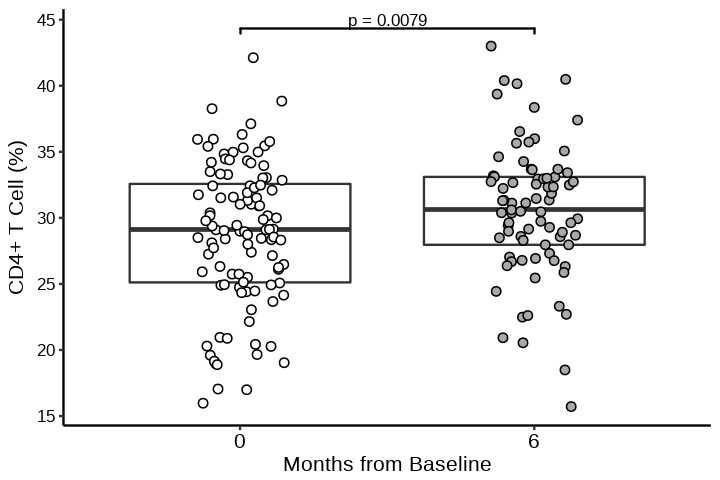


#### Figure 5B


```R
CD4_cell_18mo = ggplot(cells.Sul.18mo , aes(x=as.factor(time.from.exposure.months), y=CD4_positive_alpha_beta_T_cell)) + testTheme +
labs(y="CD4+ T Cell (%)") + geom_signif(comparisons=list(c("0", "18")),
                                                       annotations = c("p = 0.20"),
                                                       step_increase = 0.09, vjust = 0.14,
                               tip_length = 0.015, textsize=3.5)

CD4_cell_18mo
```


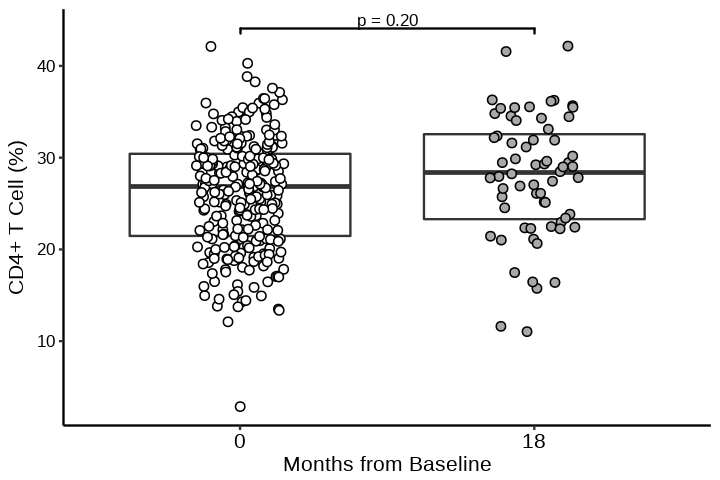


#### Figure 5C


```R
NK_cell_6mo = ggplot(cells.Sul.6mo , aes(x=as.factor(time.from.exposure.months), y=NK_cell)) + testTheme +
labs(y="NK Cell (%)") + geom_signif(comparisons=list(c("0", "6")),
                                                       annotations = c("p = 0.87"),
                                                       step_increase = 0.09, vjust = 0.14,
                               tip_length = 0.015, textsize=3.5)

NK_cell_6mo

```


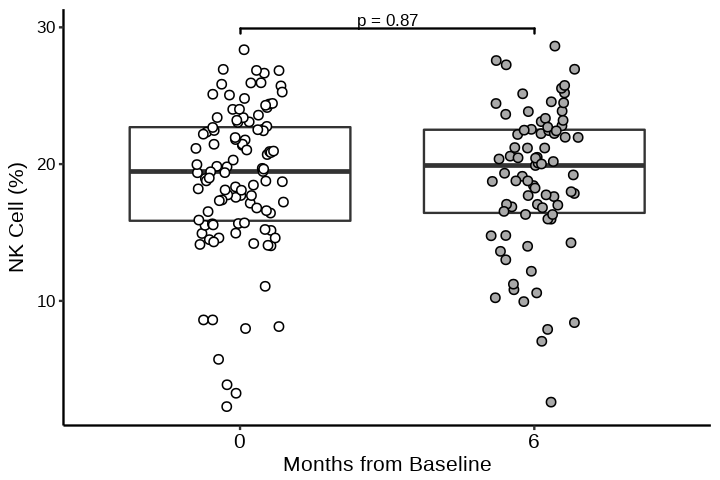


#### Figure 5D


```R
NK_cell_18mo = ggplot(cells.Sul.18mo , aes(x=as.factor(time.from.exposure.months), y=NK_cell)) + testTheme +
labs(y="NK Cell (%)") + geom_signif(comparisons=list(c("0", "18")),
                                                       annotations = c("p = 0.10"),
                                                       step_increase = 0.09, vjust = 0.14,
                               tip_length = 0.015, textsize=3.5)

NK_cell_18mo
```


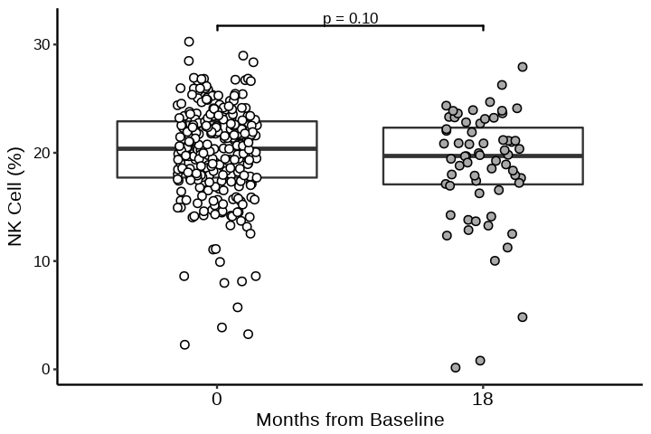

